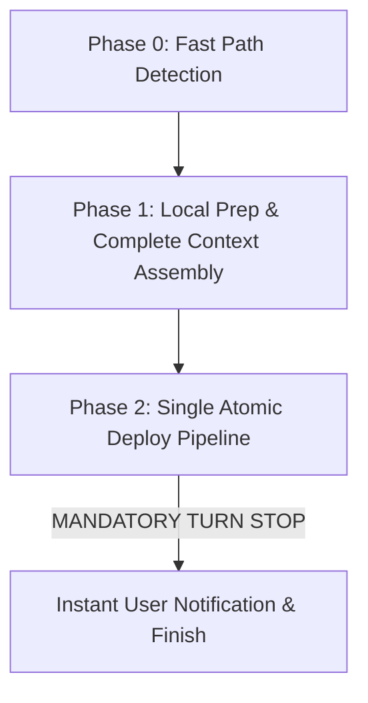

# 💾 Skill: `/save`

## Objective
The ultimate high-performance end-of-task pipeline. Unifies Quick Save context gathering, reciprocal backlinks, quality gates, conditional cache-busting, single atomic git commit, and VPS deployment into a frictionless flow that deploys to VPS in **under 15–20 seconds** with **ZERO double-pushing**.

## 🛑 End-of-Session Iron Rule
**งานเสร็จแล้ว อัปเดต Changelog/Quick Save และ Deploy ขึ้น VPS ไม้เดียวจบก่อนปิดแชทเสมอ**
ห้ามให้มันทำงานเสร็จแล้วทิ้งไว้ในแชทเด็ดขาด ทุกข้อตกลงใหม่หรือท่าแปลกๆ ที่เราเพิ่งคิดกันออก ต้องถูกย้อนกลับไปเขียนลงไฟล์ทันที

---

## ⚡ Execution Pipeline (V3 Single Atomic Deploy)



---

### Phase 0: Fast Path & Scope Detection (0ms overhead)
ก่อนเริ่มลงมือ ให้เช็คเงื่อนไขเหล่านี้เพื่อข้ามขั้นตอนที่ไม่จำเป็น:
1. **Conditional Cache-Bust Check:**
   - ตรวจดูว่าในเซสชันนี้มีการแก้ไขไฟล์ในโฟลเดอร์ `public/` (JS/CSS/HTML) หรือไม่
   - หาก **ไม่มีการแก้ไขไฟล์ใน `public/`** (เช่น ทำงานเอกสาร, study, backend API, scripts) ➔ **ข้าม `node bump-cache.js` ใน Phase 2 ทันที (ประหยัด 2-3 วินาที)**
2. **Conditional Transcript Mining:**
   - หากในโฟลเดอร์ Artifacts (`<appDataDir>\brain\<conv-id>/`) มี `dev_proposal_review.md`, `implementation_plan.md` และ/หรือ `walkthrough.md` อยู่แล้ว ➔ **ข้ามการสแกน `transcript.jsonl` ทั้งเล่ม** ให้อ่านแค่ artifacts + git diff ตรงๆ (ประหยัด 15-30 วินาที)
3. **Hard-Skip Origin:**
   - Remote `origin` ไม่มีในโปรเจกต์นี้ (มีเฉพาะ `vps`) ➔ **ห้ามเสียเวลารัน `git remote` เพื่อเช็ค `origin` เด็ดขาด**

---

### Phase 1: Local Preparation & Complete Context Assembly
*(ทุกงานเขียนไฟล์บนเครื่อง Local ให้ทำใน Phase นี้ให้เสร็จทั้งหมด 100% ก่อนเริ่ม Commit)*

1. **Intelligent Session Lock (Iron Rule):**
   - ตรวจหาโฟลเดอร์ปลายทางใน `Quick Save/Complete/` (เช่น `Core-VPS/` สำหรับ Openclaw-VPS หรือ Component ย่อยสำหรับโปรเจกต์อื่น)
   - ค้นหาว่ามีไฟล์ใน `Quick Save/Complete/<Subfolder>/` หรือ `Quick Save/Active/` ที่มี `conversation: "<current-conv-id>"` อยู่แล้วหรือไม่
   - **IF FOUND:** ห้าม bump version! ให้อัปเดตไฟล์เดิมโดย append `## Changelog` หรือ `## Timeline` ที่ท้ายไฟล์
   - **IF NOT FOUND:** สร้างไฟล์ใหม่ตาม Step 3-5

2. **Auto-Cleanup (5-7 Rule - Iron Rule):**
   - ตรวจนับไฟล์ที่ลอยอยู่ที่ root ของ `Quick Save/Complete/<Subfolder>/`
   - หากมีไฟล์เวอร์ชันปัจจุบันลอยอยู่ $\ge 7$ ไฟล์ ให้ `git mv` ไฟล์ที่เก่ากว่าเข้าไปในโฟลเดอร์ย่อย (เช่น `V13/`) ให้เหลือลอยอยู่เพียง 5 ไฟล์ล่าสุด (ใช้ Semantic Versioning `[version]` ใน PowerShell เรียงลำดับเสมอ)

3. **Fast Context Gathering:**
   - รัน `list_dir` ในโฟลเดอร์ Artifacts (`<appDataDir>\brain\<conversation-id>/`)
   - เรียก `view_file` อ่านไฟล์ `.md` ทุกตัวที่พบ
   - รัน `git diff --name-only HEAD~5` หรือ `git status -s` เพื่อดึงรายชื่อไฟล์ที่ถูกแก้ไขในเซสชันนี้

4. **Write Quick Save File (Full Depth Required):**
   - เขียนไฟล์ Quick Save ตรงเข้าไปยัง `Quick Save/Complete/<Subfolder>/` (หรือ `Active/` หากงานยังไม่เสร็จสมบูรณ์) ตามโครงสร้างมาตรฐาน:
     ```markdown
     ---
     version: "13.x.x"
     type: impl          # impl | study | hotfix | design | infra | spike
     status: complete    # complete | active | rejected
     outcome: shipped    # shipped | pending | rejected
     date: YYYY-MM-DD
     aliases: [tag1, tag2]
     conversation: "conversation-id-here"
     summary: >
       One paragraph summary of what was built and deployed.
     ---
     # [Title]

     ## 📌 Context & Implementation (Compiled Truth)
     (เหตุผลเชิงสถาปัตยกรรม + โค้ดสำคัญ ห้ามย่อ)

     ## 📋 Files Changed This Session
     | File | What Changed | Why |
     |------|-------------|-----|
     | `path/to/file` | รายละเอียด | เหตุผล |

     ## 📦 RAW ARTIFACT BACKUP (Iron Rule)
     (วางเนื้อหาเต็ม 100% จาก artifacts ทุกตัว ห้ามตัดทอน)

     ## 🔬 Timeline & Debugging Log
     (บันทึกการแก้ปัญหา ข้อผิดพลาดที่เจอ และการตัดสินใจ)

     ## 🔗 GBRAIN Backlinks
     - **YYYY-MM-DD HH:MM** | [page title](file:///C:/path/to/file.md) -- context
     ```

5. **Reciprocal GBRAIN Backlinks & Roadmap (ทำบน Local ทันทีใน Phase นี้!):**
   - ⛔ **กฎเหล็กห้าม Double Push:** ให้เปิดไฟล์ที่เกี่ยวข้อง 1-2 ไฟล์แล้วเติม Reciprocal Backlink ชี้มายังไฟล์ Quick Save ใหม่ตอนนี้เลยบน Local Disk (ใช้เวลาแค่ 50ms)
   - อัปเดต `MASTER_ROADMAP.md` (ถ้ามี) ให้เสร็จในขั้นตอนนี้เลย เพื่อให้ถูกรวมใน Commit เดียว

6. **Universal Search Indexing:**
   - รัน `node scripts/qs-indexer.js --incremental` เพื่ออัปเดต `search-manifest.md` ทันที

---

### Phase 2: Single Atomic Deploy Pipeline (Target: 10–15 วินาที)
*(ทุกคำสั่งใน Phase นี้ให้รันใน `C:\My Claw\Openclaw-VPS`)*

7. **Pre-flight Sync:**
   ```powershell
   git pull vps master --no-rebase
   ```

8. **Quality Gate Verification (Iron Rule):**
   ```powershell
   node scripts/verify-qs.js "<path-to-your-save-file>"
   ```
   *(ตรวจเช็คความสมบูรณ์ของ RAW ARTIFACT BACKUP, Mandatory sections, และไฟล์ขนาด $\ge 4KB$)*

9. **Conditional Cache Busting:**
   - หากตรวจพบการเปลี่ยนแปลงใน `public/` ให้รัน:
     ```powershell
     node bump-cache.js
     ```
   - หากไม่มีไฟล์ใน `public/` เปลี่ยน ➔ **ข้ามขั้นตอนนี้ได้เลย**

10. **Single Atomic Commit (Iron Rule - รวมทุกไฟล์ในไม้เดียว):**
    ```powershell
    git add .
    git commit -m "[AG] Auto-Save & Deploy <version>"
    ```

11. **Launch Deployment (ONE PUSH ONLY - ห้ามมี Push รอบสองเด็ดขาด):**
    ```powershell
    git push vps master
    ```
    *(ตรวจสอบผลการ deploy จาก stdout ของ Git hook โดยตรง)*

12. **High-Speed Log Sync (State Ledger Engine):**
    ```powershell
    node scripts/sync-ag-logs.js
    ```
    *(เสร็จสิ้นใน 1-3 วินาทีผ่าน State Ledger Caching และ Parallel Metadata Sync)*

13. **Final Clean Tree Audit:**
    ```powershell
    git status
    ```
    *(ยืนยันว่า Working Tree สะอาด 100%)*

14. **🛑 MANDATORY TURN STOP & INSTANT NOTIFICATION (Iron Rule):**
    - **ห้ามเรียกเครื่องมือใดๆ ต่ออีกเด็ดขาด! จบขั้นตอนแล้วต้องหยุดเรียก Tools ทันที!**
    - แจ้งสรุปผลให้ผู้ใช้ทราบทันทีว่าระบบทำการเซฟและ Deploy ขึ้น Production VPS เรียบร้อยแล้ว!
    - ⛔ **ห้ามมี Phase 3, ห้ามกลับไปแก้ไฟล์, ห้ามสั่ง `git push` ซ้ำรอบสองเด็ดขาด!**
