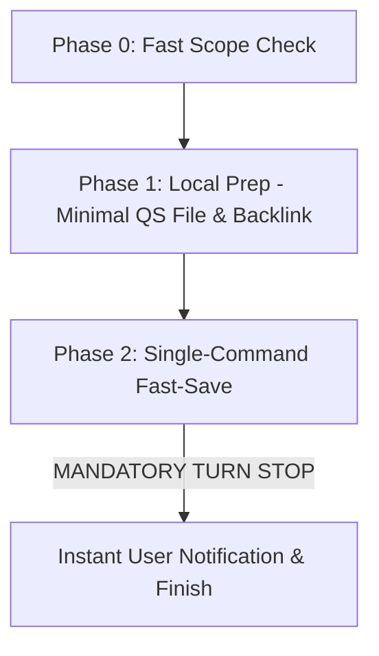

# 💾 Skill: `/save` (v3.4.0)

## Objective
The ultimate high-performance end-of-task pipeline. Target execution: **True Wall-Clock ≤ 30 Seconds** (Engine ≤ 10s + AI prep ≤ 20s). Unifies Quick Save context gathering, reciprocal backlinks, auto-scaffolded quality gates, conditional cache-busting, single atomic git commit, and VPS deployment into a frictionless flow with **ZERO double-pushing**.

## 🛑 End-of-Session Iron Rule
**งานเสร็จแล้ว อัปเดต Changelog/Quick Save และ Deploy ไม้เดียวจบก่อนปิดแชทเสมอ**
ห้ามให้มันทำงานเสร็จแล้วทิ้งไว้ในแชทเด็ดขาด ทุกข้อตกลงใหม่หรือท่าแปลกๆ ที่เราเพิ่งคิดกันออก ต้องถูกย้อนกลับไปเขียนลงไฟล์ทันที

---

## 🏎️ Speed Rules & Tool Call Cap (Iron Law — เป้า ≤ 5 Tool Calls)

> [!IMPORTANT]
> **สาเหตุที่ช้าไม่ได้อยู่ที่ Engine (Engine ใช้แค่ ~8 วินาที) แต่อยู่ที่ AI ทำ Tool Calls ซ้ำซ้อน!**
> ทุกครั้งที่รัน `/save` ห้ามทำเกิน **3–5 tool calls** เด็ดขาด:
> 1. ⛔ **ห้ามอ่าน `verify-qs.js`, `qs-compiler.js`, หรือ `fast-save.js` ก่อนรัน** — Trust the pipeline!
> 2. ⛔ **ห้ามรัน dry-run ก่อน real run** — รันจริงทันที ถ้า Quality Gate ตก สคริปต์จะแจ้งเอง
> 3. ⛔ **ห้าม `view_file` หรือ `list_dir` กวาด Brain Artifacts ซ้ำซาก** — `qs-compiler.js` จะควานหาและ inject ลง `RAW ARTIFACT BACKUP` ให้เองอัตโนมัติใน ~50ms
> 4. ⛔ **ห้ามตรวจ `git remote`** — Hard-skip origin rule มีผลถาวร
> 5. ⚡ **Ideal 3-Call Workflow:**
>    - **Call 1:** `write_to_file` → สร้างไฟล์ Quick Save ด้วย Minimal Skeleton (compiler เติมส่วนที่เหลือให้)
>    - **Call 2:** `replace_file_content` → เติม Reciprocal Backlink ในไฟล์ที่เกี่ยวข้อง 1 ไฟล์ (ถ้ามี)
>    - **Call 3:** `run_command` → `node scripts/fast-save.js ...` (ไม้เดียวจบ!)

---

## ⚡ Execution Pipeline (V3 Single Atomic Deploy)


```mermaid
graph TD
    P0[Phase 0: Fast Scope Check] --> P1[Phase 1: Local Prep - Minimal QS File & Backlink]
    P1 --> P2[Phase 2: Single-Command Fast-Save]
    P2 -->|MANDATORY TURN STOP| P3[Instant User Notification & Finish]
```

---

### Phase 0: Fast Scope Detection (0ms overhead)
1. **Conditional Cache-Bust:** หากไม่มีการแก้ไฟล์ใน `public/` ➔ ข้าม `bump-cache.js` ทันที
2. **Conditional Remote Push:** หากต้องการเซฟแค่ Local (หรือ VPS repo มีปัญหา) ➔ เติม `--skip-push` flag

---

### Phase 1: Local Preparation (Minimal QS Skeleton)
*(เขียนไฟล์บนเครื่อง Local ให้จบก่อนรัน commit)*

1. **Intelligent Session Lock:**
   - ค้นหาว่ามีไฟล์ใน `Quick Save/Complete/<Subfolder>/` หรือ `Quick Save/Active/` ที่มี `conversation: "<current-conv-id>"` อยู่แล้วหรือไม่
   - **IF FOUND:** ห้าม bump version! ให้อัปเดตไฟล์เดิมโดย append ที่ท้ายไฟล์
   - **IF NOT FOUND:** สร้างไฟล์ใหม่

2. **Write Minimal Quick Save File (Compiler Handles the Rest!):**
   ```markdown
   ---
   version: "X.Y.Z"
   type: impl          # impl | study | hotfix | design | infra | spike
   status: complete    # complete | active | rejected
   outcome: shipped    # shipped | pending | rejected
   date: YYYY-MM-DD
   aliases: [tag1, tag2]
   conversation: "<current-conv-id>"
   summary: >
     One paragraph summary of what was accomplished this session.
   ---
   # [Title]

   ## 📌 Context & Implementation (Compiled Truth)
   (AI สรุปเหตุผลเชิงสถาปัตยกรรมและการตัดสินใจหลัก ไม่ต้องก๊อป artifact มาแปะซ้ำ)

   ## 🔬 Timeline & Debugging Log
   - HH:MM — [Key event / milestone]

   ## 🔗 GBRAIN Backlinks
   - **YYYY-MM-DD** | [related doc](file:///C:/path) -- context
   ```
   > ⚡ **QS Auto-Compiler Guarantee:** `## 📋 Files Changed` และ `## 📦 RAW ARTIFACT BACKUP` จะถูก scan และ inject ให้อัตโนมัติ 100% ถ้าไม่มี brain artifact สคริปต์จะ auto-scaffold ให้ Quality Gate ผ่านฉลุย!

3. **Reciprocal Backlink (1 File Max):**
   - เติม backlink สั้นๆ ในไฟล์งานหลักชี้มาที่ QS file ใหม่ (1 call)

---

### Phase 2: Turbo Single-Command Execution (Target: 8–10 วินาที)

4. **🚀 Execute Unified Fast-Save:**
   - ดึง timestamp เริ่มต้นจาก `<ADDITIONAL_METADATA>` (`The current local time is: <timestamp>`)
   - เรียก `run_command` เพียง **คำสั่งเดียวถ้วน**:
   ```powershell
   node scripts/fast-save.js "<path-to-quick-save>" "[commit_message]" --start "<prompt_timestamp>"
   ```
   *(หรือเติม `--skip-push` หากต้องการ commit บน Local โดยไม่ push ไปยัง remote)*

   > ⛔ **CRITICAL TOOL CALL RULE:**
   > เมื่อเรียก `run_command` ต้องตั้งพารามิเตอร์:
   > - `WaitMsBeforeAsync: 10000` (10 วินาที) เสมอ

5. **🛑 MANDATORY TURN STOP & DUAL-TELEMETRY NOTIFICATION:**
   - **ห้ามเรียกเครื่องมือใดๆ ต่ออีกเด็ดขาด! จบขั้นตอนแล้วต้องหยุดเรียก Tools ทันที!**
   - สรุปตาราง Telemetry 2 มิติ (True Wall-Clock + Engine Pipeline) ให้ผู้ใช้เห็นทันที
   - ⛔ **ห้ามมี Phase 3, ห้ามกลับไปแก้ไฟล์, ห้าม push ซ้ำรอบสอง!**

