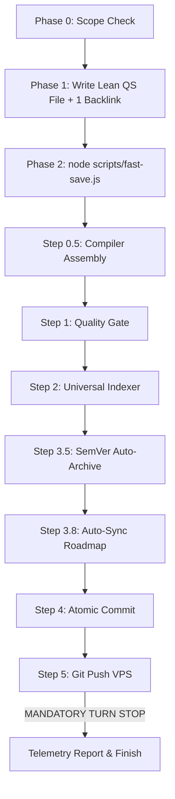

# 💾 Skill: `/save` (v3.6.1 Devil-Speed Architecture)

## Objective
The ultimate high-performance end-of-task pipeline. Target execution: **True Wall-Clock ≤ 10–15 Seconds** (Engine ≤ 5s + AI prep ≤ 5–10s). Unifies Quick Save context gathering, auto-relocation, **auto-roadmap sync**, reciprocal backlinks, auto-scaffolded quality gates, 5-7 SemVer file archiving, conditional cache-busting, single atomic git commit, and VPS deployment into a frictionless flow with **ZERO ghost deploys**.

## 🛑 End-of-Session Iron Rule
**งานเสร็จแล้ว อัปเดต Changelog/Quick Save และ Deploy ไม้เดียวจบก่อนปิดแชทเสมอ**
ห้ามให้มันทำงานเสร็จแล้วทิ้งไว้ในแชทเด็ดขาด ทุกข้อตกลงใหม่หรือท่าแปลกๆ ที่เราเพิ่งคิดกันออก ต้องถูกย้อนกลับไปเขียนลงไฟล์ทันที

---

## 🛡️ Closed Loopholes (V3.5 + V3.6 + V3.6.1 Combined — 10 Total)

1. 🔒 **Active-to-Complete Auto-Relocation:** ไฟล์ `status: complete` ใน `Active/` ย้ายเข้า `Complete/<Component>/` อัตโนมัติ
2. 🔒 **SemVer Floating Files Auto-Archive (กฎ 5-7 ไฟล์):** Natural SemVer Sort เก็บไฟล์เก่าเข้า Major Version folder
3. 🔒 **Deploy Push Failure Guard:** หาก `git push` ล้มเหลวทั้งหมด ➔ `exit code 1` ทันที
4. 🔒 **Self-Contained Skill Architecture:** สคริปต์ทั้ง 4 ตัวใน `.agents/skills/save/scripts/`
5. 🔒 **Auto-Detect Active Conversation ID:** แทนที่ Placeholder ID อัตโนมัติ
6. 🔒 **Cross-Environment Brain Path Resolution:** รองรับทุก PC
7. 🔒 **Universal Fallback Script Resolver:** 4-tier lookup
8. 🔒 **Dynamic Complete/* Subdirectory Scanner (V3.6):** ไม่ฮาร์ดโค้ด `Core-VPS` อีกต่อไป สแกนทุกโฟลเดอร์ใน `Quick Save/Complete/` อัตโนมัติ ทำให้ Zero-Arg execution ใช้ได้ทุกโปรเจกต์
9. 🔒 **Auto-Sync MASTER_ROADMAP.md (V3.6):** สกัด Frontmatter จาก Quick Save แล้วแทรกเข้า `## 🔵 3. Completed` ของ `docs/MASTER_ROADMAP.md` อัตโนมัติใน 10ms — **AI ไม่ต้องเปิด Roadmap มาแก้เองอีกต่อไป**
10. 🔒 **Self-Healing Quality Gate (V3.6.1):** Auto-inject missing/empty `aliases` จาก `tags` หรือชื่อไฟล์อัตโนมัติ, normalize และ scaffold หัวข้อ `Context & Implementation (Compiled Truth)` ให้อัตโนมัติใน 50ms ป้องกันการตก Quality Gate และตัดปัญหา AI Loop สะดุด 100%

---

## 🏎️ Speed Rules & Tool Call Cap (Iron Law — เป้า ≤ 3 Tool Calls)

> [!IMPORTANT]
> **สาเหตุที่ช้าไม่ได้อยู่ที่ Engine แต่อยู่ที่ AI ทำ Tool Calls ซ้ำซ้อน!**
> ทุกครั้งที่รัน `/save` ห้ามทำเกิน **2–3 tool calls** เด็ดขาด:
> 1. ⛔ **ห้ามอ่านสคริปต์ `verify-qs.js`, `qs-compiler.js`, `fast-save.js` ก่อนรัน** — Trust the pipeline!
> 2. ⛔ **ห้ามรัน dry-run ก่อน real run** — รันจริงทันที ถ้า Quality Gate ตก สคริปต์จะแจ้งเอง
> 3. ⛔ **ห้าม `view_file` กวาด Brain Artifacts** — Compiler inject `RAW ARTIFACT BACKUP` ให้อัตโนมัติ
> 4. ⛔ **ห้ามตรวจ `git remote` หรือเปิด MASTER_ROADMAP.md** — Roadmap ซิงก์อัตโนมัติใน fast-save.js แล้ว
> 5. ⚡ **Ideal 2-Call Workflow (V3.6 Devil-Speed):**
>    - **Call 1:** `write_to_file` → สร้าง Lean Quick Save (YAML + Context + Timeline + Backlinks เท่านั้น)
>    - **Call 2:** `run_command` → `node scripts/fast-save.js "path" "message" --start "timestamp"` (ไม้เดียวจบ!)
>    - *(Call 3 optional:* `replace_file_content` → เติม Backlink ในไฟล์ที่เกี่ยวข้อง ถ้ามี *— แต่ตอนนี้ Roadmap ไม่ต้องนับแล้ว!)*

---

## ⚡ Execution Pipeline (V3.6 Devil-Speed Architecture)


```mermaid
graph TD
    P0[Phase 0: Scope Check] --> P1[Phase 1: Write Lean QS File + 1 Backlink]
    P1 --> P2[Phase 2: node scripts/fast-save.js]
    P2 --> S05[Step 0.5: Compiler Assembly]
    S05 --> S1[Step 1: Quality Gate]
    S1 --> S2[Step 2: Universal Indexer]
    S2 --> S35[Step 3.5: SemVer Auto-Archive]
    S35 --> S38[Step 3.8: Auto-Sync Roadmap]
    S38 --> S4[Step 4: Atomic Commit]
    S4 --> S5[Step 5: Git Push VPS]
    S5 -->|MANDATORY TURN STOP| P3[Telemetry Report & Finish]
```

---

### Phase 0: Fast Scope Detection (0ms overhead)
1. **Conditional Cache-Bust:** ไม่แก้ `public/` ➔ ข้าม `bump-cache.js`
2. **Conditional Remote Push:** ใช้ `--skip-push` ถ้าเซฟ Local only

---

### Phase 1: Local Preparation (Lean QS + 1 Backlink — ≤ 2 Tool Calls)

1. **Intelligent Session Lock:**
   - ค้นหาไฟล์ที่มี `conversation: "<current-conv-id>"` อยู่แล้ว → append ไม่ bump

2. **Write Lean Quick Save File:**
   ```markdown
   ---
   version: "X.Y.Z"
   type: impl
   status: complete
   outcome: shipped
   date: YYYY-MM-DD
   aliases: [tag1, tag2]
   conversation: "<current-conv-id>"
   summary: >
     One paragraph summary.
   ---
   # [Title]

   ## 📌 Context & Implementation (Compiled Truth)
   (สรุปการตัดสินใจหลัก + สถาปัตยกรรม — ไม่ต้องก๊อป artifact มาซ้ำ)

   ## 🔬 Timeline & Debugging Log
   - HH:MM — [Key event]

   ## 🔗 GBRAIN Backlinks
   - **YYYY-MM-DD** | [doc](file:///...) -- context
   ```
   > ⚡ **Auto-Assembly Guarantee:** `📋 Files Changed` + `📦 RAW ARTIFACT BACKUP` ถูก inject อัตโนมัติ 100% โดย Compiler
   > ⚡ **Auto-Roadmap Guarantee:** `docs/MASTER_ROADMAP.md` ถูกอัปเดตอัตโนมัติใน Pipeline — ห้าม AI เปิดแก้เอง!

3. **Reciprocal Backlink (1 File Max — Optional):**
   - เติม backlink สั้นๆ ในไฟล์ที่เกี่ยวข้องโดยตรง (ไม่รวม Roadmap ที่ถูก Auto-Sync แล้ว)

---

### Phase 2: Turbo Single-Command (Target: ≤ 5 วินาที + SSH Multiplexing)

4. **🚀 Execute Unified Fast-Save:**
   ```powershell
   node scripts/fast-save.js "<path-to-quick-save>" "[commit_message]" --start "<prompt_timestamp>"
   ```
   > ⛔ `WaitMsBeforeAsync: 10000` (10 วินาที) เสมอ

   **สิ่งที่ `fast-save.js` V3.6 ทำให้โดยอัตโนมัติ:**
   - [x] Check `.git/index.lock`
   - [x] Active-to-Complete Auto-Relocate
   - [x] QS Auto-Compiler (Artifact + Diff Assembly)
   - [x] Quality Gate (`verify-qs.js`)
   - [x] Universal Search Indexer (Incremental)
   - [x] Conditional Cache-Bust
   - [x] SemVer 5-7 Floating Files Auto-Archive
   - [x] **Auto-Sync MASTER_ROADMAP.md** ← NEW in V3.6
   - [x] Atomic Git Commit
   - [x] Production Push with Fail Guard
   - [x] Background Log Sync
   - [x] Dual-Telemetry Stopwatch

5. **🛑 MANDATORY TURN STOP & DUAL-TELEMETRY NOTIFICATION:**
   - ห้ามเรียกเครื่องมือใดๆ ต่ออีกเด็ดขาด!
   - แสดงตาราง Telemetry: True Wall-Clock + Engine Pipeline + Phase Breakdown
   - ⛔ ห้ามมี Phase 3, ห้ามกลับไปแก้ไฟล์, ห้าม push ซ้ำรอบสอง!
