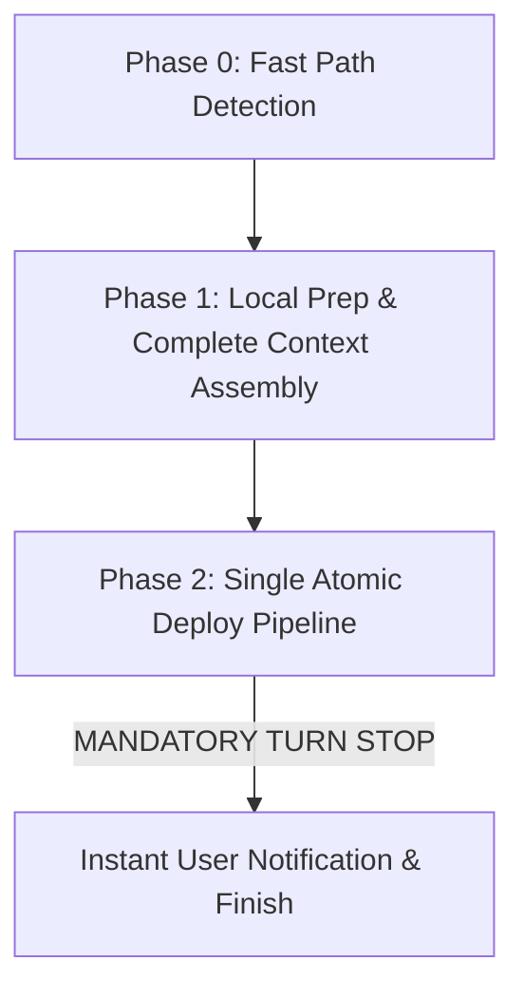

# 💾 Skill: `/save` (v3.3.0)

## Objective
The ultimate high-performance end-of-task pipeline. Unifies Quick Save context gathering, reciprocal backlinks, quality gates, conditional cache-busting, single atomic git commit, and VPS deployment into a frictionless flow that deploys to VPS in **under 15–20 seconds** with **ZERO double-pushing**. Seamlessly adapts across **PC Home & PC Office** with zero manual configuration.

## 🛑 End-of-Session Iron Rule
**งานเสร็จแล้ว อัปเดต Changelog/Quick Save และ Deploy ขึ้น VPS ไม้เดียวจบก่อนปิดแชทเสมอ**
ห้ามให้มันทำงานเสร็จแล้วทิ้งไว้ในแชทเด็ดขาด ทุกข้อตกลงใหม่หรือท่าแปลกๆ ที่เราเพิ่งคิดกันออก ต้องถูกย้อนกลับไปเขียนลงไฟล์ทันที

---

## ⚡ Execution Pipeline (V3 Single Atomic Deploy)


```mermaid
graph TD
    P0[Phase 0: Fast Path Detection] --> P1[Phase 1: Local Prep & Complete Context Assembly]
    P1 --> P2[Phase 2: Single Atomic Deploy Pipeline]
    P2 -->|MANDATORY TURN STOP| P3[Instant User Notification & Finish]
```

---

### Phase 0: Fast Path & Scope Detection (0ms overhead)
ก่อนเริ่มลงมือ ให้เช็คเงื่อนไขเหล่านี้เพื่อข้ามขั้นตอนที่ไม่จำเป็น:
1. **Conditional Cache-Bust Check:**
   - ตรวจดูว่าในเซสชันนี้มีการแก้ไขไฟล์ในโฟลเดอร์ `public/` (JS/CSS/HTML) หรือไม่
   - หาก **ไม่มีการแก้ไขไฟล์ใน `public/`** (เช่น ทำงานเอกสาร, study, backend API, scripts) ➔ **ข้าม `node bump-cache.js` ใน Phase 2 ทันที (ประหยัด 2-3 วินาที)**
2. **Conditional Transcript Mining:**
   - หากในโฟลเดอร์ Artifacts (`<appDataDir>\brain\<conv-id>/`) มี `dev_proposal_review.md`, `implementation_plan.md` และ/หรือ `walkthrough.md` อยู่แล้ว ➔ **ข้ามการสแกน `transcript.jsonl` ทั้งเล่ม** ให้อ่านแค่ artifacts + git diff ตรงๆ (ประหยัด 15-30 วินาที)
3. **Hard-Skip Origin:**
   - Remote `origin` ไม่มีในโปรเจกต์นี้ (มีเฉพาะ `vps`) ➔ **ห้ามเสียเวลารัน `git remote` เพื่อเช็ค `origin` เด็ดขาด**

---

### Phase 1: Local Preparation & Complete Context Assembly
*(ทุกงานเขียนไฟล์บนเครื่อง Local ให้ทำใน Phase นี้ให้เสร็จทั้งหมด 100% ก่อนเริ่ม Commit)*

1. **Intelligent Session Lock (Iron Rule):**
   - ตรวจหาโฟลเดอร์ปลายทางใน `Quick Save/Complete/` (เช่น `Core-VPS/` สำหรับ Openclaw-VPS หรือ Component ย่อยสำหรับโปรเจกต์อื่น)
   - ค้นหาว่ามีไฟล์ใน `Quick Save/Complete/<Subfolder>/` หรือ `Quick Save/Active/` ที่มี `conversation: "<current-conv-id>"` อยู่แล้วหรือไม่
   - **IF FOUND:** ห้าม bump version! ให้อัปเดตไฟล์เดิมโดย append `## Changelog` หรือ `## Timeline` ที่ท้ายไฟล์
   - **IF NOT FOUND:** สร้างไฟล์ใหม่ตาม Step 3-5

2. **Auto-Cleanup (5-7 Rule - Iron Rule):**
   - ตรวจนับไฟล์ที่ลอยอยู่ที่ root ของ `Quick Save/Complete/<Subfolder>/`
   - หากมีไฟล์เวอร์ชันปัจจุบันลอยอยู่ $\ge 7$ ไฟล์ ให้ `git mv` ไฟล์ที่เก่ากว่าเข้าไปในโฟลเดอร์ย่อย (เช่น `V13/`) ให้เหลือลอยอยู่เพียง 5 ไฟล์ล่าสุด (ใช้ Semantic Versioning `[version]` ใน PowerShell เรียงลำดับเสมอ)

3. **Fast Context Gathering (QS Auto-Compiler Powered):**
   - AI **ไม่ต้อง** นั่ง `view_file` กวาด Artifact ทุกตัว เพื่อพิมพ์ซ้ำ (ตัดคอขวด 30–90 วินาทีทิ้ง!)
   - AI เพียงสังเคราะห์สิ่งที่ทำจริงในเซสชัน เพื่อเขียน **"แก่น"** (Compiled Truth + Decisions + Timeline)
   - ส่วน `## 📦 RAW ARTIFACT BACKUP` และ `## 📋 Files Changed This Session` จะถูกประกอบให้อัตโนมัติใน **~50ms** โดย `scripts/qs-compiler.js` ตอนรัน `fast-save.js`

4. **Write Quick Save File (Streamlined Core):**
   - เขียนไฟล์ Quick Save ตรงเข้าไปยัง `Quick Save/Complete/<Subfolder>/` (หรือ `Active/` หากงานยังไม่เสร็จสมบูรณ์):
     ```markdown
     ---
     version: "13.x.x"
     type: impl          # impl | study | hotfix | design | infra | spike
     status: complete    # complete | active | rejected
     outcome: shipped    # shipped | pending | rejected
     date: YYYY-MM-DD
     aliases: [tag1, tag2]
     conversation: "conversation-id-here"
     summary: >
       One paragraph summary of what was built and deployed.
     ---
     # [Title]

     ## 📌 Context & Implementation (Compiled Truth)
     (เหตุผลเชิงสถาปัตยกรรม + โค้ดสำคัญ ห้ามย่อ)

     ## 🔬 Timeline & Debugging Log
     (บันทึกการแก้ปัญหา ข้อผิดพลาดที่เจอ และการตัดสินใจ)

     ## 🔗 GBRAIN Backlinks
     - **YYYY-MM-DD HH:MM** | [page title](file:///C:/path/to/file.md) -- context
     ```
   - ⚡ **Auto-Assembly (Automatic in fast-save.js):** สคริปต์ `fast-save.js` Step 0.5 จะเรียก `qs-compiler.js` เพื่อแทรก `## 📋 Files Changed` และ `## 📦 RAW ARTIFACT BACKUP` ให้ครบ 100% อัตโนมัติก่อนผ่าน Quality Gate

5. **Reciprocal GBRAIN Backlinks & Roadmap (ทำบน Local ทันทีใน Phase นี้!):**
   - ⛔ **กฎเหล็กห้าม Double Push:** ให้เปิดไฟล์ที่เกี่ยวข้อง 1-2 ไฟล์แล้วเติม Reciprocal Backlink ชี้มายังไฟล์ Quick Save ใหม่ตอนนี้เลยบน Local Disk (ใช้เวลาแค่ 50ms)
   - อัปเดต `MASTER_ROADMAP.md` (ถ้ามี) ให้เสร็จในขั้นตอนนี้เลย เพื่อให้ถูกรวมใน Commit เดียว

---

### Phase 2: Turbo Single-Command Execution (Target: 10–15 วินาที)
*(ใช้ Single-Process Orchestrator: ห้ามแยกคำสั่งเดี่ยวๆ เป็น 9-23 Tool Calls เด็ดขาด!)*

6. **🚀 Execute Unified Fast-Save (ไม้เดียวจบ + True Wall-Clock):**
   - ดึงเวลาที่ผู้ใช้กดส่งคำสั่งจาก `<ADDITIONAL_METADATA>` (`The current local time is: <timestamp>`)
   - เรียก `run_command` รันคำสั่งนี้เพียง **คำสั่งเดียวถ้วน**:
   ```powershell
   node scripts/fast-save.js "<path-to-your-save-file>" "[commit_message]" --start "<prompt_timestamp>"
   ```
   
   > ⛔ **CRITICAL TOOL CALL RULE:**
   > เมื่อเรียก `run_command` ต้องตั้งพารามิเตอร์:
   > - `WaitMsBeforeAsync: 10000` (10 วินาที) เสมอ เพื่อให้คำสั่งรันจบแบบ Synchronous ไม่หลุดเป็น Background Task!

   **สิ่งที่ `scripts/fast-save.js` ทำให้โดยอัตโนมัติในโปรเซสเดียว:**
   - [x] ตรวจสอบความปลอดภัย `.git/index.lock`
   - [x] รัน **Step 0.5: QS Auto-Compiler** ประกอบ Artifact Backup + Files Changed อัตโนมัติใน ~200ms
   - [x] รัน Quality Gate ตรวจไฟล์ Quick Save (`verify-qs.js`)
   - [x] รัน Universal Search Indexer โหมด True Incremental (`qs-indexer.js --incremental`) ใน 30ms
   - [x] ตรวจจับไฟล์ `public/` หากมีการแก้ไขจะรัน `bump-cache.js` ให้อัตโนมัติ (ข้ามถ้าไม่มี เพื่อประหยัด 2s)
   - [x] รวมไฟล์ทั้งหมดเข้า Staging (`git add .`)
   - [x] สร้าง Atomic Commit เพียง Commit เดียว
   - [x] Deploy ขึ้น VPS Production ทันที (`git push vps master`) พร้อม Smart Diff ข้าม PM2 บน VPS
   - [x] สั่งรัน Background Log Sync (`sync-ag-logs.js --bg`) แบบ Detached
   - [x] คำนวณและพิมพ์ Stopwatch Telemetry: **ทั้ง Engine Pipeline และ True Wall-Clock**

7. **🛑 MANDATORY TURN STOP & DUAL-TELEMETRY NOTIFICATION (Iron Rule):**
   - **ห้ามเรียกเครื่องมือใดๆ ต่ออีกเด็ดขาด! จบขั้นตอนแล้วต้องหยุดเรียก Tools ทันที!**
   - แสดงตารางสรุปผล Telemetry 2 มิติให้ผู้ใช้เห็นทันที:
     - ⏱️ **True Wall-Clock (User Reality):** เวลารวมตั้งแต่วินาทีที่ User กดส่งคำสั่งจนตอบกลับ
     - ⚡ **Engine Pipeline:** เวลาที่ Node.js + Git + Deploy Hook ทำงานจริง
     - 📊 ตารางแจกแจงทุก Phase (Compiler, Quality Gate, Indexer, Push, etc.)
   - ⛔ **ห้ามมี Phase 3, ห้ามกลับไปแก้ไฟล์, ห้ามสั่ง `git push` ซ้ำรอบสองเด็ดขาด!**
