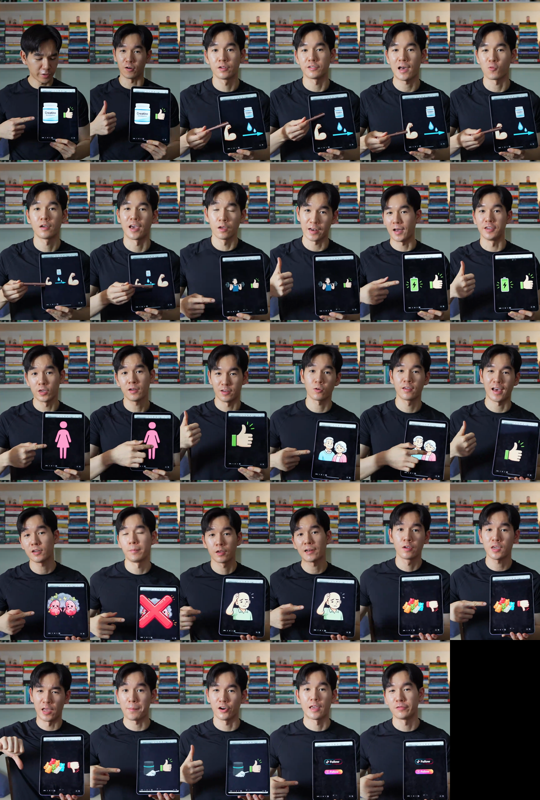

# 🎬 Magnesium Night Plus: Short-Form Video Adaptation Plan
*แผนกลยุทธ์การทำเนื้อหาวิดีโอสั้นแบบไวรัล และการถอดสคริปต์เปรียบเทียบฟอร์มแมกนีเซียม*

---

## 🎯 กลยุทธ์เนื้อหาวิดีโอ 3 รูปแบบหลัก (3 Content Pillars)
เพื่อให้คอนเทนต์ของ Magnesium Night Plus เข้าถึงลูกค้าได้หลากหลายกลุ่ม เราจะแบ่งรูปแบบการเล่าเรื่อง (Video Format) ออกเป็น 3 สไตล์หลัก:

1. **Binary Contrast Format (สลับขั้ว ดี/ห่วย อย่างรวดเร็ว):**
   * **สไตล์:** ตัดต่อฉับไว (1-2 วินาที/คัท) ดึงคำถามหรือความเชื่อผิดๆ มาตบด้วยความจริงแบบสลับขั้ว (ยอดเยี่ยม vs ห่วย)
   * **จุดประสงค์:** หยุดนิ้วคนดูทั่วไป (Cold Audience) ดึงดูดความสนใจใน 3 วินาทีแรก และย่อยข้อมูลยากๆ ให้สนุก
   * **สถานะ:** *ออกแบบสคริปต์ซีรีส์ 3 EP เสร็จสิ้นแล้ว (ดูด้านล่าง)*

2. **Q&A / Interview Style (ถามมา-ตอบไป):**
   * **สไตล์:** มีบุคคลที่ 2 (เช่น ผู้บริโภคทั่วไป, ทีมงาน, หรือพิธีกร) โยนคำถามที่คนมักสงสัย (PAA) แล้วบุคคลที่ 1 (ตัวแทนแบรนด์/Formulator) เป็นคนตอบแบบเคลียร์ๆ ด้วยภาษาพูด
   * **จุดประสงค์:** สร้างความน่าเชื่อถือแบบเป็นกันเอง และตอบข้อโต้แย้ง (Objection Handling) เชิงลึก ให้ความรู้สึกเหมือนกำลังคุยกับผู้เชี่ยวชาญส่วนตัว
   * **ไอเดียหัวข้อ:** "ทำไมต้องกินแมกนีเซียม 4 ฟอร์ม?", "คนที่กินยานอนหลับมานาน เปลี่ยนมากินตัวนี้ได้ไหม?"

3. **Talking Head (Knowledge / Educational):**
   * **สไตล์:** นั่งพูดให้ความรู้แบบตรงไปตรงมา มีกราฟิกหรือ Text ประกอบด้านข้าง โทนดูเป็นมืออาชีพ จริงจัง และน่าเชื่อถือสูง
   * **จุดประสงค์:** เจาะกลุ่มคนที่ชอบศึกษาข้อมูลก่อนซื้อ (Warm/Hot Audience) ให้ความรู้เชิงลึกเกี่ยวกับสุขภาพและการนอน
   * **ไอเดียหัวข้อ:** "วงจรการนอนหลับ 4 ระยะที่คนตื่นกลางดึกบ่อยๆ ต้องรู้", "ความลับของฮอร์โมนความเครียดที่ทำให้สมองแล่นตอนกลางคืน"

---

## 🖼️ 1. ภาพรวมคีย์เฟรมวิดีโอต้นแบบ (Keyframe Grid 1 FPS)
เพื่อวิเคราะห์การจัดวางภาพ อัตราการตัดต่อ และการเคลื่อนไหวของผู้พูด เราได้ดึงภาพจากวิดีโอทุกๆ 1 วินาทีมาร้อยเรียงเป็นตารางภาพ (Grid) ขนาด 6 คอลัมน์ x 5 แถว (รวม 30 คอลัมน์/วินาที):

> [!NOTE]
> **การวางเลย์เอาต์ภาพและจังหวะของผู้พูดจากรูป Grid:**
> * **แถวที่ 1-2 (0-12 วินาที - ช่วงบอกข้อดี):** ผู้พูดหันหน้าเข้ากล้อง ครึ่งตัว (Medium Close-Up) และใช้นิ้วชี้เพื่อเรียกข้อความ Text Overlay แต่ละหัวข้อขึ้นมาทีละจุด (เรียงจากบนลงล่าง) ทำให้มี Movement ขยับสายตาคนดูตลอด
> * **แถวที่ 3-4 (12-22 วินาที - ช่วง Q&A เคลียร์ข้อสงสัย):** ผู้พูดขยับแสดงอารมณ์ชัดเจนขึ้น เช่น ส่ายหัว/ทำมือ X ปฏิเสธเมื่อคำถามเป็นความเชื่อผิดๆ (ไตพัง? หัวล้าน?) และพยักหน้า/ยิ้มมั่นใจเมื่อตอบตกลง (ผู้หญิง? คนแก่?)
> * **แถวที่ 5 (22-30 วินาที - ช่วงเปรียบเทียบ VS & CTA):** ผู้พูดทำหน้าเบ้/ไม่พอใจตอนพูดถึงรูปแบบกัมมี่ (ห่วย) และเปลี่ยนเป็นหยิบของขึ้นมาโชว์/ทำหน้าร่าเริงสุดๆ ตอนโชว์รูปแบบผง (ยอดเยี่ยม) พร้อมชี้ไปที่ขอบขวาเพื่อปิดท้ายด้วยปุ่ม Follow

---

## 🔎 2. ถอดสคริปต์ต้นฉบับภาษาไทยจากคลิปตัวอย่าง (Creatine Video)

บทพูดและซับไตเติลจริงจากคลิปต้นแบบเรื่อง Creatine:

* **[00:00-00:02]** Creatine ของดี! *(Hook เปิดคลิปดึงความสนใจ)*
* **[00:02-00:04]** Creatine ซึมเข้ากล้าม *(อธิบายกลไกขั้นที่ 1: การดูดซึม)*
* **[00:04-00:06]** กล้ามอุ้มน้ำ *(อธิบายกลไกขั้นที่ 2: ปฏิกิริยาชีวภาพ)*
* **[00:06-00:08]** กล้ามใหญ่ขึ้น *(อธิบายกลไกขั้นที่ 3: ผลลัพธ์ทางกายภาพ)*
* **[00:08-00:10]** ยกเวทได้หนักขึ้น *(อธิบายกลไกขั้นที่ 4: ผลลัพธ์ด้านสมรรถนะ)*
* **[00:10-00:12]** พลังงานดีขึ้น *(อธิบายกลไกขั้นที่ 5: ผลลัพธ์ภาพรวม)*
* **[00:12-00:13]** ผู้หญิงกินได้มั้ย? *(ถาม-ตอบ 1)*
* **[00:13-00:15]** ดี!
* **[00:15-00:16]** คนแก่? *(ถาม-ตอบ 2)*
* **[00:16-00:17]** กินได้!
* **[00:17-00:19]** กินเยอะๆ ไตพัง? *(ถาม-ตอบ 3)*
* **[00:19-00:20]** ไม่จริง!
* **[00:20-00:21]** กินแล้วหัวล้าน? *(ถาม-ตอบ 4)*
* **[00:21-00:22]** ไม่จริง!
* **[00:22-00:23]** Creatine Gummy *(เปรียบเทียบฟอร์ม 1)*
* **[00:23-00:24]** ห่วย! / ห่วยแตก! *(ผลลัพธ์ลบ)*
* **[00:24-00:25]** Creatine แบบผง *(เปรียบเทียบฟอร์ม 2)*
* **[00:25-00:27]** ยอดเยี่ยม! *(ผลลัพธ์บวก)*
* **[00:27-00:28]** อยากรู้เพิ่ม? *(CTA นำ)*
* **[00:28-00:29]** Follow! *(CTA ปิด)*

---

## ⚡ 3. วิเคราะห์เทคนิคทางจิตวิทยาและการตัดต่อ (Technique Analysis)

1. **จังหวะกระตุ้นความสนใจแบบปืนกล (Rapid-Fire Pacing):**
   * เปลี่ยนฉากหรือคีย์เวิร์ดบนหน้าจอทุกๆ **1-2 วินาที** ป้องกันไม่ให้สมองของคนดูเข้าสู่ภาวะเฉื่อยชา (Active Scanning)
2. **การเล่ากลไกแบบปฏิกิริยาลูกโซ่ (Step-by-step Chain Reaction Mechanism):**
   * แทนที่จะบอกข้อดีสะเปะสะปะ คลิปนี้เลือกอธิบาย "กลไกการทำงาน" (Mechanism) ให้เห็นภาพตามเป็นฉากๆ ย่อยง่ายๆ: *ซึมเข้ากล้าม -> อุ้มน้ำ -> กล้ามฟู -> มีแรงยก -> พลังงานดี* ทำให้คนดูรู้สึกว่าสินค้านี้มีวิทยาศาสตร์รองรับแบบเป็นเหตุเป็นผล (Make sense) และน่าเชื่อถือกว่าการเคลมลอยๆ
3. **ความต่างของอารมณ์แบบชัดเจน (Visual & Emotional Contrast):**
   * มีการเล่นระดับสีเขียวเด่นชัด (เมื่อตอบ "ดี / ยอดเยี่ยม / ถูกต้อง") และสีแดงเข้ม (เมื่อตอบ "ห่วย / ผิด / ไม่จริง") ทำให้คนดูที่ปิดเสียงเข้าใจสารได้ทันที
4. **การปฏิเสธความเชื่อที่ฝังหัว (Myth Busting Power):**
   * คนมักมีข้อสงสัยและความเชื่อผิดๆ (เช่น กินครีเอทีนแล้วไตพัง/หัวล้าน) การเอาสิ่งนี้มาตอบแบบฟันธง "ไม่จริง!" สั้นๆ ช่วยลดกำแพงตรรกะในหัวลูกค้าได้เร็วกว่าการอธิบายยาวๆ เป็นนาที
5. **การจบด้วยความคุ้มค่าสูงสุด (High-Value Conclusion):**
   * ตบภาพสุดท้ายด้วยการฟันธงเลือกตัวที่ดีที่สุด เพื่อให้ลูกค้ารู้สึกมีแนวทางปฏิบัติที่ชัดเจนหลังดูจบ

---

## 🧬 4. สคริปต์หลัก: เปรียบเทียบฟอร์ม Magnesium (อวยฟอร์มแบรนด์เรา)
> *แนวคิด: นำเสนอเรื่องประเภทของแมกนีเซียมในรูปแบบสากล ชี้เป้าข้อจำกัดของเกรดราคาถูก และอวยเกรดพรีเมียม (Bisglycinate / Complex 4 ฟอร์ม) ซึ่งเป็นสูตรของ Magnesium Night Plus*

### 📝 สคริปต์เปรียบเทียบฟอร์มแมกนีเซียม (30 วินาที)

* **[0:00 - 0:02]**
  - **บทพูด:** "แมกนีเซียม... ของดี!" (ทำมือ 👍)
  - **ข้อความจอ:** Magnesium ของดี!
  - **ภาพ/เสียง:** 🎵 ดนตรีเปิดตัวจังหวะสนุกสนาน

* **[0:02 - 0:04]**
  - **บทพูด:** "ช่วยคลายกล้ามเนื้อตึงๆ"
  - **ข้อความจอ:** 🦾 คลายกล้ามเนื้อ
  - **ภาพ/เสียง:** 🔊 เสียง *ติ๊ง*

* **[0:04 - 0:06]**
  - **บทพูด:** "หยุดอาการคิดวนก่อนนอน"
  - **ข้อความจอ:** 🛑 หยุดคิดวน
  - **ภาพ/เสียง:** 🔊 เสียง *ติ๊ง*

* **[0:06 - 0:08]**
  - **บทพูด:** "ช่วยให้หลับลึก หลับสนิท"
  - **ข้อความจอ:** 💤 หลับลึก
  - **ภาพ/เสียง:** 🔊 เสียง *ติ๊ง*

* **[0:08 - 0:10]**
  - **บทพูด:** "ตื่นมาสดชื่น ไม่เพลีย!"
  - **ข้อความจอ:** ☀️ ตื่นมาไม่เพลีย
  - **ภาพ/เสียง:** 🔊 เสียง *ติ๊ง*

* **[0:10 - 0:12]**
  - **บทพูด:** "กินแล้วติดมั้ย?" (🤔 ทำหน้าสงสัย)
  - **ข้อความจอ:** กินแล้วติดมั้ย?

* **[0:12 - 0:14]**
  - **บทพูด:** "ไม่ติด! ไม่ใช่ยานอนหลับ" (🙅‍♂️ ส่ายหน้าปฏิเสธ)
  - **ข้อความจอ:** ไม่ติด!

* **[0:14 - 0:15]**
  - **บทพูด:** "กินนานๆ ตับพังมั้ย?" (🤔 ทำหน้าถาม)
  - **ข้อความจอ:** ตับพังมั้ย?

* **[0:15 - 0:17]**
  - **บทพูด:** "ไม่พัง! วิตามินล้วนๆ" (👍 พยักหน้ายิ้ม)
  - **ข้อความจอ:** ไม่พัง!

* **[0:17 - 0:18]**
  - **บทพูด:** "กินแล้วจู๊ดๆ ท้องเสียมั้ย?" (🤢 ทำท่ากังวล)
  - **ข้อความจอ:** ท้องเสียมั้ย?

* **[0:18 - 0:19]**
  - **บทพูด:** "อันนี้อยู่ที่ฟอร์ม!" (☝️ ชูนิ้วชี้เตือนสติ)
  - **ข้อความจอ:** อยู่ที่ฟอร์ม!

* **[0:19 - 0:21]**
  - **บทพูด:** "ฟอร์มแรก... แมกนีเซียม ออกไซด์"
  - **ข้อความจอ:** Magnesium Oxide
  - **ภาพ/เสียง:** ❌ สัญลักษณ์กากบาทแดง

* **[0:21 - 0:23]**
  - **บทพูด:** "ห่วย! ซึมน้อย แถมท้องเสีย"
  - **ข้อความจอ:** ห่วย! (ท้องเสีย)
  - **ภาพ/เสียง:** 🔊 เสียง *ตื๊ด (Error)*

* **[0:23 - 0:25]**
  - **บทพูด:** "แต่ฟอร์ม บิสไกลซิเนต..." (ยิ้มกว้าง)
  - **ข้อความจอ:** Mag Bisglycinate
  - **ภาพ/เสียง:** 🏆 สัญลักษณ์ถ้วยรางวัล

* **[0:25 - 0:27]**
  - **บทพูด:** "ยอดเยี่ยม! ซึมไว หลับสบายสุด"
  - **ข้อความจอ:** ยอดเยี่ยม! (ซึมไว)
  - **ภาพ/เสียง:** 🔊 เสียง *ฉลอง (Success)*

* **[0:27 - 0:28]**
  - **บทพูด:** "อยากได้แบบครบโดสจบๆ"
  - **ข้อความจอ:** Magnesium Night Plus
  - **ภาพ/เสียง:** ✅ โชว์ขวดสินค้าเด่นๆ

* **[0:28 - 0:29]**
  - **บทพูด:** "อยากนอนเต็มอิ่ม?" (👉 ชี้ตะกร้า)
  - **ข้อความจอ:** อยากนอนเต็มอิ่ม?

* **[0:29 - 0:30]**
  - **บทพูด:** "จิ้มตะกร้าเลยครับ!"
  - **ข้อความจอ:** Follow!
  - **ภาพ/เสียง:** 📌 ป้ายกระตุ้นให้กด

---

## 🍵 5. วิดีโอซีรีส์: เจาะลึกทีละสาร (Ingredient Deep-Dive Series)
> *แนวคิด: ตามที่คุณแนะนำ การนำเสนอทีละสารจะทำให้เนื้อหาแน่นและไม่แย่งซีนกัน เราจึงออกแบบซีรีส์วิดีโอเพิ่มเติมโดยใช้ Template ความสำเร็จเดิม (Mechanism -> Q&A -> VS)*

### 🎬 EP. 2: เจาะลึก L-Theanine (เน้นเรื่องลดคิดฟุ้งซ่าน)

* **[0:00 - 0:02]**
  - **บทพูด:** "แอลธีอะนีน... ของดี!" (ทำมือ 👍)
  - **ข้อความจอ:** L-Theanine ของดี!
  - **ภาพ/เสียง:** 🎵 ดนตรีเปิดตัว

* **[0:02 - 0:04]**
  - **บทพูด:** "ซึมเข้าสมองไวมาก"
  - **ข้อความจอ:** 🧠 ซึมเข้าสมองไว
  - **ภาพ/เสียง:** 🔊 เสียง *ติ๊ง*

* **[0:04 - 0:06]**
  - **บทพูด:** "ช่วยดันคลื่นสมองอัลฟ่า"
  - **ข้อความจอ:** 🌊 ดันคลื่นอัลฟ่า
  - **ภาพ/เสียง:** 🔊 เสียง *ติ๊ง*

* **[0:06 - 0:08]**
  - **บทพูด:** "ใครคิดเยอะ... ปิดสวิตช์เลย"
  - **ข้อความจอ:** 🔌 ปิดสวิตช์คิดเยอะ
  - **ภาพ/เสียง:** 🔊 เสียง *ติ๊ง*

* **[0:08 - 0:10]**
  - **บทพูด:** "หัวโล่ง พร้อมนอน"
  - **ข้อความจอ:** 🧘‍♀️ สมองโล่ง
  - **ภาพ/เสียง:** 🔊 เสียง *ติ๊ง*

* **[0:10 - 0:11]**
  - **บทพูด:** "กินตอนเช้าได้มั้ย?" (🤔 ทำหน้าสงสัย)
  - **ข้อความจอ:** กินตอนเช้าได้มั้ย?

* **[0:11 - 0:13]**
  - **บทพูด:** "ได้! ช่วยให้มีสมาธิทำงาน" (👍 พยักหน้ายิ้ม)
  - **ข้อความจอ:** ได้! โฟกัสดีเยี่ยม

* **[0:13 - 0:14]**
  - **บทพูด:** "แล้วจะง่วงทั้งวันมั้ย?" (🤔 ทำหน้าถาม)
  - **ข้อความจอ:** ง่วงทั้งวันมั้ย?

* **[0:14 - 0:16]**
  - **บทพูด:** "ไม่จริง! แค่รีแล็กซ์" (🙅‍♂️ ส่ายหน้าปฏิเสธ)
  - **ข้อความจอ:** ไม่จริง!

* **[0:16 - 0:18]**
  - **บทพูด:** "กินชาเขียวก่อนนอน..."
  - **ข้อความจอ:** ชาเขียวก่อนนอน
  - **ภาพ/เสียง:** ❌ สัญลักษณ์กากบาทแดง

* **[0:18 - 0:20]**
  - **บทพูด:** "ห่วย! มีคาเฟอีน ตาค้างแน่"
  - **ข้อความจอ:** ห่วย! (ตาค้างแน่)
  - **ภาพ/เสียง:** 🔊 เสียง *ตื๊ด (Error)*

* **[0:20 - 0:22]**
  - **บทพูด:** "แต่ถ้าเป็น AlphaWave แท้..."
  - **ข้อความจอ:** AlphaWave® แท้
  - **ภาพ/เสียง:** 🏆 สัญลักษณ์ถ้วยรางวัล

* **[0:22 - 0:24]**
  - **บทพูด:** "ยอดเยี่ยม! สงบจริง ไม่ตาค้าง"
  - **ข้อความจอ:** ยอดเยี่ยม! (สงบ 100%)
  - **ภาพ/เสียง:** 🔊 เสียง *ฉลอง*

* **[0:24 - 0:26]**
  - **บทพูด:** "รวมไว้ในขวดนี้แล้ว!"
  - **ข้อความจอ:** Magnesium Night Plus
  - **ภาพ/เสียง:** ✅ โชว์ขวดสินค้า

* **[0:26 - 0:30]**
  - **บทพูด:** "อยากเลิกคิดเยอะ... จิ้มตะกร้าเลย!" (👉 ชี้ตะกร้า)
  - **ข้อความจอ:** อยากเลิกคิดเยอะ?
  - **ภาพ/เสียง:** 📌 ป้ายกระตุ้นให้กด

---

### 🎬 EP. 3: เจาะลึก PharmaGABA (เน้นเรื่องการเบรกความเครียด)

* **[0:00 - 0:02]**
  - **บทพูด:** "กาบ้า... ของดี!" (ทำมือ 👍)
  - **ข้อความจอ:** GABA ของดี!
  - **ภาพ/เสียง:** 🎵 ดนตรีเปิดตัว

* **[0:02 - 0:04]**
  - **บทพูด:** "ช่วยเบรกสมองที่ตื่นตัว"
  - **ข้อความจอ:** 🛑 เบรกสมอง
  - **ภาพ/เสียง:** 🔊 เสียง *ติ๊ง*

* **[0:04 - 0:06]**
  - **บทพูด:** "ตัดวงจรความเครียดทันที"
  - **ข้อความจอ:** 🌪️ ตัดความเครียด
  - **ภาพ/เสียง:** 🔊 เสียง *ติ๊ง*

* **[0:06 - 0:08]**
  - **บทพูด:** "พาร่างกายผ่อนคลายสุดๆ"
  - **ข้อความจอ:** 💆‍♂️ คลายสุดๆ
  - **ภาพ/เสียง:** 🔊 เสียง *ติ๊ง*

* **[0:08 - 0:10]**
  - **บทพูด:** "หัวถึงหมอนปุ๊บ หลับปรู๊ด!"
  - **ข้อความจอ:** 💤 หลับง่ายปรู๊ด
  - **ภาพ/เสียง:** 🔊 เสียง *ติ๊ง*

* **[0:10 - 0:12]**
  - **บทพูด:** "ใช้แทนยานอนหลับได้มั้ย?" (🤔 ทำหน้าสงสัย)
  - **ข้อความจอ:** ใช้แทนยาได้มั้ย?

* **[0:12 - 0:14]**
  - **บทพูด:** "ได้! เพราะนี่ธรรมชาติ 100%" (👍 พยักหน้ายิ้ม)
  - **ข้อความจอ:** ได้! ธรรมชาติ 100%

* **[0:14 - 0:16]**
  - **บทพูด:** "ส่วนคนที่กินยาเคมีบ่อยๆ..."
  - **ข้อความจอ:** กินยานอนหลับเคมี
  - **ภาพ/เสียง:** ❌ สัญลักษณ์กากบาทแดง

* **[0:16 - 0:18]**
  - **บทพูด:** "ห่วย! ตื่นมาเบลอ แฮงก์ทั้งวัน"
  - **ข้อความจอ:** ห่วย! (ตื่นมาเบลอ)
  - **ภาพ/เสียง:** 🔊 เสียง *ตื๊ด (Error)*

* **[0:18 - 0:20]**
  - **บทพูด:** "แต่ถ้าใช้ PharmaGABA ญี่ปุ่น..."
  - **ข้อความจอ:** PharmaGABA® แท้
  - **ภาพ/เสียง:** 🏆 สัญลักษณ์ถ้วยรางวัล

* **[0:20 - 0:22]**
  - **บทพูด:** "ยอดเยี่ยม! หลับลึก ตื่นมาเฟรช"
  - **ข้อความจอ:** ยอดเยี่ยม! (เฟรชมาก)
  - **ภาพ/เสียง:** 🔊 เสียง *ฉลอง*

* **[0:22 - 0:24]**
  - **บทพูด:** "อัดมาให้เต็มโดสในขวดนี้"
  - **ข้อความจอ:** Magnesium Night Plus
  - **ภาพ/เสียง:** ✅ โชว์ขวดสินค้า

* **[0:24 - 0:30]**
  - **บทพูด:** "อยากหลับง่าย ไม่พึ่งยา... กดตะกร้าเลย!" (👉 ชี้ตะกร้า)
  - **ข้อความจอ:** อยากหลับง่าย ไม่พึ่งยา?
  - **ภาพ/เสียง:** 📌 ป้ายกระตุ้น

---

## 🛡️ 6. กฎระเบียบเคร่งครัดเรื่องการเคลม (Compliance Guardrails)
เนื่องจากแบรนด์ **DR.BANK** เป็นแบรนด์ผลิตภัณฑ์สุขภาพระดับพรีเมียม จึงจำเป็นต้องดูแลเรื่องคำเคลมให้ถูกต้อง 100%:
1. **ห้ามกล่าวถึงสถานะ "แพทย์ / หมอ" ในลักษณะชวนซื้อตรงๆ:** ในคลิปสั้นควรให้ผู้พูดใช้คำแทนตัวเองเป็น "Formulator (ผู้พัฒนาสูตร)" หรือเป็น "ผู้เชี่ยวชาญด้านสุขภาพ"
2. **ห้ามพูดว่าแก้โรคนอนไม่หลับ (Insomnia):** ให้ใช้คำว่า "ปรับพฤติกรรมการนอน" หรือ "คืนคุณภาพการนอน" หรือ "สลัดเรื่องคิดฟุ้งซ่านก่อนนอน" แทนการใช้ข้อความเชิงการแพทย์
3. **คำทับศัพท์แบรนด์ลิขสิทธิ์:** เพื่อให้คลิปฟังดูธรรมชาติ ในการพูดพากย์เสียงจริง (Voiceover) สามารถเรียกเป็นภาษาไทยเข้าใจง่ายได้เลย เช่น *กาบ้าเกรดพรีเมียม* หรือ *แอลธีอะนีนนำเข้า* แล้วใช้วิธีแสดงฉลากหรือ Text สัญลักษณ์ลิขสิทธิ์ `PharmaGABA®` และ `AlphaWave®` บนหน้าจอวิดีโอเพื่อยืนยันมาตรฐานแทน
