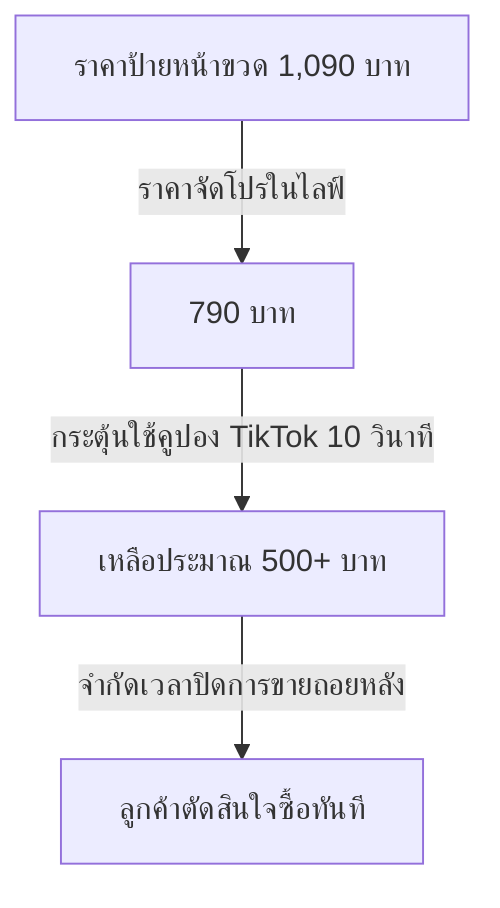

# 📋 Competitor Live Sales Blueprint: Sales Psychology & Script Decoupling
*วิเคราะห์จิตวิทยาการขายและโครงสร้างบทพูดจากคลิปไลฟ์สดคู่แข่ง 4 คลิปใหญ่ เพื่อนำมาประยุกต์ใช้กับ Doctorbank Magnesium Night Plus*

---

## 1. ข้อมูลภาพรวมการแปลงไฟล์ (Transcription Metadata)
*แปลงข้อมูลเสียงเป็นข้อความด้วย Whisper `medium` (ภาษาไทย) จากโฟลเดอร์ `Raw-Data/Raw VDO`*

1. **live1.mp4** (~740 MB | 15 นาที): เน้นขาย Astaxanthin (NatAxtin 6mg 60 เม็ด) และเกริ่น Glutathione
2. **live2.mp4** (~600 MB | 9.3 นาที): เน้นขาย Liposomal Glutathione (Liposomax) เปรียบเทียบกับ Reduced Form ทั่วไป
3. **Live3.mp4** (~854 MB | 20.5 นาที): ขาย Astaxanthin สลับกับ **"KOSMO Sleep Gummies"** (แมกนีเซียม + แคลเซียม + คาโมมายล์ + บี 6)
4. **Live4.mp4** (~797 MB | 19.3 นาที): เน้นขยายความลึกของชั้นผิว, Astaxanthin (เปรียบเทียบต้านอนุมูลอิสระดีกว่าวิตามินซี 6,000 เท่า), และสอนทริก engagement ใน TikTok Live

---

## 2. เจาะลึกวิเคราะห์ 9 มิติทางจิตวิทยาและการขาย (9-Dimension Analysis)

### 📊 มิติที่ 1: โครงสร้างลำดับการพูดและเส้นเวลา (Flow & Timeline)
โครงสร้างไลฟ์ของคู่แข่งไม่ได้ไหลไปเรื่อยๆ แต่ถูกออกแบบเป็น **"Loop-Based Selling Cycle" (ลูปการขายแบบสั้น 5-8 นาที)** เพื่อจับกลุ่มผู้ชมที่สลับเข้ามาดูใหม่ตลอดเวลา:
1. **The Problem Hook (0-1 นาที):** เริ่มจากชี้ประเด็นปัญหาใกล้ตัว (เช่น แสงแดด UV ระดับ 10 ในไทย, PM 2.5, นอนไม่หลับ, ตื่นมามึนหัว)
2. **The Education & Ingredient Stack (1-3 นาที):** ให้ความรู้เชิงลึก (เช่น ผิวมี 7 ชั้น ครีมบำรุงเข้าไม่ถึง, Reduced Glutathione ดูดซึมยากต้อง Liposomal, หรือแมกนีเซียมในเจลลี่นอนหลับคุณภาพต่ำตื่นมาจะปวดหัว)
3. **The Authority & Trademark (3-4 นาที):** เสนอตัวชูโรงที่เป็นเครื่องหมายการค้าลิขสิทธิ์ระดับโลก เช่น *NatAxtin* (Astaxanthin), *Liposomax* (USA Gluta), หรือการตรวจจาก *SGS Switzerland* เพื่อการันตีความน่าเชื่อถือ
4. **The Value Stacking (4-5 นาที):** เปรียบเทียบปริมาณและสารสกัด เช่น "เราให้ 60 เม็ด แบรนด์อื่นให้ 30 เม็ด", "กินเม็ดเดียวเท่ากับกินปู 6 กิโล"
5. **The Flash Deal Trigger (5-6 นาที):** เปิดราคาพิเศษแบบทันที "ราคาปกติ 1,090 บาท ผมลดให้เหลือ 700 บาท... แต่เดี๋ยวก่อน! ถ้าใช้คูปองในระบบ ตอนนี้เห็นเท่าไหร่?"
6. **The Urgency Countdown (6-7 นาที):** นับถอยหลัง 10 วินาทีเพื่อบีบให้กดจ่ายเงินทันที ป้องกันลูกค้าลังเล จากนั้นปรับราคากลับขึ้นเป็นราคาปกติ
7. **The Loop Reset (7 นาทีขึ้นไป):** ดึงกระแสกลับมาด้วยการดูลายแชร์ ยอดแชร์ หรือสอนทริกการengaged เพื่อเตรียมเริ่มลูปถัดไปหรือสินค้าถัดไป

---

### ⚖️ มิติที่ 2: การปฏิบัติตามกฎและวิธีอ้างสิทธิ์ (Compliance & Claims)
คู่แข่งเลี่ยงข้อกฎหมายของ อย. ไทย และกฎของ TikTok ได้อย่างแนบเนียนโดยการใช้คำพูดเปรียบเทียบกับค่ามาตรฐานหรือการทำงานระดับเซลล์แทนการอ้างผลการรักษา:
* **การพูดถึงการนอนหลับ:**
  * หลีกเลี่ยงคำว่า "รักษานอนไม่หลับ"
  * ใช้คำว่า: *"ช่วยให้หลับลึกขึ้นจริง ตื่นมาสดชื่น ไม่ปวดหัว ไม่มึนหัว"*
  * นำจุดเด่นเรื่องวิทยาศาสตร์ระดับโมเลกุลมาช่วยเสริม: *"ช่วยลดความเครียดของระบบประสาท ช่วยเรื่องโกรทฮอร์โมน (Growth Hormone) ทำให้ตื่นมาผิวดี ร่างกายฟื้นฟู"*
* **การพูดถึงผิวพรรณ:**
  * ใช้คำว่า: *"ต้านอนุมูลอิสระลึกถึงเซลล์ผิว"*
  * ใช้ตัวเลขเปรียบเทียบเชิงวิชาการเพื่อไม่ให้เคลมเกินจริง: *"ต้านอนุมูลอิสระดีกว่าวิตามินซี 6,000 เท่า ดีกว่า CoQ10 800 เท่า"* (ซึ่งเป็นข้อมูลวิจัยจริงของ Astaxanthin ช่วยเบี่ยงเบนความสนใจจากคำเคลมเรื่องความขาวตรงๆ)
* **การส่งต่อความน่าเชื่อถือ (Credential Transfer):**
  * อ้างอิงสถาบันตรวจสอบระดับสากล เช่น *"ผ่านการตรวจความปลอดภัยและสารโลหะหนักจาก SGS Switzerland"* เพื่อสร้างความมั่นใจสูงสุดโดยไม่ต้องใช้คำว่า "ผ่านการแนะนำโดยแพทย์" (ซึ่งผิดกฎการโฆษณา)

---

### 🎁 มิติที่ 3: โครงสร้างข้อเสนอและการปิดการขาย (Offer & Closing)
จิตวิทยาการสร้างความขาดแคลนและความเร่งด่วนขั้นสุด (Extreme Scarcity & Urgency):
* **10-Second Countdown (การนับถอยหลัง 10 วินาที):**
  * วิธีนี้ใช้บ่อยมากในคลิป 1, 2, 3: *"นับ 10 วิปรับเป็นราคาเต็มครับ 10, 9, 8... 1 ขออนุญาตปรับราคาเต็มนะ ใครไม่ทันขออภัยจริงๆ"*
  * เป็นการตัดหน้าการคิดเชิงตรรกะของลูกค้า ลูกค้าต้องรีบกดลงตะกร้าและชำระเงินทันทีเพื่อไม่ให้เสียสิทธิ์
* **Micro-Stock Alert (แจ้งยอดจำกัดระดับไมโคร):**
  * *"เหลือ 4 กระปุกสุดท้าย... 3 กระปุกสุดท้าย..."* แม้ในความเป็นจริงหลังบ้านอาจจะมีสต็อกมากกว่านั้น แต่การบอกตัวเลขหลักเดียวทำให้เกิดภาวะ Fear Of Missing Out (FOMO)
* **Double-Pack Anchoring (การดึงราคาแบบแพ็กคู่):**
  * ใน Live4: *"กด 2 กระปุกราคาดีขึ้นอีก"* เพื่อเพิ่มยอดขายต่อคำสั่งซื้อ (AOV - Average Order Value)

---

### 💬 มิติที่ 4: การมีปฏิสัมพันธ์และการดึงผู้ชม (Visual & Interaction)
คู่แข่งแก้ปัญหากลไกการนำเสนอของ TikTok (TikTok Algorithm) โดยกระตุ้นให้คนดูมีส่วนร่วมตลอดเวลา:
* **The Engaged Trigger Trick (ทริกล่อแชร์เพื่อแย่งคูปอง):**
  * คู่แข่งสอนผู้ชมว่าระบบ TikTok จะส่งคูปองส่วนลดและให้สิทธิ์กดซื้อทันเฉพาะคนที่ "มีส่วนร่วมสูง" (Engagement) เท่านั้น
  * คำพูดใน Live4: *"TikTok จะชอบคนที่ Engaged เยอะมาก ทุกคนต้องกดติดตามก่อน กด Follow แล้วกดแชร์ ตอนนี้คนดู 800 คน มีแชร์แค่ 800 เอง แย่งคูปองไม่ทันแน่ๆ"*
  * วิธีนี้ได้ยอด Follow และยอดแชร์ไปช่วยดันให้ไลฟ์ถูกส่งต่อหาผู้ใช้อื่นๆ แบบ Organic
* **Interaction Check:**
  * ถามคำถามให้ผู้ชมพิมพ์ตอบเพื่อดันกระแสคอมเมนต์: *"ตอนนี้ทุกคนเห็นราคาในตะกร้าเท่าไหร่ พิมพ์บอกผมหน่อย"*
  * เมื่อผู้ชมเห็นราคาพิเศษและพิมพ์เข้ามา (เช่น 399, 200, 450) คอมเมนต์จะไหลเร็วมาก ช่วยกระตุ้นระบบดันไลฟ์ขึ้นหน้าฟีด

---

### 👥 มิติที่ 5: พลังของการรีวิวสดและการยอมรับจากสังคม (Testimonial & Social Proof)
* **Social Proof แบบ Real-time:**
  * ดึงคอมเมนต์ของลูกค้าที่กินแล้วได้ผลจริงขึ้นมาอ่านออกเสียงดังๆ กลางไลฟ์ เช่น *"ผิวลื่นจริง กิน Asta ผิวเด็ก ขอบคุณมากๆ เลยครับ"*
  * การอ่านคอมเมนต์ด้านบวกสดๆ มีพลังน่าเชื่อถือสูงกว่ารูปรีวิวแปะหน้าจอ เพราะแสดงถึงตัวตนจริงของลูกค้า ณ เวลานั้น
* **Social Proof เชิงตัวเลขสะสม:**
  * *"ขายมาแค่ 2 เดือน ขายไปแล้วกว่า 80,000 กระปุก ถ้าไม่ดีจริงคนไม่กลับมาซื้อซ้ำเยอะขนาดนี้"* การระบุยอดขายระดับหมื่นในระยะเวลาสั้นๆ แสดงถึงความนิยมถล่มทลาย

---

### 💸 มิติที่ 6: จิตวิทยาการตั้งราคาและการทำโปรโมชั่น (Pricing Psychology)
* **The Store-Anchored Price (การยึดโยงราคาร้านค้าห้างสรรพสินค้า):**
  * ดึงราคาร้านค้าออฟไลน์ในห้างมาเป็นตัวเปรียบเทียบสูงๆ ก่อน: *"ในห้างแบรนด์อื่นขายกัน 700-800 บาท (สำหรับ 30 เม็ด) หรือในห้าง Watsons/Eveandboy 33 สาขาของเรา ราคาเต็มป้ายอยู่ที่ 1,090 บาท"*
  * ทำให้ราคาที่ขายในไลฟ์ดูคุ้มค่าทันที
* **The Double-Discount Illusion (ภาพลวงตาจากระบบคูปอง):**
  * คู่แข่งตั้งราคาลดในตะกร้าของตัวเองไว้ระดับหนึ่ง (เช่น จาก 1,090 เหลือ 700) แล้วพูดกระตุ้นให้ลูกค้าใช้คูปองลับของ TikTok/แพลตฟอร์มมาทับซ้อน
  * *"ผมกดลดราคาให้เหลือ 500 บาท แต่ถ้าใครมีคูปองสะสมของ TikTok มันจะดิ่งลงไปเหลือ 200 กว่าบาท! อันนั้นคือราคาที่ถูกกว่าของปลอมอีก รีบกดเลยครับ!"*
* **High Price Justification (การป้องกันข้อโต้แย้งเรื่องราคาแพง สำหรับสูตรนอนหลับ):**
  * ใน Live3 คู่แข่งใช้เทคนิคพูดดักไว้ก่อน: *"ตัวนอนหลับราคามันจะสูงนิดนึง ของเพื่อสุขภาพเกี่ยวกับการนอนหลับจะราคาถูกไม่ได้ ยี่ห้ออื่นขาย 200-300 บาท ใน TikTok เป็นไปไม่ได้ที่จะทำสูตรที่ไม่มีผลข้างเคียง มึนหัวตอนตื่นนอน"*
  * การสร้างกำแพงคุณภาพว่า "คุณภาพสูงต้องแลกด้วยราคาที่สมเหตุสมผล" ทำให้สินค้าดูพรีเมียมและน่าเชื่อถือมากขึ้น

---

### 🔄 มิติที่ 7: วงจรรักษาคนดูให้อยู่ในไลฟ์ (Retention Loop)
* **The Coupon Teaser (การเลี้ยงไข้คนดูด้วยของรางวัล/คูปอง):**
  * ดึงคนดูไม่ให้ออกไปจากไลฟ์ด้วยการสัญญาว่าจะแจกราคาพิเศษรอบใหม่: *"เดี๋ยวผมจะเปิดให้อีกรอบนะ แต่ทุกคนต้องกดแชร์ไลฟ์นี้ก่อน"*
* **Technical Troubleshooting Glitch (การอ้างปัญหาทางเทคนิคเพื่อสร้างความเป็นกันเอง):**
  * *"ทำไมคอมผมแหลก แปปนึงนะทุกคน คอมผมแล็กเย็นๆ"* หรือการถามแอดมินหลังบ้านสดๆ เรื่องราคากับคูปอง ทำให้การไลฟ์ดูเรียล ไม่ใช่การขายของแบบหุ่นยนต์ส่งผลให้คนดูรู้สึกเป็นพวกเดียวกันและเอ็นดูผู้ไลฟ์

---

### 🎯 มิติที่ 8: การจัดวางตำแหน่งและการโจมตีคู่แข่ง (Competitor Positioning)
* **Ingredient Form Attack (โจมตีรูปแบบสารสกัดที่ด้อยกว่า):**
  * โจมตีสูตร Glutathione แบบทั่วไป: *"กลูตาต้องกินแบบ Liposomal นะครับ ห้ามกินแบบ Reduced Form ทั่วไป เพราะ Reduced Form ไม่ได้ช่วยผิวโดยตรง"*
  * โจมตีสูตรนอนหลับราคาถูก: *"ยี่ห้ออื่น 200-300 กินไปเถอะ ตื่นมาแล้วมึนหัว ปวดหัว นอนหลับไม่จริง"*
* **The Direct-to-Consumer (D2C) Rationale (อ้างตัดงบการตลาดเพื่อลดราคา):**
  * อธิบายให้คนดูเห็นภาพว่าทำไมเราขายของแพงในราคาถูกได้: *"แบรนด์เราไม่มีค่าการตลาด ค่า Marketing แค่ 5% ต้นทุนทั้งหมดไปลงที่สารสกัดและวัตถุดิบนำเข้า ส่วนแบรนด์ทั่วไปบวกค่าการตลาดออฟไลน์เข้าไปเยอะ ราคาขายเลยสูงแต่สารสกัดน้อย"*

---

### ⛏️ มิติที่ 9: คอมเมนต์เด่นและคำถามยอดฮิต (Comment & FAQ Mining)
จากการถอดเทป คำถามและคอมเมนต์จากลูกค้าจริงที่เกิดขึ้นบ่อยที่สุด ได้แก่:
1. **"กินเวลาไหนดีที่สุด / กินตอนไหน?"** (คู่แข่งตอบ: "ทานหลังอาหาร 2 เม็ด")
2. **"ตื่นมาจะปวดหัว / มึนหัวไหม?"** (คู่แข่งตอบ: "รับประกันตื่นมาสดชื่น ไม่มึนหัว ไม่ปวดหัว เหมือนยาเคมีแน่นอน")
3. **"กินได้นานแค่ไหน / สะสมไหม?"** (คู่แข่งตอบ: "ตุนได้เลย เก็บได้นานประมาณ 2 ปี")
4. **"มีสารอันตรายไหม?"** (คู่แข่งตอบ: "เราส่งตรวจใบเซอร์จาก SGS สวิตเซอร์แลนด์ มั่นใจได้")

---

## 3. แผนการนำจิตวิทยาคู่แข่งมาปรับใช้กับ Doctorbank Magnesium Night Plus
*การประยุกต์ใช้เพื่อขายสูตร Premium Non-Melatonin Nightly Support*

> [!IMPORTANT]
> **DR.BANK Compliance Rule:** ห้ามอ้างคำว่า "คุณหมอ" หรือ "โรงพยาบาล" ในตัวโฆษณา/ตัวสคริปต์พูดเด็ดขาด ให้ใช้สถานะ **"Founder / Formulator" (ผู้ก่อตั้ง / ผู้คิดค้นสูตร)** และห้ามอ้างผลการรักษาโรคนอนไม่หลับ (Insomnia) โดยตรง

### 1. บทพูดเปรียบเทียบจุดอ่อนคู่แข่ง (Competitor Defeat Hook)
* **Competitor Attack:** โจมตี GABA ทั่วไปที่ไม่ข้าม BBB (Blood-Brain Barrier) และการตื่นมามึนหัวจากเมลาโทนินหรือยาเคมี
* **DR.BANK Pitch:**
> *"หลายคนลองตัวช่วยนอนหลับในเน็ตราคา 200-300 บาท แล้วบ่นว่าตื่นมามึนหัว ปวดกระบอกตา หรือบางแบรนด์ใส่ GABA ธรรมดาที่กินเท่าไหร่ก็ไม่เข้าสมอง...*
>
> *สูตร Magnesium Night Plus ของเราคิดค้นโดย Formulator ที่คัดเฉพาะ **PharmaGABA®** ที่ดูดซึมผ่านระบบประสาทส่วนปลาย (Gut-Brain Axis) และ **L-Theanine (AlphaWave®)** สารสกัดพรีเมียมลิขสิทธิ์ระดับโลก เพื่อกระตุ้นคลื่นสมองอัลฟ่า (Alpha Wave) โดยเฉพาะ ช่วยให้สมองสลัดเรื่องคิดเยอะ ผ่อนคลายหัวค่ำ ตื่นมาเฟรช 100% ไม่มีเอฟเฟกต์แฮงก์ตอนเช้าแน่นอน!"*

### 2. การสร้างคุณค่าเพิ่มเชิงวิทยาศาสตร์ (Premium Value Stacking)
* **สูตรคู่แข่ง:** แมกนีเซียมธรรมดา + แคลเซียม + คาโมมายล์ (มักใช้รูป Oxide หรือเกรดทั่วไป)
* **DR.BANK Pitch:**
> *"Magnesium ทั่วไปตามท้องตลาดส่วนใหญ่เป็น Oxide ซึ่งดูดซึมได้แค่ 4% กินไปก็ถ่ายทิ้งหมด... แต่ขวดนี้เราใช้ **Magnesium Complex ถึง 4 รูปแบบ** ชูโรงด้วย **Bisglycinate Chelate** ที่ร่างกายดูดซึมได้สูงสุด ไม่กวนทางเดินอาหาร พร้อมกับสารอาหารประสานงานร่วมกันแบบ **Multi-Pathway Sleep Formula** (แมกนีเซียม + L-Theanine + GABA + Zinc + B6) จบในสูตรเดียว ไม่ต้องซื้อแยกทาน 3-4 กระปุก"*

### 3. เทคนิคปิดการขายชวนอึ้งกลางไลฟ์ (Live Pricing & TikTok Coupon Trigger)
* **กลไกการตั้งราคา:**
  * ราคาปกติป้ายหน้าขวด (Anchored Price): **1,090 บาท** (หรือราคารายการออฟไลน์/คลินิก)
  * ราคาพิเศษประจำไลฟ์: **790 บาท** (30 แคปซูล)
  * โปรโมชั่นพิเศษตะกร้า TikTok: ดึงราคาลงเหลือ **650-690 บาท** และดันให้คนใช้คูปองลดพิเศษของ TikTok ในช่วง 10 วินาทีสุดท้ายให้เหลือต่ำกว่า 500 บาท เพื่อปิดการขายแบบฉับพลัน

### 4. โครงสร้างสคริปต์สั้น 7 นาทีสำหรับ TikTok Live (DR.BANK 7-Min Live Script Template)

* **นาทีที่ 0:00 - 0:01 (Hook ปัญหาคนเมือง):**
  * *"ใครเป็นบ้างครับ? พอหัวถึงหมอนแล้วสมองไม่ยอมหยุดวิ่ง คิดเรื่องงาน คิดเรื่องพรุ่งนี้ เครียดสะสมจนตีสองตีสามก็ยังตาค้าง ตื่นมาก็ปวดหัว ตกบ่ายง่วงเพลีย"*
* **นาทีที่ 0:01 - 0:03 (Educate & Differentiate เผยจุดอ่อนสินค้าตลาด):**
  * *"หลายคนไปพึ่งเมลาโทนินสังเคราะห์นานๆ จนร่างกายดื้อ หรือกินยากดประสาทตื่นมาแล้วหัวตื้อไปครึ่งวัน หรือซื้อแมกนีเซียมถูกๆ ที่ไม่ดูดซึม... สูตรนี้ไม่ใช่ยานอนหลับและไม่มีเมลาโทนิน แต่เราทำมาเพื่อปรับ Night Routine โดยเฉพาะ"*
* **นาทีที่ 0:03 - 0:04 (Introduce Formula & Trademarks):**
  * *"นี่คือสูตร Magnesium Night Plus ของแบรนด์ DR.BANK เรานำเข้าวัตถุดิบลิขสิทธิ์อย่าง **AlphaWave® L-Theanine** และ **PharmaGABA®** บวกกับแมกนีเซียมคีเลตชั้นดี 4 ฟอร์ม เพื่อช่วยให้สวิตช์สมองปิดโหมดคิดฟุ้งซ่านได้อย่างปลอดภัยตามกลไกธรรมชาติ"*
* **นาทีที่ 0:04 - 0:05 (Social Proof & Safety Check):**
  * *"สูตรนี้พัฒนาจากข้อมูลวิจัยทางการแพทย์ มีการตรวจสอบสัดส่วนสารสกัดอย่างถูกต้อง ทาน 2-3 แคปซูลก่อนนอนได้อย่างปลอดภัย ไม่เกินมาตรฐานระดับสูงสุด (UL)"*
* **นาทีที่ 0:05 - 0:06 (The Flash Deal Offer & Urgency):**
  * *"ปกติ 1 กระปุก 30 แคปซูล ราคาปกติ 1,090 บาท หน้าไลฟ์ตอนนี้ปักตะกร้าให้ที่ 790 บาท... แต่เดี๋ยวใครที่กดแชร์ไลฟ์นี้และกดติดตาม ตอนนี้ TikTok จะปล่อยคูปองลดเพิ่มลงไปอีก บางคนอาจจะเห็นเหลือแค่ 500 กว่าบาท!"*
* **นาทีที่ 0:06 - 0:07 (The 10-Second Countdown):**
  * *"ผมให้เวลาแค่ 10 วินาทีเท่านั้นสำหรับราคานี้ หมดแล้วแอดมินดึงราคากลับเป็น 790 ทันทีนะครับ... นับ 10, 9, 8... 1 ปรับราคากลับครับ!"*
