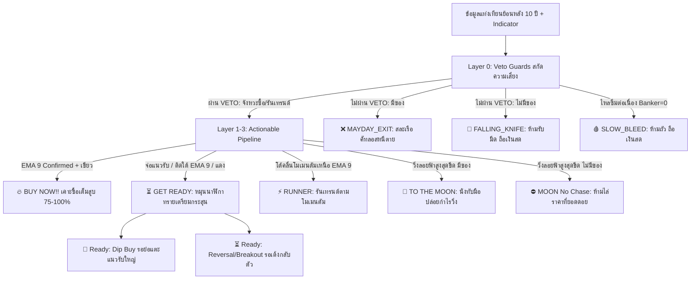

# 📘 คู่มือมาตรฐาน 7-Tier Cyber Action Matrix & 16-Scenario Checklist
> **เอกสารอ้างอิงหลัก (State of Truth):** Project 2X Technical Signal Architecture & X-Chart Watchlist Pipeline  
> **เวอร์ชัน:** 2.38.1 (Production Release - Watchlist Synchronized)  
> **ไฟล์ต้นทางระบบคำนวณและ UI:**  
> - Backend: [`project2xEngine.js`](file:///c:/My%20Claw/MyProjects/My%20Stock%20Portfolio/server/services/project2xEngine.js)  
> - Frontend Config: [`tierConfig.ts`](file:///c:/My%20Claw/MyProjects/My%20Stock%20Portfolio/src/utils/tierConfig.ts)  
> - Watchlist Dock: [`XChartWatchlistDock.tsx`](file:///c:/My%20Claw/MyProjects/My%20Stock%20Portfolio/src/components/xchart/XChartWatchlistDock.tsx)  
> - Micro-Badge & Visual Info: [`TierBadgeIndicator.tsx`](file:///c:/My%20Claw/MyProjects/My%20Stock%20Portfolio/src/components/xchart/TierBadgeIndicator.tsx)  

---

## 🧭 1. ปรัชญาการออกแบบ: Risk-First & Action-Oriented (Watchlist Battle-Tested)

ระบบสัญญาณแบบเดิมที่มีเพียง 3 สี (**BUY ZONE / WAIT / DANGER**) มักสร้างปัญหาในการปฏิบัติงานจริง 3 ประการ:
1. **กั๊กจังหวะในขาขึ้น:** หุ้นที่กำลังวิ่งลอยฟ้า (Bull Trend) มักถูกแปะป้าย `WAIT` ทำให้ผู้ใช้งานเข้าใจผิดว่า "กำลังจะพังหรือเปล่า" จนรีบขายหมูทิ้ง
2. **ไม่ระบุไม้เข้าซื้อ (Undefined Tranche):** ไม่รู้ว่าสัญญาณนี้ควรใส่เต็มสูบ 100%, แหย่ไม้แรก 25%, หรือรอแท่งเขียวคอนเฟิร์ม
3. **รับมีดขาลง (Falling Knife Trap):** ป้าย `BUY ZONE` เดิมมักหลอกให้คนกระโดดรับมีดหุ้นที่ยังลงไม่สุด หรือติดแท่งแดงลึกใต้ EMA 200

ระบบ **7-Tier Cyber Action Matrix (V2.38.1)** จึงถูกจัดระเบียบใหม่ให้ตรงกับหน้างานจริง โดยยุบหมวดหมู่กำกวม (เช่น `BUY ZONE` และ `ON RADAR`) ออก แล้วแปลงเป็นสถานะที่ **Actionable 100%**:
- **Layer 0 (Veto Guards):** สกัดกั้นความเสี่ยงเงินต้น สละเรือ/ห้ามรับมีด
- **Layer 1 (Confirmed Buy):** จุดเข้าซื้อคอนเฟิร์มสมบูรณ์แบบเหนือ **EMA 9 Trigger**
- **Layer 2 (Get Ready):** โซนดักซุ่มเตรียมกระสุน (แบ่ง 2 ขา: ย่อลึกแนวรับ `🧲 Dip Buy` vs รอเด้งกลับตัว `⏳ Reversal`)
- **Layer 3 (Trend Surfers & Moonshots):** หุ้นขาขึ้นโต้คลื่นโมเมนตัม `⚡ RUNNER` และลอยฟ้า `🚀 TO THE MOON`

---

## 📊 2. ตารางแม่แบบ 7-Tier Cyber Action Matrix (Action-Urgency Order)

> **มาตรฐานการจัดเรียง (Watchlist Sorting Hierarchy):** เรียงลำดับตาม **ความเร่งด่วนในการตัดสินใจ (Action-Urgency)** เป็นค่าเริ่มต้น (`asc`) เพื่อให้เทรดเดอร์กวาดสายตา 0.1 วินาทีแล้วเห็นสิ่งที่ต้องทำทันที:

| ลำดับ Tier | ชื่อระดับสัญญาณ | ไอคอน | สีเส้น Spine & แอนิเมชัน | ความหมายเชิงยุทธศาสตร์ | แอคชั่นหน้างาน (Actionable Mandate) | ขนาดกระสุน (Deploy Tranche) |
|:---:|:---|:---:|:---|:---|:---|:---:|
| **Tier 1** | **BUY NOW!!** | 🔥 | **The Solar Fire Orb** ส้มแดงทอง Pulse `animate-fire-zoom` | คอนเฟิร์มสมบูรณ์แบบ แท่งเขียวปิดยืนเหนือ **EMA 9 Trigger** | **เคาะซื้อทันที** เข้าตามจุดกลับตัวสถาบันเต็มสูบ | **75% – 100%** |
| **Tier 2** | **GET READY** | ⏳ | **ส้มอำพัน / ทองสว่าง** `🧲 #FF9100` / `⏳ #FFD600` | **ดักซุ่มเตรียมกระสุน** แบ่ง 2 ท่าย่อย: • **`🧲 Dip Buy`:** จ่อแนวรับใหญ่ EMA 150-200 • **`⏳ Reversal`:** รอเด้งกลับตัว / บีบตัวจ่อเบรก | **หมุนนาฬิกาทรายรอ** ห้ามใจร้อนเคาะก่อนแท่งเขียวคอนเฟิร์มเหนือ EMA 9 | **0% (เตรียมกระสุน)** |
| **Tier 3** | **SLOW BLEED** | 🩸 | **ชมพูกุหลาบ** `#F50057 animate-bleed-drip` | หุ้นไหลซึมต่อเนื่อง สถาบันหายหัว ($Banker = 0$) นานเกิน 8 วัน | **ถือเงินสด 100%** ห้ามซื้อถัวเฉลี่ยขาลงเด็ดขาด | **0% (Cash 100%)** |
| **Tier 4** | **FALLING KNIFE** | 🔪 | **แดงเลเซอร์ Pulse** `#FF1744 animate-flash-alert` | มีดกำลังร่วงหลุดลึก โครงสร้างหลักพัง (สำหรับคน **ไม่มีของ**) | **ห้ามรับมีดเด็ดขาด!** ถือเงินสด 100% รอสะเด็ดน้ำ | **0% (Cash 100%)** |
| **Tier 5** | **MAYDAY EXIT** | ❌ | **แดงเลเซอร์ Pulse** `#FF1744 animate-flash-alert` | สัญญาณเตือนภัยวิกฤต หลุดโซนหายนะ (สำหรับคน **มีหุ้นในพอร์ต**) | **สละเรือ / คัทลอสหนีตายทันที** รักษาเงินต้น | **Exit / Stop-Loss** |
| **Tier 6** | **RUNNER** | ⚡ | **ฟ้าเลเซอร์ นีออน** `#00E5FF animate-pulse` | หุ้น Super Bull โต้คลื่นโมเมนตัม เกาะเส้น Trigger EMA 9 แน่น | **รันเทรนด์ตามโมเมนตัม** ปล่อยให้กำไรวิ่งไปต่อ | **ถือต่อ (Hold)** |
| **Tier 7** | **TO THE MOON** | 🚀 / ⛔ | **ม่วงนีออนลอยฟ้า** `#D500F9 animate-rocket-float` | หุ้นวิ่งลอยฟ้าสูงสุดขีดเหนือ EMA 150 • มีของ: `🚀 TO THE MOON` • ไม่มีของ: `⛔ MOON (No Chase)` | • **มีของ:** **นั่งทับมือ ปล่อยกำไรวิ่ง** ห้ามขายหมู • **ไม่มีของ:** **ห้ามไล่ราคาที่ยอดดอยเด็ดขาด** | **มีของ: ถือ 100% ไม่มีของ: 0%** |

---

## 🔬 3. สี่เซ็นเซอร์หลัก (The 4 Preflight Sensors) & ตัวชี้วัดสำคัญ

หน้าจอ **Stock X-Ray Command HUD (DossierHeader Row 3)** และระบบคัดกรองสัญญาณอัตโนมัติทำงานด้วยเซ็นเซอร์ 4 จุด:

### 1. ⚡ EMA 9 Tactical Trigger Line
- **สูตรคำนวณ:** $EMA_9 = Close \times \frac{2}{10} + EMA_{prev} \times (1 - \frac{2}{10})$
- **บทบาท:** ตัวกระตุ้นเชิงยุทธวิธี (Agile Tactical Trigger)
- **กฎเหล็ก:** แม้ราคาจะแตะแนวรับหินผาเส้น 200 หรือเกิด Bullish Divergence แต่ถ้าแท่งเทียนยังปิด **ใต้เส้น EMA 9** ระบบจะล็อกสถานะไว้ที่ `⏳ GET READY` ทันที และจะปลดล็อกเป็น `🔥 BUY NOW!!` ก็ต่อเมื่อ **ราคาปิดยืนเหนือ EMA 9 ได้สำเร็จ** เพื่อสกัดกั้นการเด้งลม

### 2. 🏦 Banker Flow (MCDX Multi-Color Dragon Extended)
- **สูตรคำนวณ:** คำนวณจาก RSI(50) ของราคาปิด โดยแปลงสเกลเป็น 0 ถึง 20 แท่ง
- **บทบาท:** วัดความหนาแน่นของเม็ดเงินสถาบันกองทุน (Smart Money):
  - `Banker = 0`: **ไร้เจ้ามือ ไร้สถาบัน** (อันตราย เสี่ยง Slow Bleed / Falling Knife)
  - `Banker 1 – 6`: **สถาบันเริ่มสะสมบางตา** (จังหวะ Early Bird หรือระวัง Dead Cat)
  - `Banker 8 – 14`: **สถาบันเกาะแน่น** (ปลอดภัยสูงสำหรับช้อนซื้อรอบย่อตัว)
  - `Banker > 14`: **สถาบันคุมตลาดเบ็ดเสร็จ** (ระดับ Super Bull รันเทรนด์ลอยฟ้า)

### 3. 🌐 EMA Alignment Regime (สภาพแวดล้อมเทรนด์)
- `BULL Regime`: $EMA_{50} > EMA_{150} > EMA_{200}$ (การเรียงตัวสมบูรณ์แบบ — ซื้อได้ทุกจังหวะย่อ)
- `NEUTRAL Regime`: $EMA_{50} > EMA_{200}$ แต่ $EMA_{150}$ ยังไม่จัดระเบียบ (ช่วงพลิกฟื้นฐาน)
- `BEAR Regime`: $EMA_{50} < EMA_{200}$ (โครงสร้างขาลงใหญ่ — **ห้ามซื้อเด็ดขาด ยกเว้น Regime Flip / Reclaim**)

### 4. 🧲 RSI Bullish Divergence Detector
- **สูตรคำนวณ:** สแกนย้อนหลัง 30 แท่งเทียน (`lookback = 30`) หาจุดต่ำสุดของราคาและ RSI:
  - $Price_{current} \le Price_{earlier\_low} \times 1.015$ (ราคาทำ Lower Low หรือ Double Bottom)
  - $RSI_{current} \ge RSI_{earlier\_low} + 3.0$ (RSI ยก Low สูงขึ้นอย่างมีนัยสำคัญ)
  - $RSI_{current} \le 55$ (ต้องอยู่ในโซนล่าง)
- **บทบาท:** ตรวจจับแรงสะสมใต้ผิวน้ำ ดึงเข้าหมวด `Ready: Reversal / Breakout ⏳`

### 5. 🧬 Pullback & Bedrock DNA (10Y Historical Bounces)
- สแกนย้อนหลัง 2,500+ แท่งเทียน (10 ปี) ในฐานข้อมูล SQLite เพื่อคำนวณอัตราความสำเร็จในการเด้ง:
  - **EMA 50 Bounces (%):** อัตราการย่อตื้นแล้วไปต่อ
  - **EMA 150 Bounces (%):** อัตราการย่อระดับปานกลาง
  - **EMA 200 Bedrock (%):** อัตราการเด้งจากแนวรับหินผาหลัก
  - **Bedrock Line:** ระบุเส้นแนวรับที่เหนียวแน่นที่สุดในรอบทศวรรษ

---

## 📑 4. เจาะลึก 16 สถานการณ์ & กฎเช็คลิสต์ (The 16 Scenarios)

---

### [LAYER 0: VETO GUARDS] เกราะป้องกันความปลอดภัยเงินต้น

> **กฎการจำแนกสถานะพอร์ต (Context-Aware Mandate):**
> - **มีหุ้นในพอร์ต (`ownedShares > 0`):** แสดงเป็น `MAYDAY_EXIT` ❌ ➔ **สละเรือ / ตัดขาดทุน (Cut Loss) ทันที เพื่อรักษาเงินต้น**
> - **ไม่มีหุ้นในพอร์ต (`ownedShares == 0`):** แสดงเป็น `FALLING_KNIFE` 🔪 ➔ **ห้ามรับมีดเด็ดขาด! ถือเงินสด 100% รอสะเด็ดน้ำรอตั้งลำกลับตัว**

#### 🔴 Scenario 1: Falling Knife (มีดร่วง) ➔ `FALLING_KNIFE` 🔪 / `MAYDAY_EXIT` ❌
> **นิยาม:** หุ้นถูกทุบหลุดต่ำกว่าเส้น EMA 200 เกิน -10% (-12% ใน BULL) โดยที่สถาบันหนีเตลิด (Banker = 0)
- **ความเสี่ยง:** มีดกำลังปักลงพื้น ห้ามเอามือไปรับเด็ดขาด

| เช็คลิสต์ | เกณฑ์การตรวจสอบ | ผลลัพธ์ที่ต้องผ่าน |
|:---:|:---|:---:|
| 1 | **Dist EMA 200** | $< -10.0\%$ (หรือ $< -12.0\%$ ใน BULL) |
| 2 | **Banker MCDX** | $= 0$ (ไร้แรงซื้อสถาบันโดยสิ้นเชิง) |
| 3 | **Actionable VETO** | **มีของ:** สละเรือ คัทลอสทันที / **ไม่มีของ:** ห้ามรับมีด ถือเงินสด |

---

#### 🔴 Scenario 2: Dead Cat Bounce (เด้งหลอกใต้น้ำ) ➔ `FALLING_KNIFE` 🔪 / `MAYDAY_EXIT` ❌
> **นิยาม:** ราคาจมลึกใต้ EMA 200 เกิน -10% ในเทรนด์ขาลง (BEAR) พยายามดีดตัวด้วยแรงสถาบันกระปริบกระปรอย (1-6)
- **ความเสี่ยง:** เป็นการเด้งเพื่อเปิดทางให้สถาบันใหญ่ระบายของทุบต่อ

| เช็คลิสต์ | เกณฑ์การตรวจสอบ | ผลลัพธ์ที่ต้องผ่าน |
|:---:|:---|:---:|
| 1 | **EMA Regime** | `BEAR` ($EMA_{50} < EMA_{200}$) |
| 2 | **Dist EMA 200** | $< -10.0\%$ |
| 3 | **Banker MCDX** | อยู่ระหว่าง $1$ ถึง $6$ (บางตา ไม่พอเปลี่ยนเทรนด์) |
| 4 | **Actionable VETO** | **ห้ามตาม / ระวังกับดักเด้งหลอกเพื่อทุบต่อ** |

---

#### 🔴 Scenario 3: Core Breakdown (โครงสร้างหลักพัง) ➔ `FALLING_KNIFE` 🔪 / `MAYDAY_EXIT` ❌
> **นิยาม:** หลุดแช่อยู่ใต้เส้น EMA 200 ลึกกว่า -4% ต่อเนื่องนานเกิน 3 วันทำการในเทรนด์ BEAR (หรือหลุดลึกใน BULL นานเกิน 5 วัน)
- **ความเสี่ยง:** หุ้นเสียสภาพการเติบโต กลายสภาพเป็นขาลงระยะยาว

| เช็คลิสต์ | เกณฑ์การตรวจสอบ | ผลลัพธ์ที่ต้องผ่าน |
|:---:|:---|:---:|
| 1 | **EMA Regime** | `BEAR` หรือหลุดต่ำกว่า EMA 200 |
| 2 | **Dist EMA 200** | $< -4.0\%$ (BEAR) หรือ $< -5.0\%$ (BULL) |
| 3 | **Days Below EMA 200** | $\ge 3$ วัน (BEAR) หรือ $\ge 5$ วัน (BULL) |
| 4 | **Actionable Mandate** | **มีของ:** ตัดขาดทุนทันที (Stop-Loss) / **ไม่มีของ:** รอซ่อมฐานใหม่ |

---

#### 🩸 Scenario 4: Slow Bleed / Death Drift (ไหลซึมไร้เจ้ามือ) ➔ `SLOW_BLEED` 🩸
> **นิยาม:** หุ้นซึมลงช้าๆ ใต้เส้น EMA 200 โดยที่ Banker เป็น 0 ต่อเนื่องนานเกิน 8 วันทำการ
- **ความเสี่ยง:** เสียโอกาสและเงินจม ไม่มีใครสนใจดันราคา

| เช็คลิสต์ | เกณฑ์การตรวจสอบ | ผลลัพธ์ที่ต้องผ่าน |
|:---:|:---|:---:|
| 1 | **EMA Regime** | `BEAR` |
| 2 | **Dist EMA 200** | $< 0.0\%$ |
| 3 | **Days Banker Zero** | $\ge 8$ วันทำการ |
| 4 | **Actionable Mandate** | **ถือเงินสด 100% รอโครงสร้างฟื้น ห้ามถัวเด็ดขาด** |

---

### [LAYER 1: CONFIRMED REVERSALS & BREAKOUTS] จุดซื้อคมกริบ มั่นใจ 100%

#### 🔥 Scenario 5: Double Bottom Confirmed ➔ `BUY_NOW` 🔥
> **นิยาม:** ราคาลงมาทดสอบแนวรับเส้น EMA 200 รอบที่ 2 ในรอบ 30-45 วัน โดยไม่ทำ Lower Low + ปิดยืนเหนือ EMA 9 ได้สำเร็จ
- **ความมั่นใจ:** สูงสุดในบรรดาทุกสัญญาณ (Prime Entry 100%)

| เช็คลิสต์ | เกณฑ์การตรวจสอบ | ผลลัพธ์ที่ต้องผ่าน |
|:---:|:---|:---:|
| 1 | **EMA Regime** | ไม่ใช่ `BEAR` (`BULL` หรือ `NEUTRAL`) |
| 2 | **Double Bottom Structure** | ฐานที่ 2 ไม่ต่ำกว่าฐานแรก ($\Delta \ge 0$) |
| 3 | **Dist EMA 200** | $-3.5\%$ ถึง $+2.0\%$ |
| 4 | **EMA 9 Tactical Trigger** | **ปิดเหนือ EMA 9 (`isAboveEma9 = true`)** |
| 5 | **Banker MCDX** | $\ge 1$ |
| 6 | **Deploy Tranche** | **จัดเต็ม 100% ของโควตาไม้** |

---

#### 🔥 Scenario 6: Bear Trap Reclaim (กับดักหมีสำเร็จ) ➔ `BUY_NOW` 🔥
> **นิยาม:** ราคาเคยหลุดกระชากใต้เส้น 200 หลอกให้คนคัทลอส แล้วดีดกลับขึ้นมายืนเหนือเส้น 200 + ตัดข้าม EMA 9 ด้วยวอลุ่มหนุน
- **ความมั่นใจ:** 75% – 100%

| เช็คลิสต์ | เกณฑ์การตรวจสอบ | ผลลัพธ์ที่ต้องผ่าน |
|:---:|:---|:---:|
| 1 | **EMA Regime** | ไม่ใช่ `BEAR` |
| 2 | **Reclaim Action** | เคย $< -4\%$ ใน 5 วันก่อน แต่วันนี้กลับมา $\ge 0\%$ |
| 3 | **EMA 9 Tactical Trigger** | **ปิดยืนเหนือ EMA 9** |
| 4 | **Banker MCDX** | $\ge 1$ |
| 5 | **Volume Surge** | $\ge 1.2\times$ ค่าเฉลี่ย 20 วัน |
| 6 | **Deploy Tranche** | **75% – 100%** |

---

#### 🔥 Scenario 7: Base Breakout (ระเบิดจากฐานสะสม) ➔ `BUY_NOW` 🔥
> **นิยาม:** สร้างฐานแน่นิ่งใกล้เส้น EMA มานาน แล้วทะลุขอบบนของกรอบสะสมด้วยวอลุ่มระเบิด + ยืนเหนือ EMA 9
- **ความมั่นใจ:** 100% โมเมนตัมตามรอบใหญ่

| เช็คลิสต์ | เกณฑ์การตรวจสอบ | ผลลัพธ์ที่ต้องผ่าน |
|:---:|:---|:---:|
| 1 | **EMA Regime** | ไม่ใช่ `BEAR` |
| 2 | **Base History** | สะสมในกรอบแคบ $\ge 5$ วัน |
| 3 | **Price Breakout** | ทะลุ High ของฐานสะสม |
| 4 | **EMA 9 Tactical Trigger** | **ปิดยืนเหนือ EMA 9** |
| 5 | **Banker MCDX** | $\ge 4$ |
| 6 | **Volume Surge** | $\ge 1.5\times$ วอลุ่มเฉลี่ย 20 วัน |
| 7 | **Deploy Tranche** | **100%** |

---

#### 🔥 Scenario 8: V-Shape Quick Dip Rebound ➔ `BUY_NOW` 🔥
> **นิยาม:** หุ้นขาขึ้นแกร่ง (BULL) ย่อตัวแตะ EMA 150/200 แล้วแท่งเขียวดีดสวนทันที + ยืนเหนือ EMA 9
- **ความมั่นใจ:** 100% ช้อนซื้อของถูกในเทรนด์ขาขึ้น

| เช็คลิสต์ | เกณฑ์การตรวจสอบ | ผลลัพธ์ที่ต้องผ่าน |
|:---:|:---|:---:|
| 1 | **EMA Regime** | **BULL เท่านั้น** ($50 > 150 > 200$) |
| 2 | **Dist Major EMA** | EMA 200 ($-3.5\%$ ถึง $+2\%$) หรือ EMA 150 ($-2.5\%$ ถึง $+2\%$) |
| 3 | **EMA 9 Tactical Trigger** | **ปิดยืนเหนือ EMA 9** |
| 4 | **Candle Pattern** | **แท่งเขียว Bullish (`isLatestBullish = true`)** |
| 5 | **Banker MCDX** | อยู่ระหว่าง $1$ ถึง $14$ |
| 6 | **Deploy Tranche** | **100%** |

---

### [LAYER 2: GET READY] เตรียมกระสุน & ดักซุ่มยุทธวิธี (2 Core Sub-Modes)

#### 🧲 ท่าย่อยที่ 1: `Ready: Dip Buy 🧲` (รอย่อแตะแนวรับใหญ่)

##### 🧲 Scenario 9: Testing Support (จ่อแนวรับใหญ่) ➔ `GET_READY` (Dip Buy)
> **นิยาม:** ราคาลงมาแตะ EMA 150 หรือ 200 มีแรงสถาบันสะสม แต่ยังอยู่ใต้ EMA 9 หรือยังติดแท่งแดง
- **เกณฑ์:** $d200$ อยู่ระหว่าง $-3.5\%$ ถึง $+2\%$ หรือ $d150$ อยู่ระหว่าง $-2.5\%$ ถึง $+2\%$ และ $Banker \ge 1$
- **แอคชั่น:** **หมุนนาฬิกาทรายเตรียมตัว** รอยืนยันแท่งเขียวข้ามผ่าน EMA 9 เพื่อปลดล็อกเป็น BUY NOW

##### 🧲 Scenario 10: Shallow Dip (EMA 50 Bounce Watch) ➔ `GET_READY` (Dip Buy)
> **นิยาม:** หุ้น Super Bull ย่อตื้นทดสอบเส้น EMA 50 ($-2.0\%$ ถึง $+1.5\%$) ลอยเหนือ EMA 150 ชัดเจน
- **เกณฑ์:** $Regime = BULL$, แตะ EMA 50, $Banker \ge 5$
- **แอคชั่น:** เฝ้ารอยืนยันแท่งเขียว หากยืนเหนือ EMA 9 จะเคาะซื้อตามแผนทันที

##### 🧲 Scenario 16 (ขา Dip): Pullback to Bedrock ➔ `GET_READY` (Dip Buy)
> **นิยาม:** หุ้นพักฐานลึกเข้าหาแนวรับหินผา 10 ปี (The Costco / ISRG / MELI Bedrock Zone)
- **หมวดหมู่ย่อย:**
  - `DIP BUY (Healthy Dip)`: ย่อเบาๆ $-1\%$ ถึง $-3\%$ vs EMA 150
  - `DIP BUY (Deep Pullback)`: ย่อลึก $-3\%$ ถึง $-6\%$ vs EMA 150
  - `DIP BUY (Approaching Bedrock)`: ทิ้งตัวหาเส้น EMA 200 ($d150 < -6\%$)
  - `DIP BUY (Below Bedrock)`: หลุดต่ำกว่าเส้น 200 ($-3.5\%$ ถึง $-12\%$) แต่พื้นฐานไม่พัง สไนเปอร์จ้องช้อนซื้อ

---

#### ⏳ ท่าย่อยที่ 2: `Ready: Reversal / Breakout ⏳` (รอเด้งกลับตัว / บีบตัวจ่อเบรก)

##### ⏳ Scenario 11: Regime Flip Watch (Golden Cross) ➔ `GET_READY` (Reversal)
> **นิยาม:** เส้น EMA 50 ตัดขึ้นเหนือ EMA 200 พลิกจากขาลงสู่รอบขาขึ้นใหม่ พร้อมเงินสถาบันไหลเข้าสะสม
- **เกณฑ์:** Golden Cross เกิดขึ้นใหม่, $Banker \ge 3$, ปิดจ่อแนวเส้น
- **แอคชั่น:** รอวอลุ่มหนุนและราคาปิดยืนเหนือ EMA 9

##### ⏳ Scenario 12: Sideway Base Squeeze ➔ `GET_READY` (Reversal)
> **นิยาม:** ราคากอดเส้น EMA 200 นิ่งๆ ในกรอบแคบ $\ge 5$ วัน วอลุ่มแห้งบีบตัว ($\le 1.2\times$) สถาบันเลี้ยงตัว
- **เกณฑ์:** อยู่ใกล้ EMA 200 นาน $\ge 5$ วัน, $Banker \ge 2$, $RSI \in [35, 62]$
- **แอคชั่น:** จ่อระเบิดกรอบสะสม รอ Volume Surge $\ge 1.4\times$ + ยืนเหนือ EMA 9

##### ⏳ Scenario 13: Early Bird Watch / RSI Divergence ➔ `GET_READY` (Reversal)
> **นิยาม:** แตะแนวรับใหญ่พร้อมสัญญาณกระทิงซ่อน RSI Bullish Divergence ใต้ผิวน้ำ
- **เกณฑ์:** เกิด Divergence ใน non-BEAR regime หรือเริ่มมีสถาบันสะสม
- **แอคชั่น:** ตั้งเรดาร์จับตาเป็นพิเศษ ใกล้ถึงเวลาปลดล็อกจุดกลับตัว

---

### [LAYER 3: TREND RUNNERS & MOONSHOTS] รันเทรนด์ไต่ระดับและแตะดวงจันทร์

#### ⚡ Scenario 15: RUNNER (Surfing Trend) ➔ `RUNNER` ⚡
> **นิยาม:** ขาขึ้นสมบูรณ์แบบ ($50 > 150 > 200$) ราคาโต้คลื่นไต่ระดับเหนือเส้น Trigger EMA 9 สถาบันคุมเข้ม ($Banker \ge 10$)
- **ความหมาย:** นักวิ่งกำลังวิ่งไต่ระดับ เทรนด์เดินหน้าอย่างมั่นคง
- **แอคชั่น:** **ถือรันเทรนด์เต็มสูบ** เกาะเส้น EMA 9 ห้ามขายหมู

---

#### 🚀 Scenario 14 (มีหุ้นในพอร์ต): To The Moon ➔ `TO_THE_MOON` 🚀
> **นิยาม:** หุ้นวิ่งทะยานลอยฟ้าสูงสุดขีด $+15\%$ (Core) หรือ $+25\%$ (Moonshot) เหนือเส้น EMA 150 สถาบันเกาะแน่น ($Banker \ge 12$)
- **ความหมาย:** แตะดวงจันทร์แล้ว ลอยฟ้าสูงสุดขั้ว
- **แอคชั่น:** **นั่งทับมือ ปล่อยกำไรวิ่งเต็มสูบ** ตามแผน Let Profits Run

---

#### ⛔ Scenario 14 (ไม่มีหุ้นในพอร์ต): MOON (No Chase) ➔ `TO_THE_MOON` ⛔
> **นิยาม:** หุ้นวิ่งลอยฟ้าแตะดวงจันทร์เหมือนกรณีข้างต้น สถาบันเกาะแน่น แต่เราไม่มีของในมือ (`ownedShares = 0`)
- **ความหมาย:** จรวดขึ้นดวงจันทร์ไปแล้ว มึงตกรถแล้ว อย่ากระโดดเกาะยอดดอย!
- **แอคชั่น:** **ห้ามไล่ราคาเด็ดขาด** แปะป้าย `⛔ NO CHASE` รอย่อตัวแตะแนวรับรอบใหม่

---

## 🧭 5. ตารางตรวจสอบข้ามมิติ (Cross-Reference Matrix)

| Indicator | V-Shape (#8) | Double Bottom (#5) | Bear Trap (#6) | Base Breakout (#7) | Shallow Dip (#10) | Testing Support (#9) | Sideway Base (#12) | Slow Bleed (#4) | Falling Knife (#1) |
|---|:---:|:---:|:---:|:---:|:---:|:---:|:---:|:---:|:---:|
| **EMA Regime** | `BULL` | BULL/NEU | BULL/NEU | BULL/NEU | `BULL` | BULL/NEU | BULL/NEU | `BEAR` | ใดๆ |
| **EMA 9 Trigger** | **เหนือ EMA 9** | **เหนือ EMA 9** | **เหนือ EMA 9** | **เหนือ EMA 9** | รอตัดข้าม | **ใต้ EMA 9** | รอตัดข้าม | — | — |
| **Dist EMA 200** | $\approx 0\%$ | แตะรอบ 2 | เคยหลุด $\rightarrow$ ปิดเหนือ | — | — | แตะเส้น 200 | $\pm 3\%$ ($\ge 5$d) | $< 0\%$ | $< -10\%$ |
| **Dist EMA 150** | $\approx 0\%$ | — | — | — | $> +3\%$ | แตะเส้น 150 | — | — | — |
| **Dist EMA 50** | — | — | — | — | แตะเส้น 50 | — | — | — | — |
| **Banker MCDX** | $1 – 14$ | $\ge 1$ | $\ge 1$ | $\ge 4$ | $\ge 5$ | $\ge 1$ | $\ge 2$ | $= 0$ ($\ge 8$d) | $= 0$ |
| **RSI Divergence** | — | — | — | — | — | หรือมี Div | — | — | — |
| **Candle Pattern** | แท่งเขียว | ไม่ทำ Lower Low | — | แท่งเขียวยาว | แท่งแดง/เขียว | แท่งแดง | กรอบแคบ | Lower Low | แดงดิ่ง |
| **Volume Ratio** | $\ge 0.8\times$ | ปกติ | $\ge 1.2\times$ | $\ge 1.5\times$ | ปกติ | ปกติ | $\le 1.2\times$ (แห้ง) | แห้งสนิท | Panic |
| **Action Tier** | **BUY NOW 🔥** | **BUY NOW 🔥** | **BUY NOW 🔥** | **BUY NOW 🔥** | **GET READY 🧲** | **GET READY 🧲** | **GET READY ⏳** | **SLOW BLEED 🩸** | **MAYDAY ❌ / KNIFE 🔪** |

---

## ⚔️ 6. กฎเหล็กการเทรดหน้างาน 5 ข้อ (The 5 Iron Rules)

1. 🛑 **กฎ VETO เหนือทุกสิ่ง (Capital First):**  
   หากหุ้นติดเงื่อนไข Layer 0 (`Falling Knife 🔪`, `Dead Cat Bounce 🔪`, `Core Breakdown 🔪`, `Mayday Exit ❌`) **ห้ามเปิดรับคำสั่งซื้อทุกกรณี** ไม่ว่าจะชอบพื้นฐานบริษัทแค่ไหน ทุนต้องมาก่อนกำไรเสมอ
2. ⏳ **ไม่ผ่าน EMA 9 ห้ามเคาะขวา:**  
   หากหุ้นอยู่ในสถานะ `⏳ GET READY` หน้าที่ของเราคือหมุนนาฬิกาทรายรอ ห้ามใจร้อนเคาะซื้อล่วงหน้าจนกว่าราคาปิดจะยืนยันเหนือเส้น Trigger EMA 9
3. 🚀 **TO THE MOON / RUNNER ต้องนั่งทับมือ:**  
   เมื่อหุ้นติดสถานะ `To The Moon 🚀` หรือ `RUNNER ⚡` กฎข้อเดียวคือ **ห้ามขายหมู** ปล่อยให้กำไรวิ่งไปเรื่อยๆ จนกว่าโครงสร้างเทรนด์จะเสีย
4. 🧲 **อดทนดักซุ่มใน GET READY (เตรียมกระสุน):**  
   ในโซนสะสม `Ready: Dip Buy 🧲` หรือ `Ready: Reversal ⏳` ให้เตรียมสภาพคล่องไว้พร้อม เมื่อใดที่สัญญาณปลดล็อกเป็น `BUY NOW 🔥` ให้เข้าซื้อตามขนาดโควตาไม้ทันที
5. 🩸 **SLOW BLEED ห้ามเฉลี่ยขาลง:**  
   หุ้นที่ไหลซึมไร้สถาบัน ($Banker = 0$) การซื้อถัวเฉลี่ยคือการเอาเงินสดไปจม ถือเงินสด 100% รอจนกว่าจะเกิด Reversal หรือ Reclaim ข้ามเส้น 200

---

## 🖥️ 7. สถาปัตยกรรมบน X-Chart Watchlist (V2.38.1 Integration)

1. **The Solid Laser Neon Spine & Frameless Micro-Badge (Hybrid 1 + 3):**
   - แถบ Watchlist ด้านขวาของ X-Chart แสดงเส้นแสง Neon Spine และตัวไอคอนเปลือยไร้กรอบตามสีของ Tier ทันที
2. **7-Tier Sorting System (Action-Urgency Default):**
   - ปุ่มหัวตาราง **`Tier / Symbol`** รองรับการจัดเรียง 3 จังหวะ:
     - **คลิกที่ 1 (`asc` - ค่าเริ่มต้น):** `BUY NOW!! 🔥` $\rightarrow$ `GET READY ⏳` $\rightarrow$ `SLOW BLEED 🩸` $\rightarrow$ `FALLING KNIFE 🔪` $\rightarrow$ `MAYDAY EXIT ❌` $\rightarrow$ `RUNNER ⚡` $\rightarrow$ `TO THE MOON 🚀`
     - **คลิกที่ 2 (`desc`):** `TO THE MOON 🚀` $\rightarrow$ `RUNNER ⚡` $\rightarrow$ `MAYDAY EXIT ❌` $\rightarrow$ `FALLING KNIFE 🔪` $\rightarrow$ `SLOW BLEED 🩸` $\rightarrow$ `GET READY ⏳` $\rightarrow$ `BUY NOW!! 🔥`
     - **คลิกที่ 3:** ปลดการจัดเรียง (คืนค่ามาตรฐาน)
3. **Cyber Section Right-Click Context Menu:**
   - คลิกขวาที่แถบ Section ใดๆ เพื่อเข้าถึงเมนู:
     - ✏️ **Rename Section:** เปลี่ยนชื่อหมวดหมู่ (Sync Cloud สำหรับ Custom Section และ Local Override สำหรับ Dynamic Sections)
     - 🗑️ **Delete Section:** ลบหมวดหมู่พร้อมการยืนยันความปลอดภัย
     - ➕ **Add Symbol:** เพิ่มหุ้นเข้าหมวดนี้
     - ↕️ **Collapse / Expand:** พับหรือกางหมวดหมู่อย่างรวดเร็ว
4. **Streamlined Quick-Filter Bar (Zero Overflow):**
   - แถบชิป 4 ปุ่มด้านบน: `ALL 🌐` | `BUY NOW 🔥` | `READY ⏳` | `MAYDAY 🩸` กรองเฉพาะกลุ่มที่ต้องการในคลิกเดียว
