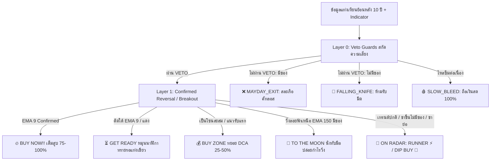

# 📘 คู่มือมาตรฐาน 7-Tier Cyber Action Matrix & 16-Scenario Checklist
> **เอกสารอ้างอิงหลัก (State of Truth):** Project 2X Technical Signal Architecture  
> **เวอร์ชัน:** 2.38.0 (Production Release)  
> **ไฟล์ต้นทางระบบคำนวณ:** [`project2xEngine.js`](file:///c:/My%20Claw/MyProjects/My%20Stock%20Portfolio/server/services/project2xEngine.js) & [`tierConfig.ts`](file:///c:/My%20Claw/MyProjects/My%20Stock%20Portfolio/src/utils/tierConfig.ts)

---

## 🧭 1. ปรัชญาการออกแบบ: Risk-First & Action-Oriented

ระบบสัญญาณแบบเดิมที่มีเพียง 3 สี (**BUY ZONE / WAIT / DANGER**) มักสร้างปัญหาในการปฏิบัติงานจริง 3 ประการ:
1. **กั๊กจังหวะในขาขึ้น:** หุ้นที่กำลังวิ่งลอยฟ้า (Bull Trend) มักถูกแปะป้าย `WAIT` ทำให้ผู้ใช้งานเข้าใจผิดว่า "กำลังจะพังหรือเปล่า" จนรีบขายหมูทิ้ง
2. **ไม่ระบุไม้เข้าซื้อ (Undefined Tranche):** ไม่รู้ว่าสัญญาณนี้ควรใส่เต็มสูบ 100%, แหย่ไม้แรก 25%, หรือรอแท่งเขียวคอนเฟิร์ม
3. **รับมีดขาลง (Falling Knife Trap):** ไม่มีระบบ Veto คัดกรองหุ้นขาลงลึกที่มีดกำลังร่วงจนเกิดความเสียหายต่อเงินต้น

ระบบ **7-Tier Cyber Action Matrix** จึงถูกพัฒนาขึ้นบนหลักการ **Risk-First Hierarchy** โดยแบ่งการตรวจสอบออกเป็น **2 ชั้น (2-Layer Preflight Check)**:
- **Base Layer:** ตรวจสอบโครงสร้างความเสี่ยง สภาพแวดล้อมเทรนด์ (Regime) และแรงเงินสถาบัน (MCDX)
- **Scenario Checklist:** ตรวจสอบแพทเทิร์นทางเทคนิคเฉพาะจุด และต้องผ่านตัวกระตุ้นเชิงยุทธวิธี **EMA 9 Trigger** เพื่อปลดล็อกสัญญาณซื้อ

---

## 📊 2. ตารางแม่แบบ 7-Tier Cyber Action Matrix

| ลำดับ Tier | ชื่อระดับสัญญาณ | ไอคอน | สี & แอนิเมชัน | ความหมายเชิงยุทธศาสตร์ | แอคชั่นหน้างาน (Actionable Mandate) | ขนาดกระสุน (Deploy Tranche) |
|:---:|:---|:---:|:---|:---|:---|:---:|
| **Tier 1** | **TO THE MOON** | 🚀 | ม่วงนีออนลอยฟ้า `animate-rocket-float` | หุ้นขาขึ้นลอยฟ้า (Super BULL) สถาบันคุมเข้ม | **นั่งทับมือ ปล่อยกำไรวิ่ง** ห้ามรีบขายหมู | **0% (ถือ 100%)** |
| **Tier 2** | **BUY NOW!!** | 🔥 | ส้ม-แดงไฟลุก ซูมเรืองแสง `animate-fire-zoom` | คอนเฟิร์มสมบูรณ์แบบ ยืนเหนือ **EMA 9** | **เคาะซื้อทันที** เข้าตามจุดกลับตัวสถาบัน | **75% – 100%** |
| **Tier 3** | **BUY ZONE** | 💰 | เขียวนกการเวก เรืองแสงนิ่ง `Teal Steady Glow` | โซนสะสมฐานยก / แตะ EMA 50 / Golden Cross | **แหย่ไม้แรก ทยอยสะสม** ซื้อตามแผน DCA | **25% – 50%** |
| **Tier 4** | **GET READY** | ⏳ | ทองอำพัน พลิก-หยุด-พลิก-หยุด `animate-hourglass-flip` | จ่อแนวรับใหญ่ / เกิด Bullish Divergence | **หมุนนาฬิกาทรายเตรียมตัว** รอยืนยันแท่งเขียวตัดผ่าน EMA 9 | **0% (เตรียมกระสุน)** |
| **Tier 5** | **ON RADAR** | 📡 | โมโนโครม สเตลธ์ คอนทราสต์ 70% `Stealth Slate` | **RUNNER ⚡ (ขาขึ้น):** โมเมนตัมติดเครื่อง **DIP BUY 🧲 (ขาย่อ):** ทิ้งตัวหาแนวรับ | **RUNNER:** ห้ามไล่ราคาที่ยอดดอย **DIP BUY:** เตรียมกระสุนรอย่อแตะแนวรับ | **0% (เฝ้าดู)** |
| **Tier 6** | **SLOW BLEED** | 🩸 | ชมพู-แดง หยดเลือดไหลริน `animate-bleed-drip` | หุ้นไหลซึมต่อเนื่อง ไร้สถาบัน (Banker = 0) | **ถือเงินสด 100%** นั่งเฉยๆ ห้ามช้อนเด็ดขาด | **0% (Cash 100%)** |
| **Tier 7** | **FALLING KNIFE / MAYDAY EXIT** | 🔪 / ❌ | แดงกะพริบเตือนภัยสองจังหวะ `animate-flash-alert` | มีดร่วง หลุดลึกเกิน -10% (-12% ใน BULL) โครงสร้างหลักพัง • มีหุ้นในพอร์ต: **MAYDAY EXIT ❌** • ไม่มีหุ้นในพอร์ต: **FALLING KNIFE 🔪** | • **มีของ:** **สละเรือ / คัทลอสหนีตายทันที** • **ไม่มีของ:** **ห้ามรับมีดเด็ดขาด! รอสะเด็ดน้ำ** | **มีของ: Exit / Short** **ไม่มีของ: 0% (Cash)** |

---

## 🔬 3. สี่เซ็นเซอร์หลัก (The 4 Preflight Sensors) & ตัวชี้วัดสำคัญ

หน้าจอ **Stock X-Ray Command HUD (DossierHeader Row 3)** ทำงานด้วยเซ็นเซอร์ตรวจสอบ 4 จุด:

### 1. ⚡ EMA 9 Tactical Trigger Line
- **สูตรคำนวณ:** $EMA_9 = Close \times \frac{2}{10} + EMA_{prev} \times (1 - \frac{2}{10})$
- **บทบาท:** เป็นตัวกระตุ้นเชิงยุทธวิธี (Agile Tactical Trigger)
- **กฎเหล็ก:** แม้ราคาจะแตะแนวรับเส้น 200 แต่ถ้าแท่งเทียนยังปิด **ใต้เส้น EMA 9** ระบบจะล็อกสถานะไว้ที่ `⏳ GET READY` ทันที และจะปลดล็อกเป็น `🔥 BUY NOW!!` ก็ต่อเมื่อ **ราคาปิดยืนเหนือ EMA 9 ได้สำเร็จ** เพื่อสกัดกั้นการเด้งลม

### 2. 🏦 Banker Flow (MCDX Multi-Color Dragon Extended)
- **สูตรคำนวณ:** คำนวณจาก RSI(50) ของราคาปิด โดยแปลงสเกลเป็น 0 ถึง 20 แท่ง
- **บทบาท:** วัดความหนาแน่นของเม็ดเงินสถาบันกองทุน (Smart Money):
  - `Banker = 0`: **ไร้เจ้ามือ ไร้สถาบัน** (อันตราย เสี่ยง Slow Bleed)
  - `Banker 1 – 6`: **สถาบันเริ่มสะสมบางตา** (จังหวะ Early Bird หรือระวัง Dead Cat)
  - `Banker 8 – 14`: **สถาบันเกาะแน่น** (ปลอดภัยสูงสำหรับช้อนซื้อรอบย่อตัว)
  - `Banker > 14`: **สถาบันคุมตลาดเบ็ดเสร็จ** (ระดับ Super Bull รันเทรนด์ลอยฟ้า)

### 3. 🌐 EMA Alignment Regime (สภาพแวดล้อมเทรนด์)
- `BULL Regime`: $EMA_{50} > EMA_{150} > EMA_{200}$ (การเรียงตัวสมบูรณ์แบบ — ซื้อได้ทุกจังหวะย่อ)
- `NEUTRAL Regime`: $EMA_{50} > EMA_{200}$ แต่ $EMA_{150}$ ยังไม่จัดระเบียบ (ช่วงพลิกฟื้นฐาน)
- `BEAR Regime`: $EMA_{50} < EMA_{200}$ (โครงสร้างขาลงใหญ่ — **ห้ามซื้อเด็ดขาด ยกเว้น Regime Flip**)

### 4. 🧲 RSI Bullish Divergence Detector
- **สูตรคำนวณ:** สแกนย้อนหลัง 30 แท่งเทียน (`lookback = 30`) หาจุดต่ำสุดของราคาและ RSI:
  - $Price_{current} \le Price_{earlier\_low} \times 1.015$ (ราคาทำ Lower Low หรือ Double Bottom)
  - $RSI_{current} \ge RSI_{earlier\_low} + 3.0$ (RSI ยก Low สูงขึ้นอย่างมีนัยสำคัญ)
  - $RSI_{current} \le 55$ (ต้องอยู่ในโซนล่าง ไม่ใช่บนยอด)
- **บทบาท:** ตรวจจับแรงสะสมใต้ผิวน้ำก่อนที่ราคาจะดีดตัวจริง

### 5. 🧬 Pullback & Bedrock DNA (10Y Historical Bounces)
- สแกนย้อนหลัง 2,500+ แท่งเทียน (10 ปี) ในฐานข้อมูล SQLite เพื่อคำนวณอัตราความสำเร็จในการเด้ง:
  - **EMA 50 Bounces (%):** อัตราการย่อตื้นแล้วไปต่อ
  - **EMA 150 Bounces (%):** อัตราการย่อระดับปานกลาง
  - **EMA 200 Bedrock (%):** อัตราการเด้งจากแนวรับหินผาหลัก
  - **Bedrock Line:** ระบุเส้นแนวรับที่เหนียวแน่นที่สุดในรอบทศวรรษ

---

## 📑 4. เจาะลึก 16 สถานการณ์ & กฎเช็คลิสต์ (The 16 Scenarios)

---

### [LAYER 0: VETO GUARDS] เกราะป้องกันความปลอดภัยเงินต้น

> **กฎการจำแนกสถานะพอร์ต (Context-Aware Mandate):**
> - **มีหุ้นในพอร์ต (`ownedShares > 0`):** แสดงเป็น `MAYDAY_EXIT` ❌ ➔ **สละเรือ / ตัดขาดทุน (Cut Loss) ทันที เพื่อรักษาเงินต้น**
> - **ไม่มีหุ้นในพอร์ต (`ownedShares == 0`):** แสดงเป็น `FALLING_KNIFE` 🔪 ➔ **ห้ามรับมีดเด็ดขาด! ถือเงินสด 100% รอสะเด็ดน้ำรอตั้งลำกลับตัว**

#### 🔴 Scenario 1: Falling Knife (มีดร่วง) ➔ `FALLING_KNIFE` 🔪 / `MAYDAY_EXIT` ❌
> **นิยาม:** หุ้นถูกทุบหลุดต่ำกว่าเส้น EMA 200 เกิน -10% (-12% ใน BULL) โดยที่สถาบันหนีเตลิด (Banker = 0)
- **ความเสี่ยง:** มีดกำลังปักลงพื้น ห้ามเอามือไปรับเด็ดขาด

| เช็คลิสต์ | เกณฑ์การตรวจสอบ | ผลลัพธ์ที่ต้องผ่าน |
|:---:|:---|:---:|
| 1 | **Dist EMA 200** | $< -10.0\%$ (หรือ $< -12.0\%$ ใน BULL) |
| 2 | **Banker MCDX** | $= 0$ (ไร้แรงซื้อสถาบันโดยสิ้นเชิง) |
| 3 | **Actionable VETO** | **มีของ:** สละเรือ คัทลอสทันที / **ไม่มีของ:** ห้ามรับมีด ถือเงินสด |

---

#### 🔴 Scenario 2: Dead Cat Bounce (เด้งหลอกใต้น้ำ) ➔ `FALLING_KNIFE` 🔪 / `MAYDAY_EXIT` ❌
> **นิยาม:** ราคาจมลึกใต้ EMA 200 เกิน -10% ในเทรนด์ขาลง (BEAR) พยายามดีดตัวด้วยแรงสถาบันกระปริบกระปรอย (1-6)
- **ความเสี่ยง:** เป็นการเด้งเพื่อเปิดทางให้สถาบันใหญ่ระบายของทุบต่อ

| เช็คลิสต์ | เกณฑ์การตรวจสอบ | ผลลัพธ์ที่ต้องผ่าน |
|:---:|:---|:---:|
| 1 | **EMA Regime** | `BEAR` ($EMA_{50} < EMA_{200}$) |
| 2 | **Dist EMA 200** | $< -10.0\%$ |
| 3 | **Banker MCDX** | อยู่ระหว่าง $1$ ถึง $6$ (บางตา ไม่พอเปลี่ยนเทรนด์) |
| 4 | **Actionable VETO** | **ห้ามตาม / ระวังกับดักเด้งหลอกเพื่อทุบต่อ** |

---

#### 🔴 Scenario 3: Core Breakdown (โครงสร้างหลักพัง) ➔ `FALLING_KNIFE` 🔪 / `MAYDAY_EXIT` ❌
> **นิยาม:** หลุดแช่อยู่ใต้เส้น EMA 200 ลึกกว่า -5% ต่อเนื่องนานเกิน 5 วันทำการในเทรนด์ BEAR (หรือหลุดลึกใน BULL นานเกิน 5 วัน)
- **ความเสี่ยง:** หุ้นเสียสภาพการเติบโต กลายสภาพเป็นขาลงระยะยาว

| เช็คลิสต์ | เกณฑ์การตรวจสอบ | ผลลัพธ์ที่ต้องผ่าน |
|:---:|:---|:---:|
| 1 | **EMA Regime** | `BEAR` หรือหลุดต่ำกว่า EMA 200 |
| 2 | **Dist EMA 200** | $< -4.0\%$ (BEAR) หรือ $< -5.0\%$ (BULL) |
| 3 | **Days Below EMA 200** | $\ge 3$ วัน (BEAR) หรือ $\ge 5$ วัน (BULL) |
| 4 | **Actionable Mandate** | **มีของ:** ตัดขาดทุนทันที (Stop-Loss) / **ไม่มีของ:** รอซ่อมฐานใหม่ |

---

#### 🔪 Scenario 4: Slow Bleed / Death Drift (ไหลซึมไร้เจ้ามือ) ➔ `SLOW_BLEED` 🔪
> **นิยาม:** หุ้นซึมลงช้าๆ ใต้เส้น EMA 200 โดยที่ Banker เป็น 0 ต่อเนื่องนานเกิน 8 วันทำการ
- **ความเสี่ยง:** เสียโอกาสและเงินจม ไม่มีใครสนใจดันราคา

| เช็คลิสต์ | เกณฑ์การตรวจสอบ | ผลลัพธ์ที่ต้องผ่าน |
|:---:|:---|:---:|
| 1 | **EMA Regime** | `BEAR` |
| 2 | **Dist EMA 200** | $< 0.0\%$ |
| 3 | **Days Banker Zero** | $\ge 8$ วันทำการ |
| 4 | **Actionable Mandate** | **ถือเงินสด 100% รอโครงสร้างฟื้น** |

---

### [LAYER 1: CONFIRMED REVERSALS & BREAKOUTS] จุดซื้อคมกริบ มั่นใจ 100%

#### 🔥 Scenario 5: Double Bottom Confirmed ➔ `BUY_NOW` 🔥
> **นิยาม:** ราคาลงมาทดสอบแนวรับเส้น EMA 200 รอบที่ 2 ในรอบ 30-45 วัน โดยไม่ทำ Lower Low + ยืนเหนือ EMA 9 ได้สำเร็จ
- **ความมั่นใจ:** สูงสุดในบรรดาทุกสัญญาณ (Prime Entry 100%)

| เช็คลิสต์ | เกณฑ์การตรวจสอบ | ผลลัพธ์ที่ต้องผ่าน |
|:---:|:---|:---:|
| 1 | **EMA Regime** | ไม่ใช่ `BEAR` (`BULL` หรือ `NEUTRAL`) |
| 2 | **Double Bottom Structure** | ฐานที่ 2 ไม่ต่ำกว่าฐานแรก ($\Delta \ge 0$) |
| 3 | **Dist EMA 200** | $-3.5\%$ ถึง $+2.0\%$ |
| 4 | **EMA 9 Tactical Trigger** | **ปิดเหนือ EMA 9 (`isAboveEma9 = true`)** |
| 5 | **Banker MCDX** | $\ge 1$ |
| 6 | **Deploy Tranche** | **จัดเต็ม 100% ของโควตาไม้** |

---

#### 🔥 Scenario 6: Bear Trap Reclaim (กับดักหมีสำเร็จ) ➔ `BUY_NOW` 🔥
> **นิยาม:** ราคาเคยหลุดกระชากใต้เส้น 200 หลอกให้คนคัทลอส แล้วดีดกลับขึ้นมายืนเหนือเส้น 200 + ตัดข้าม EMA 9 ด้วยวอลุ่มหนุน
- **ความมั่นใจ:** 75% – 100%

| เช็คลิสต์ | เกณฑ์การตรวจสอบ | ผลลัพธ์ที่ต้องผ่าน |
|:---:|:---|:---:|
| 1 | **EMA Regime** | ไม่ใช่ `BEAR` |
| 2 | **Reclaim Action** | เคย $< -4\%$ ใน 5 วันก่อน แต่วันนี้กลับมา $\ge 0\%$ |
| 3 | **EMA 9 Tactical Trigger** | **ปิดยืนเหนือ EMA 9** |
| 4 | **Banker MCDX** | $\ge 1$ |
| 5 | **Volume Surge** | $\ge 1.2\times$ ค่าเฉลี่ย 20 วัน |
| 6 | **Deploy Tranche** | **75% – 100%** |

---

#### 🔥 Scenario 7: Base Breakout (ระเบิดจากฐานสะสม) ➔ `BUY_NOW` 🔥
> **นิยาม:** สร้างฐานแน่นิ่งใกล้เส้น EMA มานาน แล้วทะลุขอบบนของกรอบสะสมด้วยวอลุ่มระเบิด + ยืนเหนือ EMA 9
- **ความมั่นใจ:** 100% โมเมนตัมตามรอบใหญ่

| เช็คลิสต์ | เกณฑ์การตรวจสอบ | ผลลัพธ์ที่ต้องผ่าน |
|:---:|:---|:---:|
| 1 | **EMA Regime** | ไม่ใช่ `BEAR` |
| 2 | **Base History** | สะสมในกรอบแคบ $\ge 5$ วัน |
| 3 | **Price Breakout** | ทะลุ High ของฐานสะสม |
| 4 | **EMA 9 Tactical Trigger** | **ปิดยืนเหนือ EMA 9** |
| 5 | **Banker MCDX** | $\ge 4$ |
| 6 | **Volume Surge** | $\ge 1.5\times$ วอลุ่มเฉลี่ย 20 วัน |
| 7 | **Deploy Tranche** | **100%** |

---

#### 🔥 Scenario 8: V-Shape Quick Dip Rebound ➔ `BUY_NOW` 🔥
> **นิยาม:** หุ้นขาขึ้นแกร่ง (BULL) ย่อตัวแตะ EMA 150/200 แล้วแท่งเขียวดีดสวนทันที + ยืนเหนือ EMA 9
- **ความมั่นใจ:** 100% ช้อนซื้อของถูกในเทรนด์ขาขึ้น

| เช็คลิสต์ | เกณฑ์การตรวจสอบ | ผลลัพธ์ที่ต้องผ่าน |
|:---:|:---|:---:|
| 1 | **EMA Regime** | **BULL เท่านั้น** ($50 > 150 > 200$) |
| 2 | **Dist Major EMA** | EMA 200 ($-3.5\%$ ถึง $+2\%$) หรือ EMA 150 ($-2.5\%$ ถึง $+2\%$) |
| 3 | **EMA 9 Tactical Trigger** | **ปิดยืนเหนือ EMA 9** |
| 4 | **Candle Pattern** | **แท่งเขียว Bullish (`isLatestBullish = true`)** |
| 5 | **Banker MCDX** | อยู่ระหว่าง $1$ ถึง $14$ |
| 6 | **Deploy Tranche** | **100%** |

---

### [LAYER 2: DIP BUY & SUPPORT TESTS] เตรียมตัวช้อนซื้อ

#### ⏳ Scenario 9: Testing Support (จ่อแนวรับใหญ่) ➔ `GET_READY` ⏳
> **นิยาม:** ราคาลงมาแตะ EMA 150 หรือ 200 มีแรงสถาบันสะสม แต่ยังอยู่ใต้ EMA 9 หรือยังติดแท่งแดง
- **แอคชั่น:** หมุนนาฬิกาทรายเตรียมตัว ห้ามรีบเคาะ รอแท่งเขียวเด้งผ่าน EMA 9 ก่อน

| เช็คลิสต์ | เกณฑ์การตรวจสอบ | ผลลัพธ์ที่ต้องผ่าน |
|:---:|:---|:---:|
| 1 | **Dist Major EMA** | EMA 200 ($-3.5\%$ ถึง $+2\%$) หรือ EMA 150 ($-2.5\%$ ถึง $+2\%$) |
| 2 | **Banker MCDX** | $\ge 1$ |
| 3 | **Trigger Status** | **ยังอยู่ใต้ EMA 9 หรือ แท่งแดง $\ge 2$ วัน** |
| 4 | **Actionable Mandate** | **GET READY ⏳ (เตรียมกระสุน รอสัญญาณยืนยัน)** |

---

#### ⏳ Scenario 13: Early Bird Watch / RSI Divergence ➔ `GET_READY` ⏳
> **นิยาม:** แตะแนวรับใหญ่พร้อมสัญญาณกระทิงซ่อน RSI Bullish Divergence แต่สถาบันยังไม่จุดพลุ (Banker ต่ำ)
- **แอคชั่น:** ตั้งเรดาร์จับตาเป็นพิเศษ ใกล้ถึงเวลาซื้อ

| เช็คลิสต์ | เกณฑ์การตรวจสอบ | ผลลัพธ์ที่ต้องผ่าน |
|:---:|:---|:---:|
| 1 | **Dist Major EMA** | ใกล้แนวรับ EMA 150 หรือ 200 |
| 2 | **RSI Bullish Divergence** | เกิดสัญญาณ Divergence หรือ Banker $= 0$ |
| 3 | **Regime** | ไม่ใช่ `BEAR` |
| 4 | **Actionable Mandate** | **GET READY ⏳** |

---

### [LAYER 3: ACCUMULATION / STARTER] ทยอยสะสมไม้แรก

#### 💰 Scenario 10: Shallow Dip (EMA 50 Bounce) ➔ `BUY_ZONE` 💰
> **นิยาม:** หุ้นเทรนด์แกร่งจัด ย่อตื้นแค่แตะ EMA 50 ไม่มีทางลงถึงเส้น 200 พร้อมสถาบันหนุน
- **แอคชั่น:** แหย่ไม้แรก 50% ของโควตา

| เช็คลิสต์ | เกณฑ์การตรวจสอบ | ผลลัพธ์ที่ต้องผ่าน |
|:---:|:---|:---:|
| 1 | **EMA Regime** | `BULL` |
| 2 | **Dist EMA 50** | $-2.0\%$ ถึง $+1.5\%$ |
| 3 | **Dist EMA 150** | $> +3.0\%$ (ลอยเหนือเส้น 150 ชัดเจน) |
| 4 | **Banker MCDX** | $\ge 5$ |
| 5 | **Candle Pattern** | แท่งเขียวเด้ง Bullish |
| 6 | **Deploy Tranche** | **สะสมไม้แรก 50%** |

---

#### 💰 Scenario 11: Regime Flip (Golden Cross) ➔ `BUY_ZONE` 💰
> **นิยาม:** เส้น EMA 50 ตัดขึ้นเหนือ EMA 200 พลิกจากขาลงสู่รอบขาขึ้นใหม่ พร้อมเงินสถาบันไหลเข้า
- **แอคชั่น:** เริ่มสะสมไม้แรก 25% – 50%

| เช็คลิสต์ | เกณฑ์การตรวจสอบ | ผลลัพธ์ที่ต้องผ่าน |
|:---:|:---|:---:|
| 1 | **Regime Flip Trigger** | $EMA_{50}$ ตัดข้าม $EMA_{200}$ (Golden Cross) |
| 2 | **Banker MCDX** | $\ge 3$ |
| 3 | **Price Level** | ปิดเหนือทั้ง EMA 50 และ EMA 200 |
| 4 | **Deploy Tranche** | **สะสม 25% – 50%** |

---

#### 💰 Scenario 12: Sideway Base Building ➔ `BUY_ZONE` 💰
> **นิยาม:** ราคากอดเส้น EMA 200 นิ่งๆ ในกรอบแคบ $\ge 5$ วัน วอลุ่มแห้งบีบตัว สถาบันเลี้ยงตัว
- **แอคชั่น:** ทยอย DCA เก็บไม้ละ 25%

| เช็คลิสต์ | เกณฑ์การตรวจสอบ | ผลลัพธ์ที่ต้องผ่าน |
|:---:|:---|:---:|
| 1 | **Days Near EMA 200** | $\ge 5$ วันทำการ ($-3\%$ ถึง $+3\%$) |
| 2 | **Banker MCDX** | $\ge 2$ |
| 3 | **RSI 14** | $35$ ถึง $62$ (ไม่ Oversold ไม่ Overbought) |
| 4 | **Volume Ratio** | $\le 1.2\times$ (วอลุ่มแห้ง บีบตัว) |
| 5 | **Deploy Strategy** | **DCA ไม้ละ 25%** |

---

### [LAYER 4: TREND RUNNERS & MOONSHOTS] รันเทรนด์ไต่ระดับและแตะดวงจันทร์

#### 🚀 Scenario 14 (มีหุ้นในพอร์ต): To The Moon ➔ `TO_THE_MOON` 🚀
> **นิยาม:** หุ้นวิ่งทะยานลอยฟ้าสูงสุดขีด $+15\%$ (Core) หรือ $+25\%$ (Moonshot) เหนือเส้น EMA 150 สถาบันเกาะแน่น ($Banker \ge 12$)
- **ความหมาย:** แตะดวงจันทร์แล้ว ลอยฟ้าสูงสุดขั้ว
- **แอคชั่น:** **นั่งทับมือ ปล่อยกำไรวิ่งเต็มสูบ** ห้ามขายหมู

| เช็คลิสต์ | เกณฑ์การตรวจสอบ | ผลลัพธ์ที่ต้องผ่าน |
|:---:|:---|:---:|
| 1 | **Dist EMA 150** | $> +15\%$ (Core) หรือ $> +25\%$ (Moonshot) |
| 2 | **Banker MCDX** | $\ge 12$ (สถาบันหนาแน่นมาก) |
| 3 | **Holdings Status** | **มีหุ้นอยู่ในพอร์ต (`ownedShares > 0`)** |
| 4 | **Actionable Mandate** | **TO THE MOON 🚀 (Let Profits Run)** |

---

#### ⛔ Scenario 14 (ไม่มีหุ้นในพอร์ต): MOON (No Chase) ➔ `ON_RADAR` 📡
> **นิยาม:** หุ้นวิ่งลอยฟ้าแตะดวงจันทร์เหมือนกรณีข้างต้น สถาบันเกาะแน่น แต่เราไม่มีของในมือ (`ownedShares = 0`)
- **ความหมาย:** จรวดขึ้นดวงจันทร์ไปแล้ว มึงตกรถแล้ว อย่ากระโดดเกาะยอดดอย!
- **แอคชั่น:** **ห้ามไล่ราคาเด็ดขาด** แปะไว้บนเรดาร์ รอย่อตัวแตะแนวรับรอบใหม่

| เช็คลิสต์ | เกณฑ์การตรวจสอบ | ผลลัพธ์ที่ต้องผ่าน |
|:---:|:---|:---:|
| 1 | **Dist EMA 150** | อยู่ในโซนสูง Overbought ($> +15\%$ หรือ $> +25\%$) |
| 2 | **Holdings Status** | **ไม่มีหุ้นในพอร์ต (`ownedShares = 0`)** |
| 3 | **Radar Status** | **MOON 🚀 (No Chase ⛔)** |
| 4 | **Actionable Mandate** | **ON RADAR 📡 (Do Not Chase Highs)** |

---

#### ⚡ Scenario 15: RUNNER (Surfing Trend) ➔ `TO_THE_MOON` 🚀
> **นิยาม:** ขาขึ้นสมบูรณ์แบบ ($50 > 150 > 200$) ราคาโต้คลื่นไต่ระดับเหนือเส้น Trigger EMA 9 สถาบันคุมเข้ม ($Banker \ge 10$)
- **ความหมาย:** นักวิ่งกำลังวิ่งไต่ระดับ (RUNNER ⚡) เทรนด์เดินหน้าอย่างมั่นคง
- **แอคชั่น:** ถือรันเทรนด์เต็มสูบ ปล่อยให้วิ่งไปหาดวงจันทร์

| เช็คลิสต์ | เกณฑ์การตรวจสอบ | ผลลัพธ์ที่ต้องผ่าน |
|:---:|:---|:---:|
| 1 | **EMA Regime** | `BULL` ($50 > 150 > 200$) |
| 2 | **EMA 9 Tactical Trigger** | ปิดยืนเหนือ EMA 9 ต่อเนื่อง |
| 3 | **Dist EMA 150** | $> +4.0\%$ |
| 4 | **Banker MCDX** | $\ge 10$ |
| 5 | **Actionable Mandate** | **RUNNER ⚡ (Ride Trend)** |

---

### [LAYER 5: STEALTH RADAR] สังเกตการณ์แยก 2 ขา (RUNNER ⚡ vs DIP BUY 🧲)

#### 📡 Scenario 16: Default Matrix / 2-Leg Technical Radar ➔ `ON_RADAR` 📡
> **นิยาม:** หุ้นวิ่งอยู่ในเทรนด์ปกติที่ยังไม่เข้าเกณฑ์จุดซื้อใหญ่ โดยแยกออกเป็น 2 ขาตามพฤติกรรมราคา:

##### ⚡ ขาที่ 1: `RUNNER` (ขาขึ้น / โมเมนตัมรันเทรนด์)
- **`RUNNER (Consolidating)`**: ราคาแกว่งตัวเลี้ยงตัวเหนือเส้น EMA 150 และ EMA 200 ($d150 \ge 0, d200 \ge 0$) รันเทรนด์ปกติ
- *(ส่วน Scenario 14 คือ **`MOON (No Chase) ⛔`**: ลอยฟ้าแตะดวงจันทร์แล้ว ห้ามไล่ราคา)*

##### 🧲 ขาที่ 2: `DIP BUY` (ขาย่อ / ทิ้งตัวหาแนวรับ เตรียมกระสุน)
- **`DIP BUY (Healthy Dip)`**: ย่อตัวเบาๆ $-1.0\%$ ถึง $-3.0\%$ vs EMA 150 กำลังจับตาแนวรับ
- **`DIP BUY (Deep Pullback)`**: ย่อตัวลึก $-3.0\%$ ถึง $-6.0\%$ vs EMA 150 เริ่มเข้าใกล้โซนดักซุ่ม
- **`DIP BUY (Approaching Bedrock)`**: ทิ้งตัวลงหาแนวรับหินผาเส้น EMA 200 ($d150 < -6\%$)
- **`DIP BUY (Testing 200)`**: แหย่ขาหลุดใต้เส้น EMA 200 ($d200$ ระหว่าง $0\%$ ถึง $-3.5\%$) รอแรงซื้อดึงกลับ
- **`DIP BUY (Below Bedrock)`**: หลุดต่ำกว่าเส้น EMA 200 เกิน $-3.5\%$ แต่ยังไม่เข้า Veto ส่องหาฐานแนวรับ

---

## 🧭 5. ตารางตรวจสอบข้ามมิติ (Cross-Reference Matrix)

| Indicator | V-Shape (#8) | Double Bottom (#5) | Bear Trap (#6) | Base Breakout (#7) | Shallow Dip (#10) | Testing Support (#9) | Sideway Base (#12) | Slow Bleed (#4) | Falling Knife (#1) |
|---|:---:|:---:|:---:|:---:|:---:|:---:|:---:|:---:|:---:|
| **EMA Regime** | `BULL` | BULL/NEU | BULL/NEU | BULL/NEU | `BULL` | BULL/NEU | BULL/NEU | `BEAR` | ใดๆ |
| **EMA 9 Trigger** | **เหนือ EMA 9** | **เหนือ EMA 9** | **เหนือ EMA 9** | **เหนือ EMA 9** | — | **ใต้ EMA 9** | — | — | — |
| **Dist EMA 200** | $\approx 0\%$ | แตะรอบ 2 | เคยหลุด $\rightarrow$ ปิดเหนือ | — | — | แตะเส้น 200 | $\pm 3\%$ ($\ge 5$d) | $< 0\%$ | $< -10\%$ |
| **Dist EMA 150** | $\approx 0\%$ | — | — | — | $> +3\%$ | แตะเส้น 150 | — | — | — |
| **Dist EMA 50** | — | — | — | — | แตะเส้น 50 | — | — | — | — |
| **Banker MCDX** | $1 – 14$ | $\ge 1$ | $\ge 1$ | $\ge 4$ | $\ge 5$ | $\ge 1$ | $\ge 2$ | $= 0$ ($\ge 8$d) | $= 0$ |
| **RSI Divergence** | — | — | — | — | — | หรือมี Div | — | — | — |
| **Candle Pattern** | แท่งเขียว | ไม่ทำ Lower Low | — | แท่งเขียวยาว | แท่งเขียว | แท่งแดง | — | Lower Low | แดงดิ่ง |
| **Volume Ratio** | $\ge 0.8\times$ | ปกติ | $\ge 1.2\times$ | $\ge 1.5\times$ | ปกติ | ปกติ | $\le 1.2\times$ | แห้งสนิท | Panic |
| **Action Tier** | **BUY NOW** | **BUY NOW** | **BUY NOW** | **BUY NOW** | **BUY ZONE** | **GET READY** | **BUY ZONE** | **SLOW BLEED**| **MAYDAY EXIT**|

---

## ⚔️ 6. กฎเหล็กการเทรดหน้างาน 5 ข้อ (The 5 Iron Rules)

1. 🛑 **กฎ VETO เหนือทุกสิ่ง (Capital First):**  
   หากหุ้นติดเงื่อนไข Layer 0 (`Falling Knife`, `Dead Cat Bounce`, `Core Breakdown`) **ห้ามเปิดรับคำสั่งซื้อทุกกรณี** ไม่ว่าจะชอบพื้นฐานบริษัทแค่ไหน ทุนต้องมาก่อนกำไรเสมอ
2. ⏳ **ไม่ผ่าน EMA 9 ห้ามเคาะขวา:**  
   หากหุ้นอยู่ในสถานะ `⏳ GET READY` หน้าที่ของเราคือหมุนนาฬิกาทรายรอ ห้ามใจร้อนเคาะซื้อล่วงหน้าจนกว่าราคาปิดจะยืนยันเหนือเส้น Trigger EMA 9
3. 🚀 **TO THE MOON ต้องนั่งทับมือ:**  
   เมื่อหุ้นติดสถานะ `To The Moon` หรือ `Trend Runner` กฎข้อเดียวคือ **ห้ามขายหมู** ปล่อยให้กำไรวิ่งไปเรื่อยๆ จนกว่าโครงสร้างเทรนด์จะเกิด Sell Alert
4. 💰 **สะสมตามแผนใน BUY ZONE:**  
   ในโซนสะสม `BUY ZONE` ให้แบ่งกระสุนเข้าเป็นไม้เบา 25% – 50% เพื่อป้องกันการเสียโอกาสและควบคุมต้นทุนเฉลี่ย
5. 🔪 **SLOW BLEED ห้ามเฉลี่ยขาลง:**  
   หุ้นที่ไหลซึมไร้สถาบัน การซื้อถัวเฉลี่ยคือการเอาเงินสดไปขัง ถือเงินสด 100% รอจนกว่าจะเกิด Golden Cross หรือ Regime Flip Recovery
