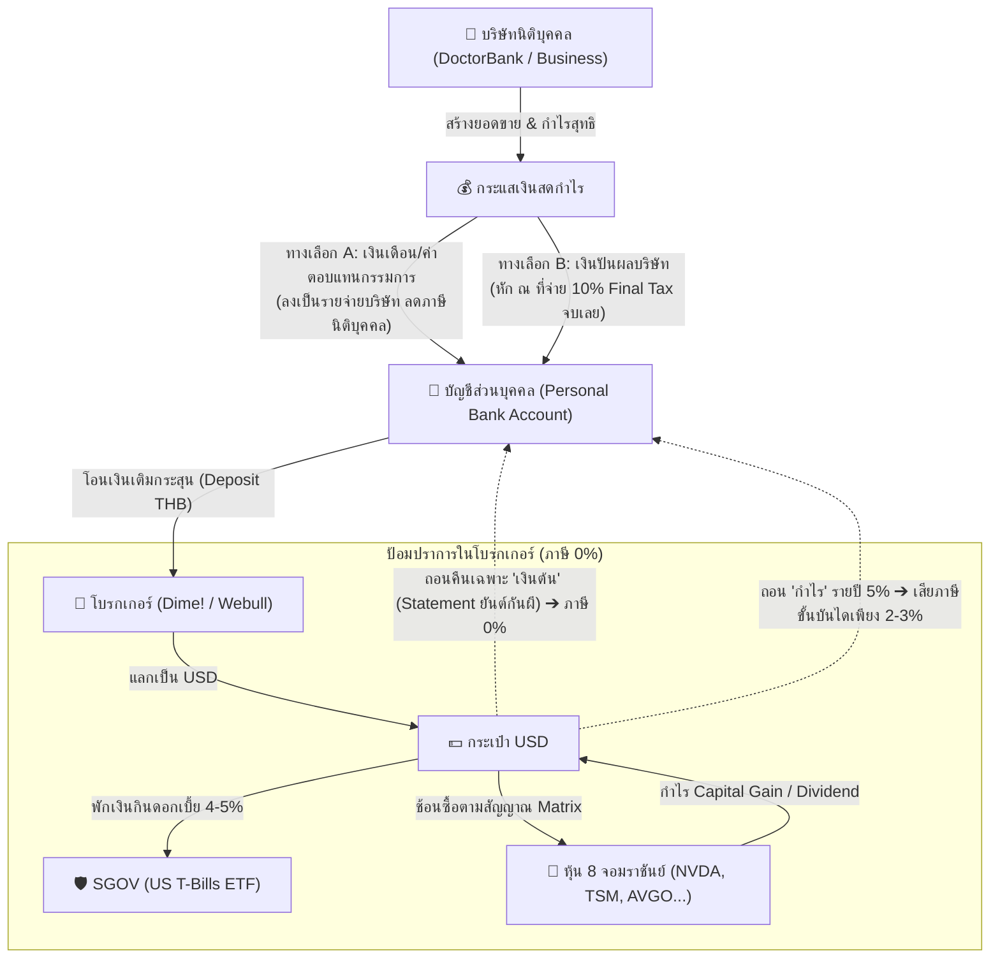

# 🛡️ PROJECT 2X: คัมภีร์ยุทธศาสตร์ภาษีหุ้นนอก & ป้อมปราการความมั่งคั่ง (The US Stock Tax & Wealth Shield Playbook)
### *ถอดรหัสกฎหมายสรรพากร ป.161/2566, กลยุทธ์ภาษี 0%, ท่อส่งเงินสดบริษัท x โบรกเกอร์ และพิมพ์เขียวถอนเงิน 5% สู่ 100 ล้าน*

---

> **"คนไม่รู้คือกฎหมาย... แต่คนรู้คือกฎเกณฑ์!  
> ในโลกการเงิน มหาเศรษฐีไม่เคยหนีภาษีแบบผิดกฎหมาย แต่พวกเขาใช้ 'โครงสร้าง' เพื่อจ่ายภาษีน้อยที่สุดหรือ 0% อย่างถูกต้อง 100%!"**

---

## 📌 สารบัญ (Table of Contents)
1. [ความจริงเบื้องหลังกฎหมายภาษีต่างประเทศ (สรรพากร ป.161/2566)](#1-ความจริงเบื้องหลังกฎหมายภาษีต่างประเทศ-สรรพากร-ป1612566)
2. [ถอดรหัสเซียน VI ยุคก่อน: ทำไมยังติดหุ้นไทย แล้วเขาซ่อนพอร์ตไว้ที่ไหน?](#2-ถอดรหัสเซียน-vi-ยุคก่อน-ทำไมยังติดหุ้นไทย-แล้วเขาซ่อนพอร์ตไว้ที่ไหน)
3. [5 ท่าไม้ตายวางแผนภาษีหุ้นสหรัฐฯ ให้เสีย 0% หรือน้อยที่สุด](#3-5-ท่าไม้ตายวางแผนภาษีหุ้นสหรัฐฯ-ให้เสีย-0-หรือน้อยที่สุด)
4. [พิสูจน์คณิตศาสตร์จริง: ถอน 5% Dynamic Harvest เสียภาษีแค่ 2.3% ไม่ใช่ 35%!](#4-พิสูจน์คณิตศาสตร์จริง-ถอน-5-dynamic-harvest-เสียภาษีแค่-23-ไม่ใช่-35)
5. [โครงสร้างเชื่อมต่อ: บริษัทที่มีอยู่ (นิติบุคคล) x ท่อส่งเงินสด x บัญชีเทรด](#5-โครงสร้างเชื่อมต่อ-บริษัทที่มีอยู่-นิติบุคคล-x-ท่อส่งเงินสด-x-บัญชีเทรด)
6. [สมรภูมิโบรกเกอร์: Dime! vs Webull Thailand vs Interactive Brokers (IBKR)](#6-สมรภูมิโบรกเกอร์-dime-vs-webull-thailand-vs-interactive-brokers-ibkr)
7. [ยันต์กันผีสรรพากร: Protocol บันทึก Statement เงินต้น](#7-ยันต์กันผีสรรพากร-protocol-บันทึก-statement-เงินต้น)

---

## 1. ความจริงเบื้องหลังกฎหมายภาษีต่างประเทศ (สรรพากร ป.161/2566)

ตั้งแต่วันที่ **1 มกราคม 2567** กรมสรรพากรได้ปรับหลักเกณฑ์การจัดเก็บภาษีเงินได้บุคคลธรรมดาจากแหล่งเงินได้ต่างประเทศ ทำให้เกิดความตื่นตระหนกว่า "เทรดหุ้นนอกจะโดนภาษี 35% ทันทีที่ถอนเงิน" ซึ่งเป็นความเข้าใจผิดอย่างสิ้นเชิง!

### กฎ 3 ข้อที่ต้องจำให้ขึ้นใจ:
1. **เงินต้น (Principal) ปลอดภาษี 0% ตลอดกาล:** 
   * ภาษีคิดเฉพาะ **"ผลตอบแทนที่งอกเงย" (Capital Gain และ Dividend)** เท่านั้น
   * หากมึงโอนเงินต้นออกไปสะสม 3 ล้านบาท วันข้างหน้ามึงถอนเงินกลับมา 3 ล้านบาทแรก = **เงินต้น ไม่เสียภาษีสักบาทเดียว!**
2. **ไม่ใช่ 35% Flat Rate แต่เป็น "ภาษีขั้นบันไดบุคคลธรรมดา":**
   * กำไรสุทธิจะถูกนำมาคำนวณตามฐานภาษีเงินได้บุคคลธรรมดาของไทย (0% ➔ 5% ➔ 10% ➔ 15% ➔ 20% ➔ 25% ➔ 30% ➔ 35%)
   * มึงจะแตะเพดาน 35% ก็ต่อเมื่อ **มีเงินได้สุทธิส่วนที่เกิน 5,000,000 บาทขึ้นไปในปีนั้นเท่านั้น!**
3. **ตราบใดที่ไม่โอนเงินกลับเข้าไทย = ปลอดภาษี 100%:**
   * กำไรจากการขายหุ้น หรือดอกเบี้ย SGOV ที่นอนอยู่ในกระเป๋า USD ตราบใดที่ยังไม่ออกจากโบรกเกอร์ สรรพากรไทยไม่มีอำนาจแตะต้องเงินมึงแม้แต่วินาทีเดียว สามารถปล่อยให้ดอกผลทบต้น (Compound) ไปได้ชั่วชีวิต

---

## 2. ถอดรหัสเซียน VI ยุคก่อน: ทำไมยังติดหุ้นไทย แล้วเขาซ่อนพอร์ตไว้ที่ไหน?

ทำไมปรมาจารย์อย่าง ดร.นิเวศน์, เซียนฮง, หมอพงศ์ศักดิ์, เสี่ยยักษ์ ถึงยังมีหุ้นไทยติดพอร์ต และไม่ได้เทขาย 100% ไป US?

| ปรมาจารย์ | สถานะพอร์ตหุ้นไทย | สิ่งที่เกิดขึ้นจริงเบื้องหลัง | กลยุทธ์การปรับตัว |
| :--- | :--- | :--- | :--- |
| **ดร.นิเวศน์** | เหลือถือหุ้นปันผล ~30% (QH, EASTW) | ยอมรับตรงๆ ว่าหุ้นไทยเจอ **Lost Decade** ไม่โต ซึมยาว พอร์ตไทยหม่นหมอง | **ย้ายเงิน 70% หนีออกนอกประเทศ!** (30% หุ้นเวียดนาม, 30% หุ้นโลก/สหรัฐฯ, 10% เงินสด) |
| **เซียนฮง (สถาพร)** | พอร์ตหุ้นไทยหดเหลือ ~1,700 ล้าน (จากพีคเกือบหมื่นล้าน) | โดน Drawdown หุ้น Growth ไทย (JMT, SINGER, FORTH ฯลฯ) ลดลง -60% ถึง -80% | ลดขนาดพอร์ตไทย ถือเงินสด และย้ายเงินส่วนหนึ่งไปเทรดสินทรัพย์ต่างประเทศ |
| **หมอพงศ์ศักดิ์** | พอร์ตหุ้นไทยยังยืน ~1.7 หมื่นล้าน (Whale อันดับ 1) | หุ้นหลักเดิมโดนเทขาย (COM7, MASTER, SISB) และมีบทเรียนหุ้นกู้ | **แปลงร่างเป็น Whale Rotation!** หมุนเงินเร็ว เข้า TRUE, PLANB, BA ไม่ใช่ VI ถือยาวแบบโบราณ |
| **เสี่ยยักษ์ (วิชัย)** | พอร์ตไทย ~3,000 ล้าน (BEM, GUNKUL, JMT) | ออกมาด่าระบบ Robot Trade, HFT, Short Sell และหุ้นโกง ว่าทำลายตลาดทุนไทยจนเล่นยากที่สุดในชีวิต 40 ปี | ลดพอร์ต BEM ถือเงินสด ไม่กล้า All-in หรือรันเทรนด์ยาวเหมือนในอดีต |

> 💡 **บทสรุปเชิงลึก:** สิ่งที่คนทั่วไปเห็นในข่าว คือเฉพาะ **"พอร์ตบนดิน"** ที่ติดชื่อผู้ถือหุ้นใหญ่ตามกฎหมาย ก.ล.ต. เท่านั้น แต่ **"พอร์ตใต้ดิน"** เช่น Private Banking (สิงคโปร์/สวิส), บัญชี Offshore และกองทุนต่างประเทศ พวกเขากระจายออกนอกประเทศกันไปนานแล้ว!

---

## 3. 5 ท่าไม้ตายวางแผนภาษีหุ้นสหรัฐฯ ให้เสีย 0% หรือน้อยที่สุด

### 🛡️ ท่าที่ 1: เล่นหุ้นนอกผ่านกระดานไทย (DR / DRx / กองทุน FIF) ➔ ภาษี 0%!
* **DR / DRx ในตลาดหุ้นไทย (เช่น NDX01, SPX19, AAPL80X, NVDA80X):**
  * เทรดบนกระดาน Streaming เหมือนหุ้นไทย
  * **กำไรจากส่วนต่างราคา (Capital Gain) ได้รับการยกเว้นภาษี 0% ตามกฎหมายไทย!**
* **กองทุนรวมต่างประเทศ (FIF):**
  * ซื้อกองทุนดัชนีสหรัฐฯ ผ่าน บลจ. ไทย กำไรจากการขายคืนหน่วยลงทุนสำหรับบุคคลธรรมดา **ฟรีภาษี 0%!**

### 🛡️ ท่าที่ 2: ท่า "180 วัน" ตามประมวลรัษฎากร มาตรา 41 ➔ ภาษี 0%!
สรรพากรมีอำนาจจัดเก็บภาษีเงินได้ต่างประเทศ ก็ต่อเมื่อเข้าเงื่อนไข **ครบทั้ง 2 ข้อพร้อมกันในปีภาษีนั้น**:
1. ผู้นั้นอยู่ในประเทศไทยรวมกัน **ถึง 180 วัน**
2. มีการนำเงินได้นั้นเข้ามาในประเทศไทย
* **ยุทธวิธีหน้างาน:** ในปีที่มีแผนจะดึงเงินก้อนใหญ่ (เช่น ถอน 10-20 ล้านไปซื้อบ้าน) ให้ออกไปพำนัก พักผ่อน หรือท่องเที่ยวต่างประเทศให้มีระยะเวลารวมเกิน 186 วัน (อยู่ในไทยไม่ถึง 180 วัน) ในปีนั้น แล้วกดโอนเงินเข้าบัญชีไทย ➔ **สรรพากรไม่มีสิทธิ์เก็บภาษีแม้แต่บาทเดียว ถูกกฎหมาย 100%!**

### 🛡️ ท่าที่ 3: กระจายถอนตามสูตร Dynamic Harvest (Income Smoothing)
* ไม่ดึงเงินก้อนใหญ่ตูมเดียว แต่ถอนเป็นรายปีตามแผน 5% (ปีละ 5 แสน – 1 ล้านบาท)
* เงินที่ถอนกระจายเข้าฐานภาษีขั้นต่ำ (5% – 10%) ซึ่งเมื่อหักค่าลดหย่อนแล้ว เสียภาษีจริงเพียง 2% – 5% เท่านั้น

### 🛡️ ท่าที่ 4: รูดกินใช้ผ่านบัตรเดบิตต่างประเทศ (Offshore Debit Card) ➔ ภาษี 0%!
* บัญชีโบรกเกอร์หรือธนาคารต่างประเทศ (เช่น Charles Schwab High Yield Investor Checking, Wise, HSBC Expat) มีบัตร Debit Card ให้ใช้งาน
* ใช้บัตรรูดช้อปปิ้ง เติมน้ำมัน ซื้อของ กินอาหารในไทย หรือกดเงินสดตู้ ATM ในไทย
* ไม่มีการโอนเงินก้อนใหญ่ผ่านระบบ Wire Transfer เข้าธนาคารไทย จึงไม่ถูกประเมินเป็นเงินได้นำเข้า

### 🛡️ ท่าที่ 5: โครงสร้างนิติบุคคลต่างประเทศ (Offshore Holding / Family Office)
* สำหรับพอร์ตระดับ 50 – 100 ล้านบาทขึ้นไป
* จัดตั้ง Holding Company หรือ Family Office ที่ศูนย์กลางการเงินที่มีข้อตกลง DTA ดีเยี่ยม (เช่น สิงคโปร์ หรือฮ่องกง)
* บริหารภาษีนิติบุคคลในอัตราต่ำ และสามารถ Reinvest ดอกผลได้ตลอดกาลโดยไม่ต้องดึงเงินเข้าไทยในนามบุคคล

---

## 4. พิสูจน์คณิตศาสตร์จริง: ถอน 5% Dynamic Harvest เสียภาษีแค่ 2.3% ไม่ใช่ 35%!

ตารางคำนวณภาษีจริงตามแผน [PROJECT_2X_REAL_LIFE_FREEDOM_PLAYBOOK.md](file:///C:/My%20Claw/MyProjects/My%20Stock%20Portfolio/strategies/PROJECT_2X_REAL_LIFE_FREEDOM_PLAYBOOK.md):

### กรณีสมมติ: ปีที่ 1 (พอร์ต 10 ล้าน ➔ ดึง 5% = 500,000 บาท)
*(สมมติเป็นกำไรล้วนๆ และไม่มีรายได้อื่นหลังลาออกจากงาน)*

```
[เงินได้พึงประเมินจากการถอนกำไรหุ้นนอก]      500,000 บาท
- หักค่าใช้จ่ายส่วนตัว (50% ไม่เกิน 1 แสน)     -100,000 บาท
- หักค่าลดหย่อนส่วนบุคคล                       -60,000 บาท
-----------------------------------------------------------
= เงินได้สุทธิที่ต้องนำไปคำนวณภาษี             340,000 บาท

การคำนวณภาษีตามขั้นบันได:
- ขั้นที่ 1:      0 – 150,000 บาท (0%)          =       0 บาท
- ขั้นที่ 2: 150,001 – 300,000 บาท (5%)          =   7,500 บาท
- ขั้นที่ 3: 300,001 – 340,000 บาท (10%)         =   4,000 บาท
-----------------------------------------------------------
รวมภาษีเงินได้ที่ต้องจ่ายจริงทั้งปี                =  11,500 บาท!
```

> 🔥 **Effective Tax Rate = เพียง 2.3% เท่านั้น!**  
> ถอนเงินสดมาใช้เดือนละ 41,667 บาท จ่ายภาษีทั้งปีแค่ 11,500 บาท แลกกับพอร์ตปีนั้นเสกกำไรให้ถึง **+2,600,000 บาท**  
> **ภาษีหลักหมื่น เป็นเพียงแค่เศษธุลีของกำไรหลักล้าน!**

---

## 5. โครงสร้างเชื่อมต่อ: บริษัทที่มีอยู่ (นิติบุคคล) x ท่อส่งเงินสด x บัญชีเทรด

สำหรับผู้ที่มีบริษัทจดทะเบียนอยู่แล้ว (เช่น ธุรกิจ DoctorBank):



### ข้อเท็จจริงสำคัญ:
* **Dime! และ Webull Thailand ไม่รับบัญชีนิติบุคคล:** เปิดได้เฉพาะ "บุคคลธรรมดา" เท่านั้น
* **บทบาทของบริษัท:** ทำหน้าที่เป็น "หัวจ่ายกระแสเงินสด" ป้อนเงินเข้าบัญชีส่วนตัวอย่างถูกต้องตามกฎหมาย เพื่อส่งต่อไปทบต้นในตลาดโลก

---

## 6. สมรภูมิโบรกเกอร์: Dime! vs Webull Thailand vs Interactive Brokers (IBKR)

| มิติการเปรียบเทียบ | Dime! (KKP Phatra) | Webull Thailand | Interactive Brokers (IBKR) |
| :--- | :--- | :--- | :--- |
| **ประเภทบัญชีที่รองรับ** | บุคคลธรรมดาเท่านั้น | บุคคลธรรมดาเท่านั้น | **บุคคลธรรมดา & นิติบุคคล (Corporate)** |
| **เครื่องมือวิเคราะห์กราฟ** | พื้นฐาน สไตล์มินิมอล | **ระดับสูง (TradingView ในตัว, Level 2)** | ระดับสถาบันการเงิน (TWS Platform) |
| **ประเภทคำสั่งซื้อขาย** | Limit / Market พื้นฐาน | **Stop Loss, Take Profit, OCO, Trailing** | ครบเครื่องที่สุดในโลก |
| **ชั่วโมงการเทรด** | เฉพาะเวลาตลาดเปิดปกติ | **เทรด Pre/After-Market ได้ 16 ชม./วัน** | เทรดตลอด 24 ชั่วโมง (Overnight Trading) |
| **ค่าคอมมิชชันหุ้น US** | ไม้แรกฟรี, ถัดไป 0.15% | **0.10% (ไม่มีขั้นต่ำ)** | $0.005/หุ้น (ขั้นต่ำ ~$1) |
| **การพักเงิน USD / SGOV** | มีกระเป๋า USD / ซื้อ SGOV ได้ | มีกระเป๋า USD / ซื้อ SGOV ได้ | ซื้อ SGOV / ได้ดอกเบี้ย USD อัตโนมัติ |
| **สถานะทางภาษีนำเข้า** | พักใน USD = ภาษี 0% | พักใน USD = ภาษี 0% | พักใน USD = ภาษี 0% |
| **ความเหมาะสมตามระดับพอร์ต** | **0 ถึง 10 ล้านบาท (เน้นง่าย)** | **0 ถึง 20 ล้านบาท (เน้นเทคนิคัล)** | **20 ถึง 100+ ล้านบาท (เน้น Global & นิติบุคคล)** |

---

## 7. ยันต์กันผีสรรพากร: Protocol บันทึก Statement เงินต้น

เพื่อความปลอดภัยสูงสุดและปิดประตูการถูกประเมินภาษีย้อนหลัง 100%:

1. **ดาวน์โหลด Deposit Confirmation ทุกครั้ง:** ทุกเดือนที่มีการโอนเงินบาทเข้า Dime! หรือ Webull ให้เซฟสลิปและใบยืนยันรายการฝากเงินเข้าสู่โฟลเดอร์ `tax_records/deposits/`
2. **ทำสมุดบัญชีเงินต้นสะสม (Cumulative Principal Ledger):**
   * บันทึก: [วันที่] | [จำนวนเงินบาท] | [อัตราแลกเปลี่ยน] | [จำนวน USD ที่ได้]
   * รวมยอดเงินต้นสุทธิสะสมไว้เสมอ (เช่น สะสมครบ 4,500,000 บาท)
3. **การสำแดงเมื่อถอนเงิน (Return of Capital Protocol):**
   * เมื่อถึงปีที่ต้องดึงเงินสด 500,000 บาทมาใช้จ่าย ให้ระบุในบันทึกส่วนตัวว่าเป็นการ **"ถอนคืนเงินต้นสะสม"**
   * หากสรรพากรขอตรวจสอบ สามารถยื่นหลักฐาน Statement เงินฝากย้อนหลังเพื่อพิสูจน์ว่ายอดเงินที่ถอนกลับเข้ามายังไม่เกินยอดเงินต้นที่ส่งออกไป จึงไม่มีภาระภาษีเงินได้

---

*เอกสารเชื่อมโยง:*
* [PROJECT_2X_REAL_LIFE_FREEDOM_PLAYBOOK.md](file:///C:/My%20Claw/MyProjects/My%20Stock%20Portfolio/strategies/PROJECT_2X_REAL_LIFE_FREEDOM_PLAYBOOK.md)
* [PROJECT_2X_EXECUTION_PLAYBOOK.md](file:///C:/My%20Claw/MyProjects/My%20Stock%20Portfolio/strategies/PROJECT_2X_EXECUTION_PLAYBOOK.md)
