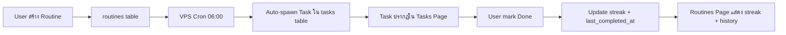

## 📦 RAW ARTIFACT BACKUP

```markdown
# Recurring / Routine Tasks System

งาน routine ที่ต้องทำซ้ำเป็นรอบ (daily, weekly, monthly) — ระบบปัจจุบันไม่มี support เลย ต้องเพิ่มใหม่

## สถานะปัจจุบัน

| Component | Current State |
|-----------|--------------|
| DB Schema | `tasks` table — no recurrence fields |
| API | CRUD `/api/tasks` — no recurrence logic |
| Frontend | Table + Board views, filters by status/project/priority/due_date |
| Cron | มี cron system อยู่แล้ว (health.js, cron-brief) — สามารถ reuse pattern ได้ |

## User Review Required

> [!IMPORTANT]
> **เลือก Approach:** ผมเสนอ 3 แนวทาง — ทั้ง 3 ทำได้ แต่ Approach ที่แนะนำคือ **Option B (Hybrid)**

### Option A: เพิ่ม field ใน tasks table เดิม
- เพิ่ม `recurrence_rule`, `recurrence_parent_id` ใน tasks
- Routine task = task ธรรมดาที่มี rule ว่า "ทำทุกวัน/ทุกสัปดาห์"
- **ข้อดี:** Simple, no new table
- **ข้อเสีย:** ปนกันเยอะ, filter/view ซับซ้อนขึ้น, tasks page จะรกมาก

### Option B: Routines Table แยก + Auto-spawn tasks (แนะนำ)
- สร้าง `routines` table ใหม่เก็บ "template" ของงาน routine
- VPS cron job auto-spawn task จาก routine ตาม schedule
- Task ที่ spawn มีได้ `routine_id` link กลับไป routine
- **ข้อดี:** แยก concern ชัด, Tasks page ไม่รก, จัดการ routine ได้ง่าย, สามารถ track ว่าทำ/ไม่ทำแต่ละรอบ
- **ข้อเสีย:** ต้องสร้าง table + API + page ใหม่

### Option C: Routines Page เป็น static checklist (ไม่เชื่อม task)
- หน้า Routines เป็น checklist แบบ daily reset (เช็คทุกวัน, reset เที่ยงคืน)
- ไม่สร้าง task ใน tasks table — เป็น habit tracker style
- **ข้อดี:** Simple, lightweight
- **ข้อเสีย:** ไม่ได้ integrate กับ task system, ไม่มี history tracking ที่ดี

---

## Proposed Changes (Option B — Recommended)

แบ่งเป็น 4 ส่วนหลัก:

---

### 1. Database — New `routines` Table

#### [MODIFY] [init.js](file:///c:/My%20Claw/Openclaw-VPS/db/init.js)

เพิ่ม table ใหม่ + alter tasks table:

```sql
-- Routines: template สำหรับงานที่ต้องทำซ้ำ
CREATE TABLE IF NOT EXISTS routines (
  id INTEGER PRIMARY KEY AUTOINCREMENT,
  title TEXT NOT NULL,
  description TEXT,
  frequency TEXT NOT NULL DEFAULT 'daily',  -- 'daily' | 'weekly' | 'monthly' | 'custom'
  schedule TEXT,                              -- JSON: {"days": [1,3,5]} for weekly, {"day_of_month": 15} for monthly
  time_of_day TEXT,                          -- e.g. "09:00" — when to spawn task
  priority TEXT DEFAULT 'P2',
  project TEXT,
  tags TEXT,
  is_active INTEGER DEFAULT 1,              -- pause/resume routine
  streak_current INTEGER DEFAULT 0,
  streak_best INTEGER DEFAULT 0,
  last_completed_at TEXT,                    -- track last completion
  created_at TEXT DEFAULT (datetime('now','localtime')),
  updated_at TEXT DEFAULT (datetime('now','localtime'))
);
```

เพิ่ม field ใน `tasks` table:

```sql
ALTER TABLE tasks ADD COLUMN routine_id INTEGER REFERENCES routines(id);
```

---

### 2. Backend API

#### [NEW] [routines.js](file:///c:/My%20Claw/Openclaw-VPS/routes/routines.js)

| Endpoint | Method | Description |
|----------|--------|-------------|
| `/api/routines` | GET | List all routines (with stats: streak, completion rate) |
| `/api/routines` | POST | Create new routine |
| `/api/routines/:id` | PUT | Update routine |
| `/api/routines/:id` | DELETE | Delete routine |
| `/api/routines/:id/history` | GET | ดึง tasks ที่ spawn จาก routine นี้ (history) |
| `/api/routines/today` | GET | Routines ที่ต้องทำวันนี้ + สถานะ (done/not done) |

#### [MODIFY] [tasks.js](file:///c:/My%20Claw/Openclaw-VPS/routes/tasks.js)

- เมื่อ task ที่มี `routine_id` ถูก mark done → update `routines.last_completed_at` + streak

#### [MODIFY] [server.js](file:///c:/My%20Claw/Openclaw-VPS/server.js)

- Register routines routes

---

### 3. VPS Cron — Auto-Spawn

#### [NEW] [cron-routine-spawner.js](file:///c:/My%20Claw/Openclaw-VPS/scripts/cron-routine-spawner.js)

- รันทุกเช้า (e.g. 06:00)
- ดึง routines ที่ active + schedule ตรงวันนี้
- สร้าง task ใหม่ใน `tasks` table โดย link `routine_id`
- ป้องกัน duplicate: เช็คว่าวันนี้ยังไม่เคย spawn task จาก routine นี้

Logic:
```
for each active routine:
  if should_spawn_today(routine):
    if not already_spawned_today(routine.id):
      INSERT INTO tasks (title, description, priority, project, tags, due_date, routine_id)
      VALUES (routine.title, routine.description, ..., today, routine.id)
```

---

### 4. Frontend — Routines Page

#### [MODIFY] [index.html](file:///c:/My%20Claw/Openclaw-VPS/brain-app-public/index.html)

- เพิ่ม nav item "Routines" ใน sidebar (ภายใต้ LIFE section ใกล้กับ Tasks)
- เพิ่ม `<div id="page-routines">` section

#### [NEW] [routines.js](file:///c:/My%20Claw/Openclaw-VPS/brain-app-public/routines.js)

**หน้า Routines UI ประกอบด้วย:**

1. **Today's Progress Bar** — แถบด้านบนแสดง "3/7 done today" 
2. **Routine Cards Grid** — แต่ละ routine เป็น card แสดง:
   - Title + frequency badge (Daily / Mon-Wed-Fri / Monthly 15th)
   - Streak count (🔥 12 days)
   - Today's status (✅ Done / ⬜ Not done) — click to toggle
   - Mini heatmap (7 วันล่าสุด)
3. **Add Routine Modal** — form สร้าง routine ใหม่
4. **History View** — click card to see full history

**Design แนว:**
- Dark theme ตาม DESIGN.md (Deep Navy + Purple accent)
- Card style แบบ premium, มี streak animation 🔥
- Progress ring หรือ progress bar ด้านบน

#### [MODIFY] [style.css](file:///c:/My%20Claw/Openclaw-VPS/brain-app-public/style.css)

- เพิ่ม styles สำหรับ routines page

---

## Data Flow



## Open Questions

> [!IMPORTANT]
> **1. Frequency options:** ต้องการ custom schedule แค่ไหน?
> - **Basic:** Daily / Weekly (เลือกวัน) / Monthly (เลือกวันที่)
> - **Advanced:** เพิ่ม "Every X days" / Biweekly / Quarterly
> 
> ผมแนะนำเริ่มจาก **Basic** ก่อน แล้วค่อยเพิ่ม

> [!IMPORTANT]
> **2. Task page integration:** ต้องการให้ tasks ที่ spawn จาก routine แสดงอะไรพิเศษใน Tasks page ไหม?
> - เช่น badge "🔄 Routine" ใน task row
> - หรือแค่ปนกับ task ปกติเฉยๆ

> [!IMPORTANT]
> **3. Dashboard widget:** ต้องการเพิ่ม "Today's Routines" widget ใน Dashboard page ไหม?
> - แสดง progress bar + checklist สั้นๆ

> [!IMPORTANT]
> **4. Pause/Archive:** ต้องการ feature pause routine ชั่วคราว (เช่น ลาพักร้อน) ไหม?

## Verification Plan

### Automated Tests
- สร้าง routine → verify ใน DB
- Run cron spawner → verify task ถูกสร้าง
- Mark task done → verify streak updated
- Test duplicate prevention (run spawner 2 ครั้ง → task ไม่ซ้ำ)

### Browser Test
- เปิด Routines page → verify UI renders correctly
- สร้าง routine ใหม่ → verify card ปรากฏ
- Toggle today's status → verify streak + animation
- ตรวจ Tasks page → verify spawned tasks แสดง routine badge
```

## Changelog (Phase 2 - Dashboard Tab)
**Added routines analytics and improved UI styling:**
- **Buttons**: Restyled Edit/Pause buttons to use DESIGN.md Stripe ghost/outlined patterns.
- **Tab System**: Separated Routines into "Dashboard" (overview) and "My Routines" (grid) tabs.
- **Hero Section**: Added "Today's Progress" large progress bar and mini-cards for quick status checking.
- **Stats Strip**: Added 4 KPI cards (Active, Current Streak, Best Streak, Paused).
- **Charts**: 
  - Added Weekly Completion bar chart (Chart.js) tracking last 7 days of performance.
  - Added Streak Leaderboard showing top 5 routines with highest current streaks.
  - Added 30-Day Completion Map (GitHub-style heatmap) using opacity levels for completion percentage.
- **APIs**: Created GET /api/routines/stats/weekly and GET /api/routines/stats/heatmap to power the dashboard charts.

