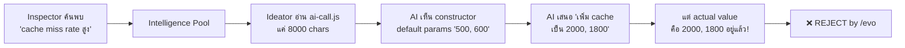

# Hydra Tri-Agent Deep Analysis (Blind Ideator)

## 📌 Context (Compiled Truth)
Hydra's EVOs batch from May 1-3 exhibited a 0% approval rate (0/7), dropping drastically from historical averages. A deep study identified the root cause as the "Blind Ideator" problem. The Ideator's context injection only read the first 8000 characters of `ai-call.js` (and other large files), missing crucial cache implementations and leading it to propose redundant optimizations. Additionally, UTF-16 BOM corruption from PowerShell `echo >>` commands broke the `rejection-patterns.jsonl` memory file. Fixes are prioritized into P0 (urgent), P1, and P2.

## 📦 RAW ARTIFACT BACKUP (Iron Rule)
<details>
<summary>View Full hydra_triforce_analysis.md</summary>

# 🔬 Hydra 3 สหาย — Deep Analysis Report
**Date:** 2026-05-04 | **Scope:** EVO Batch May 1-3 + Historical Feedback Log (38 entries)

---

## 📊 Executive Summary

| Metric | Value |
|--------|-------|
| **Total EVOs reviewed (all time)** | 38 entries in feedback-log |
| **This batch (May 1-3)** | 7 proposals |
| **Approve rate (this batch)** | **0% (0/7)** — worst batch yet |
| **Reject rate (this batch)** | 71% (5/7) |
| **Root cause of rejection** | 4/5 = redundant (already implemented), 1/5 = wrong problem framing |
| **Historical approve rate** | ~30% (8 approved / ~27 evaluated) |
| **UTF-16 BOM corruption** | Active in feedback-log.jsonl lines 17-23 |

---

## 🧠 Agent-by-Agent Analysis

### 1. Inspector 🔍 (ตัวสแกน)

#### ข้อดี ✅
- **10 Growth Checks (GC1-GC10)** ครอบคลุมทุกมิติ: performance, cost, staleness, DORA metrics, evolution success rate — design ดีมาก
- **ICE Scoring System** (Impact × Confidence × Ease) ช่วย prioritize findings อย่างเป็นระบบ
- **Layer Rotation Strategy** ที่ไม่ scan ทุกอย่างทุกรอบ → ลด token waste
- **Suppression Rules + Memory** จาก false positive เรียนรู้ได้ — "FALSE POSITIVES = 0 สัปดาห์ที่แล้ว" แสดงว่า calibrated ดี
- **Cross-dedup กับ evolution_log** ป้องกัน finding ซ้ำข้าม agent

#### ข้อบกพร่อง ❌
1. **ไม่มี "Code Content Check"** — Inspector ตรวจ SQL metrics (duration_ms, token count, error count) แต่ **ไม่เคยอ่านไฟล์ source code จริง** เลย → ทำให้ Inspector ส่ง finding เรื่อง "cache optimization needed" ไปยัง Ideator ทั้งที่ cache นั้นมีอยู่แล้ว
2. **GC2 Skill Gap Detection** ตรวจแค่ว่า tag ถูกใช้กี่ครั้ง ไม่ได้ตรวจว่า skill นั้นยังจำเป็นอยู่ไหม
3. **ไม่มี "Already Implemented" check** — เมื่อ Inspector ค้นพบ "performance opportunity" มันไม่ตรวจว่า optimization นั้นถูก implement ไปแล้วหรือยัง

#### 🔧 ข้อเสนอปรับปรุง
> **P0:** เพิ่ม "Code Reality Check" ใน Inspector — ก่อนส่ง finding ไปยัง Intelligence Pool, Inspector ควร `fs.readFileSync()` ไฟล์ affected_component แล้วตรวจว่า key patterns ที่เกี่ยวข้อง (เช่น `keepAlive`, `zlib`, `Map`) มีอยู่แล้วหรือไม่

---

### 2. Ideator 💡 (ตัวคิด)

#### ข้อดี ✅
- **CORE_INFRA_FILES injection** (lines 279-283) — อ่าน `ai-call.js`, `heartbeat.js`, `hydra-memory.js` ก่อนเสนอ proposal อยู่แล้ว → ป้องกัน hallucination ของ critical modules
- **Post-generation dedup check** (lines 482-511) — ตรวจ codebase ด้วย keyword matching ≥ 70% → ถูกทิศทาง
- **Rejection Pattern Memory** — อ่าน `rejection-patterns.jsonl` แล้ว pre-filter proposals ที่มี category ตรงกัน
- **File tree injection via Minions** — ส่ง repository structure จริง ป้องกัน hallucinated file paths
- **Persona system** (bold/pragmatic/moonshot) ให้ความหลากหลายของ proposal types

#### ข้อบกพร่อง ❌ (สำคัญที่สุด — Root Cause ของ Batch นี้)

1. **🔴 Context Injection ที่อ่านแค่ 8,000 chars ไม่พอ:**
   ```javascript
   // ideator.js line 296:
   contextStr += `\n--- EXISTING IMPLEMENTATION (${relFile}) ---\n` + code.slice(0, 8000) + '\n';
   ```
   `ai-call.js` มี 365 lines (~14K chars) แต่ Ideator อ่านแค่ 8,000 chars แรก → **ไม่เคยเห็น `l1Cache = new L1InMemoryCache(2000, 1800)` ที่ line 159** (chars ~6000+) หรือ `RedisCache(7200)` ที่ line 94 → ทำให้ AI คิดว่า cache ยังใช้ค่า default `(500, 600)` อยู่

2. **🔴 Post-gen Dedup ใช้ "keyword matching" ที่หลวมเกินไป:**
   ```javascript
   // ideator.js lines 490-494:
   const words = (change.action || '').toLowerCase().split(/\W+/).filter(w => w.length > 3);
   const matchedWords = words.filter(w => code.includes(w));
   if (matchedWords.length / words.length >= 0.7) { isDuplicate = true; }
   ```
   ปัญหา: ถ้า action = "Add http.Agent with keepAlive:true" → keywords = `["http", "agent", "with", "keepalive", "true"]` → 5 words ที่ทุกอัน match ใน code base ทั่วไป → **ผลลัพธ์ควรจะ mark ว่าซ้ำ แต่ match 100% กับ generic words = อาจ false positive** → ในทางกลับกัน proposals ที่ผ่าน dedup นี้ไปได้ = dedup หลวมเกินไปไม่ catch semantics

3. **🟡 Prompt ของ Ideator ไม่มี "ตรวจค่า parameter ปัจจุบัน" rule:**
   - Prompt บอกว่า "ห้ามเสนอซ้ำ" แต่ไม่ได้บอกว่า "ตรวจ actual parameter values ก่อน" → AI เห็น `L1InMemoryCache(500, 600)` ใน constructor signature (default params) แล้วเข้าใจผิดว่านั่นคือค่าที่ใช้อยู่จริง

4. **🟡 `rejection-patterns.jsonl` มี UTF-16 BOM corruption (lines 3-6):**
   - เกิดจากมีคนใช้ `echo >>` ใน PowerShell → ทำให้ Ideator อ่าน patterns ไม่ได้ทั้งหมด → **learned rules หายไป**

---

### 3. Evolver ⚙️ (ตัวเขียนโค้ด)

#### ข้อดี ✅
- **Multi-strategy cascade** (JSON Edit → Unified Diff) ที่ retry อัตโนมัติ 7 ครั้ง
- **Self-correction loop** — ส่ง error กลับ AI ให้แก้เอง → innovation ดี
- **Model ranking จาก memory** — sort models ตาม historical success rate
- **Safety gates ครบ:** File whitelist, Syntax check, Smoke test, Rollback, Circuit breaker (max 2 rollbacks/day, 3 deploys/day)
- **Lifecycle cleanup** — auto-expire stale items (K8s reconciliation pattern) → ป้องกัน zombie accumulation
- **Supersede logic** — เมื่อ deploy สำเร็จ, supersede proposals อื่นที่ target ไฟล์เดียวกัน

#### ข้อบกพร่อง ❌
1. **🟡 ไม่มี "pre-flight ground truth check":** Evolver ไม่เคยตรวจว่า proposal ที่ได้รับมาจาก Ideator ถูก reject ไปแล้วกี่ครั้ง ก่อนเริ่มเขียน code → waste tokens ถ้า proposal เป็น garbage
2. **🟡 `callAI()` ไม่ผ่าน `callAIGateway()`** → Evolver เรียก API ตรงผ่าน axios ไม่ผ่าน gateway wrapper ที่มี cache/dedup → ไม่ใช้ประโยชน์จาก infrastructure ที่สร้างไว้
3. **🟢 Minor:** `escapeHtml()` ถูกเรียกใน line 607-608 แต่ไม่เห็น function definition → อาจเป็น runtime error ถ้า HIGH risk proposal ถูก process

---

## 🏗️ Systemic Issues (ปัญหาระดับระบบ)

### Issue 1: "Blind Ideator" Problem 🔴🔴🔴

**นี่คือ Root Cause #1 ของทั้ง batch:**



**Fix:** เปลี่ยน `code.slice(0, 8000)` เป็น `code.slice(0, 15000)` หรือดีกว่า → extract เฉพาะ instantiation lines (grep หา `new ClassName(` และ `export const`) แล้ว inject แทน

### Issue 2: UTF-16 BOM Corruption 🟡

```
feedback-log.jsonl lines 17-23  → UTF-16 BOM
rejection-patterns.jsonl lines 3-4 → UTF-16 BOM
```

**Root cause:** มีครั้งหนึ่งที่ใช้ `echo >>` ใน PowerShell → PowerShell default encoding = UTF-16LE → corrupt JSONL files

**Impact:** Ideator อาจอ่าน learned patterns ไม่ครบ → ไม่ pre-filter proposals ที่ควรถูก block

**Fix:** 
1. สร้าง cleanup script ที่ strip UTF-16 BOM และ re-encode เป็น UTF-8
2. เพิ่ม Iron Rule ใน `/evo` skill: **NEVER use `echo >>` in PowerShell — always use `write_to_file` or `Out-File -Encoding utf8`**

### Issue 3: Feedback Loop ช้าเกินไป 🟡

```
Weekly Reflection → Prompt Patches → Ideator reads patches → Next proposal
```

ปัญหาที่ patterns ที่ถูก reject ซ้ำๆ ใน batch นี้ (4 proposals เสนอ feature ที่มีแล้ว) ไม่ได้ถูก stop ทันทีเพราะ:
- `rejection-patterns.jsonl` ใช้ pattern matching แบบ loose (เช็คแค่ `category` + partial title match)
- ไม่มี **file-level dedup** — "ถ้า proposal เสนอแก้ `lib/ai-call.js` และ proposals อื่นที่แก้ไฟล์เดียวกันถูก reject ภายใน 7 วัน → auto-block"

---

## 📈 Historical Score Trends

| Batch | Date | Proposals | Approve | Reject | Icebox | Success Pattern |
|-------|------|-----------|---------|--------|--------|-----------------|
| Batch 1 | Apr 24-25 | 6 | 3 (50%) | 2 | 1 | ✅ Real bugs, single-file fixes |
| Batch 2 | Apr 25-26 | 10 | 3 (30%) | 3 | 4 | ⚠️ Icebox spam start, dedup issues |
| Batch 3 | Apr 26-27 | 8 | 1 (12%) | 5 | 2 | ⚠️ Crash loop duplicate spam |
| **Batch 4** | **May 1-3** | **7** | **0 (0%)** | **5** | **2** | **🔴 Blind Ideator problem** |

**Trend:** approve rate ร่วงจาก 50% → 0% ใน 10 วัน — Ideator degradation ชัดเจน

---

## 🎯 Recommended Fixes (Prioritized)

### P0 — ต้องทำทันที

| # | Fix | Agent | Effort | Impact |
|---|-----|-------|--------|--------|
| 1 | **เพิ่ม context limit** จาก 8000 → 15000 chars สำหรับ CORE_INFRA_FILES | Ideator | 1 line | 🔴 Critical |
| 2 | **Clean UTF-16 BOM** จาก `feedback-log.jsonl` + `rejection-patterns.jsonl` | Memory | Script | 🟡 Medium |
| 3 | **เพิ่ม file-level dedup** ใน Ideator: ถ้า >2 proposals ที่แก้ไฟล์เดียวกันถูก reject ใน 14 วัน → auto-block | Ideator | ~30 lines | 🔴 Critical |

### P1 — ทำเร็วๆ นี้

| # | Fix | Agent | Effort | Impact |
|---|-----|-------|--------|--------|
| 4 | **Inspector Code Reality Check:** ก่อนส่ง finding เรื่อง performance/cache → อ่าน code ตรวจว่า optimization มีแล้วไหม | Inspector | ~50 lines | 🟡 Medium |
| 5 | **Ideator prompt enhancement:** เพิ่ม rule "ตรวจ actual instantiation values ไม่ใช่แค่ constructor signature" | Ideator | Prompt edit | 🟡 Medium |
| 6 | **Evolver → ใช้ `callAIGateway()`** แทน direct axios → ได้ cache + telemetry free | Evolver | Refactor | 🟢 Low |

### P2 — Nice to Have

| # | Fix | Agent | Effort | Impact |
|---|-----|-------|--------|--------|
| 7 | **Semantic dedup** ด้วย embedding similarity แทน keyword match | Ideator | New module | 🟢 Low |
| 8 | **Evolver pre-flight:** ตรวจ proposal quality score ก่อนเริ่ม code gen | Evolver | ~20 lines | 🟢 Low |

</details>

## 🔬 Timeline & Debugging Log
- **2026-05-04 02:13** - Generated deep analysis report highlighting the 8000 chars cutoff bug in `ideator.js`.
- **2026-05-04 02:20** - Initialized implementation plan and executed `/save` flow before coding.

## 🔗 GBRAIN Backlinks
### depends_on
- **2026-04-20 20:36** | [V7.8.0 AG-GEPA Engine](V7/V7.8.0_[impl]_hydra_ag-gepa-engine.md) -- Core engine design.
### related_to
- **2026-04-26 13:00** | [V10.1.0 Hydra Ideator Dedup & Growth Quota](V10.1.0_[impl]_hydra_ideator-dedup-and-growth-quota.md) -- Previous attempt at fixing dedup.
- **2026-04-19 14:00** | [V7.5.0 Surgery Quality Audit](V7/V7.5.0_[impl]_hydra_evolver-surgery-quality-audit.md) -- Evolver safety gates.
### enables
- **2026-05-04 09:55** | [V12.0.0_[impl]_ag-skills_smart-versioning-v2](../../V12.0.0_[impl]_ag-skills_smart-versioning-v2.md) -- The analysis here directly led to the Smart Versioning v2 overhaul, which prevents unapproved EVOs from inflating version numbers.
