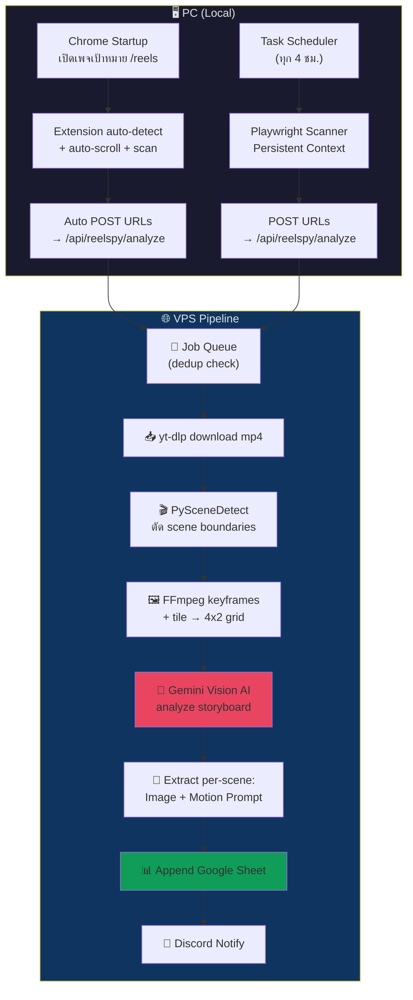

# V12.3.2 [study] ReelSpy Competitive Intelligence Pipeline

## 📌 Context (Compiled Truth)
The user requested a "Competitive Intelligence Pipeline" (codename: **ReelSpy**) to monitor competitor/inspiration Facebook pages for new Reels. The goal is to study successful content strategies by extracting shot composition, motion, pacing, and generating a prompt library to recreate the style.

The pipeline architecture heavily reuses existing infrastructure:
- **Reel Discovery:** Reuse Chrome Extension `fb-reels-scraper`.
- **Downloader:** Reuse `yt-dlp` from `routes/downloader.js`.
- **Output:** Reuse Google Sheets OAuth from `sheets-output.js`.

The new components required are:
1. **Scene Detection:** `PySceneDetect` (Python) to cut scene boundaries.
2. **Storyboard Grid:** `FFmpeg` to extract 8 keyframes and tile them into a 4x2 grid.
3. **AI Analysis:** `Gemini 2.5 Flash Vision` to analyze the 4x2 storyboard and extract an Image Prompt and Motion Prompt for each scene, plus an overall mood.

For **Full Automation**, 3 options were researched:
- **Option A (Smart Extension):** Chrome `onStartup` auto-opens target pages. Extension auto-detects `/reels`, scrolls, and sends URLs to the VPS. (Free, uses native cookies, recommended).
- **Option B (Playwright Ghost):** Windows Task Scheduler triggers a headless Playwright script on logon/interval to scrape. Uses persistent browser context.
- **Option C (Cloud Sentinel):** Apify Actor scraping on the cloud and webhooking the VPS (Costs money).
*Recommendation:* A hybrid of A (primary) + B (fallback) sending to the same deduplicating VPS queue.

## 📦 RAW ARTIFACT BACKUP (Iron Rule)
<details>
<summary>View Artifact: implementation_plan.md</summary>

```markdown
# 🕵️ ReelSpy — FB Page Competitive Intelligence Pipeline

ระบบ Monitor เพจ Facebook คนอื่น ดึง Reels ใหม่ → โหลดคลิป → แกะ Scene → สร้าง Storyboard → แปลงเป็น Image + Motion Prompt → ส่ง Google Sheets แบบ Real-time

## Background & Rationale

ระบบนี้คล้าย `/vdobatch` แต่ประยุกต์ใช้สำหรับ **Competitive Intelligence** — ติดตามเพจต้นแบบ/คู่แข่งแบบ real-time เพื่อ:
- ศึกษา content strategy ของเพจที่ประสบความสำเร็จ
- วิเคราะห์ shot composition, motion, pacing ของ Reels ที่ viral
- สร้าง prompt library สำหรับ recreate ในสไตล์ของเรา

### 🏗️ Existing Infrastructure ที่ใช้ซ้ำได้

| Component | Location | Reuse |
|-----------|----------|-------|
| Chrome Extension FB Scraper | `chrome-extensions/fb-reels-scraper/` | ✅ ใช้ scan reels URL จากเพจเป้าหมาย |
| Video Downloader (yt-dlp) | `scripts/off-peak-agents/lib/video-downloader.js` | ✅ ดาวน์โหลด mp4 |
| Downloader Route + Job Queue | `routes/downloader.js` | ✅ Background job queue, dedup, flush |
| Google Sheets Auth (OAuth) | `scripts/off-peak-agents/lib/sheets-output.js` | ✅ `getAccessToken()` + `appendToGoogleSheet()` |
| Discord Notifications | `routes/downloader.js` → `sendDiscordNotification()` | ✅ แจ้ง progress |
| AI Provider (Gemini Vision) | `discord-bot/lib/ai.js` → `callAIDirect()` | ✅ วิเคราะห์ภาพด้วย Gemini |

---

## User Review Required

> [!IMPORTANT]
> **Full Automation Strategy** — มี 3 ระดับ automation ให้เลือก ดูรายละเอียดใน section ด้านล่าง

---

## 🤖 Full Automation Options (ตอบคำถาม: "แบบ full auto ทำได้ไหน?")

### Option A: "Smart Extension" — Auto-trigger เมื่อเปิด Chrome ⭐ แนะนำ

**ทำงานยังไง:**
1. ตั้ง Chrome startup pages → เพจเป้าหมาย `/reels` URLs (ใน Chrome Settings)
2. เปิดคอม → Chrome เปิดเอง → Extension ตรวจจับว่าอยู่บนหน้า `/reels` → **auto scan + auto scroll + auto send ไป VPS** โดยไม่ต้องกดอะไรเลย
3. VPS รับ URLs → download → analyze → ส่ง Google Sheet → แจ้ง Discord

```
เปิดคอม → Chrome เปิดเอง (startup pages)
         → Extension detect /reels page
         → Auto Scroll 30 วินาที (ดึง reels ล่าสุด)
         → Auto ส่ง URLs ไป VPS
         → VPS pipeline: download → scene detect → storyboard → AI analyze → Sheets
         → Discord notify: "✅ พบ 8 reels ใหม่จากเพจ X → วิเคราะห์เสร็จแล้ว"
```

| Pro | Con |
|-----|-----|
| ✅ ใช้ cookies session ของเราเอง (ปลอดภัย) | ❌ ต้องเปิดคอม + internet |
| ✅ ไม่โดน FB bot detection | ❌ Chrome ต้องเปิดอยู่ ~1 นาที |
| ✅ reuse extension เดิม (แก้น้อยมาก) | ❌ ไม่ 100% auto ถ้าไม่เปิดคอม |
| ✅ ฟรี ไม่มีค่าใช้จ่าย | |

**สิ่งที่ต้องทำ:**
- เพิ่ม `chrome.runtime.onStartup` → auto-open target pages
- เพิ่ม auto-detect logic ใน content.js → ถ้าอยู่บน `/reels` page → auto scan + send
- Config: list เพจเป้าหมายใน extension options page

---

### Option B: "Playwright Ghost" — Full headless automation บน PC

**ทำงานยังไง:**
1. Windows Task Scheduler trigger เมื่อ logon (เปิดคอม)
2. รัน Node.js script ที่ใช้ **Playwright** + persistent browser context (cookies FB login)
3. Script เปิดเพจเป้าหมาย → scroll → ดึง reel URLs → ส่งไป VPS API

```
Windows Logon → Task Scheduler trigger
             → node reelspy-scanner.js
             → Playwright เปิด Chrome (ใช้ cookies ที่ login ไว้แล้ว)
             → เปิดเพจ /reels → scroll → ดึง URLs
             → POST ไป /api/reelspy/analyze
             → ปิด browser (invisible)
```

| Pro | Con |
|-----|-----|
| ✅ Full auto ไม่ต้องเห็น browser | ❌ ต้อง install Playwright (~200MB) |
| ✅ รันเงียบๆ ไม่รบกวน | ❌ FB อาจ detect headless (ใช้ headed mode แทน) |
| ✅ สามารถ schedule ซ้ำทุก X ชม. ได้ | ❌ ถ้า session expire ต้อง re-login manual |
| ✅ ไม่ต้องเปิด Chrome จริง | ❌ Setup ซับซ้อนกว่า Option A |

**สิ่งที่ต้องทำ:**
- สร้าง `scripts/reelspy/reelspy-scanner.js` (Playwright script)
- Login FB ครั้งแรกด้วย headed mode → บันทึก persistent context
- สร้าง Windows Task Scheduler task → trigger at logon
- Config: target pages ใน `.env` หรือ JSON config file

---

### Option C: "Cloud Sentinel" — Apify Actor (VPS-only, ไม่ต้องเปิดคอม)

**ทำงานยังไง:**
1. Apify Actor "Facebook Reels Scraper" รันบน cloud (scheduled ทุก 2-4 ชม.)
2. เมื่อเสร็จ → webhook POST ไป VPS `/api/reelspy/analyze`
3. VPS download + analyze → Sheets

| Pro | Con |
|-----|-----|
| ✅ ไม่ต้องเปิดคอมเลย 24/7 | ❌ Apify Free tier = $5/เดือน (จำกัด) |
| ✅ Cloud-based, reliable | ❌ Paid plan ถ้าใช้เยอะ |
| ✅ ไม่เกี่ยวกับ PC เราเลย | ❌ FB อาจ block Apify IPs (ต้องใช้ residential proxy) |
| | ❌ อาจ miss reels ถ้า scraper ถูก rate limit |

---

### 🏆 ข้อแนะนำ: ใช้ **Option A + B hybrid**

1. **ปกติ:** เปิดคอม → Chrome auto-open → Extension auto-scan (Option A) — **ง่าย ฟรี ปลอดภัย**
2. **เสริม (optional):** Task Scheduler รัน Playwright ทุก 4 ชม. (Option B) — **catch reels ที่พลาด**
3. **ทั้ง 2 route ส่ง URLs เข้า VPS ตัวเดียวกัน** → dedup ป้องกันซ้ำ

---

## Proposed Architecture



### Data Flow (Per Reel)

```
Reel URL → dedup check (already processed?)
  → YES: skip
  → NO: yt-dlp download mp4
    → PySceneDetect (detect scene boundaries)
    → Extract 8 keyframes (1 per scene, max 8; fallback: even intervals)
    → FFmpeg tile → 4x2 storyboard grid (1920x1080)
    → Gemini Vision: analyze grid → extract per-scene prompts
    → Format row → Append to Google Sheet
    → Cleanup temp files (mp4 + frames)
```

### Google Sheet Output Schema (Level 1+2)

| Column | Content | Example |
|--------|---------|---------|
| A | Reel ID | `1234567890` |
| B | Source Page | `Virum Bless` |
| C | Upload Date | `2026-05-06` |
| D | Views | `5,200,000` |
| E | Duration | `28s` |
| F | Reel URL | `https://fb.com/reel/...` |
| G | Storyboard Image | `=IMAGE("https://brain.../storyboard_xxx.jpg")` |
| H-I | Scene 1 — Image + Motion Prompt | `A golden sunrise...` / `Slow zoom in...` |
| J-K | Scene 2 — Image + Motion Prompt | `Close-up of hands...` / `Static shot...` |
| L-M | Scene 3 | ... |
| N-O | Scene 4 | ... |
| P-Q | Scene 5 | ... |
| R-S | Scene 6 | ... |
| T-U | Scene 7 | ... |
| V-W | Scene 8 | ... |
| X | Overall Mood / Style | `Inspirational, warm, golden hour` |
| Y | Download Link | `=HYPERLINK("...", "📥 Download")` |

> Columns ภาษา Eng+Thai จะกำหนดอีกทีตอน implement — ตอนนี้ default English prompts ก่อน

---

## Proposed Changes

### Phase 1: Chrome Extension — Auto-trigger (Option A)

#### [MODIFY] [manifest.json](file:///c:/My%20Claw/Openclaw-VPS/chrome-extensions/fb-reels-scraper/manifest.json)

- เพิ่ม permissions: `"alarms"`, `"storage"`
- เพิ่ม `options_page` สำหรับ config target pages

#### [MODIFY] [background.js](file:///c:/My%20Claw/Openclaw-VPS/chrome-extensions/fb-reels-scraper/background.js)

เพิ่ม auto-trigger logic:
```javascript
// เมื่อ Chrome startup → เปิดเพจเป้าหมายทั้งหมด
chrome.runtime.onStartup.addListener(async () => {
  const { targetPages } = await chrome.storage.sync.get('targetPages');
  if (targetPages && targetPages.length > 0) {
    for (const pageUrl of targetPages) {
      chrome.tabs.create({ url: pageUrl, active: false });
    }
  }
});

// alarm ทุก 4 ชม. → re-open + re-scan
chrome.alarms.create('reelspy-scan', { periodInMinutes: 240 });
chrome.alarms.onAlarm.addListener((alarm) => {
  if (alarm.name === 'reelspy-scan') { /* re-open targets */ }
});
```

#### [MODIFY] [content.js](file:///c:/My%20Claw/Openclaw-VPS/chrome-extensions/fb-reels-scraper/content.js)

เพิ่ม auto-detect + auto-scan logic:
```javascript
// ถ้า URL match /reels → auto trigger scan + send
if (window.location.href.includes('/reels')) {
  setTimeout(async () => {
    // Auto scroll + scan (reuse existing autoScrollAndScan)
    await autoScrollAndScan();  // existing function
    // Auto send to ReelSpy API (not sync-sheets)
    await sendToReelSpy();      // NEW function → POST /api/reelspy/analyze
  }, 3000); // wait 3s for page load
}
```

เพิ่มปุ่ม **"🕵️ Analyze (ReelSpy)"** ใน sidebar (manual trigger option)

#### [NEW] [options.html](file:///c:/My%20Claw/Openclaw-VPS/chrome-extensions/fb-reels-scraper/options.html)

Settings page สำหรับ config:
- Target pages list (add/remove URLs)
- Auto-scan on startup toggle
- Scan interval (hours)
- Analysis mode: Sync Only / Full ReelSpy Analysis

---

### Phase 2: Playwright Scanner (Option B) — Local PC

#### [NEW] [reelspy-scanner.js](file:///c:/My%20Claw/Openclaw-VPS/scripts/reelspy/reelspy-scanner.js)

Playwright-based headless scanner สำหรับ scheduled runs:
```javascript
// Uses launchPersistentContext → keeps FB login session
// 1. Open target /reels pages
// 2. Scroll + collect reel URLs from DOM
// 3. POST to VPS /api/reelspy/analyze
// 4. Close browser
```

- Persistent context: `scripts/reelspy/fb-user-data/`
- First run: headed mode เพื่อ login → save session
- Subsequent runs: can be headless (หรือ headed ปลอดภัยกว่า)
- Random delays between scrolls (2-5s) to avoid detection

#### [NEW] [setup-task.ps1](file:///c:/My%20Claw/Openclaw-VPS/scripts/reelspy/setup-task.ps1)

PowerShell script สร้าง Windows Task Scheduler:
```powershell
# สร้าง scheduled task: run reelspy-scanner ทุก logon + ทุก 4 ชม.
$action = New-ScheduledTaskAction -Execute "node" -Argument "scripts/reelspy/reelspy-scanner.js"
$trigger1 = New-ScheduledTaskTrigger -AtLogOn
$trigger2 = New-ScheduledTaskTrigger -Once -At (Get-Date) -RepetitionInterval (New-TimeSpan -Hours 4)
Register-ScheduledTask -Action $action -Trigger $trigger1,$trigger2 -TaskName "ReelSpy-Scanner"
```

---

### Phase 3: VPS Analysis Pipeline

#### [NEW] [reelspy.js](file:///c:/My%20Claw/Openclaw-VPS/scripts/reelspy/reelspy.js)

**Core pipeline module** — Orchestrator:
```javascript
export async function analyzeReel(url) {
  // 1. Download MP4 via yt-dlp
  const videoPath = await downloadVideo(url);
  
  // 2. Detect scenes via PySceneDetect
  const scenes = await detectScenes(videoPath);
  
  // 3. Extract keyframes at scene boundaries
  const frames = await extractKeyframes(videoPath, scenes);
  
  // 4. Create 4x2 storyboard grid
  const gridPath = await createStoryboardGrid(frames);
  
  // 5. AI analyze storyboard
  const analysis = await analyzeStoryboard(gridPath, frames);
  
  // 6. Cleanup temp files
  await cleanupTempFiles([videoPath, gridPath, ...frames]);
  
  return analysis;
}
```

Key sub-functions:
- `detectScenes(videoPath)` → shells out to `scene-detector.py` → returns JSON timestamps
- `extractKeyframes(videoPath, scenes)` → FFmpeg `-ss` per timestamp → returns frame paths
- `createStoryboardGrid(framePaths)` → FFmpeg `tile=4x2` → returns grid image path
- `analyzeStoryboard(gridPath)` → Gemini Vision multimodal → returns structured JSON
- `cleanupTempFiles(paths)` → remove all temp mp4/jpg after processing

#### [NEW] [scene-detector.py](file:///c:/My%20Claw/Openclaw-VPS/scripts/reelspy/scene-detector.py)

Python helper สำหรับ scene detection:
```python
import sys, json
from scenedetect import detect, ContentDetector

video_path = sys.argv[1]
scene_list = detect(video_path, ContentDetector(threshold=27.0, min_scene_len=15))

# Output: JSON array of timestamps
scenes = [{"start": s[0].get_seconds(), "end": s[1].get_seconds()} for s in scene_list]

# Fallback: ถ้า scene < 4 → ใช้ even intervals
if len(scenes) < 4:
    # ... calculate duration / 8 intervals
    pass

print(json.dumps(scenes[:8]))  # Max 8 scenes for 4x2 grid
```

#### [NEW] [storyboard-analyzer.js](file:///c:/My%20Claw/Openclaw-VPS/scripts/reelspy/storyboard-analyzer.js)

Gemini Vision AI module:
```javascript
const SYSTEM_PROMPT = `You are a professional video director analyzing a storyboard grid (4x2).
The grid contains 8 panels (numbered 1-8, left-to-right, top-to-bottom).
For each scene panel:
1. IMAGE PROMPT: Describe what you see (subject, setting, lighting, colors, composition)
   in a way that could be used as a text-to-image generation prompt
2. MOTION PROMPT: Describe camera movement and subject motion
   (e.g., "slow zoom in", "pan left to right", "static wide shot")
3. SHOT TYPE: Identify (wide, medium, close-up, extreme close-up, bird's eye, etc.)
4. OVERALL MOOD: The emotional tone and visual style of the entire video

Output STRICT JSON format:
{
  "scenes": [
    {"scene": 1, "image_prompt": "...", "motion_prompt": "...", "shot_type": "..."},
    ...
  ],
  "overall_mood": "...",
  "style_notes": "..."
}`;
```

- Uses `callAIDirect('google', 'gemini-2.5-flash', ...)` with base64 image
- JSON validation before save (Iron Rule compliance)
- Retry logic if JSON parse fails

#### [NEW] [reelspy-route.js](file:///c:/My%20Claw/Openclaw-VPS/routes/reelspy.js)

Hono API route + background job queue:
- `POST /api/reelspy/analyze` — รับ URLs, queue background job
- `GET /api/reelspy/status/:jobId` — เช็คสถานะ
- Dedup: check against Google Sheet existing IDs
- Job queue pattern: same as `routes/downloader.js`
- Storyboard images served from `/public/reelspy/` for `=IMAGE()` in Sheet

#### [MODIFY] [server.js](file:///c:/My%20Claw/Openclaw-VPS/server.js)

```javascript
import { reelspyRoutes } from './routes/reelspy.js';
app.route('/api/reelspy', reelspyRoutes());
```

---

## VPS Dependencies

| Package | Install Command | Purpose |
|---------|----------------|---------|
| PySceneDetect | `pip3 install scenedetect[opencv]` | Scene/shot boundary detection |
| FFmpeg | ✅ Already installed | Frame extraction + grid assembly |
| yt-dlp | ✅ Already installed | Video download |

## PC Dependencies (Option B only)

| Package | Install Command | Purpose |
|---------|----------------|---------|
| Playwright | `npm install playwright` | Headless browser automation |
| Chromium | `npx playwright install chromium` | Browser binary |

---

## File Structure

```
scripts/reelspy/
├── reelspy.js                # Main orchestrator (Node.js)
├── scene-detector.py         # PySceneDetect wrapper (Python)
├── storyboard-analyzer.js    # Gemini Vision analysis module
├── reelspy-scanner.js        # [Option B] Playwright scanner for PC
├── setup-task.ps1            # [Option B] Windows Task Scheduler setup
└── fb-user-data/             # [Option B] Playwright persistent cookies

routes/
└── reelspy.js                # Hono API route + job queue

chrome-extensions/fb-reels-scraper/
├── manifest.json             # Enhanced (alarms, storage permissions)
├── background.js             # Auto-startup + alarms logic
├── content.js                # Auto-detect /reels + auto-scan + ReelSpy button
└── options.html              # Settings page (target pages config)
```

---

## Verification Plan

### Automated Tests
1. **VPS:** `pip3 install scenedetect[opencv]` → verify installed
2. **Scene detector:** ทดสอบ `python3 scene-detector.py test-video.mp4` → output JSON
3. **Storyboard grid:** verify FFmpeg `tile=4x2` output (correct dimensions)
4. **Integration:** POST 1 reel URL → verify Google Sheet row appears

### Manual Verification
1. **Extension:** Install updated extension → open target page `/reels` → verify auto-scan triggers
2. **End-to-end:** Watch Discord for notification → check Google Sheet → verify storyboard + prompts
3. **Prompt quality:** ลองนำ image prompt ไป generate ใน AI tool → ดูว่าได้ภาพคล้ายต้นฉบับไหม

---

## Risk Assessment

| Risk | Impact | Mitigation |
|------|--------|------------|
| yt-dlp ถูก FB block | สูง | ใช้ cookies.txt, retry with delay |
| PySceneDetect detect scene ผิด/น้อยเกินไป | กลาง | Fallback: fixed interval (duration/8) |
| Gemini Vision hallucinate prompts | กลาง | JSON validation, human review in Sheet |
| VPS disk space (video storage) | ต่ำ | Auto-cleanup temp files หลัง process |
| Google Sheets API rate limit | ต่ำ | Batch append, same as downloader |
| FB detect Playwright (Option B) | กลาง | Use headed mode + persistent context + random delays |

---

## Estimated Effort

| Phase | Effort | Priority |
|-------|--------|----------|
| Phase 1: Extension auto-trigger | ~2 hr | P0 |
| Phase 2: Playwright scanner (Option B) | ~2-3 hr | P1 (optional) |
| Phase 3: VPS pipeline (download + scene + grid + AI) | ~4-5 hr | P0 |
| VPS dependency install | ~30 min | P0 |
| **Total** | **~9-10 hr** | |
```
</details>

## 🔬 Timeline & Debugging Log
- The user requested a Facebook Page monitor system (similar to `/vdobatch` but for real-time competitive intelligence).
- Researched PySceneDetect vs FFmpeg for scene boundary detection. Selected PySceneDetect for accuracy.
- Drafted a full pipeline from Chrome Extension (URL scraping) to yt-dlp (download), scene cut, storyboard creation, and Gemini Vision extraction.
- The user requested "full auto" options instead of manual click.
- Researched 3 options for full automation: Chrome `onStartup` extensions, `Playwright` with Windows Task Scheduler, and Cloud-based Apify scrapers.
- Updated the plan to recommend a hybrid of the Smart Extension and Playwright Ghost approaches.
- User decided to `/save` and defer the implementation until ready to proceed.

## 🔗 GBRAIN Backlinks
### related_to
- **2026-05-06 13:54** | [V12.1.0_[impl]_ag-skills_vdobatch-smartdl.md](V12.1.0_[impl]_ag-skills_vdobatch-smartdl.md) -- ReelSpy uses similar video pipeline logic (metadata + frames + AI) as /vdobatch.
- **2026-05-06 13:54** | [V10.7.0_[impl]_downloader_fb-reels-proxy-architecture.md](V10.7.0_[impl]_downloader_fb-reels-proxy-architecture.md) -- ReelSpy reuses the identical FB scraper and downloader infrastructure.
- **2026-05-20 18:55** | [V12.8.0_[impl]_discord_reel-storyboard-pipeline.md](V12.8.0_[impl]_discord_reel-storyboard-pipeline.md) -- Implemented the backend pipeline, Discord command, and Mission Control UI for extracting reel storyboards using GPT-5.4 Vision.
