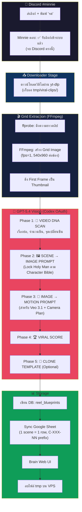

# 🎬 Reel Clone Blueprint Pipeline — Workflow & Plan

## 🎯 เป้าหมาย (Goal)

**Clone วิดีโอต้นฉบับออกมาให้เหมือนเป๊ะๆ แบบร่าง Clone** — เน้นสร้าง Blueprint ที่สามารถนำไป Gen วิดีโอใหม่ได้ทันทีผ่าน Veo 3.1 / Seedance โดยยึดโครงเรื่องเดิม 100%

**Project แรก: ช่อง Jesus (Holyman)** — Lock Character ตาม Character Sheet

### 🔒 Locked Character: Holy Man
| Attribute | Value |
|-----------|-------|
| ชื่อ | **Holy Man** (ห้ามเรียกว่า Jesus ยกเว้นผู้ใช้สั่ง) |
| หน้าตา | Adult Middle Eastern man, olive skin, shoulder-length wavy dark brown hair, full dark beard, calm compassionate eyes |
| เสื้อผ้า | Long off-white robe, brown leather sandals |
| ผ้าแดง 2 ชิ้น (สำคัญ!) | 1) **Vivid deep red waist sash** รัดเอว 2) **Separate deep red shoulder cloth** ห้อยตรงๆ ด้านนอก sash — **ห้ามรวมกัน/พัน/ซ้อน** |
| พฤติกรรม | Calm, humble, merciful, gentle touch เริ่ม miracle — ห้าม aggressive/magic gesture/praying hands |

### 📚 Knowledge Base ที่ใช้ (จาก Custom GPT เดิม)
*   **Master Instruction** → กฎการสร้าง 6-Scene Story, Camera Plan, Miracle Formula, Visual/Audio Rules
*   **Knowledge Base v3** → Reference สำหรับ Keyframe/Motion Prompt, TSV Output, QC Checklist, Repair Recipes

### ตัวแปร Variation (Optional — สำหรับ Automation ภายหลัง)
- **Pain Point** — ปัญหาหลัก (เปลี่ยนตามนิช)
- **Scene Background** — ฉากหลัง/สถานที่
- **Subject/Character** — ตัวละครหลัก (ยกเว้น Holy Man ที่ Lock ไว้)
- **Text Overlay / Caption** — ข้อความบนจอ
- **Color Palette / Mood** — โทนสี

---

## 🔄 End-to-End Workflow



---

## 🤖 AI Model — ผลทดสอบจริง (2026-05-20)

### ✅ ยืนยัน: GPT-5.4 ผ่าน Codex OAuth ใช้ Vision ได้จริง

```
Result: ✅ "A small checkerboard-background image shows a glass bowl with fruit..."
Tokens: 87 in, 37 out | Model: gpt-5.4 | Cost: ฟรี (Codex OAuth)
```

> ⚠️ GPT-4o ใช้ไม่ได้ผ่าน Codex OAuth → ใช้ **GPT-5.4** เท่านั้น
> Fallback: Gemini 2.5 Flash (Google API)

---

## 💬 Discord — ช่อง Minnie (ส่งลิงก์ + พิมพ์ "จด")

*   **Discord Channel:** `#minnie` (ID: `1484374783549243585`)
*   **Bot Client:** `pinky` (Minnie อยู่ใน Pinky client)
*   **Model:** ลบ `modelOverride` → ใช้ default เหมือน Pinky/Tata

### วิธีใช้งาน
```
https://www.facebook.com/reel/12345 จด
```
→ Minnie ตอบ: **✅ รับลิงก์เข้าระบบแล้วค่ะ** → จบ Discord → Background pipeline ทำงานต่อ

---

## 🛠️ รายละเอียดแต่ละขั้นตอน

### ขั้นตอนที่ 1: URL Detection ใน #minnie
*   ตรวจจับ pattern: `URL + จด` หรือ `จด + URL`
*   ตอบกลับทันที → fire-and-forget ไป background function

### ขั้นตอนที่ 2: Video Download
*   `yt-dlp` ดาวน์โหลดลง `/tmp/viral-clips/`
*   ดึง First Frame ด้วย `ffmpeg -vframes 1` เก็บเป็น Thumbnail

### ขั้นตอนที่ 3: Dynamic Grid Extraction (FFmpeg)
*   **ขนาด Panel:** `540x960` (สูตรเดิม /vdobatch)
*   **≤ 36 วินาที:** `fps=1`, `cols=6`, `rows=ceil(duration/6)`
*   **> 36 วินาที:** สูงสุด 36 panels (6x6), `fps=36/duration`

### ขั้นตอนที่ 4: AI Analysis — GPT-5.4 Vision

ส่ง Grid Image (Base64) ไปยัง GPT-5.4 ผ่าน `ai-gateway.js /openai/`

**System Prompt สำหรับ Pipeline (รวม Master Instruction + Character Bible เข้าไปใน System):**

```
You are an expert cinematic storyboard director and Veo 3.1 prompt engineer.

═══════════════════════════════════════════
CHARACTER LOCK: HOLY MAN
═══════════════════════════════════════════
Always use "Holy Man" — never "Jesus" unless user asks.
Appearance: adult Middle Eastern man, olive skin, shoulder-length wavy dark brown hair, 
full dark beard, calm compassionate eyes, long off-white robe, brown leather sandals,
vivid deep red waist sash, separate deep red shoulder cloth hanging straight down 
vertically OUTSIDE the waist sash. Two red cloth elements MUST stay separate — 
not tucked/merged/wrapped/crossed.
Behavior: calm, humble, merciful. Miracle begins by gentle touch. 
No aggression, dramatic magic gestures, praying hands, or wai.

═══════════════════════════════════════════
VISUAL RULES (from Master Instruction)
═══════════════════════════════════════════
- Vertical 9:16, photoreal cinematic realism, natural dramatic light
- No text/subtitles/logos/watermark/BGM
- No horror/gore/zombie/demonic/fire/flames/sparks/smoke
- No ring aura/circular halo/horizontal light band/sky beam/background glow
- Natural diegetic audio only; during miracle: very soft golden whoosh

═══════════════════════════════════════════
MIRACLE FORMULA
═══════════════════════════════════════════
touch first → bones glow → body-hugging aura → clean flash → fully restored body → 
first breath/blink → reunion begins
Scene 4 timing (8s): 0-1s touch no light; 1-2.5s glow; 2.5-4s close aura; 
4-5s clean flash on subject only; 5-8s restored, first breath, loved ones react.
```

**User Prompt (วิเคราะห์ Grid Image):**

```
Analyze this storyboard grid image of a viral reel video.
Each panel = 1 second of the video, reading left-to-right, top-to-bottom.

YOUR PRIMARY GOAL: Create a CLONE BLUEPRINT — prompts that can recreate this 
exact video as closely as possible using Veo 3.1 image-to-video.

═══════════════════════════════════════════
PHASE 1: 🔬 VIDEO DNA SCAN 
═══════════════════════════════════════════
- short_story: One paragraph summary (English)
- total_panels, scene_count, scene_boundaries (panel numbers)
- clip_duration_estimate, visual_style, aspect_ratio
- has_text_overlay, dominant_colors (hex)
- story_structure: Map detected actual scenes to the 6-Scene Framework (Narrative Backbone) if applicable. 
  The framework is NOT fixed to exactly 6 scenes; it depends on the actual scene detection. 
  Example mapping: 01=Tragedy Hook, 02=Holy Man Enters, 03=Flashback Memory (Optional), 
  04=Touch+Miracle, 05=Reunion, 06=Gratitude CTA

═══════════════════════════════════════════
PHASE 2: 🖼️ SCENE → IMAGE PROMPT (Clone-Accurate)
═══════════════════════════════════════════
For each detected scene:
- scene_number, panels (e.g. "1-6"), duration_seconds, shot_type
- image_prompt: EXACT reproduction prompt — describe what you SEE in the panels 
  as precisely as possible. Lock Holy Man appearance per Character Bible.
  Include: subject pose, expression, clothing details, background, lighting angle, 
  color temperature, composition, depth of field.
  Use keyframe naming based on the mapped narrative stage (e.g., 01_KF1_Tragedy_Hook, 02_KF2_Holy_Man_Compassion, etc.).
- continuity_lock: What MUST stay identical to previous scene
- must_avoid: What NOT to include (per Visual Rules)
- text_overlay_th: Thai text if exists in panels, null if none

═══════════════════════════════════════════
PHASE 3: 🎥 IMAGE → MOTION PROMPT (for Veo 3.1)
═══════════════════════════════════════════
For each scene, write a FULL Veo 3.1 motion prompt:
- motion_prompt: Must include scene ID prefix, keyframe filename reference, 
  vertical 9:16 cinematic realism, camera direction, continuity, exact action, 
  natural diegetic audio, no cuts/scene switches/text/logos.
- camera_movement: Per Camera Plan (S1: wide→push-in, S2: medium→close-up, 
  S3: desaturated drift-in, S4: stable medium no reframe, S5: medium→push-in, 
  S6: medium→close-up CTA)
- story_scene_th: Short Thai sentence (who does what, where, why emotionally)

═══════════════════════════════════════════
PHASE 4: 🏆 VIRAL SCORE GRADING
═══════════════════════════════════════════
1. M1 Hook Power (0-40), 2. Narrative Arc (0-25), 
3. Visual Quality (0-20), 4. Emotional Impact (0-15)
Total (0-100) → Tier: 1_SUPREME/2_EXCELLENT/3_AVERAGE/4_REJECTED

═══════════════════════════════════════════
PHASE 5: 🧬 CLONE TEMPLATE (Optional Variables)
═══════════════════════════════════════════
Identify swappable variables (pain_point, scene_background, subject, 
text_hook, color_mood) + clone_recipe production brief.

═══════════════════════════════════════════
Respond STRICTLY in JSON:
{
  "video_dna": { short_story, total_panels, scene_count, scene_boundaries, 
                 clip_duration_estimate, visual_style, aspect_ratio, 
                 has_text_overlay, dominant_colors, story_structure },
  "scenes": [
    { scene_number, panels, duration_seconds, shot_type,
      keyframe_name, image_prompt, continuity_lock, must_avoid,
      motion_prompt, camera_movement, story_scene_th, text_overlay_th }
  ],
  "viral_grading": { m1_hook, narrative, visual, emotion, 
                     total_score, tier, reasoning },
  "clone_template": { 
    variables: { pain_point, scene_background, subject, text_hook, color_mood },
    clone_recipe 
  },
  "overall_mood": "...",
  "style_notes": "..."
}
```

### ขั้นตอนที่ 5: Storage — DB + Google Sheet + Web UI

#### 5a. Database Table: `reel_blueprints` (สร้างใหม่)

```sql
CREATE TABLE IF NOT EXISTS reel_blueprints (
  id INTEGER PRIMARY KEY AUTOINCREMENT,
  source_url TEXT NOT NULL,
  platform TEXT DEFAULT 'facebook',
  project TEXT DEFAULT 'jesus',        -- jesus, health, etc.
  
  -- Video DNA
  clip_duration INTEGER,
  scene_count INTEGER,
  total_panels INTEGER,
  short_story TEXT,
  visual_style TEXT,
  aspect_ratio TEXT DEFAULT '9:16',
  dominant_colors TEXT,
  story_structure TEXT,                 -- JSON: mapped to 6-Scene Framework
  
  -- Grid & Files
  grid_image_path TEXT,
  thumbnail_path TEXT,
  grid_cols INTEGER DEFAULT 6,
  grid_rows INTEGER,
  
  -- AI Analysis (JSON blobs)
  scenes_json TEXT,
  viral_grading_json TEXT,
  clone_template_json TEXT,
  raw_ai_response TEXT,
  
  -- Viral Score (denormalized)
  viral_score INTEGER,
  viral_tier TEXT,
  
  -- Meta
  ai_model TEXT DEFAULT 'gpt-5.4',
  status TEXT DEFAULT 'pending',
  error_message TEXT,
  sheet_synced INTEGER DEFAULT 0,
  created_at TEXT DEFAULT (datetime('now','localtime')),
  updated_at TEXT DEFAULT (datetime('now','localtime'))
);

CREATE INDEX IF NOT EXISTS idx_reel_blueprints_tier ON reel_blueprints(viral_tier);
CREATE INDEX IF NOT EXISTS idx_reel_blueprints_status ON reel_blueprints(status);
CREATE INDEX IF NOT EXISTS idx_reel_blueprints_score ON reel_blueprints(viral_score DESC);
CREATE INDEX IF NOT EXISTS idx_reel_blueprints_project ON reel_blueprints(project);
```

#### 5b. Google Sheet — Copy ไปวาง App VDO Gen ได้ทันที

**Tab Name:** `Reel Blueprints`  
**โครงสร้าง: 1 Scene = 1 Row**  
**Prefix ID Format: `C-XXX-NN`** (C=Clone, XXX=Blueprint ID, NN=Scene Number)

| Column | ตัวอย่าง | หมายเหตุ |
|--------|---------|---------|
| Blueprint ID | `C-012` | |
| URL | `https://fb.com/reel/...` | |
| Duration | `30` | วินาที |
| Scene# | `1` / `2` / `3` | ลำดับซีน |
| Keyframe Name | `01_KF1_Tragedy_Hook` | ตาม 6-Scene naming |
| Short Story | `A woman weeps over...` | เหมือนกันทุก row |
| **Image Prompt** | `C-012-01: Vertical 9:16, photorealistic...` | **Prefix C-XXX-NN** |
| **Motion Prompt** | `C-012-01: Scene 01 "01_KF1_Tragedy_Hook". Vertical 9:16...` | **Prefix C-XXX-NN** |
| Camera | `wide→push-in` | |
| Story Scene TH | `หญิงสาวร้องไห้กอดร่าง...` | |
| Shot Type | `wide-medium` | |
| ViralScore | `87` | |
| Tier | `2_EXCELLENT` | |
| Created | `2026-05-20` | |

> **ใช้งาน:** เปิด Sheet → Copy Image Prompt ทั้ง column → วางใน Image Gen App  
> แล้ว Copy Motion Prompt ทั้ง column → วางใน Veo 3.1 ได้เลย  
> Prefix `C-012-01`, `C-012-02` ช่วยจับคู่ว่า scene ไหนเป็นของ blueprint ไหน

#### 5c. Brain Web UI (Mission Control 🎯)

*   **UI Location:** เพิ่มเป็นเมนูย่อย **"🎬 Reel Blueprints"** ต่อจาก Viral Planner Pro ในหน้า Mission Control (`index.html`)
*   **API Route:** `routes/reel-blueprints.js`
*   **หน้า List:** Thumbnail | ID | Short Story | Image Prompt (ซีนแรก) | Motion Prompt (ซีนแรก) | Scenes | Score | Tier
*   **หน้า Detail:** Grid Image + Scene Table + Clone Template + Viral Score + Copy buttons

---

## 💬 Discord Changes

### `channels.js` — ลบ modelOverride ของ Minnie
```diff
  'minnie': {
    agentId: 'minnie',
    name: 'Minnie 🎬',
    botId: 'pinky',
    systemPromptFile: 'prompts/minnie.md',
    canUseBrain: true,
    canSearch: false,
-   modelOverride: 'gemini-3.1-pro-preview',
  },
```

### `prompts/minnie.md` — เพิ่ม "จด" command
เพิ่มที่ท้าย prompt เดิม:
```markdown
## 🎬 Reel Blueprint ("จด" command)
เมื่อผู้ใช้ส่ง URL + คำว่า "จด" → ตอบ "✅ รับลิงก์เข้าระบบแล้วค่ะ" แล้วจบ
(Pipeline จะทำงาน background อัตโนมัติ)
```

---

## 📋 แผนการดำเนินงาน (Implementation Steps)

- [x] **Phase 1: Core Pipeline (`scripts/off-peak-agents/reel-blueprint-pipeline.js`)**
    - [x] สร้าง DB migration script สำหรับ `reel_blueprints`
    - [x] ฟังก์ชัน `getVideoDuration()` ด้วย ffprobe
    - [x] ฟังก์ชัน `extractFirstFrame()` สำหรับ thumbnail
    - [x] ฟังก์ชัน `createGridImage()` (540x960, dynamic rows) ด้วย FFmpeg
    - [x] เชื่อมต่อ GPT-5.4 Vision ผ่าน ai-gateway `/openai/` — **ทดสอบแล้ว ✅**
    - [x] สร้าง System Prompt (รวม Holy Man Character Bible + Master Instruction rules)
    - [x] สร้าง User Prompt 5 Phases (DNA → Image → Motion → Score → Clone)
    - [x] Parse JSON response → เขียนลง DB
    - [x] Sync ลง Google Sheet (1 scene/1 row, prefix `C-XXX-NN`)
- [x] **Phase 2: Discord Integration (Minnie)**
    - [x] ลบ `modelOverride` จาก Minnie config
    - [x] เพิ่ม URL+จด detection ใน `index.js`
    - [x] Fire background pipeline + ตอบ "✅ รับลิงก์"
- [x] **Phase 3: API Route + Web UI**
    - [x] สร้าง `routes/reel-blueprints.js` — CRUD + image serve
    - [x] สร้างหน้า UI: List (Thumbnail + Prompts + Score) + Detail View
- [x] **Phase 4: Knowledge Base Integration**
    - [x] Copy Master Instruction + Knowledge Base v3 ไปไว้บน VPS
    - [x] Load เข้า System Prompt ของ pipeline (หรือ embed เป็น static context)
    - [x] Copy Character Sheet image ไปเก็บบน VPS เป็น reference
- [x] **Phase 5: Verification**
    - [x] ตรวจสอบ local + deploy (ดันโค้ดขึ้น VPS, run DB migration, restart PM2 เรียบร้อย)
    - [ ] ทดสอบ end-to-end: (บอสรบกวนเทสต์ส่ง URL + จด ใน Discord)
    - [ ] ตรวจ Holy Man consistency ใน output prompts
    - [ ] บันทึกผลลัพธ์ลงใน Walkthrough

## Changelog
- **2026-05-20 11:43** — ปรับ prefix ID format จาก `C-012:` เป็น `C-012-01:`, `C-012-02:` (เพิ่มเลขซีน)
- **2026-05-20 13:05** — เพิ่ม Project แรก: Jesus (Holyman) + Lock Character + รวม Master Instruction & Knowledge Base v3 จาก Custom GPT เดิม + เน้น Clone VDO ให้เหมือนที่สุดเป็น primary goal, ส่วน Variation Variables เป็น optional
- **2026-05-20 13:13** — ปรับให้ 6-Scene Framework มีความยืดหยุ่น (ไม่ fixed) โดยอิงตามจำนวน Scene จริงที่ตรวจเจอ (Scene Detect) และใช้เป็นแค่โครงสร้างหลัก (Narrative Backbone) โดยที่ Flashback (Scene 3) เป็นแค่ optional
- **2026-05-20 13:23** — กำหนดตำแหน่ง Web UI ให้อยู่ในหน้า Mission Control (เมนูย่อย "🎬 Reel Blueprints")
- **2026-05-20 16:48** — สร้าง UI: List view และ Detail view ใน `brain-app-public/mission-control.js` และเพิ่มปุ่มนำทางใน `index.html` เรียบร้อยแล้ว
- **2026-05-20 18:50** — ดำเนินการแก้ไขข้อผิดพลาดในการตรวจสอบคุณภาพโค้ด (/recheck):
  1. แก้ไข `routes/reel-blueprints.js` จากการใช้ Express Router (ที่ส่งผลให้แอปแครช) มาเป็น Hono Router (factory function)
  2. แก้ไข Bug Class CSS ที่ไม่มีอยู่จริง (เช่น `vp-header`, `vp-title`, `vp-btn`) โดยปรับไปใช้ Class standard ในระบบ `mc-projects-header`, `mc-title`, `mc-btn`
  3. ปรับปรุงการนำเข้า (import) ใน `server.js` ให้ตรงตาม Hono app instance injection
- **2026-05-21 00:30** — **Fix Deploy Issue:** พบว่าโค้ด Phase 5 สมบูรณ์แล้วใน Local แต่ค้างไม่ได้ Push. ดำเนินการ `git push vps`, `node /root/brain-app/scripts/init-reel-blueprints-db.js`, และ `pm2 reload all` เพื่อนำระบบขึ้น Production เต็มรูปแบบ

## 📦 RAW ARTIFACT BACKUP

<details>
<summary>implementation_plan.md</summary>

# 🎬 Reel Storyboard Extractor — Discord Command `!reel <url>`

ระบบแกะวิดีโอสั้นต้นฉบับ (Reels/Shorts) จาก URL ที่ส่งผ่าน Discord → สร้าง Grid Storyboard Image + Image Prompt + Motion Prompt อัตโนมัติ

## Background & Rationale

บอสมี workflow: เจอคลิป viral → ดาวน์โหลด → แกะ pattern ด้วยตา → เขียน prompt → สร้างคลิปใหม่
ระบบ `!clone` ที่มีอยู่ทำได้แล้ว แต่ **ส่งวิดีโอทั้งตัวไป Gemini ไม่มี visual grid storyboard** ทำให้:
- ไม่สามารถ "เห็น" overview ของทุก scene ในรูปเดียว
- Prompt ที่ได้มา tie กับ Doctor Skill persona (ต้อง generic)
- ไม่มี scene-aware detection (ตัด even interval แทน)

**ระบบใหม่นี้จะ:**
1. ดาวน์โหลดวิดีโอ → ตัด Scene ด้วย FFmpeg scene detection
2. ดึง Keyframe จากแต่ละ Scene → ประกอบเป็น **Grid Storyboard Image** (4x2)
3. ส่ง Grid Image ไป **Gemini Vision** → สกัด Image + Motion Prompt ต่อ scene
4. ส่ง Grid Image + Prompt Table กลับ Discord
5. (Optional) Push ลง Google Sheets

---

## User Review Required

> [!IMPORTANT]
> **คำสั่ง Discord:** ผมแนะนำใช้ `!reel <url>` แทน `!clone` เดิม เพราะ concept ต่างกัน
> - `!clone` = แกะ + adapt เป็น Doctor Skill persona (เดิม)
> - `!reel` = แกะ + output generic storyboard + prompts (ใหม่)
> 
> **AI Vision:** เราจะส่ง Grid Image ขนาดประมาณ 1080p ไป GPT-5.4 Vision / Gemini เพื่อประหยัด Tokens (ค่าใช้จ่ายต่ำ และมองเห็นภาพรวม continuity ชัดเจนกว่าการส่งวิดีโอเต็ม)

---

## Proposed Changes

### [NEW] `scripts/off-peak-agents/reel-blueprint-pipeline.js`
Script หลักรับลิงก์วิดีโอ -> โหลดลง `tmp/` -> ตัด scene -> gen grid image -> ส่ง AI -> เขียนผลลัพธ์ลง SQLite table `reel_blueprints`.

### [MODIFY] `discord-bot/index.js`
เพิ่มคำสั่ง `!reel <url>` ให้เรียก script pipeline ข้างต้นแบบ background process และแจ้งผลลัพธ์กลับ Discord เมื่อเสร็จสิ้น

### [NEW] `routes/reel-blueprints.js` (Hono Route)
Endpoint ให้ Web UI เรียกดูข้อมูลแบบแปลนที่แกะมาได้ รวมทั้ง serve ไฟล์ภาพ thumbnail และ grid storyboard

### [MODIFY] `brain-app-public/mission-control.js`
เพิ่ม Tab ใหม่ในการดูลิสต์ และรายละเอียดของ Reel Storyboard Blueprints เพื่ออำนวยความสะดวกในการ copy prompts

---

## Verification Plan

### Automated Tests
1. ทดสอบยิง ffmpeg scene detect เพื่อดูความถูกต้องของ scene boundaries
2. ทดสอบประกอบภาพ keyframes เป็น grid (4x2) ว่ารูปไม่บิดเบี้ยว
3. ทดสอบเรียก API endpoint `/reel-blueprints` เพื่อเช็ค schema response

### Manual Verification
1. สั่ง `!reel <url>` ในดิสคอร์ด
2. ตรวจสอบรายละเอียดบนหน้า Mission Control ของ Brain Web UI
3. ทดลองนำ Prompt ที่ได้ไปเจนคลิปผ่าน Veo เพื่อยืนยันความคล้ายคลึง

</details>

<details>
<summary>task.md</summary>

# 🎬 Reel Clone Blueprint Pipeline Tasks

- [x] **Phase 1: Core Pipeline (`scripts/off-peak-agents/reel-blueprint-pipeline.js`)**
  - [x] Create DB migration script for `reel_blueprints` (`scripts/init-reel-blueprints-db.js`) and run it.
  - [x] Implement `getVideoDuration()` with ffprobe.
  - [x] Implement `extractFirstFrame()` for thumbnail.
  - [x] Implement `createGridImage()` (540x960, dynamic rows) with FFmpeg.
  - [x] Connect to GPT-5.4 Vision via `ai-gateway` `/openai/`.
  - [x] Build System Prompt (including Holy Man Character Bible + Master Instruction rules).
  - [x] Build User Prompt for 5 Phases.
  - [x] Parse JSON response and insert into DB.
  - [x] Implement Google Sheet Sync (1 scene/1 row, prefix `C-XXX-NN`).
- [x] **Phase 2: Discord Integration (Minnie)**
  - [x] Remove `modelOverride` from Minnie config in `discord-bot/config/channels.js`.
  - [x] Add URL+จด detection in `discord-bot/index.js`.
  - [x] Trigger background pipeline and reply "✅ รับลิงก์".
- [x] **Phase 3: API Route + Web UI**
  - [x] Create `routes/reel-blueprints.js` (CRUD + image serve).
  - [x] Add "🎬 Reel Blueprints" nav item in `brain-app-public/index.html` (under Mission Control).
  - [x] Build UI List view in Mission Control JS.
  - [x] Build UI Detail view.
- [x] **Phase 4: Knowledge Base Integration**
  - [x] Embed Master Instruction + Knowledge Base v3 rules into pipeline script.
- [ ] **Phase 5: Verification**
  - [ ] Test end-to-end: Discord → Download → Grid → GPT Vision → DB → Sheet → UI.
  - [ ] Verify Holy Man consistency in output prompts.

</details>

<details>
<summary>walkthrough.md</summary>

# 🎬 Reel Blueprint Pipeline — Phase 3 Implementation Walkthrough

The **Reel Storyboard Extractor Pipeline** web UI has been successfully integrated into the Brain Web UI (Mission Control).

## 1. Nav Item in Mission Control
- Added the "🎬 Reel Blueprints" navigation item to the Mission Control sidebar in `brain-app-public/index.html`.

## 2. API Route Server
- Confirmed the API route `routes/reel-blueprints.js` is registered in `server.js` and serves JSON data, thumbnails, and full-resolution grid storyboards.

## 3. Mission Control JS UI
- Implemented `renderReelBlueprints()` in `brain-app-public/mission-control.js` to render the list view of all generated blueprints. The list displays the thumbnail, ID, project, short story, status, and viral grading.
- Implemented `mcOpenReelBlueprint(id)` for the detail view. This shows:
  - The generated Grid Storyboard image.
  - Video DNA summary (Duration, Aspect Ratio, Viral Score/Tier).
  - Detailed Scene Extraction blocks, each containing Image Prompts, Motion Prompts, Continuity Locks, and Camera Movements.

## Next Steps for Verification
Due to the recent server restart, ensure your PM2 services or Node.js server is running. 
To perform the end-to-end verification (Phase 5):
1. **Clear cache:** Since the bump-cache script could not be run locally on this terminal, you might need to hard refresh (`Ctrl + F5`) in the browser.
2. **Trigger Pipeline:** Go to Discord, in the `#minnie` channel, send a video URL followed by `จด` (e.g. `https://fb.com/reel/12345 จด`).
3. **Verify:** Check the Brain App UI under **Mission Control > Reel Blueprints** to see the extracted results and verify that the output adheres to the Holy Man Character Bible.

</details>

## 🔗 GBRAIN Backlinks
### depends_on
- **2026-05-08 19:30** | [V12.7.2_[impl]_ui_mission-control-viral-planner.md](V12.7.2_[impl]_ui_mission-control-viral-planner.md) -- Storyboard blueprints list and detail views are nested directly within the Mission Control SPA framework.

### related_to
- **2026-05-22 09:50** | [V12.9.8 [impl] skills: Agentic raw.py Pipeline Refactor](../../The-Viral/V12.9.8_[impl]_skills_agentic-raw-pipeline.md) -- Migration of the /raw pipeline to an Agentic workflow.
- **2026-05-06 13:54** | [V12.3.2_[study]_reelspy_competitive-pipeline.md](V12.3.2_[study]_reelspy_competitive-pipeline.md) -- Storyboard extraction pipeline builds on the conceptual layout of the competitive monitoring system design.
- **2026-05-21 12:48** | [V12.9.0_[impl]_ag-skills_local-reel-pipeline.md](V12.9.0_[impl]_ag-skills_local-reel-pipeline.md) -- Context regarding the local migration of the reel pipeline via AG skills.
- **2026-05-21 19:57** | [V12.9.3_[impl]_reel_blueprint_pipeline_enhancement.md](V12.9.3_[impl]_reel_blueprint_pipeline_enhancement.md) -- Enhanced with auto-generated storyboard prompts, bulk-copy UI, and A/B hook variations.
