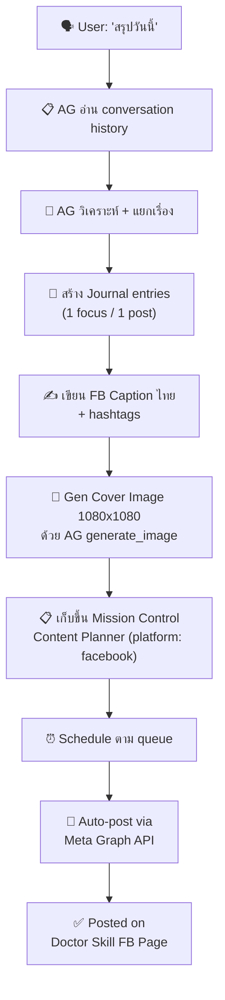

# V2.3.0 — Doctor Skill: Daily Journal Agent + FB Page Automation

> **Agent:** `daily-journal` (AG Agent #6)
> **FB Page:** Doctor Skill
> **ภาษา:** ไทยเป็นหลัก
> **Tone:** เป็นกันเอง เพื่อนเล่าให้เพื่อนฟัง บอกความว้าว ชีวิตดีขึ้นยังไง
> **ความถี่:** ทุกวัน — 1 focus/1 post (แยกเรื่อง โพสได้หลายอัน)
> **Automation:** Full Auto — Meta Graph API + Mission Control scheduling

---

## Overview

```
📝 AG สรุปวันนี้ → 🗂️ แยกเรื่อง (1 focus/1 post)
→ ✍️ เขียน Caption ไทย → 🖼️ Gen Cover Image
→ 📋 เก็บขึ้น Mission Control (Content Planner)
→ ⏰ Schedule → 📱 Auto-post FB Page "Doctor Skill"
```

### แตกต่างจาก Minnie ยังไง

| | Doctor Skill (ใหม่) | Minnie (เดิม) |
|--|---------------------|---------------|
| **Platform** | Facebook Page | TikTok |
| **Content type** | Text + Cover Image (journal/tips) | Video Script |
| **Source** | AG daily conversations & implementations | Health/wellness topics |
| **Tone** | เพื่อนแชร์เพื่อน ว้าว ชีวิตดีขึ้น | สนุก เข้าใจง่าย hook-based |
| **Format** | Pain Point → Solution → Use Case | Hook → Pain → Solution → CTA |
| **Trigger** | "สรุปวันนี้" / "journal วันนี้" | "เขียน script เรื่อง..." |

---

## Architecture



---

## Phase 1: Agent Setup

- [x] สร้าง `agents/daily-journal/AGENT.md`
- [x] สร้าง `brain/templates/journal.md`
- [x] สร้าง directory `brain/areas/journal/`
- [x] อัปเดต `AGENTS.md` เพิ่ม agent ตัวที่ 8

### Agent Definition (`agents/daily-journal/AGENT.md`)

**บทบาท:** รวบรวม daily work → แยกเรื่อง → journal + FB content  
**Trigger:** "สรุปวันนี้" / "journal วันนี้" / "เขียน journal"

**กฎ:**
- อ่าน conversation summaries ของวัน
- แยกเรื่อง = 1 focus / 1 post (ถ้าทำ 5 เรื่อง = 5 posts)
- เขียน caption ภาษาไทย tone เพื่อนเล่าให้ฟัง
- Gen cover image ด้วย AG generate_image (ฟรี)
- เก็บเข้า Mission Control Content Planner → platform: facebook

**คำสั่ง:**
- "สรุปวันนี้" → Full pipeline: collect → split → caption → image → save to Content
- "แยกโพส" → แยก journal ที่มีอยู่เป็นหลาย posts
- "gen cover [topic]" → สร้าง cover image สำหรับ topic นี้
- "สถานะ doctor skill" → ดู content queue ที่รอ post

### Journal Template Structure

```markdown
# 📓 AG Journal — YYYY-MM-DD

## 🧠 สรุปงานวันนี้
- [implementations ทั้งหมด]

## 💡 Ideas
- [ไอเดียที่คุยกัน]

## 🔧 ปัญหา + วิธีแก้
| ปัญหา | สาเหตุ | วิธีแก้ |

## 📊 Pain Point → Use Case Summary
| Pain Point | ... |
| ประโยชน์ | ... |
| แก้ปัญหา | ... |
| Use Case | ... |

---

## 📱 FB Posts (แยกเรื่อง)

### Post 1: [Topic]
**Caption:**
[caption ภาษาไทย tone เป็นกันเอง]
[hashtags]

**Cover Prompt:** [prompt สำหรับ generate_image]

### Post 2: [Topic]
...
```

---

## Phase 2: Mission Control Integration

- [x] เพิ่ม content type filter "doctor-skill" ใน Content Planner
- [x] เพิ่ม project filter แยก Minnie vs Doctor Skill
- [x] เก็บ caption + cover image path ใน content record
- [ ] เพิ่ม "Schedule" button + datetime picker
- [x] เพิ่ม status: `ready` → `scheduled` → `posting` → `posted`

### Content Record Structure (DB)

```json
{
  "topic": "AI ช่วยจัดการเงินอัตโนมัติ",
  "platform": "facebook",
  "project": "doctor-skill",
  "status": "ready",
  "caption": "เพื่อนๆ รู้มั้ย ว่า AI มันทำอะไรได้บ้าง...",
  "hook": "ไม่ต้องเปิด statement เองอีกแล้ว!",
  "cover_image_path": "/brain/areas/journal/covers/2026-03-31_post1.webp",
  "scheduled_at": "2026-04-01T10:00:00+07:00",
  "posted_at": null,
  "fb_post_id": null,
  "hashtags": ["#DoctorSkill", "#AIช่วยชีวิต", "#Productivity"]
}
```

---

## Phase 3: Cover Image Generation

- [ ] กำหนด style guide สำหรับ Doctor Skill brand
- [ ] สร้าง prompt template ที่ reuse ได้
- [ ] ทดสอบ generate_image ให้สวยตาม brand

### Style Guide

| Element | Value |
|---------|-------|
| **Size** | 1080x1080 (FB/IG optimal) |
| **Style** | Modern, clean, tech-meets-lifestyle |
| **Palette** | Teal/Cyan gradient → warm accents |
| **Feel** | ว้าว professional แต่เข้าถึงง่าย |
| **Branding** | "Doctor Skill" text, date |
| **No-go** | ไม่เอา stock photo feel, ไม่เอารูปหน้าคน generic |

### Prompt Template

```
Modern blog cover image, clean minimalist design,
gradient background from teal (#0d9488) to cyan (#06b6d4),
glassmorphism card effect in center,
title text "[TOPIC]" in bold white Thai-style typography,
small date badge "DD/MM/YYYY",
subtle tech grid pattern overlay,
professional yet approachable feel,
"Doctor Skill" small branding in corner,
1080x1080 square, no photographs
```

---

## Phase 4: Meta Graph API Full Automation

- [ ] สร้าง Meta Developer App
- [ ] ขอ permissions: `pages_manage_posts`, `pages_read_engagement`
- [ ] สร้าง Long-lived Page Access Token
- [x] เขียน posting script `scripts/fb-post.js`
- [x] เพิ่ม cron job สำหรับ scheduled posting
- [ ] เก็บ token ใน `.env` (ห้าม hardcode)

### Meta Graph API Setup Steps

```
1. ไปที่ developers.facebook.com → สร้าง App (Business type)
2. เพิ่ม "Facebook Login" product
3. ขอ permissions:
   - pages_manage_posts
   - pages_read_engagement
   - pages_show_list
4. สร้าง Page Access Token (ใน Graph API Explorer)
5. แปลง Short-lived → Long-lived token (60 วัน)
   GET /oauth/access_token?grant_type=fb_exchange_token&...
6. สร้าง Never-expiring Page Token
   GET /{user-id}/accounts
7. เก็บ token ใน VPS .env
```

### Posting Script (`scripts/fb-post.js`)

```javascript
// POST /{page-id}/photos
// - message: caption + hashtags
// - url: cover image URL (must be public)
// OR
// - source: image file upload (multipart)

async function postToFB(pageId, token, caption, imagePath) {
  const form = new FormData();
  form.append('message', caption);
  form.append('source', fs.createReadStream(imagePath));
  
  const res = await fetch(
    `https://graph.facebook.com/v22.0/${pageId}/photos`,
    { method: 'POST', headers: { Authorization: `Bearer ${token}` }, body: form }
  );
  return res.json(); // { id: "post_id", post_id: "..." }
}
```

### Cron Job: Auto-Post Scheduler

```javascript
// scripts/cron-fb-post.js
// รัน ทุก 30 นาที — check content ที่ status = "scheduled" + scheduled_at <= now
// → post → update status to "posted" + save fb_post_id
```

### Required Env Vars (VPS `.env`)

| Key | Purpose |
|-----|---------|
| `FB_PAGE_ID` | Doctor Skill Page ID |
| `FB_PAGE_TOKEN` | Long-lived Page Access Token |
| `FB_APP_ID` | Meta App ID |
| `FB_APP_SECRET` | Meta App Secret |

---

## Phase 5: End-to-End Workflow

- [ ] ทดสอบ "สรุปวันนี้" full pipeline
- [ ] ทดสอบ cover image generation quality
- [ ] ทดสอบ Mission Control content management
- [ ] ทดสอบ Meta Graph API posting (test page ก่อน)
- [ ] ทดสอบ scheduled auto-posting

### Complete Workflow

```
1. User: "สรุปวันนี้"
2. AG อ่าน conversation summaries
3. AG สร้าง journal → brain/areas/journal/2026-03-31.md
4. AG แยกเรื่อง → 5 เรื่อง = 5 posts
5. AG เขียน caption ไทย (tone เพื่อนเล่า) ให้แต่ละ post
6. AG gen cover image 1080x1080 ให้แต่ละ post
7. AG เก็บทุก post เข้า Mission Control Content (platform: facebook, project: doctor-skill)
8. User เปิด Mission Control → ดู content queue → จัด schedule
9. Cron job check scheduled posts → auto-post via Meta Graph API
10. Status: scheduled → posting → posted (+ fb_post_id)
```

---

## ตัวอย่าง Output (31 มี.ค. 2026)

วันนี้ทำไป 9 เรื่อง → แยกเป็น posts ได้:

### Post 1: Credit Card PDF Parser
> 🎉 เพื่อนๆ รู้มั้ย? ตอนนี้เราสอน AI ให้อ่าน statement บัตรเครดิตเองได้แล้ว!
> 
> แค่ forward email → AI แกะ PDF → ดึงรายการใช้จ่ายขึ้น Dashboard อัตโนมัติ
> 
> Pain point: เมื่อก่อนต้องเปิด PDF ดูทีละรายการ 😩
> ตอนนี้: แค่ forward → ทุกอย่าง track ให้หมด!
> 
> #DoctorSkill #AIช่วยชีวิต #FinanceAutomation

### Post 2: Expense Dashboard
> 💰 วันนี้สร้าง Dashboard ดูรายจ่ายส่วนตัวเสร็จ!
> 
> เห็นเลยว่าเดือนนี้ใช้ไปเท่าไหร่ ใช้กับอะไร Top 5 merchant อะไร
> กราฟสวยๆ อัปเดต real-time
> 
> ชีวิตดีขึ้นเพราะ: รู้ว่าเงินไปไหน = ควบคุมได้ 💪
> 
> #DoctorSkill #PersonalFinance #Dashboard

### Post 3: Security Audit
> 🔒 วันนี้ทำ Security Audit ลบ API keys ที่ hardcode ในโค้ดออกหมด
> 
> ถ้าเพื่อนๆ เขียนโค้ด อย่าลืม! password ใน source code = อันตราย!
> แม้ลบไปแล้ว Git ยังจำอยู่!
> 
> วิธีแก้: ใช้ git filter-repo ลบประวัติ + ย้ายทุก key ไปอยู่ .env
> 
> #DoctorSkill #CyberSecurity #DevOps

*(+ อีก 6 posts จากเรื่องอื่นๆ)*

---

## Storage Structure

```
brain/
  areas/
    journal/
      2026-03-31.md          ← full journal
      covers/
        2026-03-31_post1.webp ← cover images
        2026-03-31_post2.webp
        ...
      captions/
        2026-03-31_posts.md   ← all captions (backup)
```

---

## System Files

| ไฟล์ | หน้าที่ |
|------|--------|
| `agents/daily-journal/AGENT.md` | Agent definition |
| `brain/templates/journal.md` | Journal template |
| `brain/areas/journal/` | Journal storage |
| `scripts/fb-post.js` | FB posting via Graph API |
| `scripts/cron-fb-post.js` | Scheduled auto-posting cron |
| `discord-bot/config/channels.js` | (อาจเพิ่ม #doctor-skill channel) |

---

## Dependencies & Cost

| Item | ราคา |
|------|------|
| Meta Graph API | ฟรี |
| AG generate_image | ฟรี (built-in) |
| Mission Control (Brain App) | ฟรี (self-hosted) |
| VPS (มีอยู่แล้ว) | ฟรี (ใช้ร่วม) |
| **Total** | **ฟรี 100%** |

---

## Open Questions ที่ยังต้องตอบ

- [ ] FB Page "Doctor Skill" สร้างแล้วหรือยัง? ถ้ายัง → สร้างก่อน Phase 4
- [ ] อยาก post กี่โมง? (แนะนำ: 10:00, 12:00, 18:00 — prime time ของ FB Thai)
- [ ] อยากให้ส่ง summary ไป Discord ด้วยไหม? (เหมือน Dr.Mike)
- [ ] cover image ต้องมี QR code หรือ link กลับมาที่ blog/website ไหม?
