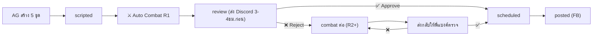

# THE ULTIMATE PLAN v2 — Adversarial Content Combat Pipeline

คอนเทนต์ที่สร้างจาก AG → ผ่าน Auto Combat R1 (กรองระดับ viral) ก่อนเสมอ → ส่งให้พี่แบงค์ Approve
ถ้ายังไม่ดีพอ → สั่ง 2 สหายตบตีกันต่อบน VPS → ส่งกลับพี่แบงค์ตรวจ
(น้องจู้จี้อาจให้ผ่านตั้งแต่ R1 ได้เลยถ้าคุณภาพดีพอ)

## ✅ Decisions Made

| หัวข้อ | ตัดสินใจแล้ว |
|--------|-------------|
| Discord Channel | `#doctor-skill` (ID: `1489014692364943390`) |
| Combat Rounds | แล้วแต่น้องจู้จี้ + **safety max 5 rounds** กัน infinity loop |
| หลัง Combat | ส่งกลับให้พี่แบงค์ตรวจก่อน (ไม่ auto-schedule) |
| Review Timing | ส่ง preview **3-4 ชม. ก่อนเวลาโพส** |
| Doctor Skill | **GPT-5.4 Codex via OpenClaw CLI** (เขียน caption) |
| น้องจู้จี้ | **Kie Gemini 3.1 Pro** (วิจารณ์) |
| Image Variants | AG สร้าง **5 ชุด (ภาพ+headline)** ไว้เลือก ไม่เข้า combat |

> [!NOTE]
> **Facebook Integration:** ยืนยันแล้วว่าใช้การยิง Webhook ไปที่ Make.com สำหรับโพสต์ขึ้น FB อัตโนมัติ จึงไม่ต้องจัดการ Credentials ฝั่ง VPS

---

## Content Status Flow



---

## Proposed Changes

### Component 1: AI Provider Config

#### [MODIFY] [ai.js](file:///p:/AI/AntiGravity%20App/Git%20Hub/Repo/Openclaw-VPS/discord-bot/lib/ai.js)

เพิ่ม provider ใหม่ + export function:

| Provider Key | Model | baseUrl | ใช้ทำอะไร |
|---|---|---|---|
| `kie-gemini31` | `gemini-3.1-pro` | `https://api.kie.ai/gemini-3.1-pro/v1` | **น้องจู้จี้** (QA Critic) |

> Doctor Skill ใช้ **OpenClaw CLI** (`openclaw agent -m "openai-codex/gpt-5.4"`) ไม่ผ่าน REST API

เพิ่ม export function `callAIDirect(providerKey, systemPrompt, messages)` สำหรับเรียก Kie Gemini 3.1 Pro (น้องจู้จี้) ตรงๆ

สำหรับ OpenClaw GPT-5.4 (Doctor Skill): เรียกผ่าน `child_process.exec('openclaw agent -m "openai-codex/gpt-5.4" ...')` ใน agent-combat.js

---

### Component 2: Content Review Cron

#### [NEW] [cron-content-review.js](file:///p:/AI/AntiGravity%20App/Git%20Hub/Repo/Openclaw-VPS/scripts/cron-content-review.js)

**รันทุก 30 นาที** — ตรวจ content ที่ status = `scripted` และ `scheduled_date` ใกล้ถึง

**Flow:**
1. Query DB: `content_plans WHERE status = 'scripted' AND scheduled_date <= date('now', '+1 day')`
2. สำหรับแต่ละ content:
   - **⚔️ Auto Combat Round 1:** เรียก `agent-combat.js --rounds 1` ทันที
     - Doctor Skill (GPT-5.4) rewrite caption
     - น้องจู้จี้ (Gemini 3.1 Pro) ตรวจ + เลือก variant ที่ viral ที่สุด
   - Update status → `review` + เก็บ combat log
   - ส่ง Embed ไป Discord (topic, caption **ที่ผ่าน QA แล้ว**, ภาพที่น้องจู้จี้เลือก)
   - ข้อความแนบ: "React ✅ = Approve | ❌ = ส่งตบตีต่อ"
3. เก็บ `discord_message_id` ลง DB เพื่อ track reaction

> [!TIP]
> พี่แบงค์จะเห็น content ที่ **ผ่านการกรองระดับ viral มาแล้ว 1 รอบ** ทุกครั้ง ไม่ต้องดู draft ดิบ

---

### Component 3: Discord Reaction Handler

#### [MODIFY] Discord Bot (index.js or event handler)

เพิ่ม `messageReactionAdd` listener:
- ถ้า reaction ✅ บน message ที่มี content_plan_id → update status = `scheduled`
- ถ้า reaction ❌ → update status = `combat` → เรียก `agent-combat.js` subprocess

---

### Component 4: Adversarial Combat Engine 🔥

#### [NEW] [agent-combat.js](file:///p:/AI/AntiGravity%20App/Git%20Hub/Repo/Openclaw-VPS/scripts/agent-combat.js)

**หัวใจของ THE ULTIMATE PLAN** — 2 AI ตบตีกันบน VPS

```
Input: content_plan_id
```

**Loop (แล้วแต่น้องจู้จี้ตัดสิน, safety max 5 rounds):**

| Step | Agent | Model | Provider | ทำอะไร |
|------|-------|-------|----------|--------|
| 1 | Doctor Skill | GPT-5.4 Codex | OpenClaw CLI | รับ original caption + feedback (ถ้ามี) → เขียน caption ใหม่ |
| 2 | น้องจู้จี้ | Gemini 3.1 Pro | Kie REST API | ตรวจ caption ตามเช็คลิสต์ 6 ข้อ → Approve หรือ Reject + feedback |
| 3 | ถ้า Reject | กลับ Step 1 | — | ส่ง feedback ให้ Doctor Skill แก้ |

**⛔ Infinity Loop Protection:**
- **Safety max: 5 rounds** — ถ้าถึง 5 รอบแล้วยังไม่ผ่าน → force stop + ส่งเวอร์ชันล่าสุดให้พี่แบงค์ตรวจ
- น้องจู้จี้ต้อง return JSON ชัดเจน: `{"approved": true/false, "feedback": "..."}`
- ถ้า parse JSON ไม่ได้ → ถือว่า approved (กัน loop จาก format error)

**สิ่งที่ตบตีกัน:** เฉพาะ **caption** (เนื้อหาโพส) เท่านั้น
**สิ่งที่ไม่แตะ:** รูปภาพ 5 ชุด + headline ← มาจาก AG พร้อมใช้ เลือกทีหลังได้
**🧐 น้องจู้จี้เลือก Variant:** ตอน review น้องจู้จี้จะเลือกภาพ+headline ที่ viral ที่สุดด้วย → return `selected_variant` index ใน JSON

**Nong Juji Response Format:**
```json
{
  "approved": true,
  "feedback": "ผ่าน! caption เด็ดมากค่ะ"
  "selected_variant": 2,
  "variant_reason": "ภาพที่ 3 ดู dark และน่าหยุดดูที่สุด"
}
```

**Output:**
- Update `caption` ใน DB ด้วยเวอร์ชันสุดท้าย
- Update `selected_variant` ตามที่น้องจู้จี้เลือก
- Update status → `review` (ส่งกลับให้พี่แบงค์ตรวจอีกรอบ)
- ส่งแจ้งเตือน Discord: "⚔️ Combat สิ้นสุด! (X rounds) น้องจู้จี้เลือกภาพ #Y — รอพี่แบงค์ Approve"

---

### Component 5: Notify Helper Update

#### [MODIFY] [notify-helper.js](file:///p:/AI/AntiGravity%20App/Git%20Hub/Repo/Openclaw-VPS/discord-bot/utils/notify-helper.js)

เพิ่ม channel mapping:
```js
'doctor-skill': 'CHANNEL_ID_HERE',
```

---

### Component 6: Database Schema

#### content_plans table — ต้องเพิ่ม columns:

| Column | Type | Purpose |
|--------|------|---------|
| `discord_message_id` | TEXT | Track Discord message สำหรับ reaction |
| `combat_rounds` | INTEGER | จำนวนรอบที่ตบตีกัน |
| `combat_log` | TEXT (JSON) | Log แต่ละรอบ (draft + feedback) |
| `variants` | TEXT (JSON) | **5 ชุด ภาพ+headline** ที่ AG สร้างไว้ |
| `selected_variant` | INTEGER | index ของ variant ที่เลือกใช้ (default: 0) |

**`variants` JSON format:**
```json
[
  { "headline": "ท่อนที่ 1", "cover_image_path": "/cdn/cover-1.jpg" },
  { "headline": "ท่อนที่ 2", "cover_image_path": "/cdn/cover-2.jpg" },
  ...
]
```

- `cover_image_path` + `headline` ใน row หลักจะชี้ไปที่ `variants[selected_variant]`
- น้องจู้จี้เลือก variant ที่ viral ที่สุดตอน combat review
- พี่แบงค์สามารถเปลี่ยน variant ได้จาก Mission Control UI (Image Gallery Strip)

---

### Component 7: Content Editor UI Revamp 🎨

#### [MODIFY] [index.html](file:///p:/AI/AntiGravity%20App/Git%20Hub/Repo/Openclaw-VPS/brain-app-public/index.html) + [content.js](file:///p:/AI/AntiGravity%20App/Git%20Hub/Repo/Openclaw-VPS/brain-app-public/content.js) + [style.css](file:///p:/AI/AntiGravity%20App/Git%20Hub/Repo/Openclaw-VPS/brain-app-public/style.css)

**Best practices จาก Buffer / Later / ContentStudio:**

#### 7a. Content Area Width Control
- Content editor pane: **`max-width: 60vw`** (กันจอยาวเกินไป)
- เนื้อหาอยู่กึ่งกลาง อ่านสบายตา ไม่กระจายยาวจนหันคอเหล็ก

#### 7b. Image Gallery Strip (แถบ 5 รูปแนวนอน)
```
┌────────────────────────────────────────────────────────┐
│  ┌──────┐  ┌──────┐  ┌──────┐  ┌──────┐  ┌──────┐  │
│  │██████│  │      │  │      │  │      │  │      │  │
│  │ IMG 1│  │ IMG 2│  │ IMG 3│  │ IMG 4│  │ IMG 5│  │
│  └──██──┘  └──────┘  └──────┘  └──────┘  └──────┘  │
│   ↑ selected (ขอบทอง)                               │
└────────────────────────────────────────────────────────┘
```
- 5 thumbnails แนวนอน (80x80px) ใต้ topic input
- คลิกเพื่อเลือกเป็น primary cover → **ขอบทอง (gold ring)** รอบรูปที่เลือก
- Hover: แสดง headline ของ variant นั้นใน tooltip
- เมื่อยังไม่มีภาพ: แสดง placeholder + Upload button

#### 7c. Live FB Post Preview (Inspired by Buffer)
- แสดงทางขวาของ editor (หรือ collapsible panel)
- Preview แสดง: ภาพ cover + caption แบบที่จะเห็นบน Facebook
- อัพเดท realtime ตามที่พิมพ์

#### 7d. Caption Optimizer Tools
- **Character counter** พร้อมแถบสี (เขียว < 400 ตัวอักษร, ส้ม < 200, แดง > 500)
- **Hashtag chips** แสดงเป็น tag แยก คลิกลบได้
- **Combat status badge** แสดงสถานะปัจจุบัน (เช่น "⚔️ Round 2/5") ถ้าอยู่ใน combat

#### 7e. Auto-Upload Flow
- AG สร้าง 5 ภาพ → **auto-upload ไป `/cdn/content/{id}/`** เก็บไว้เลย
- ใน `variants` JSON เก็บ path ที่ upload แล้ว
- ไม่ต้อง upload ซ้ำ เปิดหน้าเว็บเห็นทันที

---

## Open Questions

> [!NOTE]
> คำถาม 1, 3, 4, 5 ตอบหมดแล้ว เหลือแค่ข้อ 2

> [!NOTE]
> 2. **Facebook Integration:** ไม่ต้องใช้ `FB_PAGE_ID` / `FB_PAGE_TOKEN` แล้ว เพราะใช้ Make.com เป็นตัวกลางโพสต์แทน

---

## Verification Plan

### Automated Tests
1. รัน `agent-combat.js` ด้วย content_plan_id จริง → ตรวจว่า loop ทำงานครบ
2. ตรวจ status flow ใน DB: `scripted` → `review` → `combat` → `scheduled`
3. ตรวจ Discord notification ว่ามาถึง channel ที่ถูกต้อง

### Manual Verification
1. พี่แบงค์ทดสอบ react ✅/❌ บน Discord → ตรวจว่า status เปลี่ยนถูก
2. End-to-end: สร้าง content → approve → ดูว่าขึ้น Facebook Page จริง
