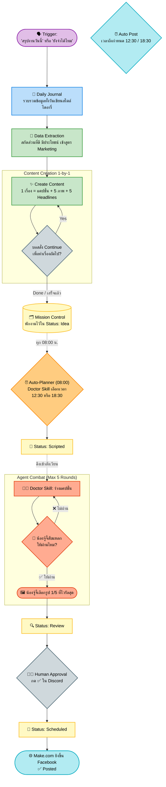

# ⚔️ Agent Combat Pipeline Workflow
**(Version 2.8.0)**

สรุปผังการทำงานทั้งหมดตั้งแต่ต้นน้ำ (สั่งงานใน AG) จนถึงปลายน้ำ (โพสต์ขึ้น Facebook) โดยเรียงลำดับตาม Timeline จริง

---

## 🕒 ทามไลน์การทำงาน (Timeline)

### 1️⃣ จุดกำเนิดเนื้อหา (Data Entry & Journaling)
> **เมื่อไหร่ก็ได้:** ตามเวลาที่บอสพิมพ์สั่งงานในจอ AntiGravity
- **Trigger:** บอสพิมพ์คำสั่งเช่น `"สรุปงานวันนี้"` หรือ `"คุณยังจำได้ไหม..."`
- **Action (Journal):** AG จะรวบรวมข้อมูลทั้งหมดของวันนั้น (นับจาก Trigger ก่อนหน้า) มาเขียนบรรยายเป็นเรื่องราว และ**บันทึกลง Daily Journal** ก่อนเสมอ
- **Action (Extraction):** จากนั้น AG จะสกัดข้อมูลที่ "ดี มีประโยชน์ และเข้าตำรา Marketing" ออกมาตั้งต้นทำ Content (จำนวนกี่เรื่องก็ได้ ขึ้นอยู่กับความเข้มข้นของวันนั้น)
- **Action (Creation 1-by-1):** AG เริ่มปั้น Content ทีละเรื่อง (เขียนเนื้อหา + Gen ภาพ 5 รูป + 5 Headlines ตามสูตรสำเร็จ) เมื่อเสร็จ 1 เรื่องจะถามยืนยันกับบอส (Prompt to continue) เพื่อทำเรื่องถัดไปจนครบ
- **Result:** นำ Content Plan ที่ได้ทั้งหมดไปเก็บพักไว้ที่กระดาน **Mission Control (MC)** ในฐานข้อมูลสถานะ `💡 Idea` เตรียมพร้อมเข้าสู่ด่านต่อไป

### 2️⃣ การจัดตารางออกอากาศ (Auto-Planner)
> **ทุกเช้า 08:00 น.** (ตั้งเวลาใน Cron Manager)
- **Trigger:** สคริปต์ `cron-auto-planner.js` เริ่มทำงาน
- **Action:** Doctor Skill (GPT-5.4) จะนำกอง `Idea` ทั้งหมดมากางดู เช็คว่าสล็อตเวลา 12:30 น. และ 18:30 น. ของ 3 วันข้างหน้า มีช่องไหนว่างบ้าง
- **Result:** เลือกเรื่องที่เหมาะสมที่สุดไปเสียบลงตารางเวลา และขยับสถานะเรื่องนั้นเป็น `📝 Scripted` อัตโนมัติ

### 3️⃣ สังเวียนตบตีเนื้อหา (Agent Combat)
> **3-4 ชั่วโมง ก่อนถึงเวลาโพสต์จริง**
- **Trigger:** สคริปต์ `cron-content-review.js` เช็คเจอโพสต์ที่สถานะเป็น `Scripted` และใกล้ถึงเวลาออกอากาศ
- **Action:** ส่งเรื่องเข้าสมรภูมิ `agent-combat.js`
  - **Round 1:** Doctor Skill เขียนแคปชั่นร่างแรกสุดไวรัล
  - **Round 2:** น้องจู้จี้ (Kie Gemini 3.1 Pro) สับแหลกตามเช็คลิสต์ ถ้าไม่ผ่าน ส่งกลับไปให้แก้วนคูป (Max 5 รอบ)
  - **Round 3:** เมื่อน้องจู้จี้อนุญาตผ่าน จะ**เลือกรูป Variant รูปที่ 1 ใน 5 ที่ไวรัลที่สุด** ประกอบแคปชั่น
- **Result:** เปลี่ยนสถานะโพสต์เป็น `🔍 Review` และยิงแจ้งเตือนสรุปงานส่งเข้า Discord `#doctor-skill` ทันที

### 4️⃣ บอสตรวจสอบ (Human Approval)
> **หลัง Discord เด้งเตือน**
- **Trigger:** บอสดูแจ้งเตือนบนมือถือ/หน้าจอ
- **Action:** กด React Emoji 
  - `✅` = อนุมัติแคปชั่นและรูป ยืนยันโพสต์
  - `❌` = ยังไม่โดนใจ ส่งกลับไปให้ 2 สหายตีกันใหม่เปลี่ยนมุมเขียน
- **Result:** สถานะเปลี่ยนเป็น `📅 Scheduled` (ยืนยันรอบิน)

### 5️⃣ โพสต์ขึ้นฟ้า (Auto Post)
> **ตรงเวลาเป๊ะ (12:30 น. หรือ 18:30 น.)**
- **Trigger:** ถึงกำหนดเวลา `scheduled_at`
- **Action:** สคริปต์ `cron-fb-post.js` จับโพสต์สถานะ `Scheduled` ส่งข้อมูลเนื้อหา + รูปภาพ แพ็คโยนเข้า Webhook ของ Make.com
- **Result:** Make.com จัดการยิงขึ้นหน้าเเพจเฟสบุ๊ก สถานะเปลี่ยนเป็น `✅ Posted` จบงาน!

---

## 📊 ผังการไหลของข้อมูล (Workflow Chart)

