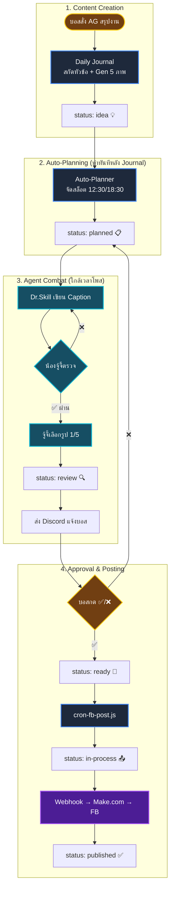

# Doctor Skill — Status Definition (Final)

## Status Flow

```mermaid
flowchart LR
    classDef s1 fill:#8b5cf6,stroke:#c4b5fd,color:#fff
    classDef s2 fill:#f59e0b,stroke:#fcd34d,color:#000
    classDef s3 fill:#ea580c,stroke:#fdba74,color:#fff
    classDef s4 fill:#6366f1,stroke:#a5b4fc,color:#fff
    classDef s5 fill:#3b82f6,stroke:#93c5fd,color:#fff
    classDef s6 fill:#10b981,stroke:#6ee7b7,color:#000

    A["💡 idea"]:::s1 -->|Auto-Planner จัดสล็อต| B["📋 planned"]:::s2
    B -->|Combat ตบตี + เลือกรูป| C["🔍 review"]:::s3
    C -->|บอส ✅ Approve| D["🚀 ready"]:::s4
    D -->|Webhook ยิงออก| E["📤 in-process"]:::s5
    E -->|ยิงสำเร็จ| F["✅ published"]:::s6
    C -->|❌ Reject| B
    E -->|ยิงพลาด| D
```

## รายละเอียด 6 สถานะ

| # | Status | Label | Emoji | สี | ความหมาย | ใครเปลี่ยน? |
|---|--------|-------|-------|----|----------|------------|
| 1 | `idea` | Ideas | 💡 | ม่วง | **หัวข้อดิบ** — Topic + Hook + Caption ร่าง + 5 ภาพ Variants | Daily Journal / AG |
| 2 | `planned` | Planned | 📋 | เหลือง | **จัดตารางแล้ว** — ถูกจับลงสล็อต 12:30/18:30 | Auto-Planner |
| 3 | `review` | Review | 🔍 | ส้ม | **ผ่านสังเวียน** — Dr.Skill + จู้จี้ ตบตี Caption + เลือกรูปเสร็จ | Agent Combat |
| 4 | `ready` | Ready | 🚀 | น้ำเงินม่วง | **บอสอนุมัติ** — พร้อมยิงออก FB เมื่อถึงเวลา | บอสกด ✅ Discord |
| 5 | `in-process` | In Process | 📤 | ฟ้า | **กำลังยิง** — ส่ง Webhook ไปยัง Make.com (ชั่วคราว) | cron-fb-post |
| 6 | `published` | Published | ✅ | เขียว | **เสร็จสิ้น** — โพสต์ขึ้น Facebook แล้ว | cron-fb-post |

## Pipeline Flow แบบเต็ม

## สิ่งที่เพิ่มใหม่ในรอบนี้

| ฟีเจอร์ | รายละเอียด |
|---------|-----------|
| **Combat Log Viewer** | เปิด content ใดๆ ใน Editor จะเห็น ⚔️ Combat Log ด้านล่าง — แสดงทุกรอบที่ Dr.Skill กับน้องจู้จี้ตบตีกัน + เหตุผลการเลือกรูป |
| **Auto-Plan หลัง Journal** | Daily Journal สร้าง idea เสร็จ → เรียก Planner ต่อเลยทันที ไม่ต้องรอ 08:00 |
| **Archive ของเก่า** | Content เทส 12 ชิ้น (ID 11-22) ถูกย้ายเป็น `archived` ไม่ปนกับของจริง |
