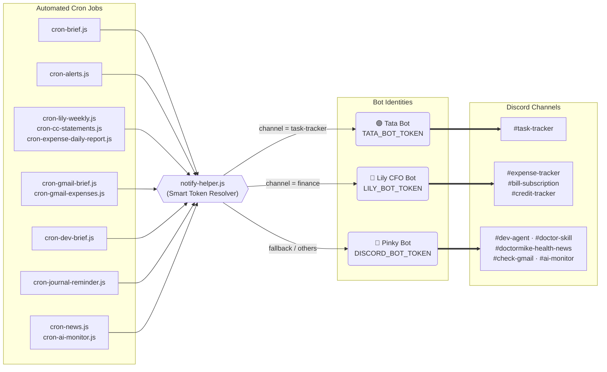

# 📊 V2.9.1 — Bot System Audit: Architecture Summary

## 🤖 ตารางสรุป Bot / Channel / Cron

| Bot Token (คนพูด) | Discord Channel | Agent Persona | Cron Jobs เชื่อมต่อ | หน้าที่หลัก |
|:---|:---|:---|:---|:---|
| **Tata** | `#task-tracker` | Tata (Project Manager) | `cron-brief.js` (morning/followup/review) | สรุปงาน, แจ้งงานค้าง, Daily Report |
| **Lily** | `#expense-tracker` | Lily CFO | `cron-expense-daily-report.js` | สรุปรายจ่ายประจำวัน |
| **Lily** | `#bill-subscription` | Lily CFO | `cron-alerts.js`, `cron-lily-weekly.js` | แจ้งเตือนบิล/Subscription, รายงานสัปดาห์ |
| **Lily** | `#credit-tracker` | Lily CFO | `cron-cc-statements.js` | Sync Statement บัตรเครดิต |
| **Pinky** | `#dev-agent` | Dev Agent (พี่เดฟ) | `cron-dev-brief.js` | คอยรับจดงาน Dev → `dev-lab`, คุม Infra |
| **Pinky** | `#doctor-skill` | Doctor Skill | `cron-journal-reminder.js` | ทวง Daily Journal, ช่วยสร้างแคปชั่น FB |
| **Pinky** | `#doctormike-health-news` | (Interactive Read-Only) | `cron-news.js` | ยิงข่าว Health, รอบอสพิมพ์เลือกเลขข่าว |
| **Pinky** | `#check-gmail` | System | `cron-gmail-brief.js` | รายงานอีเมลสรุปรายวัน |
| **Pinky** | `#ai-monitor` | System | `cron-ai-monitor.js` | Monitor สถานะ AI Models |
| **Pinky** | `#general` + ทั่วไป | Pinky (หลัก) | — | ผู้ช่วยครอบจักรวาล, ตอบทุกอย่าง |

---

## 🗺️ Flowchart — Smart Token Routing (notify-helper.js)



---

## ✅ รายการที่แก้ไขใน V2.9.1

| # | ไฟล์ที่แก้ | สิ่งที่แก้ |
|---|---|---|
| A1 | `cron-brief.js` | โหลด parent `.env` เพื่อให้ notify-helper เห็น TATA_BOT_TOKEN |
| A2 | `cron-alerts.js` | โหลด parent `.env` → ผ่าน sendToAllDestinations ถูกต้อง |
| A3 | `cron-lily-weekly.js` | โหลด parent `.env` → Lily Token ทำงานถูก |
| A4 | `cron-cc-statements.js` | เปลี่ยน sendDiscordNotification → ใช้ `sendDiscordMessage()` จาก notify-helper |
| A5 | `cron-expense-daily-report.js` | โหลด parent `.env` → ผ่าน sendToAllDestinations |
| A6 | `cron-gmail-brief/expenses/dev-brief/journal-reminder.js` | โหลด parent `.env` ทุกตัว |
| B1 | `index.js` | แก้ `channelName === 'doctormike'` → `'doctormike-health-news'` |
| B2 | `prompts/daily-journal.md` | สร้าง System Prompt ใหม่สำหรับ Doctor Skill channel |
| B3 | `config/channels.js` | ชี้ `systemPromptFile` ของ doctor-skill → `prompts/daily-journal.md` |
| C1 | `prompts/dev-agent.md` | แก้ Rule#1: ยินดีรับงาน Dev ทุกชนิด ไม่ปฏิเสธ → tag เข้า dev-lab |
| D1 | `notify-helper.js` | ลบ `'brain'` ออก, เพิ่ม `'dev-agent'`, `'doctor-skill'` เข้า CHANNEL_MAP |

---

## 🔑 กลไกสำคัญ: `notify-helper.js` LILY_CHANNELS / TATA_CHANNELS

```js
// Finance channels → Lily Token
const LILY_CHANNELS = [
  '1488589365322973314', // #bill-subscription
  '1486710809932333106', // #expense-tracker
  '1488587681054064640', // #credit-tracker
];

// Task channels → Tata Token
const TATA_CHANNELS = ['1484375037841510470']; // #task-tracker

// else → Pinky (default)
```

> [!TIP]
> กลไกนี้ทำให้ **Cron ทุกตัวไม่ต้องรู้ว่าจะใช้ Token ตัวไหน** แค่ส่งผ่าน `sendDiscordMessage(channelId, msg)` เท่านั้น notify-helper จะเลือก Token ให้เองอัตโนมัติตาม Channel ID

---

*Deployed: 2026-04-06 | Version: V2.9.1 | Status: ✅ Live on VPS*
