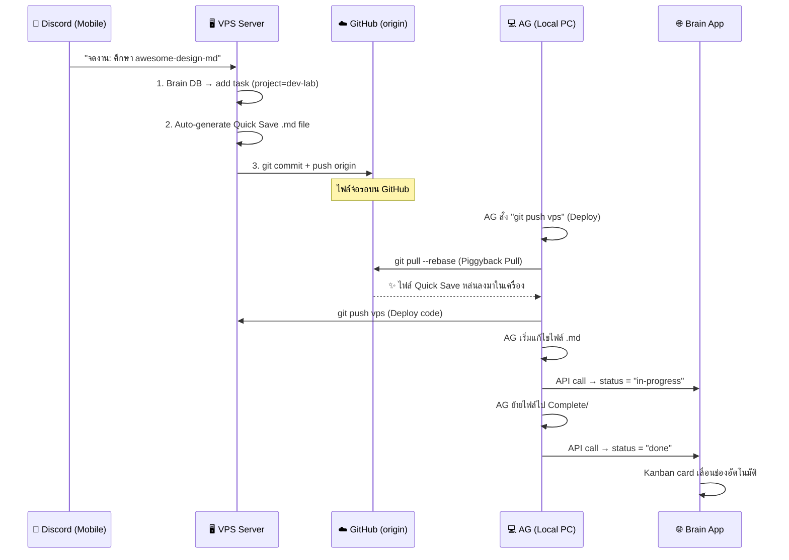

# Dev Lab Seamless Pipeline — Full Auto Task Bridge

สร้างระบบเชื่อม Discord → VPS → Git → AG (Local PC) แบบไร้รอยต่อ เพื่อให้งานที่ถูกจดผ่าน Discord สามารถ "งอกอัตโนมัติ" เป็นไฟล์ Quick Save ในเครื่องคอม พร้อมแสดงผลเป็น Kanban Board สวยๆ บนหน้าเว็บ Brain App

## Architecture Overview



## User Review Required

> [!IMPORTANT]
> **Kanban Columns (ตกลงแล้ว):** 3 ช่อง: `📦 Backlog` → `🛠️ In Progress` → `✅ Complete`

> [!IMPORTANT]
> **หน้า Dev Lab ในเว็บ (ตกลงแล้ว):** เพิ่มเมนูใหม่ในฝั่ง **Workspace** panel ชื่อ **"Dev Lab 🧪"** พร้อม **URL state แยก** (`#devlab`) เพื่อให้สามารถเข้าถึงตรงจาก bookmark หรือแชร์ลิงก์ได้

---

## Proposed Changes

### Phase 1: VPS — Task-to-File Auto Generator

เมื่อ Discord Bot (พี่เดฟ) รับคำสั่ง `add-task` ที่มี `project=dev-lab` ระบบจะสร้างไฟล์ `.md` แล้ว push ขึ้น GitHub อัตโนมัติ

#### [MODIFY] `discord-bot/lib/brain.js`
- แก้ไขฟังก์ชัน `addTask()` ให้ตรวจจับ `project === 'dev-lab'`
- เมื่อตรงเงื่อนไข → เรียกฟังก์ชันใหม่ `generateQuickSaveStub(taskData)` 

#### [NEW] `discord-bot/lib/task-file-gen.js`
สคริปต์สำหรับสร้างไฟล์ Stub (ไฟล์ตั้งต้นยังไม่มี Version) อัตโนมัติบน VPS:
- **ไม่กำหนด Version Number** — สร้างไฟล์ชื่อ `_STUB_plan-name.md` ไว้ในโฟลเดอร์ `Quick Save/_incoming/`
- ไฟล์ Stub จะมี Template ดังนี้:
  ```markdown
  # [Task Title]
  
  > Auto-generated from Discord (dev-agent) on YYYY-MM-DD HH:MM
  > Brain Task ID: [id]
  > Source: [link if provided]
  
  ## Context
  [Description or link from user]
  
  ## Tasks
  - [ ] Research / Investigate
  - [ ] Implementation
  - [ ] Test & Verify
  ```
- หลังสร้างไฟล์ → `git add` + `git commit` + `git push origin` อัตโนมัติบน VPS

> [!NOTE]
> **ทำไมไม่ให้ VPS ตั้ง Version?** เพราะกฎ Versioning อยู่ใน `AGENTS.md` ฝั่ง AG (PC) เท่านั้น — AG จะเป็นคนตัดสินใจว่างานนี้เป็น Bug Fix (+0.01) หรือ Feature ใหม่ (+0.10) ตอนที่ไฟล์ถูกดึง Piggyback ลงมา AG จะ rename ไฟล์จาก `_STUB_xxx.md` → `V3.X.X_xxx.md` ให้ถูกต้องตามกฎอัตโนมัติ

---

### Phase 2: Local PC — Piggyback Pull (ฝากลงมาตอน Deploy)

ทุกครั้งที่ AG สั่ง deploy ระบบจะดึงไฟล์ใหม่จาก GitHub ลงมาก่อนอัตโนมัติ

#### [NEW] `deploy.js`
สคริปต์ deploy แบบปลอดภัย ใช้ **2-Step Safety Approach** เพื่อป้องกัน Conflict:

**ทำไมต้อง 2-Step?** เพราะถ้ารวม pull + push ในคำสั่งเดียวแบบ blind แล้วเกิด merge conflict ระบบจะพังกลางทาง ทำให้ไม่รู้ว่า deploy สำเร็จหรือไม่ การแยก 2 ขั้นตอนทำให้แต่ละจุดมี checkpoint ชัดเจน

```
Step 1: node deploy.js pull     ← ดึงงานใหม่ลงมาจากฟ้า (Safe)
├── git stash                    ← เก็บงานที่กำลังทำพักก่อน (ถ้ามี)
├── git pull --rebase origin master
├── git stash pop                ← คืนงานที่พักไว้
├── Scan _incoming/ folder       ← หาไฟล์ _STUB ที่ VPS สร้างมา
├── Version Assignment           ← AG ตั้ง Version ตามกฎ AGENTS.md
│   └── _STUB_xxx.md → V3.X.X_xxx.md (rename + update content)
└── Report: "พบ 2 งานใหม่จาก Discord พร้อมลุย!"

Step 2: node deploy.js push     ← Deploy ตามปกติ (เหมือนเดิม)
├── node bump-cache.js
├── git add . && git commit
├── git push vps
├── git push origin
└── Status Sync (ตรวจจับไฟล์ที่ย้ายเข้า Complete/)
```

**ทำไมแบบนี้ถึงปลอดภัยที่สุด:**
- `pull` แยกออกมาทำก่อน ถ้าเกิด conflict จะเห็นทันทีและแก้ได้ก่อน push
- `push` ทำหลังจากมั่นใจแล้วว่า local repo สะอาดไร้ปัญหา
- ไฟล์ `_incoming/` กับ `Quick Save/` แยก path กัน → งาน VPS กับงาน PC ไม่มีทางตีกัน
- Version assignment เกิดในเครื่อง PC เท่านั้น → เป็นไปตามกฎ AGENTS.md อย่างเคร่งครัด

> [!TIP]
> เมื่อใช้งานจริง ผม (AG) จะรัน `node deploy.js pull` ให้อัตโนมัติตอนเริ่มทำงาน และ `node deploy.js push` ตอนจบงาน — คุณไม่ต้องจำขั้นตอนเองเลยครับ!

#### Status Syncing (อัปเดตสถานะงานกลับเว็บอัตโนมัติ):
เกิดขึ้น**เฉพาะตอนรัน `deploy.js push`** เท่านั้น ไม่มี Background Process:
- สแกน `Quick Save/` → ไฟล์ที่มี Brain Task ID + ถูกแก้ไขแล้ว → ยิง API status = `doing`
- สแกน `Quick Save/Complete/` → ไฟล์ที่มี Brain Task ID → ยิง API status = `done`

---

### Phase 3: Brain App — Dev Lab Page (หน้าเว็บใหม่)

สร้างหน้าเว็บเพจ "Dev Lab" แยกจาก Tasks ปกติ แสดง Kanban Board 3 ช่อง + Resource Cards สำหรับลิงก์ GitHub

#### [MODIFY] `brain-app-public/index.html`
- เพิ่มเมนู `Dev Lab 🧪` ใน Workspace panel (ctx-workspace)
- เพิ่ม `page-content` section ใหม่ `id="page-devlab"`
- เพิ่ม link โหลด `devlab.js`

#### [NEW] `brain-app-public/devlab.js`
สคริปต์หน้า Dev Lab:
- **Kanban Board 3 ช่อง:** `📦 Backlog` | `🛠️ In Progress` | `✅ Complete`
- ดึงข้อมูลจาก API `GET /tasks?project=dev-lab`
- **Resource Card:** เมื่อ task มี URL ใน title/description → แสดงเป็นการ์ดสวยๆ พร้อม favicon, ชื่อ repo, คำอธิบาย
- **Drag & Drop:** ลาก card ข้ามช่อง → ยิง API อัปเดตสถานะอัตโนมัติ
- **Quick Stats Header:** แสดงจำนวน Backlog / In-Progress / Complete
- **URL State แยก:** ใช้ `#devlab` เป็น hash route → กด bookmark หรือแชร์ลิงก์ตรงได้

#### [MODIFY] `brain-app-public/style.css`
- เพิ่ม CSS สำหรับ Dev Lab Kanban layout
- สไตล์ Resource Card (glassmorphism, favicon badge)
- Drag & Drop animation

#### [MODIFY] `bump-cache.js`
- เพิ่ม pattern สำหรับ `devlab.js` ในการ bump version

---

### Phase 4: Task Filter Enhancement (ปรับปรุงระบบ Tasks เดิม)

#### [MODIFY] `brain-app-public/index.html`
- เพิ่ม `dev-lab` ใน dropdown ของ `tasks-filter-project` (ข้อ 433-441 ปัจจุบันยังไม่มี)

---

## Tasks Completed

- [x] Phase 1: VPS Task-to-File Auto generator (`brain.js` and `task-file-gen.js`)
- [x] Phase 2: Local PC deployment handling (`deploy.js` pull/push)
- [x] Phase 3: Brain App Dev Lab UI (`devlab.js`, `index.html`)
- [x] Fix Dev Lab navigation mapping (`app.js`)
- [x] Auto URL resource card extraction handling from both title and descriptions
- [x] Auto-refresh Kanban board after modal task submission
