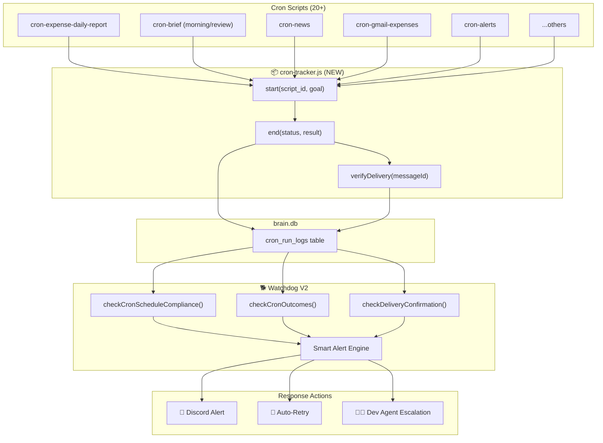

# 🐕 Watchdog V2 — Cron Outcome Monitoring & Auto-Remediation

## 📍 Background

ระบบ Watchdog V1 (V3.2.0) ทำหน้าที่ตรวจ **ภาพรวมของระบบ**: PM2 process status, API health, Doctor Skill pipeline queue — แต่ **ไม่ได้ลงลึกถึงผลลัพธ์ของแต่ละ Cron Job**

ตัวอย่างปัญหาที่เพิ่งเกิดขึ้น: `cron-expense-daily-report` ตาย 3 วัน (9-11 เม.ย.) เพราะ API endpoint พ่น 500 → Watchdog ไม่รู้เรื่องเลย เพราะ:
1. API health check ยิงแค่ `/api/health` (ซึ่งผ่าน) ไม่ได้เช็คทุก endpoint
2. Cron scripts ไม่เคยรายงานผลลัพธ์กลับเข้าระบบ — มันจบตัวเอง (`process.exit`) โดยไม่ทิ้งร่องรอย
3. ไม่มีการตรวจสอบว่า "ข้อความส่งถึง User จริงหรือเปล่า?"

---

## 🏗️ System Analysis: ปัจจุบัน vs. เป้าหมาย

### ปัจจุบัน (V1)
```
Cron Script → runs → success/fail → log to /tmp file → nobody reads
Watchdog   → every 15m → checks PM2 + /api/health + DB queries
```

### เป้าหมาย (V2)
```
Cron Script → CronTracker.start() → runs logic → CronTracker.end(result)
                                                       ↓
                                              writes to cron_run_logs table
                                                       ↓
Watchdog → every 15m → reads cron_run_logs → checks:
  1. ✅ Did each expected cron fire today?
  2. ✅ Did it succeed? (exit code + result)
  3. ✅ Did the message reach Discord? (delivery_confirmed)
  4. ❌ If failed → smart alert + escalate to Dev Agent
```

---

## 🚀 Proposed Architecture



---

## 🛠️ Implementation Requirements

### Component 1: `cron-tracker.js` (NEW)
Lightweight wrapper ที่ทุก cron script import มาใช้:

```javascript
import { CronTracker } from '../utils/cron-tracker.js';

const tracker = new CronTracker('cron-expense-daily-report', {
  goal: 'Generate and deliver daily expense summary to Discord',
  expectedSchedule: '55 23 * * *',
});

await tracker.start();
try {
  // ... existing logic ...
  await tracker.end('success', { summary: `...`, deliveryCount: sent });
} catch (err) {
  await tracker.end('failed', { error: err.message, stage: 'api-fetch' });
  process.exit(1);
}
```

### Component 2: DB Schema (`command-center.js`)
เพิ่มตาราง `cron_run_logs` เพื่อเก็บข้อมูลทุกครั้งที่ Cron ทำงาน รวมถึงผลลัพธ์ เวลาที่ใช้ และสาเหตุที่ Error

### Component 3: `cron-schedule.js` & `goals.js` (WATCHDOG UPGRADE)
เพิ่ม Goal ประเภทใหม่ๆ ให้ Watchdog ตรวจสอบ:
- `cron-schedule-check`: มาตามนัดไหม
- `cron-outcome-check`: รอดหรือร่วง
- `cron-delivery-check`: ไปถึง User จริงไหม
- `http-get` แบบเจาะลึกเฉพาะ endpoint สำคัญๆ 

### Component 4: Smart Alert & Escalation
- ครั้งแรกให้เตือนพร้อมแนบ root cause
- หายแล้วมี Recovery Notification!
- ถ้ารันซ้ำพังเกิน Limit จะถูกโยนความรับผิดชอบไปที่ช่อง `#dev-agent` โดยอัตโนมัติ พร้อมบริบทให้ทำงานต่อได้ทันที

---

## 📅 Roadmap / Task List
- [x] สถาปนา `cron_run_logs` DB Schema
- [x] เขียน `cron-tracker.js` 
- [x] แก้ Watchdog Goals + Reporter (Dev Agent Escalate)
- [x] ห่อหุ้ม `cron-xxx.js` ทั้ง 7-8 scripts สำคัญให้ใช้ Tracker
- [x] Deploy และ Monitor วันแรก


<!-- GBRAIN_BACKLINKS_START -->
## 🔗 GBRAIN Backlinks

### related_to
- **2026-04-22 07:31** | [V4.2.2_[hotfix]_cc-undeclared-vars-500](V4.2.2_[hotfix]_cc-undeclared-vars-500.md) -- Shared tags: watchdog
- **2026-04-22 07:31** | [V5.3.0_[impl]_hydra-system-recovery-and-optimization](../V5/V5.3.0_[impl]_hydra-system-recovery-and-optimization.md) -- Shared tags: watchdog
- **2026-04-22 07:31** | [V5.4.3_[hotfix]_hydra-inspector-noise-reduction](../V5/V5.4.3_[hotfix]_hydra-inspector-noise-reduction.md) -- Shared tags: watchdog
- **2026-04-22 07:31** | [V6.5.0_[impl]_watchdog-selfhealing-and-fast-edit](../V6/V6.5.0_[impl]_watchdog-selfhealing-and-fast-edit.md) -- Shared tags: watchdog
- **2026-04-22 07:31** | [V6.5.1_[hotfix]_cron-auto-planner-false-alarms](../V6/V6.5.1_[hotfix]_cron-auto-planner-false-alarms.md) -- Shared tags: watchdog
- **2026-04-22 07:31** | [V6.7.0_[impl]_hydra-speedmode-watchdog-ui](../V6/V6.7.0_[impl]_hydra-speedmode-watchdog-ui.md) -- Shared tags: watchdog
- **2026-04-22 07:31** | [V6.7.2_[hotfix]_watchdog-today-locale-fix](../V6/V6.7.2_[hotfix]_watchdog-today-locale-fix.md) -- Shared tags: watchdog
- **2026-04-22 07:31** | [V7.5.1_[impl]_hydra_auto-audit-watchdog-digest-widget](../V7/V7.5.1_[impl]_hydra_auto-audit-watchdog-digest-widget.md) -- Shared tags: watchdog, monitoring
<!-- GBRAIN_BACKLINKS_END -->
