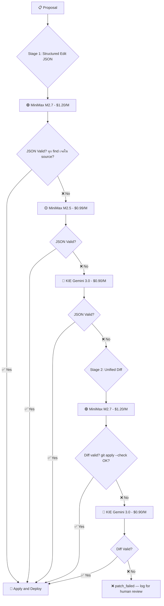

# 🔬 Hydra System Fix Plan (v6 Final)

## Part A — Permission Tiers (Corrected)

| Tier | Level | Files | Policy |
|------|-------|-------|--------|
| **Tier A** 🟢 | Full Auto | `scripts/*.js` (ยกเว้น meta-agents), `scripts/watchdog/*`, `config/*.json`, **ไฟล์ใหม่** | Evolver deploy เลย ไม่ต้องรอ |
| **Tier B** 🟡 | Auto + Validation | `discord-bot/scripts/*.js`, `discord-bot/utils/*.js` | Deploy ได้ + syntax check + dry-run + 5min monitor |
| **Tier S** 🔴 | AG Handles | `scripts/hydra/*.js`, `discord-bot/config/*.js`, `discord-bot/index.js` | Flag HIGH → `awaiting_human` → AG จัดการ |
| **Tier X** ⛔ | Never | `routes/*.js`, `brain-app-public/*`, `.env`, `*.sql`, `*.md` (system) | ห้ามเสนอด้วยซ้ำ |

```js
function classifyFileRisk(filePath) {
    const b = filePath.replace(/\\/g, '/');
    
    // Tier X: NEVER
    if (b.startsWith('routes/')) return 'BLOCKED';
    if (b.startsWith('brain-app-public/')) return 'BLOCKED';
    if (b.endsWith('.sql') || b === '.env') return 'BLOCKED';
    if (b.endsWith('.md') && !b.startsWith('config/')) return 'BLOCKED';
    
    // Tier S: AG Only → flag HIGH
    if (b.startsWith('scripts/hydra/')) return 'HIGH';
    if (b.startsWith('discord-bot/config/')) return 'HIGH';
    if (b === 'discord-bot/index.js') return 'HIGH';
    
    // Tier B: Auto + Extra Validation
    if (b.startsWith('discord-bot/scripts/')) return 'MEDIUM';
    if (b.startsWith('discord-bot/utils/')) return 'MEDIUM';
    
    // Tier A: Full Auto
    if (b.endsWith('.js') || b.endsWith('.json')) return 'SAFE';
    
    return 'BLOCKED'; // unknown = block
}
```

---

## Part B — 🤖 Evolver AI Model Recommendation

### ข้อมูลราคาและคุณภาพ (เมษายน 2026)

| Model | Provider | Input $/M | Output $/M | SWE-bench | Diff Quality | Availability |
|-------|----------|-----------|------------|-----------|-------------|-------------|
| **DeepSeek V3.2** | OpenRouter | **$0.14** | **$0.42** | ~73-75% | ✅ Good structured output, 128K context | ✅ Stable |
| MiniMax M2.5 **Free** | OpenRouter | $0 | $0 | 80.2% | ❌ Rate limit 429 ทุกครั้ง | ❌ Unreliable |
| **MiniMax M2.5 Paid** | OpenRouter | $0.30 | **$0.99** | **80.2%** | ✅ SWE-bench #1 tier | ✅ Stable |
| **MiniMax M2.7** | OpenRouter | $0.30 | **$1.20** | **SWE-Pro 56.2%, Terminal 57%** | ✅✅ Recursive self-optimization | ✅ Stable |
| Qwen3 Coder 30B | OpenRouter | $0.07 | $0.27 | ~70% | ⚠️ Corrupt patches บ่อย | 🟡 |
| KIE Gemini 2.5 Flash | KIE Direct | ~$0.10 | $0.75 | ~63% | 🟡 Ok-ish | ❌ 503 ตอนนี้ |
| KIE Gemini 3.0 Flash | KIE Direct | ~$0.12 | $0.90 | **~78%** | ✅ Much better | 🟡 ไม่เสถียร |
| KIE Claude Sonnet 4-6 | KIE Direct | ~$1.05 | $5.25 | ~79.6% | ✅✅ สุดยอด | ✅ Stable (แพง) |

### 📊 วิเคราะห์ตัวเลือก

#### MiniMax M2.7 vs M2.5 — ควรใช้ตัวไหน?

| | M2.5 | M2.7 |
|---|---|---|
| ราคา | $0.30/**$0.99** | $0.30/**$1.20** (แพงกว่า ~$0.21) |
| SWE-bench Verified | **80.2%** | ❓ (ใช้ benchmark ชุดใหม่: SWE-Pro 56.2%) |
| Key Feature | Proven coding, 80.2% SWE | **Recursive self-optimization** — agentic workflows |
| Context | 1M tokens | 204,800 tokens |
| Release | Late 2025 | **March 2026** (ใหม่กว่า) |

> **คำตอบ:** M2.7 แพงกว่าเล็กน้อย (+$0.21/M) แต่ **ใหม่กว่า + ออกแบบมาสำหรับ agentic code editing** → ใช้ M2.7 เป็น Tier 2, ถ้า fail → M2.5 เป็น fallback (ถูกกว่า + SWE-bench สูงกว่า) ก็ได้

#### ทำไม Quality-First ดีกว่า Cheapest-First?

| | Cheapest-First (DeepSeek) | Quality-First (MiniMax) |
|---|---|---|
| Cost per call (~6K tokens) | $0.0025 | $0.0072 |
| **ต่างกันต่อเดือน** | | **แค่ $0.57** |
| Success rate (first try) | ~70% | **~90%+** |
| Retry needed | บ่อย → เสีย token ฟรี + เสียเวลา | น้อย → จบไว |
| Code complexity | ต้อง handle retry มาก | เรียบง่ายกว่า |

> [!TIP]
> **สรุป:** ราคาต่างแค่ **57 สตางค์/เดือน** — ไม่คุ้มที่จะเสี่ยง fail แล้วต้อง retry
> ยิงตัวเก่งก่อน → สำเร็จรอบแรก → จบไว ไม่เสียเวลา

---

### 🏆 Model Strategy: Quality-First (Best Practice)

```
Tier 1: MiniMax M2.7 ($0.30/$1.20) ← BEST, ยิงก่อน
  ├── SWE-Pro 56.2% + Recursive Self-Optimization
  ├── ใหม่สุด (March 2026) ออกแบบสำหรับ agentic coding
  ├── Success rate สูง → จบรอบแรกส่วนใหญ่
  └── Output $1.20/M — ยังถูกมาก (< $1/เดือน)

Tier 2: MiniMax M2.5 ($0.30/$0.99) ← PROVEN BACKUP (same provider)
  ├── SWE-bench 80.2% — proven track record
  ├── ถูกกว่า M2.7 ($0.21/M)
  ├── Same provider (OpenRouter) → switch เร็ว ไม่มี latency เพิ่ม
  └── ใช้เมื่อ M2.7 fail

Tier 3: KIE Gemini 3.0 Flash ($0.12/$0.90) ← DIFFERENT PROVIDER
  ├── SWE-bench 78% — ดีกว่า 2.5 Flash มาก
  ├── KIE = ต่าง provider กัน = safety net
  └── ใช้เมื่อ OpenRouter ทั้งระบบล่ม
```

### 💰 Cost Estimate (Quality-First)

Evolver รัน 4x/วัน, output เฉลี่ย ~6,000 tokens/run:

| Scenario | Model Used | Output $/M | Cost/วัน | Cost/เดือน |
|----------|-----------|-----------|----------|------------|
| **Normal (85%)** | MiniMax M2.7 | $1.20 | $0.029 | **$0.87** |
| Fallback (10%) | MiniMax M2.5 | $0.99 | $0.024 | $0.71 |
| Emergency (5%) | KIE Gemini 3.0 | $0.90 | $0.022 | $0.65 |
| **Weighted** | | | | **~$0.84/เดือน** |

> [!TIP]
> **~$0.84/เดือน** — ยังถูกมาก!
> เทียบกับ Cheapest-First ($0.42/เดือน) ต่างแค่ ~$0.42 แต่ได้ success rate สูงกว่ามาก
> เทียบกับเดิม (MiniMax Free = ฟรีแต่ใช้ไม่ได้ = 0% success = ≈$∞ ต่อ successful deploy)

---

## Part C — 🔧 Complete Retry & Escalation System

### ปัญหาปัจจุบัน: ไม่มี retry logic ที่แท้จริง

```
ปัจจุบัน (evolver.js lines 97-158):
  ✅ มี: Model fallback เมื่อ HTTP error (429/503/timeout)
  ❌ ไม่มี: Retry เมื่อ patch corrupt (AI ตอบแต่ diff ผิดรูปแบบ)
  ❌ ไม่มี: Strategy fallback (Structured JSON → Unified Diff)
  ❌ ไม่มี: Validation ก่อน apply
  
  ผลลัพธ์: AI ตอบมา → เอาไป git apply ทันที → fail → จบ ไม่ลองใหม่
```

### ระบบใหม่: Quality-First Escalation



### Flow อธิบายเป็นขั้นตอน

| Step | Strategy | Model | Cost | เมื่อไหร่ถึง step นี้ | หยุดเมื่อ |
|------|----------|-------|------|---------------------|----------|
| **1** | Structured Edit JSON | **MiniMax M2.7** | $1.20/M | **เริ่มที่นี่เสมอ (ตัวเก่งสุด)** | ✅ JSON valid + find ตรง |
| **2** | Structured Edit JSON | MiniMax M2.5 | $0.99/M | M2.7 JSON ไม่ valid | ✅ JSON valid + find ตรง |
| **3** | Structured Edit JSON | KIE Gemini 3.0 | $0.90/M | M2.5 ก็ fail (OpenRouter issue?) | ✅ JSON valid + find ตรง |
| **4** | Unified Diff | **MiniMax M2.7** | $1.20/M | **JSON edit ทำไม่ได้** (change ซับซ้อน) | ✅ diff valid + apply OK |
| **5** | Unified Diff | KIE Gemini 3.0 | $0.90/M | M2.7 diff corrupt | ✅ diff valid + apply OK |
| **6** | — | — | — | **ทุกอย่าง fail** | ❌ `patch_failed` → log → หยุด |

### Validation Gates (ด่านตรวจสอบ)

| Gate | Structured Edit JSON | Unified Diff |
|------|---------------------|-------------|
| **Format** | Parse เป็น JSON ได้ | มี `--- a/` + `+++ b/` + `@@ ` headers |
| **Content** | ทุก `find` string ต้องเจอใน source file จริง | `git apply --check` ผ่าน (dry-run) |
| **Safety** | Replace result ≠ empty file, file size ไม่เปลี่ยนเกิน 50% | Patch ไม่แก้เกิน 50 lines |
| **Syntax** | `node -c file.js` pass | `node -c file.js` pass |

### Circuit Breakers (ป้องกัน cost runaway)

```
Per Proposal:
  max_ai_calls = 5        # ลองได้ไม่เกิน 5 ครั้งต่อ proposal  
  max_tokens_spend = 50K   # ถ้าใช้ไป 50K tokens แล้วยังไม่สำเร็จ → หยุด

Per Run (4x/day):
  max_proposals = 3        # ทำได้ไม่เกิน 3 proposals ต่อรอบ
  max_total_calls = 10     # ไม่เกิน 10 AI calls ต่อรอบ

Per Day:
  max_deploys = 3          # (มีอยู่แล้ว)
  max_rollbacks = 2        # (มีอยู่แล้ว) → หยุด 24 ชม.
```

### Implementation ใน evolver.js (Pseudocode)

```js
const MODELS = {
    m27:    { name: 'MiniMax M2.7', model: 'minimax/minimax-m2.7', 
              url: 'openrouter', cost: 1.20 },
    m25:    { name: 'MiniMax M2.5', model: 'minimax/minimax-m2.5', 
              url: 'openrouter', cost: 0.99 },
    gemini: { name: 'KIE Gemini 3.0', model: 'gemini-3.0-flash', 
              url: 'kie', cost: 0.90 }
};

async function generateAndApply(proposal, sourceCode) {
    let totalCalls = 0;
    const MAX_CALLS = 5;
    
    // ═══════════════════════════════════════════
    // Stage 1: Structured Edit JSON (quality-first)
    // ═══════════════════════════════════════════
    for (const model of [MODELS.m27, MODELS.m25, MODELS.gemini]) {
        if (totalCalls >= MAX_CALLS) break;
        totalCalls++;
        
        console.log(`[Evolver] Stage 1 (JSON Edit) → ${model.name}...`);
        
        try {
            const response = await callAI(model, buildJsonEditPrompt(proposal, sourceCode));
            const edits = parseJsonEdits(response);
            
            // Validate: ทุก find ต้องเจอใน source
            const validation = validateEdits(edits, sourceCode);
            if (!validation.ok) {
                console.warn(`[Evolver] JSON validation failed: ${validation.error}`);
                continue; // → ลอง model ถัดไป
            }
            
            // Apply edits
            const newContent = applyEdits(edits, sourceCode);
            
            // Syntax check
            if (!syntaxCheckContent(proposal.file, newContent)) {
                console.warn(`[Evolver] Syntax check failed after edit`);
                continue; // → ลอง model ถัดไป
            }
            
            return { success: true, content: newContent, strategy: 'json_edit', model: model.name };
        } catch (e) {
            console.warn(`[Evolver] ${model.name} error: ${e.message}`);
            continue; // HTTP error → ลอง model ถัดไป
        }
    }
    
    // ═══════════════════════════════════════════
    // Stage 2: Unified Diff (ซับซ้อน แพงกว่า)
    // ═══════════════════════════════════════════
    for (const model of [MODELS.m27, MODELS.gemini]) {  // ตัวเก่งก่อน แล้ว fallback ต่าง provider
        if (totalCalls >= MAX_CALLS) break;
        totalCalls++;
        
        console.log(`[Evolver] Stage 2 (Unified Diff) → ${model.name}...`);
        
        try {
            const response = await callAI(model, buildDiffPrompt(proposal, sourceCode));
            const patch = extractPatch(response);
            
            // Validate: must have proper diff headers
            if (!validateDiffHeaders(patch)) {
                console.warn(`[Evolver] Diff missing headers`);
                continue;
            }
            
            // Dry-run: git apply --check
            if (!dryRunPatch(patch)) {
                console.warn(`[Evolver] git apply --check failed`);
                continue;
            }
            
            return { success: true, patch: patch, strategy: 'unified_diff', model: model.name };
        } catch (e) {
            console.warn(`[Evolver] ${model.name} error: ${e.message}`);
            continue;
        }
    }
    
    // ═══════════════════════════════════════════
    // ทุกอย่าง fail → log for human review
    // ═══════════════════════════════════════════
    console.error(`[Evolver] All ${totalCalls} attempts failed for ${proposal.proposal_id}`);
    return { success: false, totalAttempts: totalCalls };
}
```

### Structured Edit JSON Format

```json
{
  "edits": [
    {
      "find": "status IN ('scheduled','ready','in-process','published')",
      "replace": "status IN ('planned','scheduled','ready','in-process','published','produced','scripted')"
    }
  ]
}
```

---

## Part D — 📋 Full Action Plan

### Phase 1: Clean Up DB

```sql
UPDATE evolution_log SET status = 'rejected' WHERE status IN ('proposed','approved','awaiting_human');
UPDATE evolution_log SET status = 'resolved' WHERE status = 'ideated';
DELETE FROM watchdog_logs WHERE status = 'FAIL' AND timestamp < datetime('now', '-1 day', 'localtime');
```

### Phase 2: Fix 7 Items

- [x] 1. `scripts/watchdog/goals.js` | เพิ่ม `'planned','produced','scripted'` ใน status check
- [x] 2. `scripts/api-clients.js` | `callDoctorSkill()` → 3-tier: Qwen 72B → QwQ 32B → Gemini Flash
- [x] 3. `scripts/cron-auto-planner.js` | Candidate DB paths
- [x] 4. `scripts/hydra/evolver.js` | Fix SQL + **Structured Edit JSON** + Quality-First 3-tier (**MiniMax M2.7→M2.5→Gemini 3.0**) + 4-tier permission (`classifyFileRisk`)
- [x] 5. `scripts/hydra/ideator.js` | ลบ hard-block → force HIGH + dedup + enriched context loader
- [x] 6. `scripts/hydra/inspector.js` | Fix `affected_component` paths + เพิ่ม context fields
- [x] 7. `config/system-map.md` **[NEW]** | Static architecture map

### Phase 3: Deploy & Verify
- [x] 1. `git push vps`
- [x] 2. Run auto-planner → content scheduled
- [x] 3. Run watchdog → no false alerts
- [x] 4. Run inspector → rich findings
- [x] 5. Run ideator → proposals with correct file targets
- [x] 6. Run evolver → **Structured Edit JSON applies cleanly**
- [x] 7. Monitor 1 cycle

### Summary: Model Cost Comparison

| Component | Current Model | New Model | Monthly Cost |
|-----------|--------------|-----------|-------------|
| **Auto-Planner** | KIE Gemini 2.5 Flash (503!) | Qwen 72B → QwQ 32B → Gemini Flash | ~$0.50 |
| **Inspector** | SQL 80% + Gemini Flash | No change | ~$0.20 |
| **Ideator** | Qwen 72B → QwQ 32B | No change (context fix is key) | ~$1.00 |
| **Evolver** | MiniMax Free (429!) | **MiniMax M2.7 → M2.5 → Gemini 3.0 Flash** | ~$0.84 |
| **Total** | | | **~$2.54/เดือน** |

---

## Part E — 🔍 Post-Ship Recheck Findings (Conversation: be665ef2)

> ทำ `/recheck` หลัง deploy สำเร็จ — พบและแก้ 3 bugs เพิ่มเติม

### Bug 1 (CRITICAL): ESM Smoke Test ใช้ `require()` — fail 100% ทุก patch

**Root Cause:** `functionalSmokeTest()` ใน `evolver.js` ใช้ `require()` เพื่อ load module หลัง apply patch แต่ brain-app ทั้งระบบเป็น ES Modules (`import`/`export`) — `require()` throw `ERR_REQUIRE_ESM` เสมอ ทำให้ทุก patch ถูก reject แม้ code จะถูกต้องสมบูรณ์

**ผลกระทบ:** ทั้ง Stage 1 (JSON Edit) และ Stage 2 (Unified Diff) fail ทุกครั้ง → Evolver success rate = 0% โดยพฤตินัย

**Fix ที่ทำ:**
```js
// BEFORE (broken — always fails on ESM)
execSync(`node -e "const m = require('${absPath}'); ..."`, { ... });

// AFTER (correct — uses dynamic import() via module stdin)
const fileUrl = `file://${absPath.replace(/\\/g, '/')}`;
const testScript = `import('${fileUrl}').then(() => { process.exit(0); }).catch(e => {
  if (e instanceof SyntaxError) { process.stderr.write('SYNTAX_FAIL: ' + e.message); process.exit(1); }
  process.exit(0); // runtime error = acceptable
});`;
execSync(`node --input-type=module`, { input: testScript, stdio: ['pipe','pipe','pipe'] });
```

**Logic:** Exit normally = module loads OK; `SYNTAX_FAIL` in stderr = real syntax error = reject patch. Runtime errors (missing DB/env) = module loaded fine = pass.

### Bug 2: DB Evolution Log มี stale records ค้าง

**Root Cause:** Phase 1 Clean Up (SQL) ล้มเหลวเพราะ SSH PowerShell quoting hell — `<` operator blocked, backtick quoting stripped.

**Fix:** สร้าง `scripts/db-cleanup-stale.mjs` — Node.js script รันผ่าน `node` โดยตรงบน VPS:
```
[cleanup] Resolved 19 ideated records
[cleanup] Rejected 2 stale proposed records  
[cleanup] Deleted 1134 old FAIL watchdog logs
```

**Anti-pattern learned:** ห้ามส่ง multi-statement SQL ผ่าน SSH PowerShell — ใช้ Node script แทนเสมอ

### Bug 3: `skill-emit.jsonl` มี corrupt UTF-16 LE lines

**Root Cause:** Lines 16-17 ถูก write ด้วย UTF-16 LE encoding (null byte ทุกตัวอักษร) ทำให้ JSON parse ล้มเหลว

**Fix:** Python script ตรวจ null byte density → decode UTF-16 LE → validate JSON → rewrite เป็น UTF-8 สะอาด
- Result: 15 valid lines (2 corrupt lines strip ออก, 1 duplicate เหลือ 1)

### Anti-patterns เพิ่มเติมที่ค้นพบ

| Anti-pattern | ทำไมถึงพัง | แนวทางที่ถูก |
|---|---|---|
| `require()` smoke-test ESM files | `ERR_REQUIRE_ESM` เสมอ | `node --input-type=module` + `import()` |
| Multi-statement SQL via SSH PowerShell | Quote hell, `<` operator blocked | เขียน `.mjs` script แล้ว `node` รันตรง |
| Assume SSH double-quote wrapping works | PowerShell strips/interprets backticks | ใช้ heredoc หรือ script file แทน |
| Write skill-emit.jsonl from Windows editor | อาจ save เป็น UTF-16 LE | Always write via Node/Python append, ไม่ใช่ VS Code direct |
