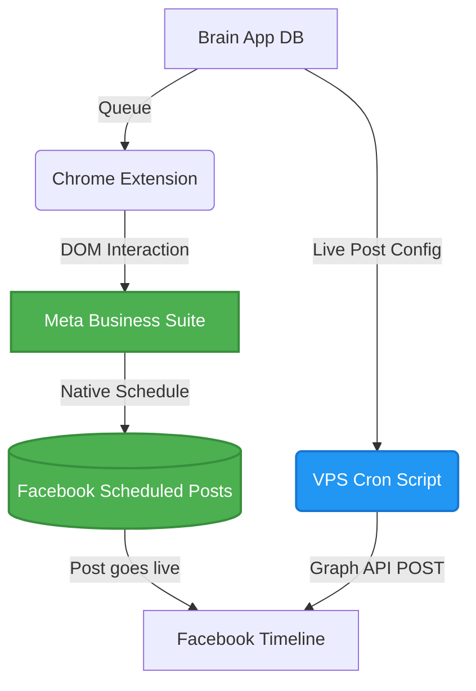

# 🤖 Hybrid Facebook Automation Architecture (Native Schedule + API Comments)

## 📌 Context
Boss wants to automate Facebook Page posting across two channels:
- **Channel 1:** Text post + Native colored background + 1-10 auto-comments + Native schedule post
- **Channel 2:** Reel + 1-10 auto-comments + Native schedule post

The goal is to maintain the "Native" post appearance (which yields better engagement) without relying on third-party API tags (e.g., "Published by Make.com"), while keeping the system stable and immune to basic Facebook anti-bot measures.

## 🛠️ The Evaluated Approaches

### 1. Browser-Use (LLM-Driven)
- ❌ Highly unreliable due to complex and frequently changing Facebook DOM.
- ❌ Expensive (LLM token costs for every step).
- ❌ Very slow and fragile.

### 2. Undocumented Graph API (`text_format_preset_id`)
- ⚠️ Allows colored backgrounds via API, but limited to 130 characters.
- ⚠️ Post is flagged as published by an App (not native).

### 3. Camoufox + Playwright (Scripted)
- ⚠️ Good for avoiding detection, but requires maintaining UI selectors.
- ⚠️ Has a monthly cost for residential proxies.
- ⚠️ Requires running a headful browser environment on the VPS.

### 4. Perplexity Comet Browser
- ❌ It is an "agentic browser" for manual instruction, but lacks public APIs for programmatic control or headless cron-based scheduling. It still requires a human sitting at the computer to issue commands.

## 🏆 The Chosen Solution: Hybrid Extension + API

This approach separates the workflow into two highly reliable phases, maximizing native appearance while minimizing maintenance and cost.

### Architecture Overview



### Phase 1: Batch Scheduling (Chrome Extension)
Instead of fighting Facebook's volatile main UI or setting up expensive VPS browsers, we build a Chrome Extension that runs on the Boss's actual logged-in browser. 

1. **Trigger:** Boss opens the Extension popup and clicks "Schedule All".
2. **Data Fetch:** Extension polls `/api/content/queue` on the Brain App VPS.
3. **Execution:** The Extension opens `business.facebook.com` (Meta Business Suite - which has a much more stable DOM than `facebook.com`).
4. **DOM Manipulation:** The Content Script simulates user actions:
   - Clicks "Create Post".
   - Selects the target colored background (for text posts) or uploads the video (for Reels).
   - Injects the caption text (using React-compatible `dispatchEvent`).
   - Interacts with the native Date/Time picker to set the schedule.
   - Clicks Submit.
5. **Result:** The post is natively scheduled. Zero proxy cost, zero ban risk, 100% native reach.

### Phase 2: Auto-Commenting (Graph API)
Once the post is natively scheduled, we don't need a browser to comment. Comments do not affect the "native" status of the parent post.

1. **Trigger:** A cron job on the VPS (`cron-fb-post.js` or similar) runs every 5 minutes.
2. **Check:** Queries the DB for posts that have passed their `scheduled_at` time but haven't been commented on.
3. **Execution:** Uses the official Meta Graph API to `POST /{post-id}/comments`.
4. **Loop:** Injects a 5-10 second delay between each of the 1-10 comments to avoid rate limits.
5. **Result:** Fast, 100% reliable, zero DOM maintenance, runs headless without opening a computer.

## 📌 Implementation Status (Chrome Extension Approach)
- [x] Scraped and documented "Dr. Jade" post format
- [x] Seeded 5 test posts into `fb_post_queue`
- [x] Built Chrome Extension (Manifest, Popup, Content Script)
- [x] Extracted robust XPaths for Business Suite (`content_calendar`)
- [x] Refined selector logic to support bilingual (TH/EN) interfaces

---

## 🔄 Changelog: Architectural Pivot to PageClaw (Delegated Token Strategy)

*Date: 2026-04-23*

### 🚨 The Problem with DOM Automation
Despite building a robust, bilingual DOM traversal engine with XPaths for the Chrome Extension, browser automation via UI interacting remains inherently fragile:
- Meta continuously obfuscates class names and DOM structures.
- Requires the user to keep the browser running and actively focused on the Planner tab.
- High risk of silent failures if Facebook rolls out a new UI experiment.

### 💡 The Pivot (Custom FB Developer App)
The user provided access to a custom **FB Developer App**, an already-approved Meta Developer App created by "Mew Social". 
By accepting a Developer Invitation to this app, the user inherits the app's verified status, allowing them to easily generate a **Long-lived Page Access Token** and an **Instagram Account ID**.

This eliminates the need for the Make.com proxy and the Chrome Extension altogether. We revert to the industry standard, pure **Graph API integration**.

### 🛠️ Updates Made
1. **Database Schema:** `ALTER TABLE fb_channels ADD COLUMN ig_account_id TEXT;` (and utilized the existing `page_token` column).
2. **Frontend UI (`config.js`):** Replaced the "Make.com Webhook URL" input field with inputs for `FB App Page Token` and `IG Account ID (Optional)`.
3. **Backend Route (`routes/fb-queue.js`):** Updated `POST /channels` and `PUT /channels/:id` to accept and store the new token fields.
4. **Publishing Engine (`scripts/cron-fb-graph-post.js`):** Created a new cron worker that directly hits `graph.facebook.com/v19.0/{page_id}/feed|photos|videos` using the App's page_token. Upon success, it updates `status = 'live'`, natively triggering the existing `cron-fb-autocomment.js` pipeline.
5. **Commenting Engine (`scripts/cron-fb-autocomment.js`):** Rewrote the script to use Graph API instead of the deprecated Make.com webhook. The script now reads `page_token` instead of `webhook_url` and uses `POST /v19.0/{fb_post_id}/comments` to automatically publish comments. Registered in the VPS crontab to run every 5 minutes.

### 📦 RAW ARTIFACT BACKUP
<details>
<summary>FB Developer App Documentation provided by User</summary>
แอบยากแฮะ เด๊่ยวเปลี่ยนแผนมาใช้ app id แทน พอดีไปเจอระะบบที่ไปลงคอร์สเขาทำมาพอดี น่าจะเป็นตัวกลางคล้ายๆ make 

วิธีการการเชื่อมให้โพสลง Facebook + IG อัตโนมัติ

ผมได้ทำระบบในการขอ Token ของ Facebook + IG เพื่อส่งให้ Openclaw โพสอัตโนมัติ สามารถทำตามขั้นตอนด้านล่างนี้ได้เลยครับ

หมายเหตุ ระบบนี้ยังไม่ได้เปิด Public นร ที่จะใช้งานต้องส่ง Facebook username (ส่วนตัว) มาให้ผมทาง Inbox นะครับเพื่อที่ผมจะได้เพิ่มสิทธิ์ให้สามารถใช้งานระบบได้ ตัวอย่าง username เฟสบุคผม Facebook.com/MewIC username = mewic เป็นต้น

=============

📋 คู่มือใช้งาน PageClaw

เครื่องมือโพส Facebook + Instagram อัตโนมัติด้วย AI

สำหรับนักเรียน Mew Social

──────────────────────────────────────────────────

🔰 ขั้นตอนเตรียมตัวก่อนคลาส (ทำ 1 ครั้ง)

Step 1: สมัคร Facebook Developer Account

1. เข้า https://developers.facebook.com

2. กด "Get Started" หรือ "เริ่มต้นใช้งาน"

3. Accept Terms → เสร็จ!


Step 2: แจ้งชื่อ Facebook ให้อาจารย์

ส่ง "ชื่อ Facebook Profile" ของคุณ (ชื่อที่แสดงบน Facebook) ให้อาจารย์มิว เพื่อเพิ่มคุณเข้าระบบ (ส่งมาให้ผมทาง Inbox)

Step 3: Accept Invitation

หลังจากอาจารย์เพิ่มแล้ว:

1. เข้า https://developers.facebook.com/settings/developer/requests/

2. จะเห็น invitation จาก PageClaw

3. กด "Accept"

หรือดูที่ 🔔 Notifications ใน Facebook

──────────────────────────────────────────────────

🚀 วิธีใช้งาน PageClaw

Step 1: Login

1. เข้า https://pageclaw.mewsocial.com

2. กด "Login with Facebook"

3. อนุญาตสิทธิ์ที่ระบบขอ (จัดการเพจ, โพสต์, Instagram)

Step 2: เลือกเพจ

1. ระบบจะแสดงรายชื่อเพจ Facebook ที่คุณเป็น Admin

2. เลือกเพจที่ต้องการใช้งาน

3. ถ้ามี Instagram Business Account เชื่อมกับเพจ → จะเห็น IG ด้วย

Step 3: ตั้งค่า Token

1. หลังเลือกเพจ ระบบจะสร้าง Page Access Token ให้อัตโนมัติ

2. Token นี้คือ "กุญแจ" สำหรับโพสต์ผ่าน API

3. เก็บ Token ไว้ใช้กับ OpenClaw หรือเครื่องมือ AI อื่นๆ

──────────────────────────────────────────────────

🔧 การนำ Token ไปใช้กับ OpenClaw

วิธีที่ 1: ใส่ใน .env

FB_PAGE_ID=ใส่_Page_ID_ที่ได้

FB_PAGE_TOKEN=ใส่_Token_ที่ได้

IG_ACCOUNT_ID=ใส่_IG_ID_ที่ได้ (ถ้ามี)

IG_PAGE_TOKEN=ใส่_Token_เดียวกัน

วิธีที่ 2: ใส่ใน OpenClaw Config

ใส่ค่าเดียวกันใน config ของ OpenClaw → ระบบ AI จะโพสต์ให้อัตโนมัติ

วิธีที่ 2 : ส่ง Token ให้ทางแชทที่คุยกับ Openclaw ตรง

──────────────────────────────────────────────────

🤖 สิ่งที่ PageClaw + OpenClaw ทำได้

✅ โพสต์ Facebook (ข้อความ + รูป + วิดีโอ + Reels)

✅ โพสต์ Instagram (รูป + Reels)

✅ AI สร้าง Content + รูป + Caption อัตโนมัติ

✅ ตั้ง Cron Schedule โพสต์ตามเวลา

✅ Tracking Link วัดผลทุกโพสต์

──────────────────────────────────────────────────

❓ FAQ

Q: Login ไม่ได้ เห็น "ฟีเจอร์ไม่พร้อมใช้งาน"

A: ยังไม่ได้ทำ Step 1-3 ด้านบน — ต้องสมัคร Developer Account + ได้รับ Invite + Accept แล้วเท่านั้น

Q: ไม่เห็นเพจของตัวเอง

A: ต้องเป็น Admin ของเพจนั้น (ไม่ใช่แค่ Editor) ถึงจะเห็น

Q: Token หมดอายุมั้ย?

A: PageClaw ออก Long-lived Token ให้ (60 วัน+) ถ้าหมดอายุ Login ใหม่ก็ได้ Token ใหม่

Q: ปลอดภัยมั้ย?

A: Token เก็บไว้ในเครื่องของคุณเท่านั้น PageClaw ไม่เก็บข้อมูลบน server
</details>

## 🌐 GBRAIN Backlinks
- [[API Security Protocols]]
- [[Content Strategy - Automation]]

## 📦 RAW ARTIFACT BACKUP

<details>
<summary>Click to expand Full Conversation & Raw Data Backup (100% Unabridged)</summary>

### USER REQUEST 1:
สร้าง Agent ที่เปิด browser แล้วโพสต์ลง Facebook Page โดยอัตโนมัติ พร้อม:
- ✅ Text post + Native colored background
- ✅ Native schedule post (ตั้งเวลาโพสต์)
- ✅ ยิง 1–10 comments อัตโนมัติหลังโพสต์ live
(Stack: browser-use, Playwright, AntiGravity, Python)

```python
import asyncio
from browser_use import Agent
from langchain_google_genai import ChatGoogleGenerativeAI

POST_TEXT      = "{{post_text}}"
BG_COLOR       = "{{bg_color}}"
SCHEDULE_TIME  = "{{schedule_time}}"
PAGE_URL       = "{{page_url}}"
COMMENTS       = {{comments_list}}

TASK = f"""
คุณเป็น Facebook Page Manager ทำตามลำดับ:
1. เปิด {PAGE_URL}
2. คลิก Create Post
3. เลือก background color: {BG_COLOR}
4. พิมพ์: {POST_TEXT}
5. ตั้ง schedule: {SCHEDULE_TIME}
6. กด Schedule Post
7. เปิด scheduled post ที่เพิ่งสร้าง
8. พิมพ์ comments ตามลำดับ: {COMMENTS}
9. Return post URL
"""
```

### AGENT EVALUATION 1:
- แนวทาง browser-use ไม่เหมาะกับระบบบอส (โดน Anti-bot ง่าย, UI เปลี่ยนบ่อยทำให้ prompt break, เสียเงินเยอะ, ช้า)
- แนะนำใช้ Graph API ตรงๆ เพราะบอสมี `fb-post.js` และ `cron-fb-post.js` (Make.com) อยู่แล้ว
- Schedule Post: API รองรับ `scheduled_publish_time`
- Comments: API รองรับ `POST /{post_id}/comments`

### USER REQUEST 2:
อันนี้เป็นช่องใหม่ ซึ่งความต้องการคือ
ช่อง 1 โพสต์ลงเพจตัวเอง+ โพสต์ text + native background + 1–10 comments+ native schedule post
ช่อง 2 โพส reel ลงเพจตัวเอง+ first comments+ native schedule post
มีท่าไหนแนะนำบ้าง api ไม่น่าได้ 

### AGENT RESEARCH (Colored Background via API):
The `text_format_preset_id` parameter is an undocumented feature in Graph API.
```http
POST /v25.0/{page-id}/feed HTTP/1.1
message=Hello%20World!&text_format_preset_id=106018623298955&access_token={token}
```
| ID | Description |
| :--- | :--- |
| `106018623298955` | Solid purple |
| `204187940028597` | Solid red |
| `365653833956649` | Pink tropical plants |

### USER REQUEST 3:
ท่า A ถือเป็น native schedule post ไหม เขาบอกว่า แบบนี้จะ engage ดีกว่า ใช้พวกโปรแกรม autopost ผ่าน api ฉันเลยว่าจะหาท่าที่เป็น native

### AGENT EVALUATION (Native vs API):
- API Post ไม่ใช่ Native (Facebook tag "Published by App ID").
- ถ้าจะเอา Native จริงๆ เพื่อ Engagement → ต้องใช้ Browser Automation.
- เสนอ Camoufox (Stealth Firefox) แบบ Deterministic Playwright Script.

### USER REQUEST 4:
-Camoufox ราคายังไงบ้าง
-แล้วอีกท่าคือทำ chrome extension เองล่ะ แล้วให้ agent ช่วยบังคับ จะยุ่งยากไหม

### AGENT EVALUATION (Chrome Extension vs Camoufox):
Chrome Extension เหนือกว่า:
1. Native 100% (ทำบน Browser บอสเลย).
2. ไม่ต้องใช้ Proxy.
3. ค่าใช้จ่าย $0.
4. ใช้ Session ที่ login อยู่แล้ว.

### USER REQUEST 5:
ข้อมูลเพิ่มเติม เราไม่ได้ postลง FB โดยตรงแต่เราโพสผ่าน 
-business suit for schedule. ส่วนนี้เวปน่าจะเสถียรกว่า dom เปลี่ยนน้อยกว่ามาก กรือไม่
-cron แจ้งเตือนเมื่อโพสเสด จะเปิดลิ้งที่โพส และคอมเม้น 1-10 คอมเม้น ตามที่ตั้งค่าไว้
-โดยส่วนใหญ๋เราทำโพสหลายๆ โพส แล้วเปิด extension มาทีคือ schedule รัวๆไป เลย แบบนี้น่าจะง่าย

### AGENT EVALUATION (Business Suite + Hybrid):
- Business Suite เสถียรกว่าจริง
- แบ่งเป็น Phase 1 (Extension Schedule รัวๆ) และ Phase 2 (Cron ยิง Graph API Comment).
- ยิง Comment ผ่าน API ไม่กระทบ Reach ของ Post เพราะ Native Reach นับที่ Post เป็นหลัก.

### USER REQUEST 6:
-คุณลองเชค comet browser ของ perplexity ดูว่าเราพอจะใช้ประโยชน์อะไรได้บ้าง เห็นบอกว่ามี agent ai ในตัว โดยเฉพาะในส่วนของการ 1-10 comment.
- 1-10 comment. พอมีท่าไหน ทีไม่ต้องเปิดคอมบ้าง น่าจะสะดวกกว่า เพราะต้อง schdule หลัง content post น่าจะ best practice กว่า

### AGENT CONCLUSION:
- Comet ไม่มี Public API บังคับแบบ Programmatic/Cron ไม่ได้ ต้องกดมือ.
- ท่าที่ไม่ต้องเปิดคอมคือ: **Graph API Auto-Comment จาก VPS Cron**
- จบที่: **Chrome Extension (สำหรับ Schedule Native) + VPS Cron Graph API (สำหรับ Auto Comment แบบไม่ต้องเปิดคอม)**

</details>

## 📋 Changelog (Implemented via V2 Plan)
- **Database:** Added `fb_channels` and `fb_post_queue` tables. Added `channel_id`, `auto_comments`, and `post_type` to `content_plans` via migration in `routes/content.js`.
- **API:** Created `routes/fb-queue.js` and `routes/fb-auth.js` for OAuth Token Helper. Registered both in `server.js`.
- **Environment:** Updated `.env.example` to require `FB_APP_ID` and `FB_APP_SECRET`.
- **Cron Jobs:** Created `cron-fb-autocomment.js` for auto-commenting and `cron-fb-poll-status.js` to poll and sync live post IDs.
- **Chrome Extension:** Scaffolded Manifest V3 under `extensions/fb-scheduler/` with popup UI, background service worker, and content script for Business Suite DOM manipulation.

### 🔄 Architectural Pivot (Make.com Proxy)
- **Problem:** Facebook now strictly requires Business Portfolio verification to create Apps, blocking the setup of `FB_APP_ID`.
- **Solution:** Switched from Direct OAuth to **Make.com Proxy**.
  - **New Post Webhook:** Make.com uses `Watch Posts` scenario to detect live posts and send `POST /api/fb/webhook/new-post` to VPS, replacing `cron-fb-poll-status.js`.
  - **Comment Webhook:** VPS uses `cron-fb-autocomment.js` to send comment payload to Make.com `Custom Webhook`, avoiding Graph API entirely.
  - **Status:** Removed `fb-auth.js` and `FB_APP_ID` requirements. Refactored UI to store Webhook URLs instead of Page Tokens.

## 🔗 GBRAIN Backlinks
- **2026-04-23 02:59** | [Doctor Skill Content Strategy 2026](../../docs/Doctor_Skill_Content_Strategy_2026.md) -- Integrating automated Native-API publishing to align with Doctor Skill content distribution goals.
- [scripts/fb-post.js](../../scripts/fb-post.js)
- [routes/content.js](../../routes/content.js)
- [routes/fb-auth.js](../../routes/fb-auth.js)
- [extensions/fb-scheduler/manifest.json](../../extensions/fb-scheduler/manifest.json)
