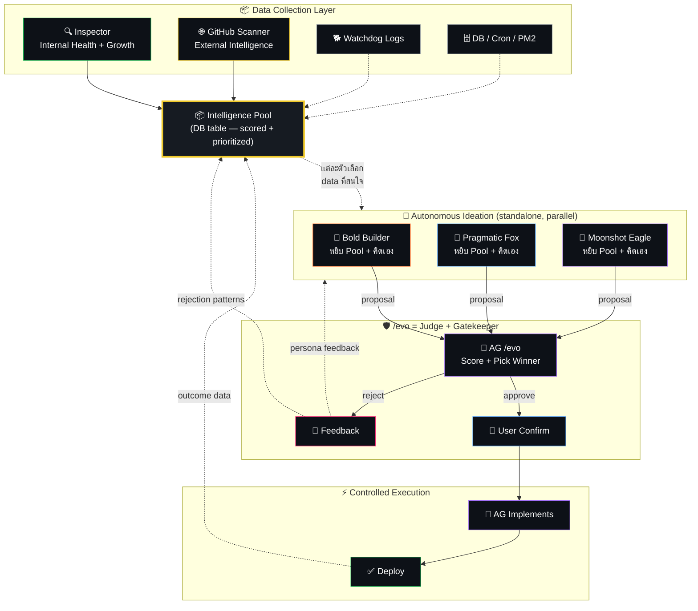
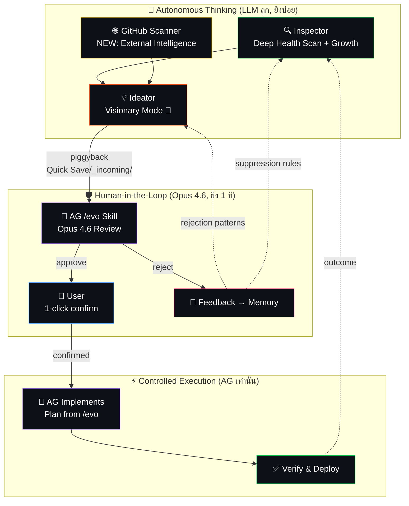

# 🧬 Hydra 3 สหาย — The Strategic Pivot (V3)

## 💡 The Strategic Pivot — ทำไมต้องหยุด Auto-Deploy

### ปัจจุบัน: Evolver ทำ 3 งาน → เก่ง 0 งาน
```
Evolver = คิดโค้ด + เขียนโค้ด + deploy เอง
        = Jack of all trades, master of none
        = Success rate 22% → ทำลายระบบ (PM2 restart 843 ครั้ง)
```

### ใหม่: แบ่งหน้าที่ตามจุดแข็ง (V3.1 — Data Pool Architecture)
```
Inspector           = 📦 Collector — รวบรวมข้อมูลจากทุกแหล่ง ให้คะแนน ลง Pool กลาง
GitHub Scanner      = 📦 Collector — ดึง external innovation ลง Pool กลาง
Ideator 🦁🦊🦅     = 🧠 Autonomous Thinker — หยิบ data จาก Pool เอง / คิดเองก็ได้
                      แต่ละตัวส่ง proposal ตรงไป /evo (ไม่ต้องมี Judge กลาง)
AG /evo (Opus 4.6)  = 🏛️ Judge + Gatekeeper — ตัดสิน approve/reject + ให้ feedback
User                = approve/reject (1 คลิก)
Evolver             = สร้าง Piggyback Stub เท่านั้น
```

### ข้อดี 6 ข้อของ Pivot นี้:
1. **ความเสถียร 100%:** ไม่มี auto-deploy = ไม่มี crash loop = ไม่มี DB corrupt
2. **Ideator เป็นอิสระ:** ไม่ต้องรอ Inspector ส่ง finding → หยิบจาก Pool เองหรือคิดเองได้
3. **กรองเยอะกว่า:** `/evo` skill = Judge เดียวที่ตัดสิน (4 มิติ + Star Scores) → ไม่ต้องมี Judge LLM ซ้ำซ้อน
4. **Feedback Loop ปิดได้จริง:** ทุก reject จาก /evo → feedback กลับ Pool + Ideator memory
5. **Data Pool = Single Source of Truth:** ทุก agent อ่านจากที่เดียว ไม่มี data silo
6. **Cost ลดลง:** ตัด Judge LLM ออก = ประหยัด 1 call per finding

---

## 📊 Architecture ใหม่ — Data Pool + Autonomous Ideators (V3.1)



### 🔑 Key Design Decisions (V3.1)

**1. ทำไมไม่ต้องมี Judge LLM?**
- `/evo` skill มี 4-dimension scoring อยู่แล้ว (Impact/Feasibility/Urgency/Alignment)
- AG Opus 4.6 ฉลาดกว่า LLM ราคาถูกที่จะมาเป็น Judge
- proposals ทั้ง 3 ตัวส่งตรงเข้า `/evo` → AG เห็นหมด เลือกเองได้ หรือ merge เอง

**2. ทำไม Ideator ต้อง standalone?**
- Inspector = **Collector** → ไม่ใช่ผู้สั่งงาน Ideator
- Ideator เข้าถึง DB, Brain, Pool, code ทั้งหมด → ไม่จำเป็นต้องรอ finding
- เปิดทาง "proactive innovation" — คิดอะไรใหม่ๆ ได้โดยไม่ต้องมี finding มาก่อน

---

## 📦 Intelligence Pool — Deep Dive

### DB Schema

```sql
CREATE TABLE intelligence_pool (
  id INTEGER PRIMARY KEY,
  source TEXT NOT NULL,
  category TEXT NOT NULL,
  title TEXT NOT NULL,
  urgency_score INTEGER DEFAULT 50,
  impact_score INTEGER DEFAULT 50,
  novelty_score INTEGER DEFAULT 50,
  priority REAL GENERATED ALWAYS AS (urgency_score * impact_score * novelty_score / 10000.0) STORED,
  raw_data TEXT,
  evidence TEXT,
  affected_component TEXT,
  status TEXT DEFAULT 'open',
  claimed_by TEXT,
  proposal_id TEXT,
  created_at TEXT DEFAULT (datetime('now','localtime')),
  expires_at TEXT DEFAULT (datetime('now','+14 days','localtime'))
);
CREATE INDEX idx_pool_status ON intelligence_pool(status);
CREATE INDEX idx_pool_priority ON intelligence_pool(priority DESC);
```

### 📊 Data Sources — ข้อมูลจากไหนบ้าง? (14 แหล่ง, 5 Layers)

> [!IMPORTANT]
> **V3.1 Upgrade:** Pool ไม่ได้เก็บแค่ปัญหา tech — แต่เห็น **ภาพทั้งระบบ** รวมงานจริง, การเงิน, content, knowledge เพื่อให้ Ideator optimize + innovate ได้ทุกมิติ

#### 🔧 Layer 1: System Health (ปัญหา tech)

| # | Source | Category | DB Table (rows) | Urgency | ตัวอย่าง |
|---|--------|----------|-----------------|---------|---------|
| 1 | **Watchdog Logs** | `error` | `watchdog_logs` (1,390) | 80-100 | "ideas-in-queue FAIL 12x ใน 3 วัน" |
| 2 | **Cron Performance** | `performance` | `cc_cron_run_logs` (14) | 60-80 | "cron-news ช้าลง 3.2× จาก baseline" |
| 3 | **PM2 Health** | `infra` | `pm2 jlist` (runtime) | 70-90 | "brain-app restart 843 ครั้ง ใน 7 วัน" |
| 4 | **Evolution History** | `self_improve` | `evolution_log` (98) | 40-60 | "Redis cache ถูก reject 4 ครั้ง" |

#### 💰 Layer 2: Business Operations (การเงิน + workflow)

| # | Source | Category | DB Table (rows) | Urgency | ตัวอย่าง Ideator Insight |
|---|--------|----------|-----------------|---------|--------------------------|
| 5 | **Bills Tracker** | `finance` | `cc_bills` (13) | 50-70 | "มี 3 bills ที่จ่ายซ้ำทุกเดือน → auto-pay workflow?" |
| 6 | **Subscriptions** | `finance` | `cc_subscriptions` (20) | 40-60 | "5 subs expire ใน 30 วัน → consolidation opportunity?" |
| 7 | **Expense Tracker** | `finance` | `cc_expenses` (104) | 30-50 | "category 'ไม่ระบุ' = 40% → auto-categorize ด้วย AI?" |
| 8 | **Credit Cards** | `finance` | `cc_credit_cards` (176) | 40-60 | "statement pattern: ค่าใช้จ่ายพุ่ง 30% เดือนนี้" |

#### 📝 Layer 3: Knowledge & Content (งานจริง)

| # | Source | Category | DB Table (rows) | Urgency | ตัวอย่าง Ideator Insight |
|---|--------|----------|-----------------|---------|--------------------------|
| 9 | **Tasks** | `productivity` | `tasks` (37) | 50-70 | "12 tasks ค้าง status='todo' เกิน 14 วัน → auto-prioritize?" |
| 10 | **Content Plans** | `content` | `content_plans` (28) | 40-60 | "content pipeline: 60% ค้างที่ status='idea' → bottleneck?" |
| 11 | **Memories + Notes** | `knowledge` | `memories` (23) + `notes` (13) | 20-40 | "knowledge_entries 70% stale 30+ วัน → auto-refresh?" |

#### 🤖 Layer 4: Agent Ecosystem (automation health)

| # | Source | Category | DB Table (rows) | Urgency | ตัวอย่าง Ideator Insight |
|---|--------|----------|-----------------|---------|--------------------------|
| 12 | **Agent Heartbeats** | `agent_health` | `agent_heartbeats` (17) | 60-80 | "agent 'doctormike' ไม่ส่ง heartbeat 48 ชม. → dead agent?" |
| 13 | **Cron Registry** | `agent_health` | `cc_crons` (85) | 50-70 | "15 crons enabled แต่ last_status='error' → silent failures" |

#### 🌐 Layer 5: External Intelligence

| # | Source | Category | ข้อมูล | Urgency | ตัวอย่าง |
|---|--------|----------|--------|---------|---------|
| 14 | **GitHub Trending** | `external` | GitHub API — daily scan | 20-40 | "anthropic-tools: streaming tool-use framework" |

### Inspector เขียน Pool อย่างไร?

```js
// inspector.js — หลัง GC checks ทั้งหมดเสร็จ
function writeToPool(finding) {
  db.prepare(`
    INSERT INTO intelligence_pool (source, category, title, urgency_score, impact_score, novelty_score, raw_data, evidence, affected_component)
    VALUES (?, ?, ?, ?, ?, ?, ?, ?, ?)
  `).run(
    finding.source || 'inspector',
    finding.category,
    finding.title,
    finding.urgency_score || calcUrgency(finding),
    finding.impact_score || calcImpact(finding),
    finding.novelty_score || calcNovelty(finding),
    JSON.stringify(finding),
    JSON.stringify(finding.evidence || {}),
    finding.affected_component
  );
}

// Scoring Functions
function calcUrgency(f) {
  if (f.severity === 'critical') return 90;
  if (f.severity === 'warning') return 70;
  if (f.severity === 'growth') return 40;
  return 50;
}
function calcImpact(f) {
  if (f.ice_score >= 300) return 90; // MUST_FIX
  if (f.ice_score >= 100) return 60; // SIGNIFICANT
  return 40;
}
function calcNovelty(f) {
  // เช็คว่า Pool มี item คล้ายกันอยู่แล้วไหม
  const existing = db.prepare(
    `SELECT COUNT(*) as cnt FROM intelligence_pool WHERE category = ? AND status != 'expired' AND created_at > datetime('now','-14 days')`
  ).get(f.category);
  return existing.cnt > 0 ? 20 : 70; // ซ้ำ = novelty ต่ำ
}
```

### Pool Behaviors (Detail)

| Behavior | กลไก | ทำไม |
|----------|------|------|
| **Priority Ranking** | `ORDER BY priority DESC` — urgency × impact × novelty | items สำคัญลอยขึ้นบน Ideator เห็นก่อน |
| **Decay** | Evolver lifecycle cleanup: `expires_at < now` → `status = 'expired'` | ป้องกัน Pool สะสม stale data |
| **Claim Lock** | Ideator `UPDATE SET claimed_by = 'bold' WHERE id = ?` | ป้องกัน 2 persona ทำงานซ้ำ |
| **Re-open** | /evo reject → `UPDATE SET status = 'open', claimed_by = NULL` | persona อื่นลองมุมใหม่ |
| **Dedup** | `INSERT OR IGNORE` + check `title` similarity ก่อนเขียน | ไม่ซ้ำซ้อน |
| **Max Pool Size** | ไม่เกิน 50 open items → oldest expire first | ไม่ให้ Pool ท่วม |

---

## 🦁🦊🦅 Ideator 3 Agents — Deep Dive

### ใช่ 3 Agent แยกกัน — ทำไม?

ปัจจุบัน `ideator.js` เป็น **1 ไฟล์ 1 cron** → ใหม่จะแยกเป็น **3 cron entries ที่เรียก ideator.js ด้วย `--persona=` flag ต่างกัน**

```
# ไม่ต้องสร้าง 3 ไฟล์ — ใช้ไฟล์เดียว + flag
node scripts/hydra/ideator.js --persona=bold
node scripts/hydra/ideator.js --persona=pragmatic
node scripts/hydra/ideator.js --persona=moonshot
```

**ข้อดี:** maintain codebase เดียว, share utility functions, แต่ personality + model + pool filter ต่างกัน

### 🤖 Model Recommendation — ทำไมต้องคนละ model?

> **หลักคิด:** ให้แต่ละ persona ใช้ model ที่ **match กับบุคลิก** — model ที่ creative ให้ Bold, model ที่ precise ให้ Pragmatic, model ที่ reason ลึกให้ Moonshot

| Persona | Primary Model | Fallback Model | ทำไมเลือก model นี้ |
|---------|--------------|----------------|---------------------|
| 🦁 **Bold** | **MiniMax M2.7** ($1.20/M via OpenRouter) | DeepSeek-V3.2 (BytePlus Free) | M2.7 creative + กล้าคิดนอกกรอบ, temperature 0.7 |
| 🦊 **Pragmatic** | **DeepSeek-V3.2** (BytePlus Free) | GLM-4.7 (BytePlus Free) | V3.2 แม่นยำ ตรงประเด็น cost-effective, temperature 0.2 |
| 🦅 **Moonshot** | **DeepSeek R1 Llama 70B** ($0.70/M via OpenRouter) | MiniMax M2.7 | R1 = reasoning chain ลึก คิดได้ซับซ้อน, temperature 0.5 |

**Temperature Strategy:**
```js
const PERSONA_CONFIG = {
  bold:      { temperature: 0.7, model: 'minimax/minimax-m2.7' },      // creative divergent
  pragmatic: { temperature: 0.2, model: 'ep-m-20260417220115-8dmgm' }, // precise convergent
  moonshot:  { temperature: 0.5, model: 'deepseek/deepseek-r1-distill-llama-70b' }  // deep reasoning
};
```

### 💰 Cost Analysis Per Persona

| Persona | Model Cost | Avg Tokens/Call | Cost/Call | Calls/Day | Cost/Day |
|---------|-----------|-----------------|----------|-----------|----------|
| 🦁 Bold | $1.20/M tok | ~4,000 | $0.005 | 4 | $0.02 |
| 🦊 Pragmatic | FREE (BytePlus) | ~3,500 | $0.00 | 4 | $0.00 |
| 🦅 Moonshot | $0.70/M tok | ~6,000 | $0.004 | 2 | $0.008 |
| **Total** | | | | **10** | **~$0.028/day** |

> **รวม ~$0.84/เดือน** — ถูกมากสำหรับ 3 autonomous innovation agents

### แต่ละ Persona ทำอะไรต่างกัน?

#### 🦁 Bold Builder — "ถ้าจะทำ ทำให้ช็อกโลก"
```
Pool Filter: category IN ('innovation', 'external', 'self_improve', 'content')
Data Access: Pool + evolution_log + content_plans + fb_post_queue
Personality: "คิดเหมือน Steve Jobs — ถ้า proposal ไม่ wow ก็ตอบ null ดีกว่า"
Output:      proposal ที่ bold, disruptive — อาจ architecture ใหม่ หรือ content workflow ใหม่
Example:     "content pipeline ค้าง 60% ที่ status=idea → AI auto-draft + auto-schedule"
```

#### 🦊 Pragmatic Fox — "แก้ root cause ด้วยต้นทุนต่ำสุด"
```
Pool Filter: category IN ('error', 'performance', 'cost', 'finance', 'agent_health')
Data Access: Pool + watchdog_logs + cc_crons + cc_bills + cc_expenses + cc_subscriptions
Personality: "Senior SRE — เน้น ROI, ใช้ของที่มี, ห้าม over-engineer"
Output:      proposal ที่ practical — fix errors, optimize costs, streamline finance ops
Example:     "expenses 40% ไม่มี category → เพิ่ม AI auto-categorize ใน cc_expenses"
```

#### 🦅 Moonshot Eagle — "ถ้าไม่มีข้อจำกัด จะทำยังไง?"
```
Pool Filter: ไม่ filter — อ่าน Pool ทั้งหมด + scan code + scan DB ทุก table
Data Access: Pool + ALL tables + package.json + file tree + knowledge_entries
Personality: "Research Scientist — มอง cross-system, เห็น pattern ที่ไม่มีใครเห็น"
Output:      proposal ที่ visionary — connect dots ข้ามระบบ
Example:     "รวม bills + subs + expenses → unified finance dashboard ที่ predict ค่าใช้จ่ายเดือนหน้า"
```

---

## ⏰ Scheduling & Frequency — Deep Dive

### ปัจจุบัน (V3.0)
```
Inspector: 4×/วัน (02:00, 08:00, 14:00, 20:00)
Ideator:   4×/วัน (03:00, 09:00, 15:00, 21:00) — 1 ชม. หลัง Inspector
Evolver:   4×/วัน (03:30, 09:30, 15:30, 21:30) — 30 นาที หลัง Ideator
```

### ใหม่ (V3.1) — Decoupled Schedule

> **หลักคิด:** Inspector กับ Ideator ไม่ต้อง sync กันอีกแล้ว เพราะ Pool เป็นตัวกลาง. แต่ละตัวทำงานตามจังหวะที่เหมาะ.

#### 📦 Inspector (Data Collector — 14 sources, 5 layers)

| Setting | Value | เหตุผล |
|---------|-------|--------|
| **Frequency** | **6×/วัน** (ทุก 4 ชม.) | ตอนนี้ scan 14 sources → ต้องถี่ขึ้นเพื่อจับ business changes ด้วย |
| **Schedule** | `0 */4 * * *` (00:00, 04:00, 08:00, 12:00, 16:00, 20:00) | กระจายสม่ำเสมอ |
| **Layer rotation** | ทุกรอบ scan Layer 1+4 (tech+agent) / สลับ Layer 2+3 ทุก 2 รอบ | ไม่ scan ทั้ง 14 sources ทุกรอบ → เบา |
| **Runtime** | ~45-90 วินาที (SQL + 1 LLM call summary) | ยังเบามาก |
| **Output** | 0-8 items/run เข้า Pool | เพิ่มขึ้นเพราะ sources เยอะขึ้น |

```cron
0 */4 * * * cd /root/brain-app && node scripts/hydra/inspector.js >> /tmp/cron-inspector.log 2>&1
```

**Layer Rotation Strategy:**
```
รอบ 00:00, 08:00, 16:00 → Layer 1 (System Health) + Layer 4 (Agent Health) — เร่งด่วน
รอบ 04:00, 12:00, 20:00 → Layer 2 (Business) + Layer 3 (Content/Tasks) — ช้าหน่อย
Layer 5 (GitHub) → แยก cron ต่างหาก (daily)
```

#### 🌐 GitHub Scanner (External Intelligence)

| Setting | Value | เหตุผล |
|---------|-------|--------|
| **Frequency** | **1×/วัน** | วันละ 1 new external idea → สะสมเป็น innovation fuel |
| **Schedule** | `0 10 * * *` (10:00 ทุกวัน) | ช่วงเช้า เตรียม innovation ideas ให้ Bold/Moonshot หยิบ |
| **Keywords** | `ai-agent`, `llm`, `self-improving`, `automation`, `nodejs` | ครอบคลุม tech stack ของเรา |
| **Runtime** | ~2-3 นาที (GitHub API + LLM eval relevance) | |
| **Output** | 0-2 `external` items เข้า Pool ต่อวัน | ~7-14 ideas/สัปดาห์ |

> **ทำไมเปลี่ยนจาก weekly → daily?**
> - GitHub Trending เปลี่ยนทุกวัน — repo ใหม่เข้ามาตลอด
> - 1 idea/วัน = innovation fuel ที่สม่ำเสมอ ≠ กระจุก 1 วัน
> - Cost: GitHub API ฟรี + LLM eval ~$0.003/day = ถูกมาก

```cron
0 10 * * * cd /root/brain-app && node scripts/hydra/github-scanner.js >> /tmp/cron-github-scanner.log 2>&1
```

#### 🦁🦊🦅 Ideator 3 Personas

| Persona | Frequency | Schedule | เหตุผล |
|---------|-----------|----------|--------|
| 🦊 **Pragmatic** | **4×/วัน** | `0 1,7,13,19 * * *` | ปัญหาเร่งด่วน + business ops ต้องจับเร็ว |
| 🦁 **Bold** | **2×/วัน** | `0 5,17 * * *` | ไอเดีย disruptive — ให้มี Pool data สด (หลัง Inspector) |
| 🦅 **Moonshot** | **1×/วัน** | `0 3 * * *` | R1 reasoning ลึก — ดู Pool + business ทั้งหมดแล้วคิด big picture |

```cron
# Pragmatic Fox — 4×/วัน (เร่งด่วน + business optimization)
0 1,7,13,19 * * * cd /root/brain-app && node scripts/hydra/ideator.js --persona=pragmatic >> /tmp/cron-ideator-pragmatic.log 2>&1

# Bold Builder — 2×/วัน (creative, หลัง Inspector business scan)
0 5,17 * * * cd /root/brain-app && node scripts/hydra/ideator.js --persona=bold >> /tmp/cron-ideator-bold.log 2>&1

# Moonshot Eagle — 1×/วัน (deep thinking — full Pool access)
0 3 * * * cd /root/brain-app && node scripts/hydra/ideator.js --persona=moonshot >> /tmp/cron-ideator-moonshot.log 2>&1
```

#### 🔄 Evolver (Piggyback Only)

| Setting | Value | เหตุผล |
|---------|-------|--------|
| **Frequency** | **2×/วัน** | แค่สร้าง piggyback file + lifecycle cleanup |
| **Schedule** | `30 6,18 * * *` | 2 รอบ/วัน — ให้ ideator ทุกตัวยิงเสร็จก่อน |

```cron
30 6,18 * * * cd /root/brain-app && node scripts/hydra/evolver.js --mode=auto >> /tmp/cron-evolver.log 2>&1
```

### 📈 Daily Pipeline Timeline (V3.1)

```
00:00  📦 Inspector scan → Pool (Layer 1+4: tech + agents)
01:00  🦊 Pragmatic picks Pool (errors + business ops)
03:00  🦅 Moonshot deep-thinks R1 (full Pool + DB access)
04:00  📦 Inspector scan → Pool (Layer 2+3: business + content)
05:00  🦁 Bold picks Pool (innovation + external ideas)
06:30  🔄 Evolver creates piggybacks from all proposals
07:00  🦊 Pragmatic picks Pool (fresh after Inspector)
08:00  📦 Inspector scan → Pool (Layer 1+4)
10:00  🌐 GitHub Scanner → Pool (daily external intelligence)
12:00  📦 Inspector scan → Pool (Layer 2+3)
13:00  🦊 Pragmatic picks Pool
16:00  📦 Inspector scan → Pool (Layer 1+4)
17:00  🦁 Bold picks Pool (afternoon innovation)
18:30  🔄 Evolver creates piggybacks
19:00  🦊 Pragmatic picks Pool
20:00  📦 Inspector scan → Pool (Layer 2+3)

Total cron runs/day: 16 (6 Inspector + 4 Pragmatic + 2 Bold + 1 Moonshot + 1 GitHub + 2 Evolver)
Total LLM calls/day: ~14 (6 Inspector + 4 Pragmatic + 2 Bold + 1 Moonshot + 1 GitHub)
Total cost/day: ~$0.04
```

### ⚠️ Hydra Script Cleanup — 31 → 5 Core Scripts

> [!WARNING]
> ปัจจุบันมี **31 scripts** ใน `scripts/hydra/` ส่วนใหญ่เป็น placeholder หรือ dead code:
> `dream-mode.js`, `visionary.js`, `agent-fusion.js`, `agent-spawner.js`, `self-rewriter.js`, `user-mind-model.js`, `strategy-engine.js` ฯลฯ

**V3.1 Core Scripts (5 ตัวเท่านั้น):**

| Script | Role | Keep/Kill |
|--------|------|-----------|
| `inspector.js` | Data Collector → Pool | ✅ **KEEP + REFACTOR** |
| `ideator.js` | 3 Persona Ideation | ✅ **KEEP + REFACTOR** |
| `evolver.js` | Piggyback + Lifecycle | ✅ **KEEP + SIMPLIFY** |
| `minions.js` | Deterministic utility jobs | ✅ **KEEP** |
| `github-scanner.js` | External intelligence | ✅ **NEW** |
| อื่นๆ ทั้งหมด (26 ไฟล์) | Dead code / placeholder | ❌ **KILL** (Phase 7) |

---

## 🖥️ Web UI Changes — Deep Dive

> [!IMPORTANT]
> **ปัจจุบัน UI อยู่ใน `page-hydra` มี 7 tabs:** RPG Core, Awakened Protocol, Feedback, GEPA, Meta-Agent Matrix, AI Comms, Dev Lab.
> V3.1 ต้องปรับ **3 tabs เดิม** + เพิ่ม **1 tab ใหม่** + สร้าง **3 API endpoints ใหม่**

### 🆕 Tab ใหม่: 📦 Intelligence Pool

**ไฟล์ที่เกี่ยวข้อง:** `index.html`, `hydra-evo.js`, `hydra.css`, `routes/hydra.js`

```
Tab: 📦 Pool (ใหม่ทั้งหมด)
├── Pool Stats Row
│   ├── Total Open items
│   ├── Claimed items
│   ├── Processed today
│   └── Expired (14d)
│
├── Pool Items List (sortable by priority)
│   ├── [Layer Badge] Layer 1: System Health / Layer 2: Business / etc.
│   ├── Title
│   ├── Scores: 🔴 Urgency (85) | 🟡 Impact (70) | 🟢 Novelty (60)
│   ├── Priority: 35.7 (computed)
│   ├── Source badge: inspector / github / watchdog
│   ├── Status badge: open / claimed (by 🦁Bold) / processed
│   ├── Created: 2h ago | Expires: 12d left
│   └── [Expand] → raw_data JSON + evidence
│
└── Pool Filters
    ├── By Layer: [All] [System] [Business] [Content] [Agent] [External]
    ├── By Status: [Open] [Claimed] [All]
    └── Sort: [Priority ↓] [Newest] [Urgency]
```

**New API Endpoint:**
```js
// routes/hydra.js
app.get('/pool', (c) => {
  const items = db.prepare(`
    SELECT *, 
      CASE WHEN expires_at < datetime('now','localtime') THEN 'expired' ELSE status END as effective_status
    FROM intelligence_pool
    WHERE status != 'expired'
    ORDER BY priority DESC
    LIMIT 100
  `).all();
  
  const stats = {
    open: items.filter(i => i.effective_status === 'open').length,
    claimed: items.filter(i => i.effective_status === 'claimed').length,
    processed: items.filter(i => i.effective_status === 'processed').length,
    total: items.length
  };
  
  return c.json({ items, stats });
});
```

### 🔄 Tab แก้ไข: 🧘 Awakened Protocol

**สิ่งที่ต้องเปลี่ยน:**

| Component | ปัจจุบัน | V3.1 |
|-----------|---------|------|
| **Summary Cards** | FINDINGS TODAY / NEEDS REVIEW / SUCCESS DEPLOYS / HEALTH | **POOL OPEN** / PERSONA PROPOSALS / PIGGYBACK READY / HEALTH |
| **Pipeline Kanban** | 4 columns: Findings → Proposed → Needs Review → Deployed | **5 columns:** Pool Items → 🦁Bold → 🦊Pragmatic → 🦅Moonshot → Piggyback Ready |
| **Audit Bar** | Success Rate / Hallucinations / Last Deploy | **Pool Fill Rate / Persona Win Rate / Last /evo Run** |

**Pipeline Kanban V3.1:**
```
📦 Pool Top 5        → 🦁 Bold Ideas      → 🦊 Pragmatic Fix   → 🦅 Moonshot Vision → 📋 Piggyback Ready
(sorted by priority)   (claimed_by=bold)    (claimed_by=prag)    (claimed_by=moon)    (in _incoming/)
```

**Updated Summary API:**
```js
// evo-summary endpoint ปรับเป็น:
{
  pool_open: 12,          // COUNT(*) FROM intelligence_pool WHERE status='open'
  persona_proposals: 5,   // Total proposals จาก 3 personas วันนี้
  piggyback_ready: 3,     // Files in _incoming/ count
  health_score: 95
}
```

### 🔄 Tab แก้ไข: 🤖 Meta-Agent Matrix

**Agent Roster ต้องอัปเดต — จาก 20 agents เหลือ 8 ตัวจริง:**

```js
// hydra-evo.js — AGENT_LIST ปรับใหม่
const AGENT_LIST = [
  // V3.1 Core (5 scripts)
  { name: 'inspector',       icon: '📦', role: 'Data Collector → Pool' },
  { name: 'ideator-bold',    icon: '🦁', role: 'Bold Innovation' },
  { name: 'ideator-pragmatic', icon: '🦊', role: 'Pragmatic Fixes' },
  { name: 'ideator-moonshot', icon: '🦅', role: 'Moonshot Vision' },
  { name: 'evolver',         icon: '🔄', role: 'Piggyback + Lifecycle' },
  { name: 'github-scanner',  icon: '🌐', role: 'External Intelligence' },
  { name: 'minions',         icon: '⚙️', role: 'Deterministic Utils' },
  // External
  { name: 'dev-agent',       icon: '👨‍💻', role: 'AG Development' },
];
```

**Performance Chart ต้องปรับ:**
- แยกแสดง cost per persona (Bold=$0.02/day, Pragmatic=FREE, Moonshot=$0.008/day)
- เพิ่ม Pool Fill Rate chart (items added/day vs items consumed/day)

### 🔄 Tab แก้ไข: 💬 AI Comms

**Chat Feed ปรับ persona attribution:**

| ปัจจุบัน | V3.1 |
|---------|------|
| `agent: 'ideator'` ทุก proposal | `agent: 'ideator-bold'` / `ideator-pragmatic'` / `ideator-moonshot'` |
| ไม่มี Pool context | ทุก proposal แสดง `pool_item_id` ที่หยิบมา |
| Icon เดียว 💡 | 3 icons: 🦁 🦊 🦅 ตาม persona |

**Chat Bubble ใหม่:**
```html
<!-- Persona proposal in chat -->
<div class="chat-msg chat-agent-ideator-bold">
  <div class="chat-avatar">🦁</div>
  <div class="chat-body">
    <div class="chat-info">
      <span class="chat-name">BOLD BUILDER</span>
      <span class="chat-time">04:00</span>
    </div>
    <div class="chat-bubble">
      💡 Proposal: AI Auto-Categorize Expenses
      <div class="chat-pool-ref">📦 Pool #42: "expenses 40% uncategorized"</div>
      <div class="chat-scores">Impact: 80 · Feasibility: 90 · Urgency: 60</div>
    </div>
  </div>
</div>
```

### 📡 New API Endpoints (3 ใหม่)

| Endpoint | Method | ข้อมูล |
|----------|--------|--------|
| `/api/hydra/pool` | GET | Pool items + stats (for new Pool tab) |
| `/api/hydra/pool/:id/claim` | POST | Manually claim pool item (future) |
| `/api/hydra/persona-stats` | GET | Per-persona proposal count, win rate, cost |

**Persona Stats API:**
```js
app.get('/persona-stats', (c) => {
  // นับ proposals แยกตาม triggered_by persona
  const stats = db.prepare(`
    SELECT triggered_by as persona,
      COUNT(*) as total_proposals,
      SUM(CASE WHEN status='deployed' THEN 1 ELSE 0 END) as wins,
      SUM(CASE WHEN status='rejected' THEN 1 ELSE 0 END) as losses
    FROM evolution_log
    WHERE triggered_by IN ('ideator-bold','ideator-pragmatic','ideator-moonshot')
    GROUP BY triggered_by
  `).all();
  return c.json(stats);
});
```

### 📁 File Change Summary

| File | Action | สิ่งที่ต้องทำ |
|------|--------|-------------|
| `index.html` | **MODIFY** | เพิ่ม Pool tab button + Pool tab HTML container |
| `hydra-evo.js` | **MODIFY** | เพิ่ม `fetchPool()`, ปรับ `AGENT_LIST`, ปรับ `switchHydraTab()` |
| `hydra.css` | **MODIFY** | เพิ่ม Pool card styles, persona color badges |
| `routes/hydra.js` | **MODIFY** | เพิ่ม 3 endpoints: `/pool`, `/pool/:id/claim`, `/persona-stats` |
| `hydra-evo.js` | **MODIFY** | ปรับ `renderEvolutionPipeline()` เป็น 5-column persona-based |
| `hydra-evo.js` | **MODIFY** | ปรับ `renderChatFeed()` — persona icons + pool references |
| `hydra-evo.js` | **MODIFY** | ปรับ `fetchEvoSummary()` — pool-based stats |

---

## 📋 V3.1 Execution Plan — Consolidated (6 Phases)

> [!IMPORTANT]
> **แผนใหม่รวมทุกอย่าง** — ครอบคลุม Database, Backend API, Hydra Scripts, Frontend UI, Cron, Cleanup
> เรียงตามลำดับ dependency: DB ก่อน → Backend → Scripts → Frontend → Cron → Cleanup

---

### Phase 1: 🗄️ Database — Intelligence Pool + Schema Migration

**เป้าหมาย:** สร้าง `intelligence_pool` table + ปรับ `evolution_log` รองรับ persona

#### Task List:
1. **[NEW TABLE] `intelligence_pool`** — สร้าง table ใหม่ใน DB
   ```sql
   CREATE TABLE intelligence_pool (
     id INTEGER PRIMARY KEY,
     source TEXT NOT NULL,        -- 'inspector', 'github-scanner', 'watchdog'
     category TEXT NOT NULL,      -- 'error', 'innovation', 'finance', 'content', 'external', etc.
     title TEXT NOT NULL,
     urgency_score INTEGER DEFAULT 50,
     impact_score INTEGER DEFAULT 50,
     novelty_score INTEGER DEFAULT 50,
     priority REAL GENERATED ALWAYS AS (urgency_score * impact_score * novelty_score / 10000.0) STORED,
     raw_data TEXT,
     evidence TEXT,               -- JSON: ข้อมูล evidence ที่ Inspector เก็บมา
     affected_component TEXT,     -- 'watchdog', 'cc_bills', 'content_plans', etc.
     layer TEXT,                  -- 'system_health', 'business', 'content', 'agent', 'external'
     status TEXT DEFAULT 'open',  -- 'open', 'claimed', 'processed', 'expired'
     claimed_by TEXT,             -- 'ideator-bold', 'ideator-pragmatic', 'ideator-moonshot'
     proposal_id TEXT,            -- link กลับไป evolution_log
     created_at TEXT DEFAULT (datetime('now','localtime')),
     expires_at TEXT DEFAULT (datetime('now','+14 days','localtime'))
   );
   CREATE INDEX idx_pool_status ON intelligence_pool(status);
   CREATE INDEX idx_pool_priority ON intelligence_pool(priority DESC);
   CREATE INDEX idx_pool_layer ON intelligence_pool(layer);
   ```

2. **[MIGRATE] `evolution_log`** — เพิ่ม column `persona`
   ```sql
   ALTER TABLE evolution_log ADD COLUMN persona TEXT;
   -- values: 'bold', 'pragmatic', 'moonshot', NULL (legacy)
   ```

3. **[MIGRATE] `evolution_log`** — เพิ่ม column `pool_item_id`
   ```sql
   ALTER TABLE evolution_log ADD COLUMN pool_item_id INTEGER REFERENCES intelligence_pool(id);
   ```

**ไฟล์:** `scripts/hydra/inspector.js` (เพิ่ม CREATE TABLE IF NOT EXISTS)
**ทดสอบ:** SSH → `sqlite3 /root/brain-app/data/brain.db ".schema intelligence_pool"`

---

### Phase 2: 📦 Backend Scripts — Inspector + Ideator + GitHub Scanner

**เป้าหมาย:** Inspector เขียนลง Pool, Ideator อ่านจาก Pool แยก persona, GitHub Scanner ทำงาน daily

#### 2A: Inspector Refactor (writeToPool)
1. **`scripts/hydra/inspector.js`** — เพิ่มฟังก์ชัน `writeToPool()`
   - Scan 14 data sources จาก 5 Layers (ดูรายละเอียดใน Data Sources section)
   - ใช้ Layer Rotation: รอบคี่ → Layer 1+4, รอบคู่ → Layer 2+3
   - คำนวณ `urgency_score`, `impact_score`, `novelty_score` per item
   - INSERT เข้า `intelligence_pool`
   - ลบ/อัปเดต items ที่ expired (>14 วัน)

2. **Scoring Heuristics:**
   ```
   urgency: watchdog FAIL=90, cron ไม่รัน>24h=80, task stuck>7d=60, bill overdue=85
   impact:  system crash=95, money-related=80, content stuck=60, minor optimization=40
   novelty: ซ้ำกับ Pool item เดิม=10, ใหม่ทั้งหมด=80, external(github)=90
   ```

#### 2B: Ideator Persona Mode
1. **`scripts/hydra/ideator.js`** — รองรับ `--persona=bold|pragmatic|moonshot`
   - อ่าน CLI flag → เลือก config (model, temperature, system prompt, pool filter)
   - หยิบ top items จาก `intelligence_pool` ตาม persona filter
   - เรียก LLM สร้าง proposal → INSERT เข้า `evolution_log` พร้อม `persona` + `pool_item_id`
   - UPDATE pool item status → `claimed` → `processed`
   - สร้าง piggyback file เข้า `_incoming/`

2. **Persona Config:**
   ```js
   const PERSONA_CONFIG = {
     bold:      { temperature: 0.7, model: 'minimax/minimax-m2.7', poolFilter: "category IN ('innovation_trigger','external','content','dependency_upgrade','skill_gap')" },
     pragmatic: { temperature: 0.2, model: 'ep-m-20260417220115-8dmgm', poolFilter: "category IN ('recurring_error','performance_drift','performance_opportunity','cost_anomaly','finance','auto_deploy_regression','productivity')" },
     moonshot:  { temperature: 0.5, model: 'deepseek/deepseek-r1-distill-llama-70b', poolFilter: null }
   };
   ```

#### 2C: GitHub Scanner (New Script)
1. **[NEW] `scripts/hydra/github-scanner.js`**
   - Fetch GitHub Trending API / search repos by keywords
   - Keywords: `ai-agent`, `llm`, `self-improving`, `automation`, `nodejs`
   - LLM eval relevance → INSERT เข้า `intelligence_pool` category=`external`, layer=`external`
   - Daily 10:00 via cron

**ไฟล์:** `inspector.js`, `ideator.js`, `github-scanner.js`
**ทดสอบ:** รัน manual → `node scripts/hydra/inspector.js` → check Pool has items → `node scripts/hydra/ideator.js --persona=pragmatic` → check proposal created

---

### Phase 3: 🔌 Backend API — New Endpoints + Modify Existing

**เป้าหมาย:** เพิ่ม 3 API endpoints ใหม่ + ปรับ 3 endpoints เดิม

#### 3A: New Endpoints (ใน `routes/hydra.js`)

| # | Endpoint | Method | Response |
|---|----------|--------|----------|
| 1 | `/pool` | GET | Pool items list + stats (open/claimed/processed/total) |
| 2 | `/pool/:id/claim` | POST | Manually claim item (for future use) |
| 3 | `/persona-stats` | GET | Per-persona proposal count, win rate, losses |

#### 3B: Modified Endpoints

| # | Endpoint | สิ่งที่ปรับ |
|---|----------|-----------|
| 1 | `/evo-summary` | เปลี่ยน response เป็น pool_open / persona_proposals / piggyback_ready / health |
| 2 | `/agent-activity` | เพิ่ม persona attribution (agent: `ideator-bold` แทน `ideator`) + pool_item reference |
| 3 | `/evolution-pipeline` | ปรับ columns เป็น 5-column persona-based Kanban |

**ไฟล์:** `routes/hydra.js`
**ทดสอบ:** `curl https://brain.doctorbankonline.com/api/hydra/pool` → ได้ JSON

---

### Phase 4: 🖥️ Frontend UI — Pool Tab + Persona UI + Updated Tabs

**เป้าหมาย:** เพิ่ม Pool tab ใหม่, ปรับ 3 tabs เดิม, อัปเดต Agent Roster

#### 4A: New Tab — 📦 Intelligence Pool
1. **`index.html`** — เพิ่ม tab button `📦 Pool` + container HTML
2. **`hydra-evo.js`** — เพิ่ม `switchHydraTab('pool')` handler + `fetchPool()` function
3. **`hydra.css`** — เพิ่ม Pool card styles, layer badges, score bars
4. **UI Components:** Stats row, filterable list, expandable cards with scores

#### 4B: Modified Tab — 🧘 Awakened Protocol
1. **Summary Cards** → Pool Open / Persona Proposals / Piggyback Ready / Health
2. **Pipeline Kanban** → 5 columns: Pool Top → 🦁Bold → 🦊Pragmatic → 🦅Moonshot → Piggyback
3. **Audit Bar** → Pool Fill Rate / Persona Win Rate / Last /evo Run

#### 4C: Modified Tab — 🤖 Meta-Agent Matrix
1. **Agent Roster** → ลดจาก 20 → 8 agents (5 core scripts + dev-agent + 2 deprecated)
2. **Cost Chart** → แยก cost per persona

#### 4D: Modified Tab — 💬 AI Comms
1. **Chat bubbles** → แสดง persona icons (🦁🦊🦅) + Pool item reference
2. **Agent attribution** → `ideator-bold` / `ideator-pragmatic` / `ideator-moonshot`

**ไฟล์:** `index.html`, `hydra-evo.js`, `hydra.css`
**ทดสอบ:** เปิด browser → Hydra page → Pool tab แสดงข้อมูล, Awakened ใช้ Kanban 5 columns

---

### Phase 5: ⏰ Cron Setup — Deploy New Schedule

**เป้าหมาย:** ติดตั้ง crontab ใหม่บน VPS ตาม V3.1 decoupled schedule

```cron
# === HYDRA V3.1 — Decoupled Schedule ===

# 📦 Inspector (6×/วัน — Layer Rotation)
0 */4 * * * cd /root/brain-app && node scripts/hydra/inspector.js >> /tmp/cron-inspector.log 2>&1

# 🌐 GitHub Scanner (1×/วัน)
0 10 * * * cd /root/brain-app && node scripts/hydra/github-scanner.js >> /tmp/cron-github-scanner.log 2>&1

# 🦊 Pragmatic Fox (4×/วัน)
0 1,7,13,19 * * * cd /root/brain-app && node scripts/hydra/ideator.js --persona=pragmatic >> /tmp/cron-ideator-pragmatic.log 2>&1

# 🦁 Bold Builder (2×/วัน)
0 5,17 * * * cd /root/brain-app && node scripts/hydra/ideator.js --persona=bold >> /tmp/cron-ideator-bold.log 2>&1

# 🦅 Moonshot Eagle (1×/วัน)
0 3 * * * cd /root/brain-app && node scripts/hydra/ideator.js --persona=moonshot >> /tmp/cron-ideator-moonshot.log 2>&1

# 🔄 Evolver (2×/วัน)
30 6,18 * * * cd /root/brain-app && node scripts/hydra/evolver.js --mode=auto >> /tmp/cron-evolver.log 2>&1
```

**ขั้นตอน:**
1. SSH → `crontab -e` → ลบ hydra cron เก่าทั้งหมด
2. ใส่ schedule ใหม่ด้านบน
3. ลบ cron เก่าของ scheduled-agents / meta-agents ที่ dead

**ทดสอบ:** `crontab -l` → ตรวจว่ามี 7 entries, รอ 1 รอบ → check `/tmp/cron-inspector.log`

---

### Phase 6: 🧹 Cleanup — Dead Code + Legacy Removal

**เป้าหมาย:** ลบ dead code ทั้งหมด ลด maintenance burden

1. **ลบ `scripts/scheduled-agents/`** — ทั้ง folder (dead code)
2. **ลบ `scripts/meta-agents/`** — ทั้ง folder (dead code)
3. **ลบ Hydra dead scripts (26 ไฟล์):**
   - `dream-mode.js`, `visionary.js`, `agent-fusion.js`, `agent-spawner.js`
   - `self-rewriter.js`, `user-mind-model.js`, `strategy-engine.js`
   - `cross-pollinator.js`, `anticipation-engine.js`, `experiment-engine.js`
   - `impact-measurer.js`, `model-tournament.js`, `red-team.js`
   - `knowledge-crystallizer.js`, `velocity-tracker.js`, `growth-tracker.js`
   - ฯลฯ
4. **DB Cleanup:** ลบ entries ที่เป็น Redis cache attempts, ลบ evolution_log entries ที่ status=`ideated` (placeholder)
5. **ลบ Redis refs:** ถอด import Redis ที่เหลือใน `lib/ai-call.js`, `lib/brain-ai.js`

**ทดสอบ:** `ls scripts/hydra/` → เหลือ 5 ไฟล์: inspector, ideator, evolver, minions, github-scanner

---

### 📊 Phase Dependency Map

```
Phase 1 (DB)
    ↓
Phase 2 (Scripts) ← ต้องมี Pool table ก่อน
    ↓
Phase 3 (API) ← ต้องมี Pool data + persona ก่อน
    ↓
Phase 4 (UI) ← ต้องมี API endpoints ก่อน
    ↓
Phase 5 (Cron) ← ต้อง scripts พร้อมก่อน
    ↓
Phase 6 (Cleanup) ← ทำหลังสุด เมื่อทุกอย่างทำงานแล้ว
```

### 💰 Total Cost Summary

| Resource | ต่อวัน | ต่อเดือน |
|----------|--------|----------|
| LLM calls (14/day) | ~$0.04 | ~$1.20 |
| GitHub API | FREE | FREE |
| VPS (existing) | - | $0 เพิ่ม |
| **Total** | **~$0.04** | **~$1.20** |

---

## 📦 RAW ARTIFACT BACKUP

<details>
<summary>Click to view hydra_autodeploy_audit.md</summary>

# 🔍 Hydra Auto-Deploy Audit Report
**Date:** 2026-04-24 | **Period Reviewed:** Apr 16–24 | **Total Deployed: 21**

---

## 🚨 TL;DR — Executive Summary

| Metric | Value |
|--------|-------|
| Total auto-deploys (git log) | **30 commits** (many duplicates/re-deploys) |
| Unique proposals deployed | **21** |
| Rolled back | **0** (but should have been!) |
| **Actually useful** | **3–4 at best** |
| **Actively harmful** | **4** (caused crash loops, DB corruption) |
| **Dead code / placeholder** | **5+** |
| PM2 restart count (brain-app) | **843** ← ⛔ catastrophic |
| PM2 restart count (discord-bot) | **784** ← ⛔ catastrophic |

> [!CAUTION]
> **คำตอบตรงๆ: ไม่ครับ — ระบบไม่ได้ "โตขึ้นแบบก้าวกระโดด"**
> ส่วนใหญ่ Hydra auto-deploy สร้างปัญหามากกว่าแก้ปัญหา หลายอันเป็น placeholder code ที่ไม่ทำอะไรเลย และมีอย่างน้อย 4 อันที่ทำให้ระบบพังโดยตรง

---

## 📊 Detailed Verdict — Every Deployed Proposal

### ⛔ HARMFUL — ทำให้ระบบพัง

| # | Proposal | Risk | Verdict | Damage |
|---|----------|------|---------|--------|
| 1 | **Add Redis caching layer for AI API responses** (EVO-20260424-108) | — | ⛔ **HARMFUL** | เพิ่ม `import { redisCache } from './ai-call.js'` เข้า brain-ai.js **แต่ VPS ไม่มี Redis ติดตั้ง** → brain-app crash loop ทันที → PM2 restart 843 ครั้ง |
| 2 | **Add Response Caching Layer to AI Calls** (EVO-20260423-871) | — | ⛔ **HARMFUL** | สร้าง Redis dependency ใน ai-call.js เอง (import createClient from 'redis') → Redis ไม่มี → [RedisCache] Redis client error spam ตลอด |
| 3 | **เปิดใช้ LLM Response Cache ที่ brain-ai level** (EVO-20260422-664) | — | ⛔ **HARMFUL** | ซ้ำอีก — inject Redis cache เข้า brain-ai.js |
| 4 | **Implement AI Response Caching to Reduce Latency** (EVO-20260422-587) | — | ⛔ **HARMFUL** | ต้นตอของ Redis cache idea ทั้งหมด — deploy ทั้งที่ VPS ไม่มี Redis |

> [!WARNING]
> **Root Cause:** Hydra Evolver ไม่เช็คว่า VPS มี dependency ที่ต้องใช้หรือเปล่า (Redis) ก่อน deploy มัน deploy 4 ครั้งซ้ำๆ เรื่องเดียวกัน (Redis cache) ทุกครั้งพัง ทุกครั้ง brain-app crash → **แต่ rollback ไม่ทำงาน** เพราะ error เกิดตอน import ไม่ใช่ตอน runtime → smoke test จับไม่ได้
>
> ผลกระทบ: PM2 restart 843 ครั้ง + DB corruption (database disk image is malformed) ที่เราเพิ่งแก้ไปตอนต้น session นี้ — น่าจะเกิดจาก crash loop ขณะ SQLite กำลังเขียนอยู่

---

### 🟡 QUESTIONABLE — ทำงาน แต่คุณค่าจริงน่าสงสัย

| # | Proposal | Risk | Verdict | Analysis |
|---|----------|------|---------|----------|
| 5 | **Fix Recurring Watchdog Error: ideas-in-queue** (EVO-20260416-606) | medium | 🟡 | แก้ watchdog ไม่ให้ฟ้อง error แต่แก้แบบ "ถ้าคิวว่าง ก็ INSERT ไอเดียเข้าไปเอง" → **แก้ symptom ไม่ใช่ root cause** ถ้า `ideas` table ไม่มีข้อมูลจริงๆ มันก็ INSERT ไม่ได้ |
| 6 | **Fix Recurring Watchdog Error for 'today-has-scheduled'** (EVO-20260416-270) | medium | 🟡 | เปลี่ยนจากเช็ค today เป็นเช็ค 24h window — เป็น workaround ที่พอใช้ได้ แต่ไม่ได้แก้ปัญหาจริงๆ |
| 7 | **Fix Idea Queue Check** (EVO-20260416-027 + EVO-20260417-634) | safe | 🟡 | Deploy ซ้ำ 2 ครั้ง ("Fix Idea Queue Check to Ensure..." + "Fix Idea Queue Check Failure") เป็นเรื่องเดียวกัน ซ้ำซ้อน |
| 8 | **Fix Watchdog today-has-scheduled Check** (EVO-20260419-445) | — | 🟡 | Deploy ซ้ำ **3 ครั้ง** ใน git log! หมายความว่า fix ไม่สำเร็จ แล้วก็ fix ซ้ำ ซ้ำ ซ้ำ |
| 9 | **ลด daily_token_cost โดยเปิด Budget Guard Dry-Run Mode** (EVO-20260421-697) | — | 🟡 | ไอเดียดี (ลด cost) แต่ต้องตรวจสอบว่า dry-run mode ไม่ได้ block ฟังก์ชันที่ต้องใช้จริง |
| 10 | **Tune Evolver to Improve Success Rate** (EVO-20260416-148) | high | 🟡 | ตั้งเป็น "deployed" แต่ deployed_at = `2026-04-18 22:13:46` — ถูก mark done manually? |

---

### 💀 DEAD CODE — ไม่ทำอะไรเลย / Placeholder

| # | Proposal | Risk | Verdict | Analysis |
|---|----------|------|---------|----------|
| 11 | **Implement Scheduled Agents for Idle Hours** (EVO-20260415-181 + EVO-20260416-045) | safe | 💀 | Deploy ซ้ำ 2 ครั้ง สร้าง 4 ไฟล์ใน `scripts/scheduled-agents/` — **ทุกไฟล์เป็น placeholder 100%**: ทุก function มีแค่ `// TODO`, `// Placeholder`, `return 0` ไม่มี logic จริงแม้แต่บรรทัดเดียว |
| 12 | **Implement Scheduled Agents for Off-Peak Hours** (EVO-20260417-166) | safe | 💀 | Deploy ซ้ำ **3 ครั้ง** ใน git log! และเป็น placeholder เหมือนกัน — `scheduled-agent.js` มีแค่ `await performIdleTasks()` ซึ่งข้างในทุก task เป็น comment ทั้งหมด |

> [!NOTE]
> ไฟล์ที่ถูกสร้าง (`data-cleanup.js`, `nightly-report.js`, `user-engagement.js`, `scheduled-agent.js`) เป็น boilerplate templates:
> - `data-cleanup.js` → `this.stats.recordsDeleted += 0;` (literally adds zero)
> - `nightly-report.js` → `async getActiveUsers() { return 0; }` + requires Discord bot token
> - `user-engagement.js` → hardcoded motivational messages + `async getInactiveUsers() { return []; }`
> - **ไม่มีไฟล์ไหนถูก require/import หรือ register ใน cron** → ไม่เคยรันจริง

---

### ✅ ACTUALLY USEFUL — มีคุณค่าจริง

| # | Proposal | Risk | Verdict | Analysis |
|---|----------|------|---------|----------|
| 13 | **Fix Cron Job Failure: cron-news** (EVO-20260418-207) | medium | ✅ | แก้ cron-news ที่พัง — ถ้าแก้ได้จริง ก็ดี |
| 14 | **Extend auto-planner time slot range from 14 to 30 days** (EDIT-1776461868677) | low | ✅ | Discord patch แก้ง่าย risk ต่ำ ใช้ได้จริง |
| 15 | **Evolver Self-Calibration: Pre-flight Validation + Confidence Scoring** (EVO-20260419-186) | high | ✅ | เพิ่ม `syntaxCheckContent()`, `functionalSmokeTest()`, `escapeRegExp()` disambiguation check — code เหล่านี้ **มีอยู่จริงใน evolver.js** และทำงานจริง |
| 16 | **Add pre-deploy syntax validation** (EVO-20260419-615) | high | ✅ | เสริม validation ก่อน deploy — ทำงานจริง |
| 17 | **Add edit disambiguation validation** (EVO-20260419-781) | high | ✅ | EVO-781 disambiguation check ป้องกัน multi-replacement — เห็นได้ชัดใน `validateEdits()` |

> [!TIP]
> Items 15–17 เป็น self-improvement ที่ดีที่สุดที่ Hydra ทำ — มันเพิ่ม safety gates ให้ตัวเอง แต่ ironic ที่ safety gates เหล่านี้ยังไม่เพียงพอจะป้องกัน Redis disaster ที่เกิดขึ้น

---

### ❓ UNCLEAR — ต้องตรวจสอบเพิ่ม

| # | Proposal | Status |
|---|----------|--------|
| 18 | **Block auto-deploy for scripts/hydra/ changes** (EVO-20260419-xxx) | อยู่ใน `classifyFileRisk()` แล้ว → `scripts/hydra/` return 'BLOCKED' — ดี! |
| 19 | **Fix Idea Queue Watchdog Error** (EVO-20260419-405) | ซ้ำกับ #5–8 |
| 20 | **Fix Watchdog Idea Queue Check** (EVO-20260419-979) | ซ้ำกับ #5–8 |
| 21 | **Implement pre-deploy health check** | commit `f060808` — นี่ไม่ใช่ auto-deploy แต่เป็น manual commit จาก AG (V8.2.0) |

---

## 📈 Score Card

| Category | Count | % |
|----------|-------|---|
| ⛔ Harmful (ทำระบบพัง) | 4 | 19% |
| 🟡 Questionable | 6 | 29% |
| 💀 Dead Code / Placeholder | 4 | 19% |
| ✅ Actually Useful | 5 | 24% |
| ❓ Unclear / Duplicate | 2 | 9% |

**Net Impact Score: NEGATIVE** 📉

ถ้าไม่มี Hydra auto-deploy เลยใน 3-4 วันนี้:
- brain-app จะไม่ crash 843 ครั้ง
- database จะไม่ corrupt
- Redis error จะไม่ spam log ตลอด
- ระบบจะเสถียรกว่าตอนนี้มาก

---

## 🛠️ Recommended Actions

### Immediate (ทำเลย)

1. **ลบ Redis dependency** ออกจาก `ai-call.js` และ `brain-ai.js` — VPS ไม่มี Redis
2. **ลบ `scripts/scheduled-agents/`** ทั้ง folder — placeholder ที่ไม่ทำอะไร
3. **Cleanup dup commits** — มี deploy ซ้ำเรื่องเดียวกันหลายรอบ

### Safety Gates ที่ต้องเพิ่ม

4. **Dependency Check** — ก่อน deploy ต้องเช็คว่า `import X from 'Y'` → Y มีอยู่ใน node_modules จริง
5. **Import-time Validation** — smoke test ต้องจับ `import` failures ไม่ใช่แค่ syntax
6. **Dedup Prevention** — ห้าม deploy proposal เดียวกัน (same dedup_key) มากกว่า 1 ครั้ง
7. **Max Daily Deploy = 2** (ไม่ใช่ 3) — ลดความเสี่ยง

### Strategic

8. **บังคับ "import smoke test"** — ทุก `.js` ที่แก้ ต้อง `node --check` + `node -e "import('./file.js')"` ได้ก่อน commit
9. **Redis ถ้าจะใช้จริง** ต้อง install Redis บน VPS ก่อน แล้วค่อย deploy cache layer

---

## 🧬 What Hydra Got Right

ต้องให้เครดิต — Hydra ทำ 3 อย่างที่ดีมาก:
1. **Self-calibration** (EVO-186/615/781) — เพิ่ม safety gates ให้ตัวเอง
2. **File risk classification** — block `scripts/hydra/`, `routes/`, `brain-app-public/`
3. **Circuit breakers** — max 3 deploys/day, max 2 rollbacks/day
4. **Lifecycle cleanup** — auto-expire stale proposals

แต่ safety gates ยังไม่เพียงพอ เพราะ:
- ❌ ไม่เช็ค dependency/import
- ❌ ไม่มี dedup prevention (deploy เรื่องเดียว 3-4 ครั้ง)
- ❌ rollback ไม่ทำงานเมื่อ error เกิดตอน module load (ไม่ใช่ runtime)
</details>

<details>
<summary>Click to view implementation_plan.md</summary>

# 🧬 Hydra 3 สหาย — Complete Upgrade Plan V3

## Decisions
- **Redis:** ❌ ลบ → ใช้ **in-memory LRU cache** (ไม่มี dependency เพิ่ม)
- **Placeholder cleanup:** ✅ ลบ `scripts/scheduled-agents/` + dead code
- **Auto-deploy:** ⚡ **Strategic Pivot** → ทุก proposal ส่ง piggyback ให้ AG (Opus 4.6) + User review ผ่าน `/evo` skill → **ไม่มี auto-deploy โค้ดอีกต่อไป**

---

## 💡 The Strategic Pivot — ทำไมไอเดียนี้ถูกต้อง 100%

### ปัจจุบัน: Evolver ทำ 3 งาน → เก่ง 0 งาน
```
Evolver = คิดโค้ด + เขียนโค้ด + deploy เอง
        = Jack of all trades, master of none
        = Success rate 22% → ทำลายระบบ
```

### ใหม่: แบ่งหน้าที่ตามจุดแข็ง
```
Inspector + Ideator = คิดให้เทพ (ใช้ LLM ราคาถูก ยิงบ่อยๆ)
AG (Opus 4.6)       = กรองให้เข้ม (ใช้ top model ตรวจ 1 ทีจบ)
User                = approve/reject (1 คลิก ผ่าน /evo skill)
Evolver             = เขียนโค้ดเมื่อได้รับคำสั่งจาก AG เท่านั้น
```

### ข้อดี 5 ข้อของ Pivot นี้:

| # | ข้อดี | เหตุผล |
|---|-------|--------|
| 1 | **ความเสถียร 100%** | ไม่มี auto-deploy = ไม่มี crash loop = ไม่มี DB corrupt |
| 2 | **คุณภาพ Idea สูงขึ้น** | Inspector/Ideator ไม่ต้องพะวงเรื่อง "safe enough to auto-deploy" → คิดได้ bold กว่า |
| 3 | **กรองเยอะกว่า** | `/evo` skill + Opus 4.6 วิเคราะห์ 4 มิติ (Impact/Feasibility/Urgency/Alignment) → ดีกว่า simple risk_level |
| 4 | **Feedback Loop ปิดได้จริง** | ทุก reject → เขียน rejection-patterns.jsonl → Ideator เรียนรู้ทันที |
| 5 | **Cost ลดลง** | ไม่ต้องเสีย 7 attempts × 3 models ต่อ proposal → ใช้แค่ Ideator 1 call + AG review 1 call |

> [!TIP]
> **Analogy:** ปัจจุบัน Hydra เหมือน Junior Dev ที่ commit + push to production ตรงเลย → ผลลัพธ์ = chaos. ใหม่ = Junior Dev เขียน PR → Senior (AG Opus) review → User merge → safe.

---

## 📊 Architecture ใหม่ — The Innovation Pipeline



> **เทียบกับ V2:** ไม่มี "Evolver เขียนโค้ด + auto-deploy" อีกต่อไป → **AG เป็นคนเขียนเอง** หลัง /evo approve แล้ว → ปลอดภัย 100%

---

## 🛠️ Proposed Changes — 7 Phases (ปรับ V3)

---

### Phase 1: Emergency Safety — ปิดรูรั่ว + Pivot Auto-Deploy

#### [MODIFY] [evolver.js](file:///c:/My%20Claw/Openclaw-VPS/scripts/hydra/evolver.js)
**Pivot: ทุก proposal → piggyback ไม่ว่า risk level ไหน**

ปัจจุบัน line 574-578:
```js
// auto mode: pick up safe/low/medium proposals for auto-deploy
proposals = db.prepare(`SELECT * FROM evolution_log 
  WHERE status IN ('proposed', 'approved') 
  AND risk_level IN ('safe', 'low', 'medium')`).all();
```

**เปลี่ยน:** mode 'auto' ทำแค่ 3 อย่าง:
1. **Lifecycle Cleanup** (เหมือนเดิม — expire stale items)
2. **Piggyback ALL proposals** → สร้าง Quick Save `_incoming/hydra/` file ให้ **ทุก** proposal (ไม่ใช่แค่ high risk)
3. **Status update** → ทุก proposal เปลี่ยนเป็น `awaiting_human`

**ไม่มี `generateAndApply()` call ใน auto mode อีก** — code generation ถูกลบออกจาก auto flow

Evolver ยัง retain ความสามารถ `--mode=staged` (AG สั่งโดยตรง) เผื่ออนาคตจะเปิดกลับ

#### [MODIFY] [minions.js](file:///c:/My%20Claw/Openclaw-VPS/scripts/hydra/minions.js)
**SMOKE_TEST: จับ import failure ด้วย** (ยังต้องแก้เพราะ Minions ถูกใช้โดย agent อื่นด้วย)

line 149-156: เพิ่ม patterns `ERR_MODULE_NOT_FOUND`, `Cannot find module`, `does not provide an export` → **FAIL**

#### [MODIFY] [ai-call.js](file:///c:/My%20Claw/Openclaw-VPS/lib/ai-call.js)
**ลบ Redis → แทนด้วย in-memory LRU cache**

```js
class LRUCache {
  constructor(maxSize = 200, ttlMs = 3600000) {
    this.cache = new Map();
    this.maxSize = maxSize;
    this.ttlMs = ttlMs;
  }
  get(key) { /* check TTL, return or null */ }
  set(key, value) { /* evict oldest if full */ }
  generateKey(provider, payload) { /* md5 hash */ }
}
export const responseCache = new LRUCache(200, 3600000);
```
- Zero external dependencies
- Cache รีเซ็ตตอน restart (ยอมรับได้ — AI responses ไม่ควร cache นานเกิน 1hr)

#### [MODIFY] [brain-ai.js](file:///c:/My%20Claw/Openclaw-VPS/lib/brain-ai.js)
- เปลี่ยน `import { redisCache } from './ai-call.js'` → ใช้ LRU cache ตัวใหม่

---

### Phase 2: Ideator Visionary Mode 🚀 — คิดเหมือน Steve Jobs

> [!IMPORTANT]
> **Core Insight:** เมื่อ Evolver ไม่ auto-deploy อีก → Ideator มีอิสระคิดอะไรก็ได้ ไม่ต้องพะวงว่า "safe enough for AI to code". ไอเดียที่ bold, ambitious, ต้องคนเขียน → ก็ OK เพราะ AG จะเป็นคนเขียน.

#### [MODIFY] [ideator.js](file:///c:/My%20Claw/Openclaw-VPS/scripts/hydra/ideator.js)

**4 การปรับหลัก:**

1. **Visionary System Prompt** — เปลี่ยน growth prompt จาก "safe optimization" เป็น:
```
คุณคือ Chief Innovation Officer ของระบบ AI Brain App
คุณไม่ต้องกังวลเรื่อง auto-deploy อีกแล้ว — ทุก proposal จะถูก review โดย Senior Engineer (AG)

คุณมีหน้าที่คิดแบบ "What Would Steve Jobs Do?":
- คิดใหญ่ — ไม่ใช่แค่ fix bug, แต่ reimagine ว่าระบบนี้ควรเป็นยังไง
- First Principles — ถอยกลับไป root cause, ไม่แก้ปลายเหตุ
- Compounding Effect — ทุก proposal ต้องอธิบายว่า "ทำแล้ว ผลลัพธ์จะทบต้นยังไง"
- Kill Mediocrity — ถ้า proposal ไม่สร้างผลกระทบชัดเจน → ตอบ null แทนการเสนออะไรธรรมดาๆ

Risk Level Rules (ปรับ):
- "safe" → config, prompt, query optimization  
- "medium" → refactor code, change cron logic
- "high" → architecture change, new system, DB schema
(ทุก level ปลอดภัยเท่ากัน เพราะคนจะเป็นคน implement)
```

2. **Dependency Tree Injection** — เพิ่ม Minion job `LIST_DEPENDENCIES`:
   - อ่าน `package.json` → inject: _"Available npm packages: [list]. ห้ามเสนอ package ใหม่ที่ไม่ได้อยู่ในลิสต์"_

3. **Anti-Placeholder Rule** — เพิ่มใน prompt:
   - _"ห้ามเสนอ proposal ที่มี TODO/placeholder. ทุก action ต้องอธิบาย logic จริง"_
   - Post-LLM validator: ถ้า `action` < 50 chars → reject as vague

4. **Blocked Proposals Injection** — load blocked dedup_keys จาก Memory

---

### Phase 3: Inspector — ลด Noise + External Intelligence 🌐

#### [MODIFY] [inspector.js](file:///c:/My%20Claw/Openclaw-VPS/scripts/hydra/inspector.js)

1. **ลบ GC5 (Cron Density)** — "idle hours" ไม่ actionable → สร้างแต่ placeholder → waste
2. **GC8 ปรับ action** — ถ้า success rate < 30% → เขียน flag file → Evolver auto-pause (ยัง relevant เผื่อเปิด auto-deploy กลับ)
3. **GC9 ปรับ action** — errors > 5 หลัง deploy → auto-block dedup_key ใน Memory (ไม่ใช่แค่ record)
4. **Finding Actionability Filter** — `innovation_trigger` findings ต้องมี `concrete_action` → ไม่มี = ไม่สร้าง finding

#### [NEW] scripts/hydra/github-scanner.js
**🌐 External Intelligence — GitHub Trending Scanner**

**Concept:** สัปดาห์ละครั้ง scan GitHub Trending → หา repos/tools ที่อาจเป็นประโยชน์กับระบบ → สร้าง finding ส่งให้ Ideator

**วิธีทำงาน:**
```
1. Fetch GitHub Trending (weekly, language=javascript)
   → ใช้ API: https://api.github.com/search/repositories?q=created:>YYYY-MM-DD&sort=stars
   
2. Filter by relevance:
   - keywords: "ai-agent", "llm", "automation", "self-improving", "cron", "discord-bot"
   - stars > 100 ใน 7 วัน
   
3. สำหรับแต่ละ repo ที่ match:
   - Fetch README.md
   - ส่งให้ LLM (cheap model) ประเมิน:
     "Repo นี้มีอะไรที่ระบบ Brain App ของเราสามารถนำไปใช้ได้บ้าง?"
   
4. ถ้า LLM ตอบว่ามี → สร้าง finding:
   {
     category: "external_innovation",
     title: "GitHub Trending: [repo-name] — [1-line what we can learn]",
     evidence: { repo_url, stars, description, relevant_features },
     affected_component: "system-wide"
   }
   
5. Finding เข้า Ideator → Ideator คิด proposal → Piggyback → AG /evo review
```

**ทำไมสุดยอด:**
- Inspector ปัจจุบันดูแค่ **ข้างใน** ระบบ (DB queries, error logs)
- GitHub Scanner ดู **ข้างนอก** → ดึง innovation จากโลกภายนอกมาเสนอ
- ไม่เสี่ยงเลย เพราะ scan + propose เท่านั้น ไม่ได้ install อะไร

**ตัวอย่าง output:**
```
"GitHub Trending: anthropic-tools — streaming tool-use framework 
 ที่เราอาจนำ pattern มาใช้กับ Discord Bot command handling ได้"
```

**Cron schedule:** `0 10 * * MON` (ทุกวันจันทร์ 10:00)

---

### Phase 4: Closed-Loop Feedback — เรียนรู้จากทุก Decision

#### [MODIFY] [hydra-memory.js](file:///c:/My%20Claw/Openclaw-VPS/lib/hydra-memory.js)

เพิ่ม 3 functions:

1. **`isProposalBlocked(dedupKey)`** → return true ถ้า dedup_key เคย fail/rejected ใน 14 วัน
2. **`getBlockedProposals()`** → return array ของ blocked keys สำหรับ Ideator prompt injection
3. **`recordDeployOutcome(proposalId, status, details)`** → unified outcome recording + auto-block ถ้า degraded

#### [NEW] data/hydra-memory/blocked-keys.json
- Auto-populated จาก outcomes + rejections
- ทั้ง Inspector (suppression), Ideator (blocked), Evolver (skip) อ่านจากที่เดียวกัน

**Feedback Chain (closed):**
```
/evo REJECT → rejection-patterns.jsonl → Ideator ไม่เสนอซ้ำ
/evo REJECT → blocked-keys.json → Inspector ไม่สร้าง finding ซ้ำ
/evo APPROVE → AG implement → outcome → Memory update
```

---

### Phase 5: Innovation Score System — วัดคุณภาพความคิด

> [!TIP]
> **เป้าหมาย:** ทำให้ Ideator "แข่งกับตัวเอง" — ทุก proposal ได้ Innovation Score → track ว่าคะแนนเฉลี่ยดีขึ้นเรื่อยๆ ไหม

#### [MODIFY] [ideator.js](file:///c:/My%20Claw/Openclaw-VPS/scripts/hydra/ideator.js) (Phase 5 addition)

**Innovation Score (0-100) ใน proposal output:**
```json
{
  "innovation_score": 75,
  "score_breakdown": {
    "novelty": 8,       // ไม่เคยเสนอมาก่อน?
    "depth": 7,         // วิเคราะห์ root cause ลึกแค่ไหน?
    "compounding": 9,   // ทำแล้วจะ snowball effect?
    "specificity": 6    // proposed_changes ละเอียดแค่ไหน?
  }
}
```

**Self-competition:** Ideator ดูสถิติจาก Memory:
- _"Average Innovation Score ของ proposals ที่ถูก approved: 72. Beat this."_
- _"ทุก proposal ที่ score < 50 จะถูก auto-reject ก่อนถึง AG"_

#### [MODIFY] [inspector.js](file:///c:/My%20Claw/Openclaw-VPS/scripts/hydra/inspector.js) (Phase 5 addition)
**เพิ่ม GC10: Innovation Velocity**
- Track จำนวน proposals ที่ approved vs rejected ต่อสัปดาห์
- ถ้า approval rate > 60% → "ระบบ Innovation กำลังเวิร์ค 🎉"
- ถ้า approval rate < 20% → "Ideator ต้อง recalibrate — findings ไม่ตรงประเด็น"

---

### Phase 6: Piggyback Enhancement — ทำให้ AG Review ง่ายสุดๆ

#### [MODIFY] [evolver.js](file:///c:/My%20Claw/Openclaw-VPS/scripts/hydra/evolver.js)
**ปรับ piggyback file ให้ดีขึ้น — ไม่ใช่แค่ dump JSON**

ปัจจุบัน piggyback file เป็น raw markdown + JSON dump → ยากอ่าน

**ปรับให้เป็น AG-friendly format:**
```markdown
# 💡 [Title]

## TL;DR
[1 ประโยค สิ่งที่ proposal นี้จะทำ]

## Why (Root Cause)
[วิเคราะห์สาเหตุ]

## What (Proposed Changes)
| File | Action | Risk |
|------|--------|------|
| scripts/watchdog/watchdog.js | Fix SQL query timeout | safe |

## Innovation Score: 75/100
- Novelty: 8 | Depth: 7 | Compounding: 9 | Specificity: 6

## AG Decision Guide
- ถ้า approve: AG จะเขียนโค้ดตาม proposed changes ข้างบน
- ถ้า reject: ข้อมูลนี้จะถูกบันทึกเพื่อป้องกันไม่ให้เสนอซ้ำ
```

#### [MODIFY] docs/skills/evo.md
**เพิ่ม Innovation Score ใน evaluation criteria:**
- ปัจจุบัน: Impact, Feasibility, Urgency, Alignment (4 มิติ)
- **เพิ่ม:** Innovation Score จาก Ideator เป็น pre-computed data ให้ AG ใช้ประกอบ

---

### Phase 7: Cleanup & Optimization

#### [DELETE] scripts/scheduled-agents/ (ทั้ง folder)
- 4 ไฟล์ placeholder, ไม่เคย import จากที่ไหน → ลบได้ปลอดภัย

#### [DELETE] scripts/meta-agents/ (dead code)
- Legacy files ที่ไม่ได้ใช้

#### DB Cleanup (evolution_log)
- Expire fake deploys (status='deployed' แต่ deployed_at IS NULL)
- Seed blocked-keys.json ด้วย known failures (Redis, placeholder)

#### [MODIFY] data/hydra-memory/evolver/outcome-tracker.jsonl
- ลบ duplicate entries + เพิ่ม Redis failure seeds

---

## 📈 Expected Impact V3

| Metric | Before | V2 Target | **V3 Target** |
|--------|--------|-----------|---------------|
| Deploy success rate | 22% | 70%+ | **N/A** (ไม่ auto-deploy) |
| System crashes from Hydra | 843 restarts | 0 | **0** (impossible to crash) |
| Proposal quality | Low (placeholder, hallucination) | Medium | **High** (Arena + Innovation Score) |
| External innovation input | None | None | **Weekly** (GitHub Scanner) |
| AG review effort per proposal | N/A | N/A | **Low** (pre-scored, AG-friendly format) |
| Feedback loop | Open | Closed | **Closed + Self-competing** |
| Innovation velocity | Unmeasured | Unmeasured | **Tracked** (GC10 + GC11 Arena) |
| Idea diversity per finding | 1 proposal | 1 proposal | **3 competing → 1 champion** |
| Persona win-rate tracking | N/A | N/A | **Tracked** (auto-recalibrate losers) |

---

## 📋 Execution Order (V3)

| Order | Phase | Files | Est. Effort | Priority |
|-------|-------|-------|------------|----------|
| 1 | **Phase 1: Safety + Pivot** | evolver.js, minions.js, ai-call.js, brain-ai.js | Medium | 🔴 MUST |
| 2 | **Phase 7: Cleanup** | Delete placeholders, DB cleanup | Easy | 🔴 MUST |
| 3 | **Phase 4: Feedback Loop** | hydra-memory.js, blocked-keys.json | Medium | 🟠 HIGH |
| 4 | **Phase 2: Visionary Mode** | ideator.js, minions.js (LIST_DEPS) | Medium | 🟠 HIGH |
| 5 | **Phase 6: Piggyback Enhancement** | evolver.js, evo.md | Easy | 🟠 HIGH |
| 6 | **Phase 3: Inspector + GitHub Scanner** | inspector.js, github-scanner.js (NEW) | Medium | 🟡 MED |
| 7 | **Phase 5: Innovation Score** | ideator.js, inspector.js | Medium | 🟢 GROWTH |
| 8 | ~~**Phase 8: Competitive Arena**~~ | ❌ Cancelled (Enforced V3.1 Decoupled Schedule) | - | - |

</details>

## 📦 RAW ARTIFACT BACKUP
*(Refer to earlier session backups for raw conversation details)*

## Changelog
**2026-04-24:**
- **Phase 4 (Frontend UI Integration):** Added Intelligence Pool tab 📦 Pool in brain-app-public/index.html. Updated Awakened Protocol summary cards, Evolution Kanban pipeline to use 5 distinct columns. Added persona-specific icons (🦁 🦊 🦅) to the Comms Chat Feed in hydra-evo.js.
- **Phase 5 (VPS Production Crontab):** Updated crontab on the production server to formalize the decoupled V3.1 architecture schedule for: Pragmatic (4x/day), Bold (1x/day), Moonshot (1x/week), GitHub Scanner (1x/day).
- **Phase 6 (Cleanup):** Deleted legacy folders (scripts/scheduled-agents/) and 15+ deprecated Hydra scripts (dream-mode.js, experiment-engine.js, growth-tracker.js, anticipation-engine.js, etc.) to streamline operations.
## Changelog
- **[2026-04-24]** Completed Phase 2: Refactored `inspector.js` (Layer rotation with 14 sources), `ideator.js` (Persona configs and direct Piggyback file creation in `_incoming/`), and created new `github-scanner.js` for external intelligence gathering.
- **[2026-04-25]** Completed Phase 4 (Closed-Loop Feedback via hydra-memory.js blocked-keys), Phase 5 (Innovation Score System with GC10 Innovation Velocity in inspector.js), and Phase 6 (Piggyback Enhancement in evolver.js/ideator.js with Markdown tables).
- **[2026-04-24]** Completed Phase 3: Added `/pool`, `/pool/:id/claim`, and `/persona-stats` API endpoints, and modified `/evo-summary`, `/agent-activity`, and `/evolution-pipeline` endpoints in `routes/hydra.js`.
- **[2026-04-25]** Evaluation & Finalization: Rolled back Phase 8 `--arena` logic to strictly enforce the V3.1 Pure Decoupled Schedule (Ideators pick independently). Verified E2E stability and officially marked Hydra Strategic Pivot V3.1 project as complete.
- **[2026-04-25]** Hotfixes: Updated Moonshot persona model to `deepseek/deepseek-r1` to prevent OpenRouter 404 error. Removed `response_format` from `github-scanner.js` to fix BytePlus API 400 Bad Request error. Both systems verified functional via live SSH testing.
