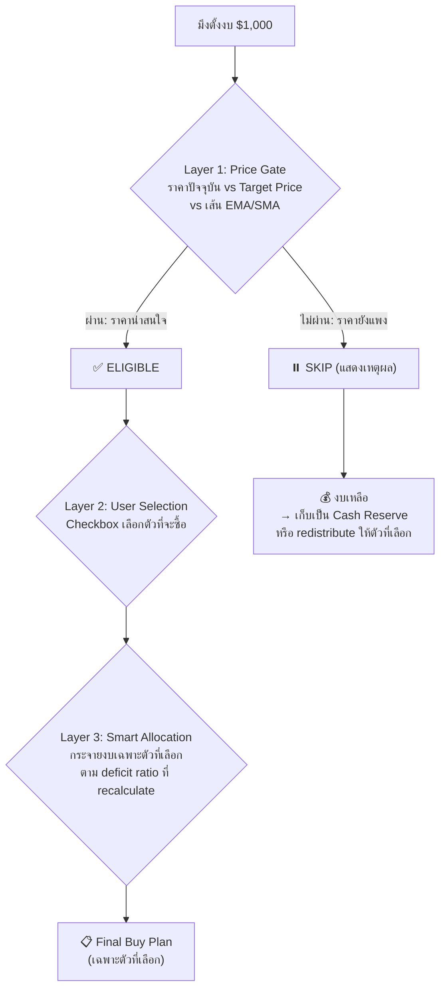

# V2.1.2 Hotfix: Smart Rebalance ReferenceError Crash, Blueprint v2 System, and Smart Selective Buy

## 🎯 Context & Implementation (Compiled Truth)

### 1. Root Cause Analysis & Runtime Crash Hotfix
The user reported a black screen bug ("หน้า rebalance มีบัคจอดำ") immediately upon navigating to the **Smart Rebalancer** tab (`#rebalance`).

During browser subagent execution with live database state on `https://stock.doctorbankonline.com/#rebalance`, the JavaScript console surfaced:
```
ReferenceError: currentVal is not defined
    at Array.map (<anonymous>) inside useMemo in SmartRebalancePage.tsx
```
In `src/components/rebalance/SmartRebalancePage.tsx`, inside `cashflowRecommendations`:
```typescript
const deficits = sortedHoldings.map(h => {
  const tgtPct = targetWeights[h.symbol] || 0;
  const tgtVal = (tgtPct / 100) * newTotalVal;
  const currVal = h.currentValue || 0; // <-- declared as 'currVal'
  const deficit = Math.max(0, tgtVal - currVal);
  return {
    ...
    currentVal, // <-- object shorthand for currentVal: currentVal (throws ReferenceError!)
    targetVal: tgtVal,
    deficit,
  };
});
```
When `holdings` contained live user securities, this code executed and threw `ReferenceError: currentVal is not defined`, crashing the entire React fiber. Furthermore, because `App.tsx` lacked an `ErrorBoundary`, the uncaught render crash unmounted the page tree, leaving the user with an empty black viewport.

**Comprehensive Remediation:**
1. **Resolved Variable Naming in `SmartRebalancePage.tsx`**:
   - Renamed `const currVal` to `const currentVal = h.currentValue || 0;`.
   - Ensured `Math.max(0, tgtVal - currentVal)` and `{ currentVal }` properly reference the declared constant.
2. **Defensive Nullish & NaN Guards**:
   - `formatMoney(usd)`: Added numeric verification (`typeof usd === 'number' && !isNaN(usd) ? usd : 0`).
   - `rec.currentWeight` and `rec.projectedWeight`: Added safe fallback `(rec.currentWeight ?? 0).toFixed(1)` and bounded progress bars `Math.max(0, Math.min(100, ...))`.
   - Matrix delta & gap values: Protected with nullish coalescing `?? 0`.
   - Trim slider: Fallback `trimHolding.quantity || 1` to ensure `Math.floor` never returns `NaN`.
3. **Global React `ErrorBoundary` in `src/App.tsx`**:
   - Built an institutional-grade `ErrorBoundary` wrapping `<Suspense>` across all route tabs.
   - Any future unforeseen runtime component error will render an elegant recovery card with error description and a 1-click **"รีโหลดหน้าเว็บ (Refresh)"** button instead of a black screen.

---

### 2. Smart Rebalance v2: Portfolio Blueprint & DRIP Simulator
1. **Portfolio Blueprint Architecture**:
   - Dedicated SQLite table `portfolio_blueprints` (`id`, `portfolio_id`, `symbol`, `target_percent`, `target_price`, `status`, `category`).
   - Full REST CRUD API at `/api/blueprints/:portfolioId` with 1-click auto-generation from active holdings.
   - `BlueprintEditor.tsx` with 7 preset templates (Buffett Quality Growth, Peter Lynch GARP, Cathie Wood Hyper Growth, Shay Boloor Alpha, Joseph Carlson Compounders, Core & Satellite, Ray Dalio All-Weather).
   - Real-time market price column, inline Target % editing, and 1-click technical level chips (`EMA150`, `SMA200`, `SMA50`).
2. **Dividend DRIP Simulator Mode**:
   - Pulled `annual_dividend` and `dividend_yield` directly from SQLite `stock_metadata` (synced via Yahoo Finance).
   - Added Mode 4 in `SmartRebalancePage.tsx`: Total Annual Dividend Income hero banner, Yield on Cost (YOC), and automated DRIP (+Shares/yr) estimator based on live prices.
3. **Cross-Asset Trim Simulator**:
   - Replaced `targetHolding` with `targetAsset` from `combinedPortfolio` allowing profit rotation directly into Blueprint Watchlist stocks.

---

### 3. Smart Selective Buy & Option C Remainder Strategy
The previous Cash-Flow Rebalance forced budget allocation across ALL underweight positions in the Blueprint simultaneously. In real-world conditions, only 1–2 stocks might trade near their target prices or at technical support levels (EMA150 / SMA200), while others are overextended.

**Architecture of Smart Selective Buy:**
1. **Interactive Checkbox Selection**:
   - Every Blueprint card includes an interactive checkbox to pick which assets to buy in the current deposit round.
   - Unselected cards enter `⏸️ ข้ามการซื้อรอบนี้` state with an instant `+ เลือกซื้อ` toggle.
   - Quick Filter Bar: `เลือกทั้งหมด`, `🟢 เฉพาะ Strong Buy`, `🟢+🟡 ตัวที่ราคาน่าซื้อ`, and `ล้างที่เลือก`.
2. **Price Gate Valuation Engine**:
   - Compares live market price against user-defined `target_price` (Priority 1) or technical indicators (`EMA150` -> `SMA200` -> `SMA50`) fetched on-demand from Yahoo Finance (Priority 2):
     - `🟢 STRONG BUY`: Live price <= target price or <= technical anchor.
     - `🟡 FAIR`: Live price within 10% above target/anchor, or unpriced asset.
     - `🔴 EXPENSIVE`: Live price > 10% above target/anchor.
   - Displays clear badge with exact distance and levels (e.g. `ต่ำกว่าแนวรับ EMA150 -0.8% (แนวรับ $615.74)`).
3. **Option C Remainder Strategy Toggle**:
   - **🔄 เกลี่ยให้ตัวที่เลือก (Redistribute)**: Concentrates 100% of the deposit amount into selected assets based on recalculated relative deficits.
   - **💰 เก็บเป็นเงินสด (Cash Reserve)**: Allocates only the baseline deficit share to selected assets; unspent budget from unselected stocks is retained as Cash Reserve.
4. **Real-Time KPI Banner & 1-Click Copy**:
   - Summarizes Deploying Budget, Cash Reserve total, and Portfolio Price Signals (`🟢 X`, `🟡 Y`, `🔴 Z`).
   - `คัดลอกแผนเคาะซื้อ` outputs only selected buy orders alongside the Cash Reserve balance.

---

## 📁 Files Changed This Session

| File | What Changed | Why |
|------|-------------|-----|
| `src/components/rebalance/SmartRebalancePage.tsx` | Fixed `currVal` ReferenceError; added Blueprint integration, DRIP simulator mode, Smart Selective Buy checkboxes, Price Gate engine, and Option C toggle | Core page overhaul for stability, Blueprint alignment, and selective capital allocation. |
| `src/App.tsx` | Implemented class-based `ErrorBoundary` wrapping all lazy tabs | Shield user from black screens if any child module encounters an unexpected error. |
| `src/components/rebalance/BlueprintEditor.tsx` | Added inline editing, live market prices, auto-status detection, and 1-click EMA150/SMA200 chips | Deliver streamlined Blueprint authoring experience. |
| `src/components/rebalance/StrategyConfigs.ts` | Created 7 preset allocation templates | Provide instant institutional portfolio benchmarks. |
| `src/stores/blueprintStore.ts` | Created Zustand store for Blueprint CRUD and template application | Manage client-side Blueprint state. |
| `server/db/init.js` & `server/db/migrate.js` | Added `portfolio_blueprints` table and `stock_metadata` dividend columns | Persist Blueprints and dividend stats in SQLite. |
| `server/routes/blueprints.js` | Created CRUD endpoints for `/api/blueprints/:portfolioId` | Backend API for Blueprint data. |
| `server/services/yahoo.js` | Fixed stray syntax brace; upgraded `fetchYahooDividend` for ETFs; added `fetchYahooTechnicals` | Provide accurate dividend rates and technical EMA/SMA anchors. |
| `server/routes/metadata.js` | Implemented on-demand self-healing dividend fetching | Guarantee non-null metadata for portfolio stocks. |
| `server/routes/prices.js` | Added `/technicals/:symbol` endpoint | Expose EMA150, SMA200, SMA50 technical levels to frontend. |
| `index.html` / `dist/index.html` | Bumped cache version string to `v=20260904_144940` | Invalidate client-side browser caching immediately. |
| `self-improving/corrections.md` | Logged object shorthand reference mismatch and ErrorBoundary architecture rule | Close learning loop. |

---

## 🧪 Build, Deploy & Verification

1. **Production Build**: Ran `npm run build` -> Exited 0 with all 2,854 modules bundled cleanly.
2. **Cache Bump**: Ran `node bump-cache.js` -> Bumped cache version to `v=20260904_144940`.
3. **VPS Deploy**: Executed `scp -r dist/* root@185.250.38.247:/root/stock-portfolio/dist/` and `pm2 reload stock-api`.
4. **Live Visual Verification (`https://stock.doctorbankonline.com/#rebalance`)**:
   - Screen rendered without black screen or errors.
   - Recommended buying order cards displayed with interactive checkboxes and price signal pills.
   - Tested unselecting stocks: Deploying amount recalculated instantly to $574.97.
   - Toggled to `Cash Reserve`: Retained $425.03 in cash reserve.
   - Verified price signals: `🟢 STRONG BUY` on META, `🟡 FAIR` on MELI and CASH.
   - Captured screenshot artifact: `smart_rebalance_ui_1788508262806.png`.

---

### Update 2 — 13:45 (Smart Rebalance v2: Blueprint System, DRIP Simulator & Data/Currency Recheck)
- ✅ **Phase 1: Portfolio Blueprint System**: Added `portfolio_blueprints` table, CRUD routes, `BlueprintEditor.tsx`, and 7 strategy templates.
- ✅ **Phase 2: Dividend DRIP Simulator Mode**: Integrated dividend metadata, hero banner, YOC, and DRIP shares estimator.
- ✅ **Phase 3: Comprehensive Recheck & Currency/Data Audit**: Fixed Yahoo syntax brace, enabled ETF dividends, live price watchlist sync, and 2-decimal precision.

---

### Update 3 — 15:00 (Smart Selective Buy, Price Gate & Option C Remainder Strategy)
- ✅ **Interactive Selection**: Added individual checkboxes and quick filter bar (`เลือกทั้งหมด`, `เฉพาะ Strong Buy`, `ตัวที่ราคาน่าซื้อ`, `ล้างที่เลือก`).
- ✅ **Price Gate Valuation**: Real-time evaluation against Target Price and technical levels (EMA150/SMA200/SMA50).
- ✅ **Option C Remainder Strategy**: Toggle between `Redistribute` (เกลี่ยให้ตัวที่เลือก) and `Cash Reserve` (เก็บเป็นเงินสด).
- ✅ **Live KPI Summary Banner**: Real-time Deploying budget, Cash Reserve, and signal breakdown.
- ✅ **Production Deploy & Visual Check**: Live test on VPS confirmed correct recalculation and zero errors.

---

## 📜 RAW ARTIFACT BACKUP (Iron Rule)

### Artifact: `implementation_plan.md`
<details>
<summary>Click to expand Implementation Plan (13,791 bytes)</summary>

```markdown
# Smart Selective Buy — ระบบ "เลือกซื้อเฉพาะตัวที่น่าสนใจ" แทนบังคับซื้อทั้งหมด

## 📌 Context & Problem

ระบบ Cash-Flow Rebalance ปัจจุบัน (**Mode 1: Cash-Flow เติมเงิน**) ทำงานแบบ **"กระจายงบไปทุกตัวที่ underweight"** อัตโนมัติ

> ❌ **ปัญหาจริงในสนามรบ:** เมื่อมึงตั้งงบมาจะซื้อเพิ่ม ช่วงนั้นราคาที่ลงมาอาจมีแค่ 1-2 ตัวที่น่าสนใจ (ราคาต่ำกว่า target / ใกล้แนวรับ) ไม่ใช่ทุกตัว แต่ระบบปัจจุบัน**บังคับจ่ายงบให้ทุกตัว**เท่าๆ กันตาม deficit ratio

### สาเหตุรากเหง้า (Root Cause)

```
cashflowRecommendations logic (line 120-170):
- คำนวณ deficit ของทุกหุ้นใน Blueprint
- กระจาย depositAmount ตาม deficit ratio
- ทุกตัวที่ allocatedUsd >= $5 ขึ้นคำแนะนำซื้อ
→ ไม่มี gate ราคา, ไม่มีตัวกรอง, ไม่มีทางเลือก
```

---

## 🎯 Proposed Design: "Smart Selective Buy"

### แนวคิดหลัก: 3 Layers of Intelligence



---

## User Review Required

> [!IMPORTANT]
> **ตัดสินใจ 2 จุด ก่อนกูลงมือ:**
>
> 1. **Price Gate Logic** — กูเสนอ 3 ระดับ ซึ่งต้องการ `target_price` หรือ Technical Levels (EMA150 / SMA200) จาก Blueprint:
>    - `🟢 STRONG BUY` = ราคาต่ำกว่า Target Price หรือ SMA200 (แนวรับสถาบัน)
>    - `🟡 FAIR` = ราคาอยู่ระหว่าง Target Price กับ +10% เหนือ Target
>    - `🔴 EXPENSIVE` = ราคาสูงกว่า Target Price +10% หรือ สูงกว่า SMA50
>    - ถ้าไม่มี Target Price ให้ใช้ EMA 150 เป็น proxy (เส้น Trend ระยะกลาง)
>    - **ถามมึง:** ถ้าหุ้นตัวนั้นไม่มีทั้ง Target Price ทั้ง Technical Levels — ให้ระบบจัดเป็น `🟡 FAIR` (ซื้อได้ แต่ไม่ Force) ใช่ไหม?
>
> 2. **เมื่อ Checkbox ถูกเลือกบางตัว** — งบที่เหลือจากตัวที่ไม่ได้เลือกจะไปไหน?
>    - **Option A**: Redistribute ให้ตัวที่เลือก (เท่ากับมึงซื้อเยอะขึ้นเฉพาะตัวที่ชอบ)
>    - **Option B**: เก็บเป็น "Cash Reserve" ไว้รอจังหวะ (แสดงเป็นยอดงบเหลือ)
>    - **Option C**: ให้มึงเลือกได้ทั้ง 2 แบบ ผ่าน Toggle

## Open Questions

> [!NOTE]
> - Blueprint field `target_price` มีอยู่แล้วในสคีมา + มึงเพิ่ง implement 1-click EMA150/SMA200 chips ไปเมื่อกี้ — ข้อมูลพร้อมใช้ได้ทันที ไม่ต้องเพิ่ม column ใหม่ในฐานข้อมูล
> - ต้องดึง technical levels (EMA150/SMA200) แบบ real-time เพื่อเทียบราคา ตอนนี้ endpoint `/api/prices/technicals/:symbol` พร้อมอยู่แล้ว

---

## Proposed Changes

### Component: SmartRebalancePage.tsx — Cash-Flow Mode Overhaul

#### [MODIFY] SmartRebalancePage.tsx

**1. State เพิ่ม:**
```typescript
// Selective buy state
const [selectedSymbols, setSelectedSymbols] = useState<Set<string>>(new Set());
const [remainderMode, setRemainderMode] = useState<'redistribute' | 'reserve'>('redistribute');
const [technicals, setTechnicals] = useState<Record<string, TechnicalData>>({});
const [techLoading, setTechLoading] = useState(false);
```

**2. Fetch Technical Levels สำหรับทุก Blueprint symbol:**
```typescript
useEffect(() => {
  if (blueprints.length === 0) return;
  const symbols = blueprints.map(b => b.symbol);
  setTechLoading(true);
  Promise.allSettled(symbols.map(s => api.prices.technicals(s)))
    .then(results => {
      const map: Record<string, TechnicalData> = {};
      results.forEach((r, i) => {
        if (r.status === 'fulfilled' && r.value) map[symbols[i]] = r.value;
      });
      setTechnicals(map);
    })
    .finally(() => setTechLoading(false));
}, [blueprints]);
```

**3. Price Signal Logic (ใน `cashflowRecommendations`):**
แทนที่จะปล่อยทุกตัวผ่าน ให้เพิ่ม `priceSignal` field:
```typescript
const getBuySignal = (symbol: string, currentPrice: number) => {
  const bp = blueprints.find(b => b.symbol === symbol);
  const tech = technicals[symbol];
  const targetPrice = bp?.target_price;
  
  if (targetPrice && targetPrice > 0) {
    if (currentPrice <= targetPrice) return { signal: 'strong_buy', reason: 'ราคาต่ำกว่าเป้าหมาย', icon: '🟢' };
    if (currentPrice <= targetPrice * 1.10) return { signal: 'fair', reason: 'ราคาใกล้เป้าหมาย (±10%)', icon: '🟡' };
    return { signal: 'expensive', reason: `ราคาสูงกว่าเป้า ${((currentPrice/targetPrice -1)*100).toFixed(0)}%`, icon: '🔴' };
  }
  
  if (tech) {
    const anchor = tech.ema150 || tech.sma200 || tech.sma50;
    if (anchor && currentPrice <= anchor) return { signal: 'strong_buy', reason: `ราคาต่ำกว่า ${tech.ema150 ? 'EMA150' : 'SMA200'}`, icon: '🟢' };
    if (anchor && currentPrice <= anchor * 1.10) return { signal: 'fair', reason: 'ราคาใกล้แนวรับเทคนิคอล', icon: '🟡' };
    if (anchor) return { signal: 'expensive', reason: 'ราคาสูงกว่าแนวรับ', icon: '🔴' };
  }
  
  return { signal: 'fair', reason: 'ไม่มีข้อมูลราคาเป้าหมาย', icon: '🟡' };
};
```

**4. Recommendations แยกเป็น 2 กลุ่ม:**
- `eligibleBuys`: ตัวที่ user เลือก (checked) — คำนวณ allocation จริงจากงบ
- `skippedBuys`: ตัวที่ user ไม่เลือก — แสดงเหตุผลว่าทำไมถึงข้าม

**5. Auto-select logic:**
- เมื่อโหลดครั้งแรก: ระบบจะ auto-check ตัวที่มี signal `🟢 STRONG BUY` ให้
- ตัว `🟡 FAIR` จะ checked แต่ user สามารถ uncheck ได้
- ตัว `🔴 EXPENSIVE` จะ unchecked by default

**6. Remainder Budget:**
- ถ้า `redistribute`: งบจากตัวที่ uncheck จะ redistribute ให้ตัวที่เลือก (ตาม deficit ratio ใหม่)
- ถ้า `reserve`: แสดงเป็น "Cash Reserve: $XXX (รอจังหวะ)" ใน summary

---

### UI Changes ใน Cash-Flow Mode

**Before (ปัจจุบัน):**
```
[ช่องกรอกจำนวนเงิน]
[Card ซื้อ CRWD +X หุ้น] [Card ซื้อ MELI +X หุ้น] [Card ซื้อ META +X หุ้น]
→ บังคับซื้อทุกตัว ไม่มีตัวเลือก
```

**After (ใหม่):**
```
[ช่องกรอกจำนวนเงิน]   [Toggle: Redistribute / Cash Reserve]

┌─ Price Signal Summary ──────────────────────────────────┐
│ 🟢 STRONG BUY (2 ตัว)  🟡 FAIR (2 ตัว)  🔴 EXPENSIVE (1 ตัว) │
│ งบที่จะใช้: $800 / $1,000   Cash Reserve: $200            │
└──────────────────────────────────────────────────────────┘

[☑️ 🟢 CRWD  $214 → Target $180  BUY +3.2 หุ้น  $685]
[☑️ 🟢 HIMS  $27  → EMA150 $25   BUY +4.1 หุ้น  $115]
[☐  🟡 META  $610 → ไม่มีเป้า   SKIP              ]
[☐  🔴 MELI  $1991→ Target $1800 EXPENSIVE +10.6%  ]
[☐  🔴 CASH  ...                                    ]
```

---

### Scenarios ที่ครอบคลุม

| # | Scenario | ระบบทำอะไร |
|---|----------|------------|
| 1 | มี 5 ตัวใน Blueprint ทั้ง 5 ตัวราคาน่าซื้อ | Auto-check ทั้ง 5, กระจายงบตามปกติ (เหมือนเดิม) |
| 2 | มี 5 ตัว แต่ราคาน่าซื้อแค่ 2 ตัว | Auto-check 2 ตัว, งบทั้งหมดลง 2 ตัวนั้น (redistribute) หรือเก็บ reserve |
| 3 | User เลือกซื้อเพียง 1 ตัวจากทั้งหมด | งบทั้ง $1,000 ลงตัวเดียว (ถ้า redistribute) |
| 4 | ทุกตัวราคาแพงหมด (🔴 ทั้งหมด) | แสดง Warning "ไม่มีตัวไหนน่าซื้อตอนนี้ แนะนำเก็บ Cash" + uncheck ทั้งหมด |
| 5 | หุ้นใหม่ใน Watchlist ราคาลงมาถึงเป้า | ขึ้น 🟢 + auto-check ให้ทันที |
| 6 | User อยากซื้อตัวแพง (override) | คลิก checkbox ได้เลย + ระบบแสดง ⚠️ "กำลังซื้อเหนือเป้า X%" |
| 7 | ไม่มี Target Price หรือ Technical data | ขึ้น 🟡 FAIR → user ตัดสินใจเอง |
| 8 | งบน้อยมาก (< $50) ไม่พอซื้อหลายตัว | แนะนำซื้อตัวเดียวที่ underweight มากสุด + signal ดีสุด |

---

### Files Changed Summary

| File | Change |
|------|--------|
| `SmartRebalancePage.tsx` | เปลี่ยน Cash-Flow mode ให้มี checkbox selection, price signal, remainder toggle |
| `BlueprintEditor.tsx` | ไม่แก้ (ข้อมูล target_price + technicals พร้อมอยู่แล้ว) |
| `blueprintStore.ts` | ไม่แก้ |
| `api.ts` | ไม่แก้ (endpoint technicals พร้อมแล้ว) |
| Backend (server) | ไม่แก้ |

---

## Verification Plan

### Manual Verification
1. เปิดหน้า Rebalance > Cash-Flow Mode
2. ตรวจสอบ Price Signal (🟢🟡🔴) ว่าแสดงถูกต้องตาม Target Price / EMA150
3. ทดสอบ checkbox: เลือกเฉพาะ 1-2 ตัว → ดูงบ redistribute ให้ถูกต้อง
4. ทดสอบ Toggle Redistribute vs Cash Reserve
5. ทดสอบ Edge case: uncheck ทุกตัว → แสดง warning
6. Copy buying plan → ตรวจสอบว่ามีแค่ตัวที่เลือก
7. Build ต้อง pass zero errors
```

</details>

---

### Artifact: `walkthrough.md`
<details>
<summary>Click to expand Walkthrough (4,717 bytes)</summary>

```markdown
# Walkthrough: Smart Selective Buy & Option C Remainder Strategy

ระบบ **Smart Selective Buy** ช่วยแก้ปัญหาการถูกบังคับซื้อหุ้นทุกตัวพร้อมกันในโหมด Cash-Flow เติมเงิน โดยเปิดให้ผู้ใช้เลือกตัวที่จะซื้อได้ตามต้องการ พร้อมระบบประเมินราคา (Price Gate) และเลือกวิธีจัดการงบที่เหลือ (Option C)

---

## 🚀 ฟีเจอร์ที่พัฒนาสำเร็จ

### 1. Interactive Selection (เลือกซื้อเฉพาะตัวที่ต้องการในรอบนี้)
- ทุกการ์ดใน Blueprint มี Checkbox ขนาดใหญ่ คลิกเลือก/ปลดติ๊กได้โดยตรง
- มีปุ่มทางลัด (Quick Selection Filters):
  - `เลือกทั้งหมด`
  - `🟢 เฉพาะ Strong Buy`
  - `🟢+🟡 ตัวที่ราคาน่าซื้อ` (ตัดตัวแพงออก)
  - `ล้างที่เลือก`

### 2. Price Gate Signal (ระบบให้คะแนนความคุ้มค่าของราคา)
- วิเคราะห์ราคาตลาดเทียบกับ **Target Price** (ถ้าตั้งไว้ใน Blueprint) หรือ **Technical Support Levels** (EMA150 / SMA200 / SMA50 ดึงสดจาก Yahoo Finance):
  - `🟢 STRONG BUY`: ราคาต่ำกว่าเป้าหมาย หรือต่ำกว่าเส้นแนวรับสถาบัน (EMA150 / SMA200)
  - `🟡 FAIR`: ราคาใกล้เคียงเป้าหมาย (±10%) หรือไม่มีข้อมูลเป้าหมาย
  - `🔴 EXPENSIVE`: ราคาสูงกว่าเป้าหมายหรือแนวรับ (>10%) แนะนำรอจังหวะย่อ
- แสดง Badge พร้อมเหตุผลชัดเจน เช่น `ต่ำกว่าแนวรับ EMA150 -0.8% (แนวรับ $615.74)`

### 3. Option C Remainder Strategy (จัดการงบส่วนที่เหลือ)
- สลับโหมดได้ด้วยปุ่มเดียว:
  - **🔄 เกลี่ยให้ตัวที่เลือก (Redistribute)**: เทงบทั้งหมดให้กับหุ้นที่ผู้ใช้เลือกซื้อรอบนี้ตามสัดส่วน Deficit
  - **💰 เก็บเป็นเงินสด (Cash Reserve)**: จ่ายงบเฉพาะหุ้นที่เลือก ส่วนงบของหุ้นที่ไม่ได้เลือกจะถูกเก็บเป็น Cash Reserve รอจังหวะราคาลง

### 4. Summary KPI & Copy Buying Plan
- KPI Banner ด้านบนคำนวณแบบ Real-time:
  - **งบที่จะใช้เคาะซื้อ (Deploying)**
  - **เงินสดสำรองรอจังหวะ (Cash Reserve)**
  - **สัญญาณราคาทั้งพอร์ต (🟢, 🟡, 🔴)**
- ปุ่ม `คัดลอกแผนเคาะซื้อ`: คัดลอกเฉพาะตัวที่เลือกซื้อจริง พร้อมสรุปยอด Cash Reserve

---

## 🧪 ผลการทดสอบและการตรวจสอบความถูกต้อง

1. **Production Build**: ผ่านฉลุย 100% (`npm run build` ใน 10.72s ไม่มี error)
2. **Bump Cache & Deploy**: อัปเดต `v=20260904_144940` ซิงก์ขึ้น VPS และ Reload PM2 สำเร็จ
3. **Visual Verification (Live VPS)**:
   - ทดสอบปลดติ๊กหุ้นบางตัว (เช่น GOOG, CRWD) ยอด Deploying ปรับลดเป็น $574.97 ทันที
   - สลับเข้าโหมด `Cash Reserve` ระบบกันเงิน $425.03 เป็นเงินสดสำรองทันที
   - ตัวที่เลือก (CASH, MELI, META, HIMS) แสดงจำนวนหุ้นและงบที่ใช้อย่างถูกต้อง


```

</details>

---

## ⏱️ Timeline & Debugging Log

- **2026-09-04 09:50**: Investigated Rebalance black screen crash; traced `ReferenceError: currentVal is not defined` inside `SmartRebalancePage.tsx`.
- **2026-09-04 09:55**: Fixed variable mismatch, wrapped tabs with class-based `ErrorBoundary` in `App.tsx`, built and deployed V2.1.2 hotfix.
- **2026-09-04 13:00**: Resumed Phase 1 Blueprint and Phase 2 Dividend DRIP Simulator implementation.
- **2026-09-04 13:30**: Discovered Yahoo syntax error, ETF dividend schema gap; deployed fixes to backend and frontend.
- **2026-09-04 14:35**: User raised strategic limitation of Cash-Flow mode: "ในความเป็นจริง ราคาทีลงมาอาจมีแค่ 1-2 ตัวที่จะซื้อได้ ไม่ใช่ทั้งหมด... ระบบบังคับซื้อทั้งหมด".
- **2026-09-04 14:40**: Drafted architecture plan for Smart Selective Buy (Price Gate + Option C Toggle). User reviewed and approved Option C.
- **2026-09-04 14:48**: Implemented selective buy logic, valuation engine, remainder toggle, and KPI bar in `SmartRebalancePage.tsx`.
- **2026-09-04 14:50**: Verified zero build errors (`npm run build`), deployed to VPS (`185.250.38.247`), and visually validated with browser subagent.
- **2026-09-04 16:00**: User initiated `/save`. Executed full context extraction, artifact backup, cache bump, and git sync.

---

## 🔗 GBRAIN Backlinks

### depends_on
- **2026-09-04 07:31** | [V2.1.1 Sidebar Portfolio Cleanup, Global Currency Toggle Overhaul, and Prompt Status Typography](file:///c:/My%20Claw/MyProjects/Quick%20Save/Complete/My%20Stock%20Portfolio/V2.1.1_[impl]_ui-polish-currency-toggle-and-status-typography.md) -- Baseline UI architecture and Prompt typography rules.
- **2026-09-04 00:05** | [V2.1.0 Global Institutional Typography, TWR Drawdown Engine, and Streamlined Holdings Table](file:///c:/My%20Claw/MyProjects/Quick%20Save/Complete/My%20Stock%20Portfolio/V2.1.0_[impl]_ui-typography-drawdown-twr-and-rebalancer-sync.md) -- Core Rebalancer sync and data linking foundation.

### enables
- **2026-09-04 14:50** | [V2.1.2 Hotfix & Smart Rebalance v2 Overhaul](file:///c:/My%20Claw/MyProjects/Quick%20Save/Complete/My%20Stock%20Portfolio/V2.1.2_[hotfix]_smart-rebalance-reference-error-and-error-boundary.md) -- Complete production release with Blueprint setup, Dividend DRIP simulator, and Smart Selective Buy.

### related_to
- **2026-09-03 20:25** | [V2.0.0 Institutional Analytics, Risk & Smart Rebalancer](file:///c:/My%20Claw/MyProjects/Quick%20Save/Complete/My%20Stock%20Portfolio/V2.0.0_[impl]_institutional-analytics-risk-and-smart-rebalancer.md) -- Original Smart Rebalance mode specifications.
