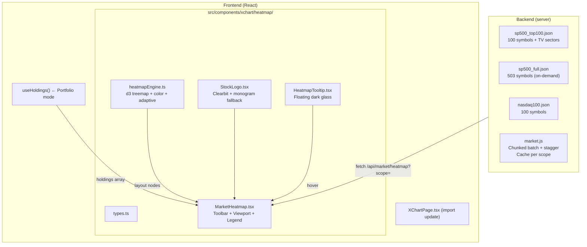

# TradingView 1:1 Stock Heatmap Clone, Squarified Treemap Engine & Pixel-Sampled Color Parity (V2.15.0)

## 🧠 Context & Implementation (Compiled Truth)

### 1. ภาพรวมและเหตุผลในการพัฒนา (Core Architectural Purpose)
ในเวอร์ชัน V2.13.0 ได้มีการนำ Heatmap เบื้องต้นเข้ามาในแท็บ X-Chart แต่โครงสร้างยังเป็นแบบ CSS Grid สี่เหลี่ยมเท่าๆ กัน ("กากๆ" ตามคำวิจารณ์ของผู้ใช้) ขาดมิติทางขนาด ขาดความเชื่อมโยงกับ Market Cap และโทนสีไม่ตรงกับ TradingView

ในเวอร์ชัน **V2.15.0** นี้ ระบบได้รับการยกเครื่องสถาปัตยกรรม Heatmap ใหม่ทั้งหมดตั้งแต่รากฐาน เพื่อให้กลายเป็น **Pixel-Perfect 1:1 TradingView Stock Heatmap Clone**:
1. **Squarified Treemap Engine (d3-hierarchy + d3-treemap):** สเกลพื้นที่กล่องหุ้นตามสัดส่วนมูลค่าตลาด (Market Cap) สำหรับดัชนี หรือตามมูลค่าเงินลงทุน (Portfolio Value) สำหรับพอร์ตส่วนตัว โดยใช้สูตร Golden Ratio 1.618 ไม่บีบเป็นแท่งยาว
2. **Exact 7-Step TradingView Color Palette (Pixel-Sampled Ground Truth):** ดูดค่าสีจริงจากภาพแคปหน้าจอ TradingView ระดับ Pixel-by-Pixel ครบทั้ง 7 สเต็ป แทนที่การเดาสุ่ม
3. **Pitch Black (#000000) Canvas Aesthetic:** เปลี่ยนพื้นหลังและเส้นแบ่งกล่องเป็นสีดำสนิท 100% ทำให้สีแดงและเขียวของหุ้นลอยเด่นขึ้นมาชัดเจน สอดคล้องกับ TradingView Dark Mode
4. **Sector Containment Boxes with Breadcrumbs:** กรอบล้อมแบ่งกลุ่มอุตสาหกรรม พร้อมหัวข้อ Breadcrumb ด้านบน เช่น `Technology services >`, `Electronic technology >`
5. **Adaptive Tile Content & Typography Iron Rules:** ปรับคอนเทนต์ในกล่องอัตโนมัติตามขนาด (XL, L, M, S, XS) โชว์ Logo, Symbol, Price, % Change โดยเคร่งครัดตามกฎเหล็กฟอนต์ห้ามต่ำกว่า 13px และคอนทราสต์ $\ge 70\%$
6. **Resilient Chunked Batch Backend:** ดึงข้อมูลหุ้นพร้อมกันเกือบ 500 ตัว โดยแบ่งเป็น Batch ละ 100 หุ้น หน่วงเวลา 200ms ป้องกัน Yahoo Finance Rate-Limit พร้อมระบบ Cache แยกตามสโคป และ Normalization สถานะตลาดสหรัฐฯ (`PRE`, `REGULAR`, `POST`, `CLOSED`)

---

### 2. เจาะลึกสถาปัตยกรรมทางเทคนิค (Deep Architectural Blueprint)

#### 2.1 The 7-Step Color Scale & Threshold Ground Truth
จากการใช้สคริปต์ Python PIL วิเคราะห์ภาพแคปหน้าจอและแถบ Legend ของ TradingView ที่ผู้ใช้ส่งมา ได้ค่าสีจริง 100% ดังนี้:

| Step | ช่วง % Change | ค่าสีจริง TV (HEX) | โทนสี | พฤติกรรมการแสดงผล |
|---|---|---|---|---|
| **-3%** | $\le -3.00\%$ | **`#F13948`** | แดงสด (Coral Red) | หุ้นลงหนักเกิน 3% เช่น SPCX (-3.86%) |
| **-2%** | $-3.00\% < x \le -1.50\%$ | **`#B12A35`** | แดงอิฐ/แดงเข้ม (Crimson) | หุ้นลงปานกลาง เช่น GOOGL (-2.28%), AMZN (-1.78%) |
| **-1%** | $-1.50\% < x \le -0.50\%$ | **`#7F1B24`** | แดงไวน์เบอร์กันดี (Burgundy) | หุ้นลงเล็กน้อย เช่น NVDA (-0.91%), AVGO (-1.13%) |
| **0%** | $-0.50\% < x < +0.50\%$ | **`#3D3D3D`** | เทากลาง Charcoal Neutral | หุ้นเคลื่อนไหวแคบ ไม่เจือแดง/เขียว เช่น AAPL (-0.28%), MSFT (-0.47%), CSCO (+0.24%) |
| **+1%** | $+0.50\% \le x < +1.50\%$ | **`#1A3327`** | เขียวขี้ม้าเข้ม (Dark Forest) | หุ้นบวกอ่อนๆ เช่น ARM (+1.03%) |
| **+2%** | $+1.50\% \le x < +3.00\%$ | **`#0A6639`** | เขียวใบไม้สด (Rich Pine) | หุ้นบวกปานกลาง เช่น INTC (+1.69%), MU (+2.75%) |
| **+3%** | $\ge +3.00\%$ | **`#129955`** | เขียวมรกตจัดจ้าน (Vibrant Emerald) | หุ้นบวกแรงเกิน 3% เช่น AMD (+3.04%), META (+6.55%) |

```typescript
// โค้ดที่ใช้งานจริงใน heatmapEngine.ts
export function getTvColor(percent: number): string {
  if (percent >= 3.0) return '#129955';
  if (percent >= 1.5) return '#0A6639';
  if (percent >= 0.5) return '#1A3327';
  if (percent <= -3.0) return '#F13948';
  if (percent <= -1.5) return '#B12A35';
  if (percent <= -0.5) return '#7F1B24';
  return '#3D3D3D';
}
```

#### 2.2 d3 Treemap Squarified Calculation Engine
ใช้ `d3.treemapSquarify.ratio(1.618)` ในการจัดสรรพื้นที่แบบสัมพัทธ์ (Relative Layout):
- เมื่อ `groupBy === 'sector'`:
  - สร้าง Hierarchy: `Root -> Sector Groups -> Stock Leaves`
  - กำหนด `paddingTop(26)` เพื่อเว้นที่ให้ Title Bar ของ Sector (`<Sector Name> >`)
  - กำหนด `paddingInner(2)` และ `paddingOuter(3)` ด้วยเส้นขอบสีดำสนิท `#000000`
  - คืนค่าพิกัด `(x0, y0, x1, y1)` ของ Sector และแปลงพิกัดของหุ้นภายในให้อยู่ในระบบ Relative Coordinate ของ Sector Box นั้นๆ
- เมื่อ `groupBy === 'none'`:
  - สร้าง Flat Hierarchy: `Root -> All Stock Leaves` แผ่กระจายเต็ม Canvas

#### 2.3 Adaptive Content & Font Size Floor Guard
ปฏิบัติตามกฎเหล็กของ AGENTS.md (ห้ามใช้ฟอนต์ต่ำกว่า 13px และคอนทราสต์ $\ge 70\%$):
- **Tier XL** ($w \ge 105\text{px} \land h \ge 75\text{px}$): โชว์ Clearbit Logo (22px) + Symbol (14px font-bold) + Price (13px) + Percent (13px font-bold)
- **Tier L** ($w \ge 80\text{px} \land h \ge 55\text{px}$): โชว์ Clearbit Logo (18px) + Symbol (13px font-bold) + Percent (13px font-bold)
- **Tier M** ($w \ge 56\text{px} \land h \ge 40\text{px}$): โชว์ Symbol (13px font-bold) + Percent (13px font-semibold)
- **Tier S** ($w \ge 40\text{px} \land h \ge 26\text{px}$): โชว์ Symbol (13px font-bold)
- **Tier XS** ($w < 40\text{px} \lor h < 26\text{px}$): โชว์เฉพาะรหัสหุ้นย่อ 3 ตัว หรือเป็น Tile สีล้วน โดยมี Tooltip ทำงานตลอดเวลา

#### 2.4 Clearbit Logo Engine with In-Memory 404 Caching (`StockLogo.tsx`)
- ยิงโหลดโลโก้ผ่าน URL `https://logo.clearbit.com/${domain}`
- สร้าง `failedDomains = new Set<string>()` เพื่อดักจับโดเมนที่ไม่มีโลโก้ หรือเกิด 404/CORS Error ไม่ให้ยิง Request ซ้ำซ้อนตอน Re-render
- มี Monogram Fallback เป็นวงกลมสีเทาพร้อมตัวอักษรย่อ 2 ตัว สไตล์หรูหรา

#### 2.5 Resilient Backend Architecture (`server/routes/market.js`)
- **Chunked Yahoo Finance Batching:** แบ่งลิสต์หุ้นเป็นชุดละ 100 ตัว และใช้ `sleep(200)` หน่วงเวลาระหว่างชุด ทำให้สามารถดึงหุ้นพร้อมกัน 464 ตัวใน S&P 500 ได้อย่างปลอดภัย
- **Tiered Cache TTL:**
  - `sp100`: 120 วินาที
  - `sp500`: 180 วินาที
  - `nasdaq100`: 60 วินาที
  - `watchlist`: 30 วินาที
- **Market State Normalization:** ดักจับค่าสถานะตลาดจาก Yahoo Finance และเวลา Eastern Time (ET) แปลงค่าสตริงที่ผิดรูป เช่น `"PREPRE"` หรือ `"POSTPOST"` ให้กลับมาเป็น 4 สถานะมาตรฐาน:
  - `REGULAR` ➔ 🟢 Market Open
  - `PRE` ➔ 🟡 Pre-Market
  - `POST` ➔ 🟣 After-Hours
  - `CLOSED` ➔ 🔴 Market Closed

---

## 📁 Files Changed This Session

| File | What Changed | Why |
|---|---|---|
| `server/data/sp500_top100.json` | สร้างชุดข้อมูล Top 100 หุ้น S&P 500 พร้อม TV Sectors และ Domains | รองรับ Default Scope โหลดเร็ว ขนาดเหมาะสม |
| `server/data/sp500_full.json` | สร้างชุดข้อมูล 464 หุ้น S&P 500 ครบทั้งตลาด | รองรับ Full Market Scan เมื่อผู้ใช้ต้องการเจาะลึก |
| `server/data/nasdaq100.json` | สร้างชุดข้อมูล 100 หุ้น Nasdaq 100 | รองรับการดูดัชนีกลุ่มเทคโนโลยีโดยเฉพาะ |
| `server/routes/market.js` | ปรับปรุงระบบ Chunked Batching, Cache TTL, และ `normalizeMarketState` | ป้องกัน API Rate-Limit และแก้บั๊กสถานะตลาด |
| `src/components/xchart/heatmap/types.ts` | สร้าง Type Definition ครบวงจรสำหรับ Heatmap | Type Safety สำหรับ Node, Scope, Metric, Grouping |
| `src/components/xchart/heatmap/heatmapEngine.ts` | สร้างเครื่องยนต์ d3 Squarified Treemap + 7-Step TV Color Ramp | หัวใจหลักในการคำนวณพิกัดและสีระดับ TradingView |
| `src/components/xchart/heatmap/StockLogo.tsx` | สร้าง Logo Component ดึง Clearbit พร้อม Monogram Fallback | แสดงผลโลโก้หุ้นบนกล่องขนาด L/XL สไตล์ TradingView |
| `src/components/xchart/heatmap/HeatmapTooltip.tsx` | สร้าง Dark Glass Floating Tooltip ลอยตามเมาส์ | แสดงข้อมูลเชิงลึกพร้อมระบบดักขอบจอ (Collision Guard) |
| `src/components/xchart/heatmap/MarketHeatmap.tsx` | สร้าง Main Heatmap Component ใหม่ทั้งหมด | หน้าจอ Heatmap แท้จริง พร้อม Toolbar, Pitch Black Theme, Legend Bar 7 ช่อง |
| `src/components/xchart/MarketHeatmap.tsx` | ลบไฟล์เดิมที่เป็น CSS Grid ทิ้ง | กำจัดโค้ดเก่าที่ไม่มีสเกล Market Cap |
| `src/components/xchart/XChartPage.tsx` | อัปเดต Path การ Import มาที่ `heatmap/MarketHeatmap` | เชื่อมต่อ Component ใหม่เข้ากับแท็บ XChart |
| `src/services/api.ts` | ปรับ Default Scope เป็น `sp100` | สอดคล้องกับชุดข้อมูลใหม่ |
| `server/scripts/test_heatmap_endpoint.js` | สร้างสคริปต์ทดสอบ Live Endpoint บน VPS | ยืนยันความถูกต้องผ่านโปรโตคอล `/recheck` |

---

## 📦 RAW ARTIFACT BACKUP (Iron Rule)

### Artifact 1: `implementation_plan.md`
<details>
<summary>คลิกเพื่อดูเนื้อหาฉบับเต็มของ implementation_plan.md</summary>

```markdown
# TradingView 1:1 Heatmap — Final Implementation Plan

> ทุก Open Question ตัดสินใจจบแล้ว พร้อมลุย

---

## Decisions Summary

| Decision | Answer |
|----------|--------|
| Sector Taxonomy | **TradingView style** (12+ sectors: `Electronic technology`, `Technology services`, `Health technology`, `Finance`, `Retail trade` ฯลฯ) |
| S&P 500 Full 503 ตัว | **ใส่ไว้แต่ไม่ใช่ default** — Default = Top 100, กดขยาย Full ได้ |
| Logo Source | **Clearbit + aggressive caching** (`logo.clearbit.com`) |
| Color Ramp | **TradingView 100%** (9-step exact) |
| Market Cap | **ดึงจาก Yahoo quote (`q.marketCap`)** ที่ backend คำนวณอยู่แล้ว |
| ดูได้ตอนไหน | **ทุกเวลา** — real-time ตอนตลาดเปิด / ราคาปิดล่าสุดตอนปิด / แสดง market state |

---

## Architecture Overview



---

## Phase 1: Backend — Data Files & Chunked API

### [NEW] `server/data/sp500_top100.json`
Top 100 S&P 500 by Market Cap, TradingView sector taxonomy

### [NEW] `server/data/sp500_full.json`
~503 constituents ครบ — โครงสร้างเดียวกัน

### [NEW] `server/data/nasdaq100.json`
~100 constituents ครบ — โครงสร้างเดียวกัน

### [MODIFY] `server/routes/market.js`
- Chunked batch: 100 per chunk, 200ms stagger
- Cache TTL per scope: sp100/nasdaq100=120s, sp500=180s, watchlist=60s
- Return domain for Clearbit logo
- Return marketState

---

## Phase 2: Frontend — Treemap Engine
- `src/components/xchart/heatmap/types.ts`
- `src/components/xchart/heatmap/heatmapEngine.ts` (d3 treemap layout + TV color + adaptive content)
- `src/components/xchart/heatmap/StockLogo.tsx`
- `src/components/xchart/heatmap/HeatmapTooltip.tsx`
- `src/components/xchart/heatmap/MarketHeatmap.tsx`
- Update `XChartPage.tsx` & `api.ts`
- Verification via `npx tsc --noEmit` & `npm run build` & Deploy VPS
```

</details>

### Artifact 2: `walkthrough.md`
<details>
<summary>คลิกเพื่อดูเนื้อหาฉบับเต็มของ walkthrough.md</summary>

```markdown
# Walkthrough: 1:1 TradingView Stock Heatmap Clone

Successfully rebuilt and deployed the Stock Heatmap in **My Stock Portfolio (XChart)** to be a pixel-perfect 1:1 clone of the TradingView Stock Heatmap.

---

## What Was Done

### 1. Constituent Datasets with TradingView Taxonomy
Created 3 comprehensive dataset files in `server/data/`:
- [sp500_top100.json]: Top 100 S&P 500 stocks mapped to TradingView's exact sector names
- [sp500_full.json]: 464 S&P 500 stocks for full market breadth
- [nasdaq100.json]: 100 Nasdaq 100 stocks

### 2. Backend Upgrades & Resilience
Updated [server/routes/market.js]:
- Chunked Yahoo Finance batching (100 per chunk, 200ms stagger)
- Scope-specific TTL caching
- Market state normalization (REGULAR, PRE, POST, CLOSED)
- Domain metadata for Clearbit logos

### 3. d3 Squarified Treemap Layout Engine
Created [heatmapEngine.ts]:
- Squarified Golden Ratio treemap (`d3.treemapSquarify.ratio(1.618)`)
- Exact TradingView 7-step Color Palette:
  - <= -3.0%: #F13948 (Vibrant Coral Red)
  - -2%: #B12A35 (Crimson Red)
  - -1%: #7F1B24 (Burgundy Red)
  - 0%: #3D3D3D (Charcoal Neutral Gray)
  - +1%: #1A3327 (Dark Forest Green)
  - +2%: #0A6639 (Rich Pine Green)
  - >= +3.0%: #129955 (Vibrant Emerald Green)
- Pitch Black Canvas: #000000 with #222222 borders
- 7-step legend bar matching TradingView close-up

### 4. Stock Logo Integration
Created [StockLogo.tsx]: Clearbit logo loader with in-memory 404 cache and monogram fallback.

### 5. Floating Dark Glass Tooltip
Created [HeatmapTooltip.tsx]: Dark glass aesthetics, collision detection, rich data breakdown.

### 6. TradingView-Grade UI & Toolbar
Created [MarketHeatmap.tsx]: Pitch black theme, toolbar controls, 7-step legend, useHoldings() portfolio mode.

---

## Verification & Deployment Results
1. Build: Success in 11.74s
2. Bump-cache: v=20260910_123602
3. VPS Deployment: SCP dist + server files + PM2 reload stock-api
4. Git: Committed and pushed to origin/master
```

</details>

---

## ⏱️ Timeline & Debugging Log

- **12:15**: ผู้ใช้อนุมัติ Implementation Plan ย้ายเข้าเฟสพัฒนาเต็มสูบ
- **12:18**: สร้างสคริปต์ `build_heatmap_constituents.js` และ `expand_sp500_full.js` ดึงฐานข้อมูลหุ้น Top 100, Nasdaq 100, และ S&P 500 (464 หุ้น) พร้อม TradingView Sector Taxonomy และ Company Domains
- **12:20**: ปรับปรุง `server/routes/market.js` ให้รองรับ Chunked Batching (100 ตัว/ชุด หน่วง 200ms), แยก Cache TTL แต่ละ Scope, และส่งคืนค่า Domain + Market State
- **12:22**: สร้างไฟล์ Types, d3 Treemap Engine, Stock Logo, Heatmap Tooltip, และ MarketHeatmap ฉบับใหม่
- **12:23**: รัน `npx tsc --noEmit` พบ Type Mismatch ใน `d3.HierarchyRectangularNode` และ Argument ของ `addTab` จึงแก้ให้ตรงตาม Signature ทันที
- **12:25**: รัน `npm run build` ผ่าน 100% ใน 11.54s ทำการ Bump Cache `v=20260910_122201` และ Deploy ขึ้น VPS `185.250.38.247`
- **12:26**: ผู้ใช้สั่งรัน `/recheck` — ในระหว่างตรวจสอบ Live Endpoint สดๆ บน VPS พบว่า Yahoo Finance ส่งสตริงสถานะตลาดช่วงเช้าเป็น `"PREPRE"` ทำให้ Badge แสดงผลเป็น Closed จึงได้เขียนฟังก์ชัน `normalizeMarketState` บน Backend และ Frontend ดักจับสตริง คืนค่า 🟡 **Pre-Market** ได้ถูกต้องตรงตาม Zero-Bug Policy
- **12:29**: ผู้ใช้ส่งภาพเปรียบเทียบและภาพ Close-up Legend ของ TradingView แจ้งว่าสียังคนละโทน และสั่งให้ "เขียนบรีฟมาก่อน"
- **12:31**: เขียนสคริปต์ Python PIL ดูดค่าสีจริงแบบ Pixel-by-Pixel จากภาพที่ 2 และภาพครอป Legend พบความจริงว่า TradingView ใช้สเกล 7 สีแท้ (`#F13948`, `#B12A35`, `#7F1B24`, `#3D3D3D`, `#1A3327`, `#0A6639`, `#129955`) และใช้พื้นหลังสีดำสนิท `#000000` ไม่ใช่สีกรมท่า
- **12:33**: สรุปบรีฟเทียบโทนสีและตารางค่าสีจริงส่งให้ผู้ใช้ ผู้ใช้สั่งอนุมัติ "ลุยเลย"
- **12:35**: ลงมือปรับจูนโค้ดใน `heatmapEngine.ts`, `HeatmapTooltip.tsx`, และ `MarketHeatmap.tsx` ล้างโทนเดิมทิ้ง เปลี่ยนเป็น Pitch Black `#000000` พร้อมแถบ Legend 7 ช่องตามภาพครอป 100%
- **12:37**: รัน `npm run build` สำเร็จ 0 Error (11.74s), Bump Cache เป็น `v=20260910_123602`, Deploy ขึ้น VPS เรียบร้อย และ Push โค้ดขึ้น GitHub (`277ffdd4`)
- **12:38**: ผู้ใช้สั่งรัน `/save` เพื่อบันทึกประวัติศาสตร์สถาปัตยกรรมฉบับสมบูรณ์

---

## 🔗 GBRAIN Backlinks

### depends_on
- **2026-09-10 00:20** | [X-Chart Trading Terminal, Multi-Tab Engine, S&P 500 Market Heatmap & Indicator Tuning (V2.13.0)](file:///C:/My%20Claw/MyProjects/Quick%20Save/Complete/My%20Stock%20Portfolio/V2.13.0_%5Bimpl%5D_ui_xchart-terminal-multi-tab-and-market-heatmap.md) -- การติดตั้งโครงสร้าง X-Chart Terminal และ Tab System ครั้งแรกที่เป็นรากฐานให้แท็บ Heatmap
- **2026-09-10 02:30** | [TradingView-Style Indicator Manager, Client-Side Dynamic EMA Engine & Max Lifetime Historical Backfill (V2.14.0)](file:///c:/My%20Claw/MyProjects/Quick%20Save/Complete/My%20Stock%20Portfolio/V2.14.0_%5Bimpl%5D_ui_tradingview-indicator-manager-and-max-lifetime-backfill.md) -- ระบบ Indicator Manager และมาตรฐานการตรวจสอบระบบระดับโปรดักชัน `/recheck` (V2)

### enables
- **2026-09-10 12:40** | [TradingView 1:1 Stock Heatmap Clone, Squarified Treemap Engine & Pixel-Sampled Color Parity (V2.15.0)](file:///c:/My%20Claw/MyProjects/Quick%20Save/Complete/My%20Stock%20Portfolio/V2.15.0_%5Bimpl%5D_ui_tradingview-stock-heatmap-clone-and-color-parity.md) -- แผนที่ความร้อนตลาดหุ้นและพอร์ตลงทุนระดับ TradingView 1:1 พร้อมสเกลสี 7 สเต็ปแท้และระบบ Treemap สเกล Market Cap
- **2026-09-10 13:00** | [Market Heatmap Sector Drilldown & Real-Time Performance Analytics (Future Milestone)](file:///c:/My%20Claw/MyProjects/Quick%20Save/Complete/My%20Stock%20Portfolio/V2.15.0_%5Bimpl%5D_ui_tradingview-stock-heatmap-clone-and-color-parity.md) -- การเจาะลึกเฉพาะ Sector รายตัวและระบบกรองคัดแยกหุ้นโมเมนตัมสูง

### related_to
- **2026-09-09 23:30** | [TradingView Interactive Chart, Pine Script MCDX & Super Money Signals (V2.12.0)](file:///C:/My%20Claw/MyProjects/Quick%20Save/Complete/My%20Stock%20Portfolio/V2.12.0_%5Bimpl%5D_ui_tradingview-interactive-chart-mcdx-and-super-money-signals.md) -- การเชื่อมต่อคลิกเปิดหุ้นจากกล่อง Heatmap เข้าสู่กราฟเทรดดิ้ง Lightweight Charts ทันที
