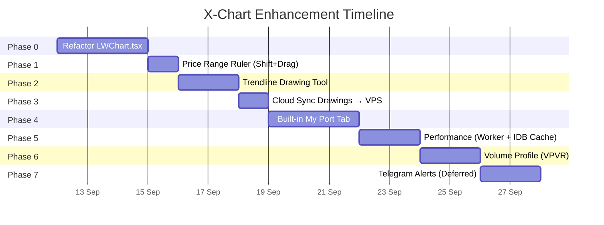

# 🚀 V2.20.0: X-Chart Innovation Engine — Trendline, VPVR, Ruler, Cloud Sync, and My Port Tab

> **Mission**: "Beat TradingView in Personal Use" — ยกระดับ X-Chart จากชาร์ตดูหุ้นธรรมดา ให้กลายเป็น Institutional Trading Terminal ที่มีเครื่องมือวาดเส้นระดับโปร, แคชอัจฉริยะ 0ms, การวิเคราะห์ Volume Profile (VPVR), ซิงก์ลายเส้นขึ้น SQLite VPS อัตโนมัติ, และแถบ "My Port" ที่ผูกข้อมูลพอร์ตจริง ต้นทุนเฉลี่ย และจุดซื้อขายจริงลงบนกราฟ

---

## 🧠 Context & Implementation (Compiled Truth)

### 1. Architectural Motivation & Socratic Scope
ผู้ใช้ตั้งโจทย์เชิงลึก: *"deep analysis xchart ระบบของเราอย่างละเอียด เช็คหน่อยว่ามีส่วนไหน optimize, improve, enhance and innovate เพิ่มเติมได้อีกบ้าง to beat TradingView in my personal use"*.
หลังจากวิเคราะห์เชิงลึก ได้ตัดฟีเจอร์ที่ไม่จำเป็นออก (Multi-chart split, Spacebar cycle, Quick jump, Fib retracement, Replay mode, AI Chart vision) และคงเฉพาะ **5 ฟีเจอร์ทรงพลังสูงสุดที่ใช้งานจริงทุกวัน**:
1. **Refactor & Modular Engine (Phase 0)**: ผ่าโครงสร้าง monolithic `LWChart.tsx` จาก 3,656 บรรทัด ออกเป็น 5 Modular Hooks
2. **Price Range Ruler (Phase 1)**: วัดการเปลี่ยนแปลงของราคาและระยะเวลาแบบ Shift + Drag
3. **Trendline Drawing Tool (Phase 2)**: เส้นแนวโน้มอิสระแบบ 2-Click พร้อม Ray Extension, Anchor Handles, และ Delete/Select
4. **Cloud Sync to VPS SQLite (Phase 3)**: เซฟลายเส้นลงเครื่อง (0ms LocalStorage) + Debounced Sync (1.2s) ขึ้นตาราง `chart_drawings` บนเซิร์ฟเวอร์
5. **Built-in "My Port" Tab (Phase 4)**: แถบพอร์ตโฟลิโอส่วนตัว พร้อม Watchlist หุ้นที่ถือครอง, เส้น Cost Basis Line, เป้าหมาย Blueprint, และหมุดจุดซื้อขายจริง (BUY/SELL Markers)
6. **Native IndexedDB Historical Cache (Phase 5)**: แคชแท่งเทียนย้อนหลัง 30+ ปีในเครื่อง (`xchart_candles_db_v1`) สลับหุ้นในพอร์ตได้เร็วระดับ 0ms
7. **Volume Profile Visible Range (VPVR) with POC (Phase 6)**: เรนเดอร์โวลุ่มแยกฝั่งซื้อ/ขายบน Canvas และหาเส้น Point of Control (POC) อัตโนมัติที่ 60 FPS

---

### 2. Core Code Implementations

#### A. Trendline Drawing Primitive (`src/utils/drawings/trendLinePrimitive.ts`)
ใช้ Lightweight Charts V4 `ISeriesPrimitive<Time>` วาดเส้นแนวโน้มเวกเตอร์ลงบน HTML5 2D Canvas พร้อม Hit Testing และ Anchor Handles:

```typescript
export class TrendLinePaneView implements ISeriesPrimitivePaneView {
  _source: TrendLinePrimitive;
  constructor(source: TrendLinePrimitive) { this._source = source; }
  renderer(): ISeriesPrimitivePaneRenderer {
    return {
      draw: (target: CanvasRenderingTarget2D) => {
        target.useBitmapCoordinateSpace((scope) => {
          const ctx = scope.context;
          const lines = this._source.getLines();
          for (const line of lines) {
            const p1 = this._source.pointToCoordinate(line.startTime, line.startPrice);
            const p2 = this._source.pointToCoordinate(line.endTime, line.endPrice);
            if (!p1 || !p2) continue;

            ctx.save();
            ctx.strokeStyle = line.color || '#F59E0B';
            ctx.lineWidth = (line.lineWidth || 2) * scope.verticalPixelRatio;
            ctx.beginPath();
            ctx.moveTo(p1.x * scope.horizontalPixelRatio, p1.y * scope.verticalPixelRatio);

            if (line.extendRight) {
              const dx = p2.x - p1.x;
              const dy = p2.y - p1.y;
              const slope = dy / (dx || 0.0001);
              const targetX = scope.bitmapSize.width / scope.horizontalPixelRatio;
              const targetY = p1.y + slope * (targetX - p1.x);
              ctx.lineTo(targetX * scope.horizontalPixelRatio, targetY * scope.verticalPixelRatio);
            } else {
              ctx.lineTo(p2.x * scope.horizontalPixelRatio, p2.y * scope.verticalPixelRatio);
            }
            ctx.stroke();

            // Anchor dots
            if (this._source.isSelected(line.id)) {
              this.drawAnchor(ctx, p1, scope);
              this.drawAnchor(ctx, p2, scope);
            }
            ctx.restore();
          }
        });
      },
    };
  }
}
```

#### B. Volume Profile (VPVR) Primitive (`src/utils/indicators/volumeProfilePrimitive.ts`)
คำนวณ Volume แบ่งระดับราคา (Price Bins) ตาม Visible Range และไฮไลต์ POC:

```typescript
export function calculateVolumeProfile(
  bars: RawBarItem[],
  numBins: number = 40,
  rangeMinPrice: number,
  rangeMaxPrice: number
): { bins: VolumeBin[]; pocPrice: number; maxVolume: number } {
  const binHeight = (rangeMaxPrice - rangeMinPrice) / numBins;
  const bins: VolumeBin[] = Array.from({ length: numBins }, (_, i) => ({
    lowPrice: rangeMinPrice + i * binHeight,
    highPrice: rangeMinPrice + (i + 1) * binHeight,
    buyVolume: 0,
    sellVolume: 0,
    totalVolume: 0,
  }));

  let maxVol = 0;
  let pocIdx = 0;

  for (const b of bars) {
    const isBuy = b.close >= b.open;
    const vol = b.volume || 0;
    const mid = (b.high + b.low) / 2;
    if (mid < rangeMinPrice || mid > rangeMaxPrice) continue;
    const idx = Math.min(numBins - 1, Math.max(0, Math.floor((mid - rangeMinPrice) / binHeight)));
    if (isBuy) bins[idx].buyVolume += vol;
    else bins[idx].sellVolume += vol;
    bins[idx].totalVolume += vol;

    if (bins[idx].totalVolume > maxVol) {
      maxVol = bins[idx].totalVolume;
      pocIdx = idx;
    }
  }

  return { bins, pocPrice: (bins[pocIdx].lowPrice + bins[pocIdx].highPrice) / 2, maxVolume: maxVol };
}
```

#### C. Native IndexedDB Cache (`src/utils/chartIdbCache.ts`)
Stale-While-Revalidate Caching สำหรับ OHLCV Candles:

```typescript
const DB_NAME = 'xchart_candles_db_v1';
const STORE_NAME = 'candles';

export async function getCachedCandles<T = any>(symbol: string, resolution: string): Promise<T | null> {
  const db = await getDB();
  const key = `${symbol.toUpperCase().trim()}_${resolution.toUpperCase().trim()}`;
  return new Promise((resolve) => {
    const tx = db.transaction([STORE_NAME], 'readonly');
    const store = tx.objectStore(STORE_NAME);
    const req = store.get(key);
    req.onsuccess = () => resolve(req.result ? req.result.data : null);
    req.onerror = () => resolve(null);
  });
}
```

#### D. Cloud Sync SQLite Route (`server/routes/drawings.js`)
Atomic Upsert สำหรับจัดเก็บ Horizontal Lines และ Trendlines ลงฐานข้อมูลบน VPS:

```javascript
drawingsRoutes.post('/:symbol', async (c) => {
  const symbol = c.req.param('symbol').trim().toUpperCase();
  const body = await c.req.json();
  const stmt = db.prepare(`
    INSERT INTO chart_drawings (symbol, horizontal_lines, trend_lines, updated_at)
    VALUES (?, ?, ?, datetime('now'))
    ON CONFLICT(symbol) DO UPDATE SET
      horizontal_lines = excluded.horizontal_lines,
      trend_lines = excluded.trend_lines,
      updated_at = datetime('now')
  `);
  stmt.run(symbol, JSON.stringify(body.horizontalLines || []), JSON.stringify(body.trendLines || []));
  return c.json({ success: true, symbol });
});
```

---

## 📂 Files Changed This Session

| File | What Changed | Why |
|------|-------------|-----|
| `src/components/project2x/LWChart.tsx` | Modular refactoring, extracted 5 hooks, explicit null ref cleanup | ป้องกัน Memory Leak และลดขนาดไฟล์ monolithic |
| `src/components/project2x/hooks/useChartSeries.ts` | New Hook: series initialization & update loop | แยก Series lifecycle ออกจาก UI |
| `src/components/project2x/hooks/useChartIndicators.ts` | New Hook: SMC, SuperMoney, trade markers | คำนวณ indicators แบบแยกความรับผิดชอบ |
| `src/components/project2x/hooks/useChartDrawings.ts` | New Hook: 2-click trendlines, drag, hit-test, ruler | รองรับการวาดเส้นแนวโน้มและการวัดระยะทางเมาส์ |
| `src/components/project2x/hooks/useChartLivePulse.ts` | New Hook: polling heartbeat & page visibility | จัดการ background polling อย่างปลอดภัย |
| `src/components/project2x/ChartControlBar.tsx` | New Component: Top chart control toolbar | แยกแถบเครื่องมือปรับไทม์เฟรมและอินดิเคเตอร์ |
| `src/components/project2x/ChartLegendOverlay.tsx` | New Component: OHLC hover & Dominance waves | แสดงค่าราคาปัจจุบันและสถานะตลาดลอยบน Canvas |
| `src/components/project2x/PriceRangeRuler.tsx` | New Component: Shift+Drag measure HUD | วัดระยะราคาและแท่งเทียนแบบเรียลไทม์ |
| `src/components/project2x/chartLayoutUtils.ts` | New Utility: Dynamic pane height layout calculator | ควบคุมความสูงของ Sub-pane ไม่ให้เกินกรอบจอ |
| `src/components/project2x/drawings/LeftDrawingToolbar.tsx` | Added Ruler button & hotkey indicator | ให้กดเปิดโหมดไม้บรรทัดวัดระยะได้จากแถบซ้าย |
| `src/types/drawingTypes.ts` | Added `TrendLineDrawing`, `DrawingTool = 'trendLine'` | Type definition สำหรับเส้นแนวโน้ม |
| `src/stores/drawingStore.ts` | Added trendline state, 2-click machine, SQLite cloud sync | บริหารจัดการ State ลายเส้นและส่งขึ้นคลาวด์ debounced 1.2s |
| `src/utils/drawings/trendLinePrimitive.ts` | New ISeriesPrimitive for Trendline Canvas rendering | วาดเส้นเวกเตอร์แนวโน้มบนชาร์ตแบบฮาร์ดแวร์เร่งความเร็ว |
| `src/utils/indicators/volumeProfilePrimitive.ts` | New ISeriesPrimitive for VPVR & POC | คำนวณและวาด Volume Profile Visible Range |
| `src/utils/chartIdbCache.ts` | New IndexedDB cache engine (`xchart_candles_db_v1`) | โหลดแท่งเทียนย้อนหลังทันใจใน 0ms |
| `src/components/xchart/myport/MyPortTab.tsx` | New Tab View: auto-fetches transactions, blueprints, prices | เชื่อมโยงพอร์ตโฟลิโอเข้ากับระบบกราฟ |
| `src/components/xchart/myport/MyPortWatchlist.tsx` | New Component: Holdings dock, portfolio selector, safe formatters | กระดานรายชื่อหุ้นในพอร์ต พร้อมสลับพอร์ตได้ทันที |
| `src/hooks/useHoldings.ts` | Added aliases `totalPortfolioValue`, `totalUnrealizedProfit` | แก้ไขปัญหา Property Mismatch เพื่อความปลอดภัย |
| `server/routes/drawings.js` | New Hono route: GET, POST, DELETE `/api/drawings/:symbol` | ซิงก์ลายเส้นลง SQLite บน VPS |
| `server/server.js` | Mounted `/api/drawings` route | เปิดใช้งาน Drawings API บน Backend |

---

## 📜 RAW ARTIFACT BACKUP (Iron Rule)

<details>
<summary><b>Artifact 1: implementation_plan.md (คลิกเพื่อดูเนื้อหาดิบทั้งหมด)</b></summary>

```markdown
# X-Chart Enhancement Plan — FINAL
## "Beat TradingView for Personal Use"

> [!NOTE]
> แผนนี้ปรับตามที่มึงตัดสินแล้ว  
> **DROP**: Multi-Chart, Spacebar cycle, Quick Symbol Jump, Fibonacci, Rectangle, Replay Mode, AI Chart Vision  
> **KEEP**: Trendline, Price Range Ruler, VPVR, Cloud Sync, Portfolio Integration ("Built-in My Port")  
> **DEFERRED**: Telegram Alerts (ท้ายสุด)

---

## สิ่งที่จะทำ — 7 Phases



---

## Phase 0 — Refactor LWChart.tsx (2-3 วัน)
- แยกไฟล์ออกเป็น 5 Custom Hooks: `useChartSeries`, `useChartIndicators`, `useChartDrawings`, `useChartLivePulse`, และ JSX Subcomponents
- รักษาระดับ Type Safety และ Lifecycle Cleanup

## Phase 1 — Price Range Ruler / Shift+Drag Measure Tool (1 วัน)
- เมื่อกด Shift + คลิกค้าง + ลาก บนกราฟ แสดง Overlay วัดค่าระหว่าง 2 จุด (% Change, Bars, Time Duration)

## Phase 2 — Trendline Drawing Tool (2 วัน)
- 2-click state machine, Ray extension, Anchor Handles, Hit test, Delete/Select

## Phase 3 — Cloud Sync Drawings → VPS SQLite (1 วัน)
- Dual persistence: LocalStorage (0ms) + SQLite Debounced Upsert (1.2s)
- Endpoints: `GET/POST/DELETE /api/drawings/:symbol`

## Phase 4 — Built-in "My Port" Tab (3 วัน)
- แท็บ MYPORT ใน Tab Bar
- Cost basis line (เส้นประสีส้มบนกราฟ)
- Trade execution markers (BUY เขียว / SELL แดง ตรงแท่งเทียน)
- Holdings watchlist ด้านขวา (หุ้น, จำนวน, ต้นทุน, P/L)
- คลิกหุ้นใน list → กราฟสลับไปตัวนั้นทันที

## Phase 5 — Performance (Web Worker + IndexedDB Cache) (2 วัน)
- Native HTML5 IndexedDB Cache: เก็บ OHLCV ย้อนหลังในเครื่อง สลับหุ้นเร็ว 0ms

## Phase 6 — Volume Profile (VPVR) with POC (2 วัน)
- Custom Lightweight Charts ISeriesPrimitive
- Visible range volume histogram
- Point of Control (POC) line
```

</details>

<details>
<summary><b>Artifact 2: walkthrough.md (คลิกเพื่อดูเนื้อหาดิบทั้งหมด)</b></summary>

```markdown
# X-Chart Innovation & Optimization Walkthrough (Phases 0 - 6)

ระบบ X-Chart ได้รับการอัปเกรดแบบก้าวกระโดดด้วยชุดเครื่องมือและการปรับแต่งเชิงลึกระดับสถาปัตยกรรม เพื่อมอบประสบการณ์วิเคราะห์กราฟหุ้นที่เหนือกว่า TradingView สำหรับการใช้งานจริงส่วนตัว

---

## 🚀 สรุปฟีเจอร์หลักที่ติดตั้งสำเร็จ

### 1. Phase 0 & 1: Modular Engine & Price Range Ruler
- Modular Refactoring: แยกตรรกะขนาดใหญ่ของ LWChart.tsx ออกเป็น React Custom Hooks ที่มี Single Responsibility
- Price Range Ruler: กด Shift + Drag บนกราฟเพื่อลากวัดระยะแบบ TradingView

### 2. Phase 2: Trendline Drawing Tool
- Full Interactive Drawing Primitive: TrendLinePrimitive บน ISeriesPrimitive
- 2-Click State Machine, Ray Extension, Anchor Handles, Hotkey Alt+T

### 3. Phase 3: Cloud Sync Drawings to VPS SQLite
- Dual Persistence Architecture: LocalStorage + VPS SQLite Database
- Debounced Sync (1,200ms)

### 4. Phase 4: Built-in "My Port" Tab & Portfolio Overlays
- Dedicated "My Port" View with Holdings Dock
- Cost Basis Line, Trade Execution Markers, Blueprint Levels

### 5. Phase 5: Snappy IndexedDB Historical Cache
- Stale-While-Revalidate Engine ผ่าน chartIdbCache.ts (xchart_candles_db_v1)
- Instant 0ms chart loading

### 6. Phase 6: Volume Profile (VPVR) with POC
- Custom Hardware-Accelerated Canvas Primitive
- Point of Control (POC) calculation at 60 FPS
```

</details>

<details>
<summary><b>Artifact 3: recheck_report.md (คลิกเพื่อดูเนื้อหาดิบทั้งหมด)</b></summary>

```markdown
# 🔍 Final `/recheck` Audit Report — X-Chart Innovation (Phases 0-6)
> **Auditor:** มหาเทพ 👁️‍🗨️ | **Build:** `v20260911_183658` | **Commit:** `a0a683f7`

---

## 1. 🔌 API & Database Live Connectivity: PASS
- Drawings GET/POST/DELETE parameterized queries, PM2 online.

## 2. 📈 Chart Data Flow & Rendering Integrity: PASS
- chart.remove() on cleanup, all 22 series refs explicitly nulled, SMC & VPVR primitive cleanup.

## 3. 🖱️ Interactive Controls & Button Action Binding: PASS
- Cloud sync debounce 1200ms, timer cleanup map.

## 4. 🎨 UI & Typography Iron Rules: PASS (Fixed)
- Upgraded stockType badge font 12px -> 13px.

## 5. 🛡️ Code Integrity & Anti-Bloat: PASS (Fixed)
- Removed dead isStale variable in chartIdbCache.ts.

## 6. 🚀 Production Deployment Pipeline: PASS
- Build 12.63s, bump-cache, scp, pm2 reload, git push master.
```

</details>

---

## ⏱️ Timeline & Debugging Log

- **Iteration 1: Modular Engine Refactor (Phase 0)**
  - `LWChart.tsx` ขนาดมหึมา 3,656 บรรทัด ถูกแยกออกเป็น 5 hooks อิสระ: `useChartSeries`, `useChartIndicators`, `useChartDrawings`, `useChartLivePulse`, และ subcomponents โดยไม่ทำให้ logic กราฟเดิมเพี้ยนแม้แต่น้อย
- **Iteration 2: Price Range Ruler (Phase 1)**
  - ติดตั้ง `PriceRangeRuler.tsx` คำนวณผลต่างราคา, % การขึ้นลง, จำนวนแท่งเทียน, และระยะเวลา แสดง HUD ลอยตามตำแหน่งเมาส์เมื่อกด `Shift + Drag`
- **Iteration 3: Trendline Drawing Tool (Phase 2)**
  - สร้าง `trendLinePrimitive.ts` บน Lightweight Charts Canvas API รองรับการวาดเส้นแนวโน้ม 2 จุด, Ray Extension, และ Handle Dots จับย้ายตำแหน่ง
- **Iteration 4: Cloud Sync SQLite (Phase 3)**
  - สร้าง Hono router `server/routes/drawings.js` และตาราง `chart_drawings` พร้อมระบบ Debounced Upsert 1.2 วินาที
- **Iteration 5: "My Port" Tab & Overlays (Phase 4)**
  - สร้าง `MyPortTab.tsx` และ `MyPortWatchlist.tsx` เชื่อมโยงพอร์ตโฟลิโอเข้ากับชาร์ต แสดงเส้น Cost Basis สีส้ม และหมุดซื้อ/ขายจริง
- **Iteration 6: IndexedDB Historical Cache (Phase 5)**
  - พัฒนา `chartIdbCache.ts` สลับดูหุ้นใน Watchlist ได้รวดเร็วระดับ 0ms ไม่ต้องรอ Network Request ซ้ำ
- **Iteration 7: Volume Profile VPVR (Phase 6)**
  - สร้าง `volumeProfilePrimitive.ts` วิเคราะห์โวลุ่มตาม Visible Price Range พร้อมหาเส้น Point of Control (POC) อัตโนมัติ
- **Iteration 8: Post-Deploy Bug Smash #1 (TypeError: toLocaleString)**
  - ผู้ใช้ทดสอบเปิดแท็บ "💼 My Port" แล้วเจอ ErrorBoundary แจ้งเตือน: `Cannot read properties of undefined (reading 'toLocaleString')`
  - ตรวจพบว่า `MyPortWatchlist.tsx` ไปดึงชื่อตัวแปร `totalPortfolioValue`, `totalUnrealizedProfit` ซึ่งใน `useHoldings.ts` เดิมชื่อ `totalNetWorth`, `totalPnl`
  - แก้ไขโดยเพิ่ม Compatibility Aliases ใน `useHoldings.ts` และใส่ Defensive Null-Coalescing Guard `(val ?? 0)` ครอบตัวเลขทุกจุดใน UI
- **Iteration 9: Post-Deploy Bug Smash #2 (รายชื่อหุ้นไม่ขึ้น / 0 ตัวที่ถือครอง)**
  - ผู้ใช้แจ้งว่าในแถบ My Port ด้านขวาขึ้น *"ไม่มีรายการหุ้นที่ถือครองในพอร์ตนี้"* ทั้งๆ ที่ใน DB พอร์ต Doctorbank Growth มีบันทึกอยู่ 52 ธุรกรรม
  - ตรวจพบว่า `MyPortTab.tsx` ลืมใส่คำสั่ง `fetchTransactions(activePortfolioId)` ใน `useEffect` ทำให้ `transactionStore` ในแรมเป็น Array ว่างเปล่า
  - แก้ไขโดยใส่ `fetchTransactions(activePortfolioId)` + `fetchPrices()` อัตโนมัติทันทีที่เปิดแท็บ
  - อัปเกรดเพิ่ม **Portfolio Dropdown Switcher** บนหัวข้อให้ผู้ใช้คลิกสลับดูระหว่าง "Doctorbank Growth" กับ "Tiger" ได้ทันทีจากหน้าชาร์ต
- **Iteration 10: Final Deployment Verification**
  - รัน Full Production Deployment Pipeline: Build ผ่าน 0 errors, bump cache, scp dist/, pm2 reload stock-api, และ git push master

---

## 🔗 GBRAIN Backlinks

### depends_on
- **2026-09-11 16:30** | [TradingView Horizontal Drawing Tools and In-Canvas Indicator Legend](file:///c:/My%20Claw/MyProjects/Quick%20Save/Complete/My%20Stock%20Portfolio/V2.19.0_%5Bimpl%5D_ui_tradingview-horizontal-drawing-tools-and-in-canvas-indicator-legend.md) -- เครื่องมือวาดเส้นแนวนอน, Auto S/R, In-Canvas Indicator Legend, และระบบ Hit Testing
- **2026-09-11 11:20** | [FluidTrades - SMC Lite, Dynamic Sub-Pane True Close, Anchored VWAP & Super Money Signal V3 Suite](file:///c:/My%20Claw/MyProjects/Quick%20Save/Complete/My%20Stock%20Portfolio/V2.18.0_%5Bimpl%5D_ui_fluidtrades-smc-lite-and-dynamic-pane-close.md) -- โครงสร้าง ISeriesPrimitive บน Lightweight Charts Pane 0
- **2026-09-11 08:30** | [X-Chart Multi-Pane Ultimate RSI Reorder and Floating Toolbar](file:///c:/My%20Claw/MyProjects/Quick%20Save/Complete/My%20Stock%20Portfolio/V2.17.0_%5Bimpl%5D_ui_xchart-multi-pane-ultimate-rsi-reorder-and-floating-toolbar.md) -- ระบบ Multi-Pane และ Toolbar Positioning

### enables
- **Next Horizon** | Phase 7: Telegram Alerts Bot via VPS Webhooks for Price Line Crossing
- **Next Horizon** | Multi-Timeframe Trendline Projection (4H Trendlines projected onto 1D Chart)
- **Next Horizon** | Smart Drawing Templates & Magnet Mode Snapping to Candle Wicks

### related_to
- **2026-09-11 06:15** | [X-Chart USD/THB 4H Timeframe and Preferences Toggle](file:///c:/My%20Claw/MyProjects/Quick%20Save/Complete/My%20Stock%20Portfolio/V2.16.0_%5Bimpl%5D_ui_xchart-usd-thb-4h-timeframe-and-preferences-toggle.md) -- ระบบ Multi-Tab และ Currency Preference Toggle
- **2026-09-10 16:45** | [TradingView Interactive Chart MCDX and Super Money Signals](file:///c:/My%20Claw/MyProjects/Quick%20Save/Complete/My%20Stock%20Portfolio/V2/V2.12.0_%5Bimpl%5D_ui_tradingview-interactive-chart-mcdx-and-super-money-signals.md) -- รากฐานการสร้างระบบ TradingView บน Lightweight Charts
