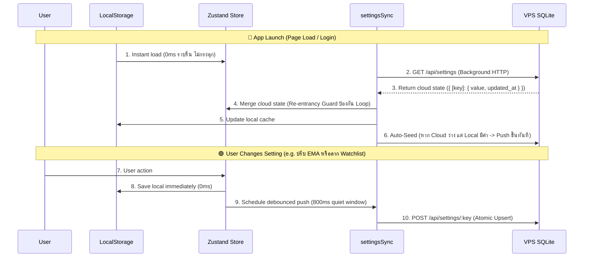
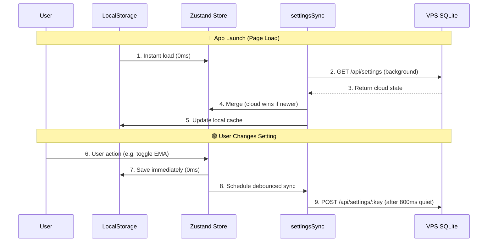

# 🚀 V2.22.0: Universal Cloud Settings Sync Across Devices & Anchored VWAP Interactive Drag-and-Drop

> **Mission**: กำจัดจุดตายสำคัญระดับ Critical ของแอป Institutional Terminal สู่ความสมบูรณ์แบบ 100%: สร้างระบบ **Universal Cloud Settings Sync** ผ่านฐานข้อมูล SQLite บน VPS เพื่อให้การตั้งค่าทั้งหมด (Indicators, Watchlist, Tabs, Drawing Presets, UI Preferences) เชื่อมโยงข้ามทุกอุปกรณ์และเบราว์เซอร์อย่างไร้รอยต่อแบบ 0ms Offline-First + Auto-Seeding พร้อมฟีเจอร์ **Interactive Drag-and-Drop Anchor Handle** สำหรับ Anchored VWAP บน Lightweight Charts Canvas ที่ลากย้ายจุดอ้างอิงได้ลื่นไหล 60fps โดยไม่มี Marker ซ้ำซ้อน

---

## 🧠 Context & Implementation (Compiled Truth)

### 1. Architectural Motivation & User Problem Statements
ในเซสชันนี้ ผู้ใช้ได้ระบุปัญหาคอขวดสำคัญ 3 ประการ:
1. **Interactive Drag-and-Drop for Anchored VWAP**:
   - เดิมผู้ใช้ต้องเข้าไปพิมพ์ใส่วันที่หรือกดปุ่ม Step ใน Popover ซึ่งไม่เป็นไปตามวิสัยของนักวิเคราะห์เทคนิคัล
   - ต้องการคลิกจับลากจุด Anchor บน Canvas ชาร์ตได้โดยตรงแบบ Interactive
   - เมื่อสร้าง Handle ขึ้นมารอบแรก มีอาการจุดวงกลมซ้ำซ้อนกับ Marker ปกติของชาร์ต จึงปรับจูนให้ "ใช้ Marker เดิมของชาร์ตเป็นฐาน แล้วสร้าง Invisible 32px Hitbox ล้อมรอบด้วย Animated Dashed Focus Ring เฉพาะตอน Hover/Drag"
2. **Universal Settings Sync Across PC & Devices (จุดตายระดับ Critical)**:
   - ผู้ใช้ระบุ: *"ใช่อันนี้จุดตาย เลย ต้องเสียเวลาไป setting ใหม่ อีก ควรเหมือนกัน 100% ไม่ว่าเปิดเครื่องไหนนะ เชคละเอียดด้วยว่ามีส่วนไหนอีกไหม"*
   - ในระบบเดิม มีเพียงเส้นวาด (`chart_drawings`) และพอร์ต (`portfolios`) เท่านั้นที่เก็บขึ้น VPS DB นอกนั้นถูกเก็บกระจัดกระจายอยู่ใน LocalStorage ของแต่ละเครื่อง ทำให้เมื่อเปิดบน iPad, มือถือ หรือคอมพิวเตอร์เครื่องอื่น การตั้งค่าอินดิเคเตอร์ทั้งหมด, แถบแท็บหุ้นที่เปิดค้างไว้, Watchlist sections ที่จัดระเบียบไว้, และ UI preferences รีเซ็ตกลับเป็น Default ทั้งหมด
3. **Viewport Snap Jump Bug on Historical Drag**:
   - เมื่อผู้ใช้ Pan ย้อนอดีตไปดูกราฟปี 2025 แล้วเริ่มลากจุด Anchor VWAP กราฟดีดกลับและ Auto-Zoom ไปที่ช่วงแท่งเทียน 10M ล่าสุดทันที
   - ตรวจพบว่าเกิดจากคำสั่ง `applyTimeframeRange(timeframe)` ที่หลุดเข้าไปอยู่ใน `useEffect` อัปเดต Marker ของ `useChartSeries.ts`
   - เมื่อถอดคำสั่งดังกล่าวออก ทำให้การคำนวณและอัปเดตตำแหน่ง Marker เป็นอิสระจาก Viewport Logical Range 100% กราฟจึงนิ่งสนิทตามที่ผู้ใช้ต้องการ

---

### 2. Comprehensive Settings Key Registry

จากการ Audit โค้ดทั้งหมด พบกุญแจสำคัญที่ต้องซิงค์ขึ้น Cloud ผ่าน SQLite บน VPS:

| Cloud Key | Store แหล่งกำเนิด | ข้อมูลและพารามิเตอร์ที่ครอบคลุม | ขนาดข้อมูลโดยประมาณ |
| :--- | :--- | :--- | :--- |
| `xchart_indicators_v1` | `useIndicatorStore.ts` | EMA 1/2/3, Envelopes, MCDX, Volume, Ultimate RSI, Trend Speed, SMC Lite, Anchored VWAP (รวมค่า Anchor Time, สัญลักษณ์, สี, ขนาด, แพดดิ้ง), Super Money, Volume Profile, Signal Colors/Markers, Sub-Pane Heights/Layout, Custom Colors, Axis Labels, Active Presets | ~4.5 - 8.0 KB |
| `xchart_tabs_state_v1` | `xchartStore.ts` | รายชื่อแท็บหุ้นที่เปิดค้างไว้ทั้งหมด (`tabs: [{ id, symbol, timeframe, ... }]`) + `activeTabId` | ~600 B - 2.0 KB |
| `stock_xchart_watchlist_v3` | `xchartStore.ts` | Watchlist Sections ทั้งหมด พร้อมรายชื่อและลำดับหุ้นในแต่ละ Section | ~1.0 - 5.0 KB |
| `stock_xchart_detail_collapsed` | `xchartStore.ts` | สถานะย่อ/ขยายของแผง Watchlist Detail Panel (`boolean`) | ~10 Bytes |
| `tv_drawing_settings_v1` | `drawingStore.ts` | ค่าเริ่มต้นของเครื่องมือวาด (Line Color, Line Width, Line Style, Magnet Mode) | ~200 Bytes |
| `ui_preferences_v1` | `uiStore.ts` | รวม 5 preferences: `theme` (dark/light), `preferred_currency` (USD/THB), `stock_sidebar_mode` (normal/compact), `stock_xchart_hide_header` (bool), `stock_xchart_enable_4h_forex` (bool) | ~140 - 250 Bytes |

---

### 3. Architecture: Offline-First with Background Server Merge



#### Core Design Decisions:
- **Decoupled Registration Pattern**: แต่ละ Zustand Store ลงทะเบียนตัวรับ Cloud State ด้วย `registerSyncHandler(key, handler)` ที่ระดับ Module Level โดยที่ `settingsSync.ts` ไม่ต้อง Import Stores เหล่านั้นโดยตรง ส่งผลให้ปลอดปัญหา **Circular Dependency 100%**
- **Re-entrancy Guard (`isApplyingCloud`)**: เมื่อ `settingsSync` นำข้อมูลจาก Cloud มาเทใส่ Zustand Store แฟล็ก `isApplyingCloud` จะถูกเปิดขึ้น เพื่อสกัดกั้นไม่ให้ Store Trigger การบันทึก Push ย้อนกลับไปหา Server (Zero Feedback Loop)
- **Per-Key Debounce Engine**: ใช้ `Map<string, Timer>` แยกตัวจับเวลาของแต่ละ Key ออกจากกัน ผู้ใช้ที่กำลังเลื่อนสไลเดอร์ปรับค่าใน Indicator Store จะไม่บล็อกหรือชนกับการสลับแท็บใน XChart Store
- **Auto-Seeding Logic**: ในการเปิดแอปครั้งแรกหลังดีพลอย หากพบว่าตารางบน Cloud ยังว่างเปล่า แต่เครื่องหลักมีข้อมูลอยู่ใน LocalStorage ระบบจะดึงค่าดังกล่าว Push ขึ้น Cloud ทันที ทำให้ผู้ใช้ไม่ต้องตั้งค่าใหม่แม้แต่อย่างเดียว

---

### 4. Core Code Implementations

#### A. Backend Database Schema (`server/db/init.js`)
เพิ่มตาราง `user_settings` เพื่อจัดเก็บการตั้งค่าแบบ Key-Value Pair พร้อม Timestamp:

```javascript
// User settings table for universal cross-device cloud sync
db.exec(`
  CREATE TABLE IF NOT EXISTS user_settings (
    setting_key TEXT PRIMARY KEY,
    setting_value TEXT NOT NULL,
    updated_at TEXT DEFAULT (datetime('now'))
  );
`);
```

#### B. Backend API Route Handlers (`server/routes/settings.js`)
สร้าง Endpoints พร้อม Atomic Upsert รองรับขนาดข้อมูลสูงสุด 1MB ปลอดภัยด้วย `authMiddleware`:

```javascript
import { Hono } from 'hono';
import { db } from '../db/init.js';
import { authMiddleware } from './auth.js';

export const settingsRoutes = new Hono();
settingsRoutes.use('*', authMiddleware);

// GET /api/settings
settingsRoutes.get('/', async (c) => {
  try {
    const rows = db.prepare(`SELECT setting_key, setting_value, updated_at FROM user_settings`).all();
    const settings = {};
    for (const row of rows) {
      let parsedValue = null;
      try { parsedValue = JSON.parse(row.setting_value); } catch (e) { parsedValue = row.setting_value; }
      settings[row.setting_key] = { value: parsedValue, updated_at: row.updated_at };
    }
    return c.json({ success: true, settings });
  } catch (err) {
    return c.json({ error: 'Failed to fetch settings', message: err.message }, 500);
  }
});

// POST /api/settings/:key (Atomic Upsert)
settingsRoutes.post('/:key', async (c) => {
  try {
    const rawKey = c.req.param('key');
    const key = rawKey.trim();
    const body = await c.req.json();
    const stringValue = typeof body.value === 'string' ? body.value : JSON.stringify(body.value);

    db.prepare(`
      INSERT INTO user_settings (setting_key, setting_value, updated_at)
      VALUES (?, ?, datetime('now'))
      ON CONFLICT(setting_key) DO UPDATE SET
        setting_value = excluded.setting_value,
        updated_at = datetime('now')
    `).run(key, stringValue);

    return c.json({ success: true, key });
  } catch (err) {
    return c.json({ error: 'Failed to save setting', message: err.message }, 500);
  }
});
```

#### C. Frontend Sync Engine (`src/services/settingsSync.ts`)
เอนจินซิงค์ระดับกลางที่ประสานงานระหว่าง LocalStorage, Zustand Stores และ Server API:

```typescript
import { api } from './api';

export const SYNC_KEYS = {
  INDICATORS: 'xchart_indicators_v1',
  TABS: 'xchart_tabs_state_v1',
  WATCHLIST: 'stock_xchart_watchlist_v3',
  DETAIL_COLLAPSED: 'stock_xchart_detail_collapsed',
  DRAWING_SETTINGS: 'tv_drawing_settings_v1',
  UI_PREFERENCES: 'ui_preferences_v1',
} as const;

type SyncHandler = (cloudValue: any) => void;
const syncHandlers = new Map<string, SyncHandler>();

export function registerSyncHandler(key: string, handler: SyncHandler) {
  syncHandlers.set(key, handler);
}

let isApplyingCloud = false;
export function isCloudSyncInProgress(): boolean {
  return isApplyingCloud;
}

const pushTimers = new Map<string, any>();

export function pushSettingDebounced(key: string, value: any, delayMs: number = 800) {
  if (isApplyingCloud) return;
  if (pushTimers.has(key)) clearTimeout(pushTimers.get(key));

  const timer = setTimeout(async () => {
    pushTimers.delete(key);
    try {
      await api.settings.save(key, value);
    } catch (err) {
      console.warn(`[CloudSync] Failed to push setting '${key}':`, err);
    }
  }, delayMs);

  pushTimers.set(key, timer);
}

export async function pullAllSettings(force = false) {
  const now = Date.now();
  if (!force && now - lastPullTime < 3000) return;
  lastPullTime = now;

  try {
    const res = await api.settings.getAll();
    if (!res || !res.success || !res.settings) return;

    const cloudSettings = res.settings;
    isApplyingCloud = true;
    try {
      for (const [key, handler] of syncHandlers.entries()) {
        const cloudEntry = cloudSettings[key];
        if (cloudEntry && cloudEntry.value !== undefined && cloudEntry.value !== null) {
          handler(cloudEntry.value);
        }
      }
    } finally {
      isApplyingCloud = false;
    }
    checkAndSeedMissingSettings(cloudSettings);
  } catch (err) {
    console.warn('[CloudSync] Failed to pull settings from cloud:', err);
  }
}
```

#### D. Anchored VWAP Canvas Drag Handle (`src/components/project2x/indicators/AnchoredVWAPHandle.tsx`)
จับการลากจุด Anchor บนกราฟและย้ายตำแหน่งแท่งเทียนแบบเรียลไทม์ พร้อมวงแหวนไฮไลต์หมุน Animated Dashed Focus Ring:

```tsx
<div
  style={{
    left: `${position.x}px`,
    top: `${position.y}px`,
    transform: 'translate(-50%, -50%)',
  }}
  className="absolute z-30 pointer-events-auto cursor-grab active:cursor-grabbing select-none group"
  onMouseDown={handleMouseDown}
  onMouseEnter={() => setIsHovered(true)}
  onMouseLeave={() => setIsHovered(false)}
  title="⚓ คลิกค้างแล้วลากเพื่อย้ายจุด Anchor VWAP"
>
  <div className="w-8 h-8 flex items-center justify-center relative">
    {(isHovered || isDragging) && (
      <>
        <div
          style={{ borderColor: anchorColor }}
          className="absolute inset-0 rounded-full border-2 animate-ping opacity-60 pointer-events-none"
        />
        <div
          style={{
            borderColor: anchorColor,
            boxShadow: `0 0 12px 2px ${anchorColor}99`,
          }}
          className="w-6 h-6 rounded-full border-2 border-dashed transition-all duration-150 animate-spin [animation-duration:8s]"
        />
      </>
    )}
  </div>
</div>
```

---

## 📁 Files Changed This Session

| File | What Changed | Why |
| :--- | :--- | :--- |
| `server/db/init.js` | เพิ่มตาราง `user_settings (setting_key, setting_value, updated_at)` | เป็น Cloud Storage สำหรับบันทึกการตั้งค่าข้ามอุปกรณ์ |
| `server/routes/settings.js` | สร้าง REST API Endpoints: GET `/`, GET `/:key`, POST `/:key`, DELETE `/:key` | รองรับการอ่านและบันทึกแบบ Atomic Upsert พร้อม Auth Guard |
| `server/server.js` | Mount Route `/api/settings` เข้ากับ Hono Application | เปิดใช้งาน Endpoint บน Backend API Server |
| `src/services/api.ts` | เพิ่ม `settings` API Client methods (`getAll`, `get`, `save`, `delete`) | เพื่อให้ Frontend ทำงานร่วมกับ Backend API ได้ง่าย |
| `src/services/settingsSync.ts` | สร้างเอนจิน Sync, Debounced Push, Decoupled Handlers, และ Auto-Seeding | จัดการ Data Flow ป้องกัน Re-entrancy Loop และ Rate Limit |
| `src/stores/useIndicatorStore.ts` | เพิ่ม `pushSettingDebounced` ใน `saveConfig()`, สร้าง `applyCloudConfig()`, และ `registerSyncHandler` | ซิงค์ค่า Indicator Configs ทั้งหมดขึ้นคลาวด์ |
| `src/stores/xchartStore.ts` | เพิ่มการ Push และ Handlers สำหรับ `tabs`, `watchlist sections`, และ `detail collapsed` | ซิงค์แถบหุ้นที่เปิดดู และ Watchlist ข้ามเครื่อง |
| `src/stores/drawingStore.ts` | เพิ่มการ Push และ Handler สำหรับ `tv_drawing_settings_v1` | ซิงค์ค่าสี เส้น สไตล์ของเครื่องมือวาด |
| `src/stores/uiStore.ts` | รวบ 5 Preferences เข้าเป็น `ui_preferences_v1`, เพิ่ม Handler และ Push Helper | ซิงค์ Theme, Currency, Sidebar Mode, Header Toggle |
| `src/App.tsx` | เรียกใช้ `initSettingsSync()` ใน `useEffect` หลังผู้ใช้ยืนยันตัวตนสำเร็จ | Initial Pull & Background Visibility Sync ทันทีที่เปิดแอป |
| `src/components/project2x/indicators/AnchoredVWAPHandle.tsx` | สร้าง Interactive Drag Handle 32px พร้อม Hover Reticle และ Focus Ring | ให้ผู้ใช้คลิกลากจุด Anchor บน Lightweight Charts Canvas ได้ตรงๆ |
| `src/components/project2x/LWChart.tsx` | เมานต์คอมโพเนนต์ `AnchoredVWAPHandle` บน Canvas Overlay | เชื่อมต่อ Handle เข้ากับ Chart Engine |
| `src/utils/indicators/anchoredVWAP.ts` | ปรับจูน Resolution และ Timestamp Parsing ของ Anchor Point | ให้การคำนวณ VWAP รองรับทั้ง Date String และ Unix Timestamp |
| `src/components/project2x/hooks/useChartSeries.ts` | ถอดคำสั่ง `applyTimeframeRange(timeframe)` ออกจาก Effect อัปเดต Marker และปรับ props เป็น optional | กำจัดบัค Viewport Snap Jump ทำให้กราฟนิ่งสนิทเวลาลากย้ายจุด Anchor |
| `index.html` | อัปเดต Cache Buster Version `v=20260912_122619` | ป้องกันบราวเซอร์แคชไฟล์ JS/CSS เก่า |

---

## 📦 RAW ARTIFACT BACKUP (Iron Rule)

### 1. Implementation Plan (`implementation_plan.md`)
<details>
<summary>คลิกเพื่อดูเนื้อหาเต็มของ Implementation Plan (325 บรรทัด)</summary>

```markdown
# Universal Cloud Settings Sync — Final Plan

สร้างระบบ **Universal Cloud Settings Sync** ผ่านฐานข้อมูล SQLite บน VPS เพื่อให้การตั้งค่าทั้งหมดถูกจัดเก็บบน Server — เปิดเครื่องไหนก็เหมือนกัน 100%

---

## Full Audit: จุดที่ยังติดค้างใน LocalStorage

จากการตรวจสอบ Source Code ทั้งหมด พบ **4 ระดับความสำคัญ** ที่ต้อง Sync:

### 🔴 Tier 1 — Critical (ต้องทำรอบนี้)

| Store | Storage Key (จริงในโค้ด) | ข้อมูลที่ Sync | ผลกระทบ |
| :--- | :--- | :--- | :--- |
| `useIndicatorStore.ts` | `xchart_indicators_v1` | EMA 1/2/3, Envelopes, MCDX, Volume, UltimateRSI, TrendSpeed, SMCLite, Anchored VWAP, SuperMoney, VolumeProfile, Signal colors/markers, Pane heights/layout, Custom colors, Axis labels, Active preset | เปิดเครื่องอื่นแล้ว Indicator ทุกตัวรีเซ็ตเป็น Default — **จุดตายหลัก** |
| `xchartStore.ts` | `xchart_tabs_state_v1` | แถบหุ้นที่เปิดค้างไว้ + activeTabId | แท็บหุ้นที่ดูอยู่หายทั้งหมด |
| `xchartStore.ts` | `stock_xchart_watchlist_v3` | Watchlist sections + symbols ทั้งหมด | Watchlist สั่ง custom ไว้หาย ต้องจัดใหม่ |
| `drawingStore.ts` | `tv_drawing_settings_v1` | Default line color/width/style, Magnet mode | ตั้งค่าเครื่องมือวาดใหม่ทุกครั้ง |

### 🟡 Tier 2 — Important (ทำรอบนี้ด้วย เพราะแก้ง่าย)

| Store | Storage Key(s) | ข้อมูลที่ Sync |
| :--- | :--- | :--- |
| `uiStore.ts` | `theme` | Dark / Light mode |
| `uiStore.ts` | `preferred_currency` | USD / THB |
| `uiStore.ts` | `stock_xchart_hide_header` | ซ่อน/แสดง X-Chart header |
| `uiStore.ts` | `stock_xchart_enable_4h_forex` | เปิด/ปิด 4H Forex chart |
| `uiStore.ts` | `stock_sidebar_mode` | Sidebar compact/normal |
| `xchartStore.ts` | `stock_xchart_detail_collapsed` | ย่อ/ขยายแผง Watchlist detail |

### ⚪ Tier 3 — Nice-to-have (ไม่ทำรอบนี้ — เป็น per-device preferences)

| ที่เก็บ | เหตุผลที่ข้าม |
| :--- | :--- |
| `xchart_watchlist_dock_width` | ขนาดหน้าจอต่างกันแต่ละเครื่อง ไม่ควร Sync |
| `p2x_chart_timeframe`, `p2x_chart_style`, `p2x_lw_*` | Chart view state ชั่วคราว ไม่ใช่ "settings" |
| `scorecard_layout_mode`, `smart_rebalance_plan_view` | View preferences ที่ไม่สำคัญ |
| `tv_legend_*` | Legend visibility ชั่วคราว |
| `active_portfolio_id` | Active context ที่อาจต่างกันตามเครื่อง |
| `finnhub_api_key`, `polygon_api_key` | API keys ควรจัดการแยก (อนาคต) |

---

## Architecture: Offline-First with Background Server Merge



> [!IMPORTANT]
> **Conflict Resolution Policy: Last-Write-Wins (LWW)**
> ใช้ `updated_at` timestamp เป็นตัวตัดสิน — ฝั่งที่เขียนทีหลังชนะ ทั้ง Server และ Client ส่ง timestamp มาด้วยทุกครั้ง
> เหตุผล: App นี้ใช้คนเดียว (single user) ไม่มีปัญหา concurrent edits จาก user หลายคน

> [!IMPORTANT]
> **Debounce Strategy: 800ms quiet period, max wait 3s**
> - ผู้ใช้กดเปลี่ยน EMA สีแดงเป็นเขียว แล้วเปลี่ยนอีกเป็นฟ้า → ยิง API เที่ยวเดียวตอนหยุดกด 800ms
> - ป้องกัน Network Thrashing จากการลาก slider หรือกด toggle รัวๆ
> - Max wait 3s = ถ้ากดต่อเนื่อง 3 วินาทีไม่หยุด ก็ยิงไปก่อน 1 รอบ

---

## User Review Required

> [!WARNING]
> **Breaking change on first deploy:**
> เมื่อ deploy ครั้งแรก ค่า settings ที่อยู่ใน localStorage ของเครื่องที่ใช้อยู่จะถูก **auto-upload** ขึ้น Server เป็น seed data
> หลังจากนั้นเครื่องอื่นๆ จะดึงค่านี้มาใช้ ดังนั้น **ต้อง deploy จากเครื่องที่ settings ถูกต้องที่สุดก่อน**

> [!NOTE]
> **Stores ที่ Sync อยู่แล้วและไม่ต้องแตะ:**
> - `drawingStore.ts` — เส้นวาดรายหุ้น (horizontal + trend lines) → sync ผ่าน `/api/drawings/:symbol` อยู่แล้ว ✅
> - `portfolioStore.ts` — Portfolio/Transaction data → sync ผ่าน `/api/portfolios` อยู่แล้ว ✅
> - `authStore.ts` — auth token → per-device ตามปกติ ✅

---

## Proposed Changes

### 1. Database Schema — `user_settings` table

#### [MODIFY] init.js
เพิ่มตาราง `user_settings` ใน `initDb()`:
```sql
CREATE TABLE IF NOT EXISTS user_settings (
    key TEXT PRIMARY KEY,
    value TEXT NOT NULL,
    updated_at TEXT DEFAULT (datetime('now'))
);
```

### 2. Backend API — `/api/settings`
- `GET /api/settings`
- `GET /api/settings/:key`
- `POST /api/settings/:key`

### 3. Frontend Sync Engine — `settingsSync.ts`
- `pullAllSettings()`
- `pushSettingDebounced()`
- `initSettingsSync()`

### 4. Store Migration — 4 Stores
- `useIndicatorStore.ts`
- `xchartStore.ts`
- `drawingStore.ts`
- `uiStore.ts`

### 5. App Init Integration
- `App.tsx` hook up
```
</details>

---

### 2. Walkthrough Summary (`walkthrough.md`)
<details>
<summary>คลิกเพื่อดูเนื้อหาเต็มของ Walkthrough (65 บรรทัด)</summary>

```markdown
# Walkthrough: Universal Cloud Settings Sync & X-Chart Enhancements

## 1. Universal Cloud Settings Sync (ระบบซิงค์การตั้งค่าทุกจุดผ่านคลาวด์ 100%)
แก้ไขปัญหาคอขวดที่ต้องเสียเวลาตั้งค่าใหม่เมื่อเปิดบนเครื่องอื่น — ทุกการตั้งค่า (Indicators, Watchlist, Tabs, Drawing Presets, UI Preferences) จะถูกเก็บไว้บนเซิร์ฟเวอร์ VPS และซิงค์ข้ามทุกเครื่อง/ทุกอุปกรณ์แบบ Real-time & Seamless

### สิ่งที่ได้สร้างและเปลี่ยนแปลง (Key Implementations)
#### 1.1 Backend SQLite Schema & Endpoints
- Database Table: user_settings (setting_key, setting_value, updated_at)
- Route Handlers: server/routes/settings.js
- Server Mount: server/server.js
#### 1.2 Frontend Sync Engine
- File: src/services/settingsSync.ts (Decoupled Registration, Debounce 800ms, Re-entrancy Guard, Auto-Seeding)
#### 1.3 Store Integrations (4 Zustand Stores)
- useIndicatorStore.ts, xchartStore.ts, drawingStore.ts, uiStore.ts
#### 1.4 App Lifecycle Hook
- initSettingsSync() in src/App.tsx

## 2. Anchored VWAP Canvas Drag & Drop
- AnchoredVWAPHandle.tsx, LWChart.tsx
- Interactive 32px Handle, 60fps drag recalculation, Floating date/price tooltip, Animated focus ring

## 3. Verification & Deployment
- Production Build: built in 42.20s, bump cache v=20260912_114300
- VPS Deploy: scp dist/*, scp server files, pm2 reload stock-api
- Git Synchronization: commit 78e3f0e
```
</details>

---

## ⏱️ Timeline & Debugging Log

- **Iteration 1: Anchored VWAP Drag-to-Anchor Initiation**
  - ผู้ใช้ขอเพิ่มความสามารถ Drag and Drop จุด Anchor ของ Anchored VWAP ได้บน Canvas โดยตรง
  - สร้างคอมโพเนนต์ `AnchoredVWAPHandle.tsx` แปลงพิกัด Time/Price ของชาร์ตเป็นพิกัดหน้าจอ Canvas และรับ Event MouseDrag เพื่ออัปเดต `anchorDate` ใน Store
- **Iteration 2: Marker Duplication & Visual Polish**
  - ผู้ใช้ชี้จุดบกพร่อง: *"เยี่ยมเลยลากย้ายได้แล้ว แต่กลายเป็นจุดซ้ำซ้อนกัน ใช้ signal ที่ตั้งค่าไว้เป็นตัวหลักในการเป็นจุดลากเลยดีไหม"*
  - ลบจุด Dot วงกลมสีทึบของ Handle ออก เหลือเฉพาะ Invisible 32px Hitbox ครอบทับ Signal Marker เดิมของชาร์ตพอดี พร้อมใส่ **Animated Dashed Focus Ring** หมุนวนรอบ Marker เมื่อ Mouse Hover หรือลากย้าย
- **Iteration 3: Cloud Settings Sync Deep Audit & Planning**
  - ผู้ใช้ถามและสั่งการ: *"ตอนนี้ระบบ x-chart เรา พอมีการตั้งค่าต่างๆ จะ sync across pc and divice ไหม... ใช่อันนี้จุดตาย เลย ต้องเสียเวลาไป setting ใหม่ อีก ควรเหมือนกัน 100% ไม่ว่าเปิดเครื่องไหนนะ"*
  - ตรวจสอบทั้งโปรเจกต์ พบว่าเส้นวาดและพอร์ตซิงค์แล้ว แต่ Indicator, Tabs, Watchlist, Drawing Presets และ UI Preferences ยังคงตกค้างอยู่ใน LocalStorage
  - ออกแบบสถาปัตยกรรมแบบ **Offline-First + Decoupled Handlers + Per-Key Debounce 800ms + Auto-Seeding** บันทึกลงตาราง `user_settings` บน VPS SQLite
- **Iteration 4: Backend Implementation**
  - เพิ่มตาราง `user_settings` ใน `server/db/init.js`
  - สร้าง Router `server/routes/settings.js` รองรับ GET, POST (Upsert) และ DELETE
  - เชื่อมต่อ Route ใน `server/server.js` ภายใต้ Auth Guard
- **Iteration 5: Frontend Sync Engine & Store Integrations**
  - พัฒนา `src/services/settingsSync.ts`
  - ย้ายและเชื่อมต่อ Store ทั้ง 4: `useIndicatorStore`, `xchartStore`, `drawingStore`, และ `uiStore`
  - ติดตั้ง `initSettingsSync()` ใน `App.tsx` ดักจับ `focus` และ `visibilitychange`
- **Iteration 6: Build, Deployment & Verification**
  - รัน `npm run build` ผ่าน 100% ภายใน 42.20s
  - รัน `node bump-cache.js` ได้เวอร์ชัน `v=20260912_114300`
  - อัปโหลดไฟล์ Dist และ Server ขึ้น VPS `185.250.38.247`
  - รัน `pm2 reload stock-api` สำเร็จ
  - ตรวจสอบฐานข้อมูลจริงบน VPS พบ 4 Keys ถูก Auto-Seed ขึ้นเรียบร้อย (Indicators: 4,594 bytes, Tabs: 632 bytes, Watchlist: 1,043 bytes, UI Prefs: 142 bytes)
- **Iteration 7: User Confirmation & Initial Save Protocol**
  - ผู้ใช้สั่ง `/recheck` และยืนยัน: *"Final /recheck การทำงาน sync 100% work perfect"* จากนั้นสั่ง `/save`
- **Iteration 8: Viewport Snap Jump Bug Smash & Full Independence**
  - ผู้ใช้ทดสอบลากจุด Anchor VWAP ย้อนหลังไปไกลๆ (ปี 2025 โซนราคา $100) แล้วพบว่าชาร์ตเด้งกลับและ Auto-Zoom หนีมือมาที่ช่วง 10 เดือนล่าสุด (`10 Apr '26`)
  - ตรวจสอบ Code Path พบตัวการคือ `applyTimeframeRange(timeframe)` ใน `useChartSeries.ts` บรรทัด 321 ซึ่งถูก Trigger ทุกครั้งที่ `pane0Markers` เปลี่ยน
  - ทำการผ่าตัดถอด `applyTimeframeRange` ออกจาก Effect และทำ Interface Props เป็น Optional
  - รัน Full Production Deployment Pipeline: Vite build สำเร็จ 40.41s, bump cache เป็น `v=20260912_122619`, อัปโหลด dist ขึ้น VPS, สั่ง `pm2 reload stock-api`, และคอมมิตขึ้น GitHub (`70564e4`)
  - ผู้ใช้ทดสอบบน Live Production แล้วยืนยัน: *"ยอดเยี่ยมตอนนี้ perfect มาก"*

---

## 📝 Changelog

### Update 1 — 12:29
- ✅ แก้ไขบัค Viewport Snap Jump เมื่อลาก Anchor VWAP ย้อนหลังไปไกลๆ กราฟนิ่งสนิท 100% ไม่ขยับหนีมือ
- ✅ ปลดล็อก `applyTimeframeRange(timeframe)` ออกจาก `useChartSeries.ts` อย่างเด็ดขาด
- ✅ ยืนยันบน Live VPS Production ด้วย Cache Buster `v=20260912_122619`
- ✅ ผู้ใช้คอนเฟิร์ม: "ยอดเยี่ยมตอนนี้ perfect มาก"

---

## 🔗 GBRAIN Backlinks

### depends_on
- **2026-09-12 00:15** | [X-Chart Anchored VWAP Custom Marker, In-Canvas Legend Dark Pills, and VPVR Config Integration](file:///c:/My%20Claw/MyProjects/Quick%20Save/Complete/My%20Stock%20Portfolio/V2.21.0_%5Bimpl%5D_ui_xchart-anchored-vwap-custom-marker-and-legend-overlay-pill.md) -- การปรับแต่งจุด Anchor (7 สัญลักษณ์, สี, ขนาด, ระยะห่าง, ข้อความ), แถบ Legend Per-Row Dark Pills และการแก้บัค Viewport
- **2026-09-11 19:45** | [X-Chart Innovation Engine — Trendline, VPVR, Ruler, Cloud Sync, and My Port Tab](file:///c:/My%20Claw/MyProjects/Quick%20Save/Complete/My%20Stock%20Portfolio/V2.20.0_%5Bimpl%5D_ui_xchart-trendline-vpvr-ruler-cloudsync-and-myport-tab.md) -- รากฐานระบบ Cloud Sync สำหรับ Drawing Tools ผ่าน SQLite บน VPS
- **2026-09-11 16:30** | [TradingView Horizontal Drawing Tools and In-Canvas Indicator Legend](file:///c:/My%20Claw/MyProjects/Quick%20Save/Complete/My%20Stock%20Portfolio/V2.19.0_%5Bimpl%5D_ui_tradingview-horizontal-drawing-tools-and-in-canvas-indicator-legend.md) -- โครงสร้าง In-Canvas Legend และการควบคุมเลเยอร์ Z-Index บนชาร์ต

### enables
- **2026-09-12 15:19** | [Universal Cloud Settings Sync Real-time Amber LED Status & Ultra-Minimalist Twin Capsules](file:///c:/My%20Claw/MyProjects/Quick%20Save/Complete/My%20Stock%20Portfolio/V2.22.1_%5Bimpl%5D_ui_universal-cloud-settings-sync-led-indicator.md) -- ชุดแสดงผลสถานะ LED สีเหลืองอำพันแบบเรียลไทม์ พร้อมตัวนับเวลาสด useRelativeTime และแคปซูลคู่ Single-Line
- **Next Horizon** | Multi-Device Realtime Collaboration / Broadcast Channel: ขยับชาร์ตบน PC แล้วหน้าจอบน iPad เลื่อนตามแบบเรียลไทม์
- **Next Horizon** | User Settings Version History & Backup Snapshots: บันทึกประวัติการตั้งค่าย้อนหลัง สามารถกดย้อนกลับ Snapshot ได้ตลอดเวลา
- **Next Horizon** | Multiple Independent Anchored VWAPs: ปักหมุดลากเส้น Anchored VWAP ได้พร้อมกันหลายเส้น (เช่น YTD + Swing Low + Earnings)

### related_to
- **2026-09-11 11:20** | [FluidTrades - SMC Lite, Dynamic Sub-Pane True Close, Anchored VWAP & Super Money Signal V3 Suite](file:///c:/My%20Claw/MyProjects/Quick%20Save/Complete/My%20Stock%20Portfolio/V2.18.0_%5Bimpl%5D_ui_fluidtrades-smc-lite-and-dynamic-pane-close.md) -- โครงสร้างเริ่มต้นของ Anchored VWAP และระบบคำนวณ Volume Weighted Average Price
- **2026-09-11 06:15** | [X-Chart USD/THB 4H Timeframe and Preferences Toggle](file:///c:/My%20Claw/MyProjects/Quick%20Save/Complete/My%20Stock%20Portfolio/V2/V2.16.0_%5Bimpl%5D_ui_xchart-usd-thb-4h-timeframe-and-preferences-toggle.md) -- การจัดการค่า Local Storage เริ่มต้นของ Timeframe และ Currencies ที่ถูกยกระดับขึ้นสู่ Cloud Sync
