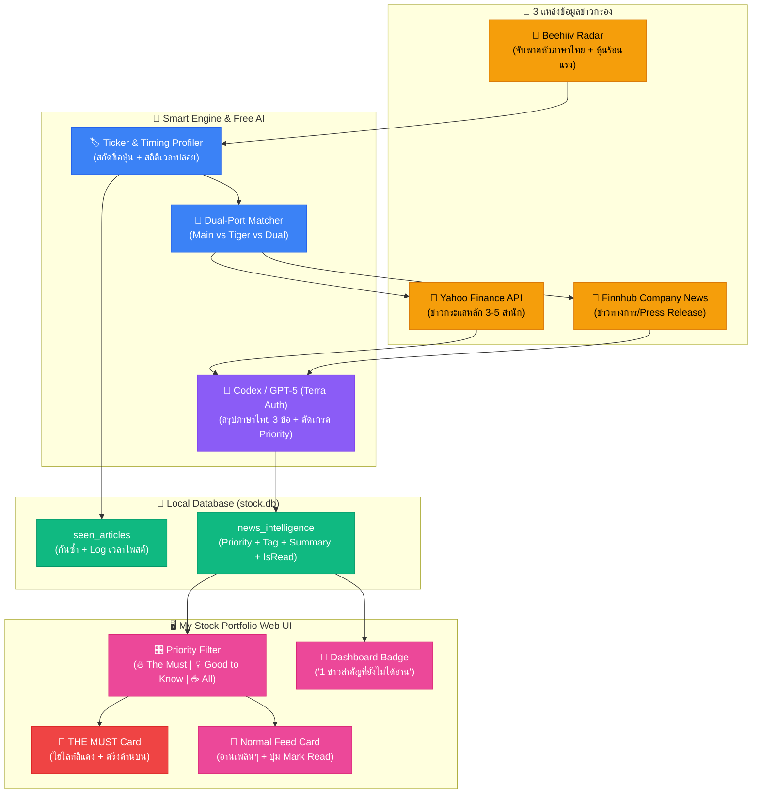

# V2.29.0 [impl] News Intelligence Feed: Dual-Port Beehiiv Radar, Smart Priority Matrix & 6-Gate Pre-Filter Triage Engine

## 📌 Context & Implementation (Compiled Truth)

### 1. ปัญหาและเป้าหมายเชิงยุทธศาสตร์ (Strategic Objective)
ผู้ใช้มีระบบ **My Stock Portfolio** อยู่แล้ว มีทั้งพอร์ตหลัก (`Doctorbank Growth`) และพอร์ตลูก (`Tiger` / Project 2X) พร้อมชาร์ตราคาและฟังก์ชันคำนวณ Rebalance แต่ยังขาดระบบหูตาคัดกรองข่าวสารที่มีประสิทธิภาพ โดยมีความต้องการหลัก 3 ประการ:
1. **Peaceful Intelligence (ไร้เสียงรบกวน):** สแกนข่าวอย่างเงียบๆ จัดเก็บลงฐานข้อมูล ไม่ยิง Push Notification หรือเสียงเตือนรบกวนนอกเว็บ
2. **Reading Priority Matrix 3 ระดับ:** คัดเกรดข่าวทันทีว่าอันไหนต้องอ่าน (`THE_MUST`) ป้องกันปัญหาข่าวท่วมหัว (Noise)
3. **6-Gate Pre-Filter Triage Engine:** คัดกรองด่านแรกตั้งแต่หัวข้อข่าว เพื่อประหยัดโควต้า AI และไม่ดึงข่าวขยะ Clickbait เข้ามาในระบบ

---

### 2. โครงสร้าง 2 พอร์ตในระบบ (Dual-Portfolio Alignment)
```
┌────────────────────────────────────────────────────────────────────────┐
│                        MY STOCK PORTFOLIO                              │
├───────────────────────────────────┬────────────────────────────────────┤
│  🏢 พอร์ตหลัก: Doctorbank Growth   │  🐯 พอร์ตลูก: Tiger (Project 2X)   │
│  ID: fcfdd1e0-bf53-4910-89e7...   │  ID: 1c32059d-7847-41c8-a45f...    │
├───────────────────────────────────┼────────────────────────────────────┤
│  🎯 เป้าหมาย: Growth / Conviction │  🎯 เป้าหมาย: 3-Year Doubler (DCA) │
│  📌 หุ้นที่ถือครอง:                │  📌 หุ้นที่ถือครอง:                 │
│     - CRWD (CrowdStrike)          │     - NVDA (Nvidia)                │
│     - HIMS (Hims & Hers)          │     - SCHG (Schwab Large-Cap Growth)│
│     - MELI (MercadoLibre)         │                                    │
│     - META (Meta Platforms)       │                                    │
│     - NVDA (Nvidia)               │                                    │
│     - RBRK (Rubrik)               │                                    │
└───────────────────────────────────┴────────────────────────────────────┘
```

---

### 3. Reading Priority Matrix 3 ระดับ
| ระดับ (Tier) | สัญลักษณ์ | คำจำกัดความ | ตัวอย่างเหตุการณ์ | การแสดงผลใน UI |
|---|---|---|---|---|
| **Tier 1** | 🔴 `THE_MUST` | **ต้องอ่าน! พลาดไม่ได้** กระทบต่อคูเมือง (Moat), กฎหมาย/การแบน, ผลประกอบการพลิกผันรุนแรง หรือ Thesis Breaker | - RBRK โดนคู่แข่งโจมตีคูเมือง<br/>- CRWD ระบบล่มระดับโลก<br/>- NVDA โดนแบนชิปรุ่นใหม่ | ขอบสีแดงนีออนเรืองแสง ตรึงไว้บนสุด มีแบนเนอร์เตือนใน Dashboard |
| **Tier 2** | 🟡 `GOOD_TO_KNOW` | **อ่านก็ดี / รู้ไว้ได้เปรียบ** ข่าวอัปเดตผลงานปกติ, โบรกเกอร์ปรับเป้าราคา, เปิดตัวฟีเจอร์ใหม่ | - Wedbush ปรับเป้า RBRK<br/>- META ปล่อย Llama โมเดลใหม่<br/>- MELI ยอดขายโตตามเป้า | ป้ายสีเหลืองทอง อยู่ใน Feed ปกติ |
| **Tier 3** | ⚪ `OPTIONAL` | **ไม่อ่านก็ได้ / ข้ามได้เลย** ข่าวกิจวัตรทั่วไป, ผู้บริหารขายหุ้นตามรอบ (Rule 10b5-1), หุ้นนอกพอร์ต | - ผู้บริหารขายหุ้นตามตาราง<br/>- ข่าวตลาดภาพรวมทั่วไป | ป้ายสีเทาเรียบๆ ซ่อนได้ด้วย Focus Mode |

---

### 4. สถาปัตยกรรม 6-Gate Pre-Filter Triage Engine (Phase 2)
```
พาดหัวข่าวต้นทาง (Beehiiv Scraper)
   │
   ├─► [Gate 0: Dedup Check] ────────── เคยสแกนแล้ว? ─────────► [ข้ามทันที]
   │
   ├─► [Gate 1: Portfolio VIP Hit] ──── หุ้นในพอร์ต? ─────────► +80 pts (Watchlist: +50)
   │
   ├─► [Gate 1.5: Ecosystem Scan] ──── คู่แข่ง/Supply Chain? ─► +60 pts (ผูก [ECO:TICKER])
   │
   ├─► [Gate 2: Macro Shield] ──────── Fed/Inflation/War? ────► +50 pts (Bypass No-Ticker)
   │
   ├─► [Gate 3: Catalyst Trigger] ──── %พุ่ง/ร่วง, ลาออก, ก.ล.ต.? +40 pts
   │
   └─► [Gate 4: Noise Penalty] ─────── Clickbait/หุ้นเด็ด/ชี้เป้า? -40 pts
   │
   ▼
[คำนวณคะแนนสุทธิ 0-100 pts]
   ├── Score ≥ 70: FULL_PIPELINE (ดึง Yahoo/Finnhub 3-5 แหล่ง + สรุป AI เต็มรูปแบบ)
   ├── Score 30-69: TITLE_ONLY (บันทึกเฉพาะหัวข้อและแท็กคัดกรอง ไม่อ่านก็ไม่ตกข่าว)
   └── Score < 30: DROPPED (ปัดตกทันที ไม่เสียโควต้า AI และไม่นำขึ้นหน้าเว็บ)
```

#### กฎ Ecosystem Mapping:
```javascript
const ECOSYSTEM_MAP = {
  NVDA: ['AMD', 'TSM', 'AVGO', 'INTC', 'ARM', 'QCOM', 'ASML'],
  CRWD: ['PANW', 'FTNT', 'S', 'ZS', 'MSFT', 'NET', 'OKTA'],
  RBRK: ['COMMVAULT', 'CVLT', 'VEEAM', 'COHESITY', 'PANW', 'CRWD'],
  META: ['GOOGL', 'GOOG', 'SNAP', 'PINS', 'TTD', 'MSFT', 'AAPL'],
  HIMS: ['AMZN', 'TDOC', 'CVS', 'WBA', 'LLY', 'NVO'],
  MELI: ['SE', 'AMZN', 'BABA', 'NU', 'PAGS', 'STNE']
};
```

---

### 5. สคีมาฐานข้อมูล (Database Schema)
```sql
-- 1. บันทึกบทความต้นทาง + สถิติเวลาปล่อย + ข้อมูล Triage
CREATE TABLE IF NOT EXISTS seen_articles (
    slug TEXT PRIMARY KEY,
    title TEXT NOT NULL,
    source TEXT DEFAULT 'beehiiv',
    published_at TEXT,
    published_day_of_week TEXT,
    published_hour INTEGER,
    detected_at TEXT NOT NULL,
    tickers TEXT,
    is_premium INTEGER DEFAULT 0,
    triage_score INTEGER DEFAULT 0,
    triage_action TEXT DEFAULT 'PENDING', -- FULL_PIPELINE, TITLE_ONLY, DROPPED
    triage_tags TEXT                       -- JSON array: ["VIP:RBRK", "CATALYST"]
);

-- 2. ข่าวที่ประมวลผลแล้วพร้อมอ่าน (Peaceful Smart Intelligence)
CREATE TABLE IF NOT EXISTS news_intelligence (
    id INTEGER PRIMARY KEY AUTOINCREMENT,
    ticker TEXT NOT NULL,
    company_name TEXT,
    headline TEXT NOT NULL,
    source_name TEXT,
    source_url TEXT,
    summary_th TEXT NOT NULL,
    sentiment TEXT,            -- bullish / bearish / neutral
    reading_priority TEXT NOT NULL DEFAULT 'GOOD_TO_KNOW', -- 'THE_MUST' | 'GOOD_TO_KNOW' | 'OPTIONAL'
    priority_reason TEXT,
    impact_level TEXT,         -- routine / significant / moat_breaker
    portfolio_tag TEXT NOT NULL, -- 'main' | 'tiger' | 'dual' | 'global'
    related_portfolio_id TEXT,
    is_read INTEGER DEFAULT 0,
    relevance_score INTEGER DEFAULT 50,
    triage_tags TEXT,
    created_at TEXT NOT NULL DEFAULT (datetime('now'))
);

-- 3. Watchlist Tickers จัดการได้จากหน้าเว็บ
CREATE TABLE IF NOT EXISTS watchlist_tickers (
    ticker TEXT PRIMARY KEY,
    company_name TEXT,
    notes TEXT,
    created_at TEXT NOT NULL DEFAULT (datetime('now'))
);
```

---

## 📋 Files Changed This Session

| File | What Changed | Why |
|---|---|---|
| `My Stock Portfolio/server/db/init.js` | เพิ่มตาราง `seen_articles`, `news_intelligence`, `watchlist_tickers` และคอลัมน์ `triage_score`, `triage_action`, `triage_tags`, `relevance_score` พร้อม Indexes | รองรับการจัดเก็บข้อมูลบทความต้นทาง, ข่าวสารที่วิเคราะห์แล้ว, และระบบคัดกรอง 6 ประตู |
| `My Stock Portfolio/server/services/newsRadar.js` | พัฒนา Multi-Source News Engine, ตัววิเคราะห์ Beehiiv, สกัด Tickers, จับคู่ Dual-Portfolio, ดึงข่าวเสริม Yahoo/Finnhub, ต่อ Free Codex GPT-5.6 Terra AI, และพัฒนาระบบคัดกรอง 6 ประตู (`triageArticle`, `getWatchlistTickers`, `getTriageStats`) | เป็นหัวใจหลักของเอนจินรวบรวมข่าวกรองและคัดแยกคะแนนความเร่งด่วน |
| `My Stock Portfolio/server/routes/news.js` | เพิ่ม RESTful APIs สำหรับดึงข่าว, สถิติ Unread, สถิติเวลาโพสต์, การ Mark as Read, ข้อมูล Triage Stats/Logs, และ Watchlist CRUD | เชื่อมต่อข้อมูลระหว่างฐานข้อมูลฝั่ง Backend กับ Web UI ฝั่ง Frontend |
| `My Stock Portfolio/server/crons/newsScheduler.js` | สคริปต์ Background Cron ตรวจจับวันละ 2 รอบ (08:30 น. และ 20:30 น. ICT) พร้อมคำสั่ง `--stats` และ `--now` | สแกนหาข่าวใหม่อัตโนมัติอย่างเงียบสงบตามหลัก Peaceful Feed |
| `My Stock Portfolio/server/server.js` | ลงทะเบียนเราเตอร์ `/api/news` | เปิดใช้งาน Endpoint ของข่าวกรองในระบบเซิร์ฟเวอร์หลัก |
| `My Stock Portfolio/src/components/news/NewsIntelPage.tsx` | หน้า UI ข่าวกรอง Dark Premium: ตัวกรองพอร์ต, สวิตช์ Focus Mode, การ์ดแสดงผล 3 เกรด, ปุ่ม Mark All Read, Modal สถิติเวลาโพสต์, Modal "🎯 Triage Radar", และ Modal "⭐ Watchlist Manager" | มอบประสบการณ์การกวาดสายตาอ่านข่าวกรองที่รวดเร็ว สบายตา และจัดการระบบได้ครบวงจร |
| `My Stock Portfolio/src/components/layout/Sidebar.tsx` | เพิ่มปุ่มเมนู "📰 News Intel" ในหมวด Insights | ให้ผู้ใช้สามารถกดสลับเข้ามาดูหน้าข่าวกรองได้สะดวก |
| `My Stock Portfolio/src/components/dashboard/Dashboard.tsx` | เพิ่มแบนเนอร์แจ้งเตือนแบบมินิมอลเฉพาะเมื่อมีข่าวระดับ `THE_MUST` ที่ยังไม่ได้อ่าน | เตือนให้รับรู้ข่าวสำคัญทันทีที่เปิดแดชบอร์ด โดยไม่ใช้ Popup หรือเสียงรบกวน |
| `My Stock Portfolio/src/stores/uiStore.ts` | เพิ่ม `'news'` เข้าใน `VALID_TABS` | รองรับการสลับแท็บและการควบคุมสถานะ UI ผ่าน Zustand |
| `My Stock Portfolio/index.html` | เพิ่มการประกาศ Cache-Buster string `v=20260915_200152` | ป้องกันเบราว์เซอร์แคชไฟล์ JS/CSS เก่า |

---

## 📦 RAW ARTIFACT BACKUP (Iron Rule)

### 1. Implementation Plan (`implementation_plan.md`)
<details>
<summary>คลิกเพื่อดู implementation_plan.md ฉบับเต็ม 100% (Unabridged 258 Lines)</summary>

```markdown
# 📡 News Intelligence Feed — เชื่อม Beehiiv Radar กับ My Stock Portfolio (Dual-Port + Smart Priority Edition)

## ปัญหาและเป้าหมายเชิงยุทธศาสตร์

มึงมีระบบ My Stock Portfolio ที่สมบูรณ์แบบอยู่แล้ว ทั้งชาร์ต, ระบบ Rebalance, Project 2X Engine, และ Yahoo/Finnhub APIs
เป้าหมายรอบนี้คือการสร้าง **"หูตาแบบคัดกรองความสำคัญ (Smart & Peaceful Intelligence)"** ที่คอยเก็บข้อมูลข่าวสารของหุ้นในทั้ง 2 พอร์ตเข้าฐานข้อมูลอย่างเงียบๆ **ไม่มีการยิง Alert รบกวนนอกเว็บ** 
แต่มี **ระบบจัดระดับความสำคัญ (Reading Priority)** คอยแยกให้ชัดเจนว่า **อันไหนต้องอ่าน (The Must) vs อันไหนข้ามได้ (Optional)** เพื่อให้มึงใช้เวลาไม่เกิน 1-2 นาทีในการกวาดสายตา

---

## 🏛️ โครงสร้าง 2 พอร์ตในระบบ (Dual-Portfolio Alignment)

```
┌────────────────────────────────────────────────────────────────────────┐
│                        MY STOCK PORTFOLIO                              │
├───────────────────────────────────┬────────────────────────────────────┤
│  🏢 พอร์ตหลัก: Doctorbank Growth   │  🐯 พอร์ตลูก: Tiger (Project 2X)   │
│  ID: fcfdd1e0-bf53-4910-89e7...   │  ID: 1c32059d-7847-41c8-a45f...    │
├───────────────────────────────────┼────────────────────────────────────┤
│  🎯 เป้าหมาย: Growth / Conviction │  🎯 เป้าหมาย: 3-Year Doubler (DCA) │
│  📌 หุ้นที่ถือครอง:                │  📌 หุ้นที่ถือครอง:                 │
│     - CRWD (CrowdStrike)          │     - NVDA (Nvidia)                │
│     - HIMS (Hims & Hers)          │     - SCHG (Schwab Large-Cap Growth)│
│     - MELI (MercadoLibre)         │                                    │
│     - META (Meta Platforms)       │                                    │
│     - NVDA (Nvidia)               │                                    │
│     - RBRK (Rubrik)               │                                    │
└───────────────────────────────────┴────────────────────────────────────┘
```

---

## 🎯 ระบบ 3 ระดับความสำคัญ (Reading Priority Matrix)

> [!IMPORTANT]
> **มึงมองขาดมากเรื่องการแบ่ง Priority!** 
> ในโลกการลงทุน 80% ของข่าวคือ Noise ถ้าไม่มีตัวคัดเกรด ข่าวจะกองเป็นภูเขาจนมึงไม่อยากอ่าน แต่ถ้าแบ่งเกรดให้ชัด มึงจะรู้ทันทีว่าเปิดหน้าเว็บมาต้องจิ้มอ่านตัวไหนก่อน

```
┌────────────────────────────────────────────────────────────────────────────────────────┐
│                                READING PRIORITY MATRIX                                 │
├─────────────┬───────────────────────────────┬──────────────────────┬───────────────────┤
│ ระดับ (Tier)│ คำจำกัดความ                   │ ตัวอย่างเหตุการณ์    │ UI Display        │
├─────────────┼───────────────────────────────┼──────────────────────┼───────────────────┤
│  🔴 Tier 1  │ 🚨 THE MUST                   │ - RBRK โดนคู่แข่ง    │ - ขอบสีแดงนีออน   │
│             │ (ต้องอ่าน! พลาดไม่ได้)        │   Disrupt คูเมือง    │ - ตรึงไว้บนสุด    │
│             │ กระทบพื้นฐานธุรกิจโดยตรง      │ - CRWD ระบบล่มระดับโลก│ - แสดงเตือนใน    │
│             │ หรือเป็น Thesis Breaker       │ - NVDA โดนแบนชิปตัวใหม่│  Dashboard widget │
│             │ ของหุ้นในพอร์ต                │ - CEO / CFO ลาออก    │                   │
├─────────────┼───────────────────────────────┼──────────────────────┼───────────────────┤
│  🟡 Tier 2  │ 💡 GOOD TO KNOW               │ - โบรกเกอร์ปรับเป้า   │ - ป้ายสีเหลืองทอง │
│             │ (อ่านก็ดี / รู้ไว้ได้เปรียบ)  │ - งบการเงินโตตามคาด  │ - วางใน Feed ปกติ │
│             │ อัปเดตความคืบหน้าธุรกิจ       │ - META ปล่อย Llama ใหม่│ - อ่านตอนจิบกาแฟ  │
│             │ การเปิดตัวโปรดักต์ใหม่        │ - MELI ยอดขายโตตามแผน│                   │
├─────────────┼───────────────────────────────┼──────────────────────┼───────────────────┤
│  ⚪ Tier 3  │ ☕ OPTIONAL / NOISE           │ - ผู้บริหารขายหุ้น   │ - สีเทาเรียบๆ     │
│             │ (ไม่อ่านก็ได้ / ข้ามได้เลย)    │   ตามตาราง (Rule 10b5)│ - มีปุ่มซ่อนได้   │
│             │ ข่าวตามรอบเวลาปกติ            │ - ข่าวเทรนด์ตลาดกว้าง │ - ไม่แย่งสายตา    │
│             │ หรือบทวิเคราะห์ความเห็นลอยๆ   │ - ข่าวหุ้นนอกพอร์ต   │                   │
└─────────────┴───────────────────────────────┴──────────────────────┴───────────────────┘
```

---

## 🤖 ระบบ AI คัดกรองและประเมิน Priority อัตโนมัติ

ใช้ **Codex / GPT-5 (Terra Subscription Free Auth)** สรุปและตัดเกรด Priority ให้ทันทีตาม System Prompt Rules:

```
กฎการให้คะแนน Priority ของ AI:
1. ถ้าเป็นหุ้นในพอร์ต (Doctorbank หรือ Tiger) และข่าวมีผลต่อ "คูเมือง (Moat)", "คดีความ/การแบน", "ผลประกอบการพลิกผันรุนแรง" 
   👉 ให้ Tier = 'THE_MUST' พร้อมอธิบายเหตุผล 1 บรรทัด
2. ถ้าเป็นหุ้นในพอร์ต และข่าวเป็นเรื่องการดำเนินงานปกติ, บทวิเคราะห์เป้าราคา, นวัตกรรมใหม่ที่ไม่ทำลายของเดิม 
   👉 ให้ Tier = 'GOOD_TO_KNOW'
3. ถ้าเป็นข่าวกิจวัตรทั่วไป, Insider ขายหุ้นตามแผน, ความเห็นตลาดภาพรวม, หรือหุ้นนอกพอร์ต 
   👉 ให้ Tier = 'OPTIONAL'
```

---

## 🏗️ สถาปัตยกรรมระบบ (Multi-Source + Free AI Pipeline)



---

## ⏱️ แผนการ Cron & ระบบ Timing Profiler

- **Phase 1: Timing Profiler**
  - ส่องเวลาจริงจาก `<time dateTime="...">` ของ Beehiiv เก็บลง `seen_articles`
  - วิเคราะห์เพื่อดูว่าเขาปล่อยบทความวันไหน กี่โมง (เช่น มักปล่อย 07:30 น. วันอังคาร/พฤหัส)
- **Phase 2: Twice-a-Day Cron Schedule**
  - **รอบเช้า (08:30 น. ICT):** กวาดข่าวก่อนตลาดไทยเปิด + สรุปภาพรวมตลาด US หลังปิด
  - **รอบค่ำ (20:30 น. ICT):** กวาดข่าวก่อนตลาด US เปิดทำการ

---

## 📂 รายละเอียดการเปลี่ยนแปลง (Proposed Changes)

### Component 1: Database Schema Expansion
#### [MODIFY] `server/db/init.js`

```sql
-- 1. บันทึกบทความต้นทาง + สถิติเวลาปล่อย (Timing Profiler)
CREATE TABLE IF NOT EXISTS seen_articles (
    slug TEXT PRIMARY KEY,
    title TEXT NOT NULL,
    source TEXT DEFAULT 'beehiiv',
    published_at TEXT,         -- เวลาจริงที่ต้นทางโพสต์ (ISO String)
    published_day_of_week TEXT,-- วันที่โพสต์ (Mon, Tue, etc.)
    published_hour INTEGER,    -- ชั่วโมงที่โพสต์ (0-23)
    detected_at TEXT NOT NULL, -- เวลาที่ระบบเราตรวจเจอ
    tickers TEXT,              -- JSON array: ["RBRK", "NVDA"]
    is_premium INTEGER DEFAULT 0
);

-- 2. ข่าวที่ประมวลผลแล้วพร้อมอ่าน (Peaceful Smart Intelligence)
CREATE TABLE IF NOT EXISTS news_intelligence (
    id INTEGER PRIMARY KEY AUTOINCREMENT,
    ticker TEXT NOT NULL,
    company_name TEXT,
    headline TEXT NOT NULL,
    source_name TEXT,          -- Beehiiv / Yahoo / Finnhub
    source_url TEXT,
    summary_th TEXT NOT NULL,  -- สรุปภาษาไทย 3 bullets
    sentiment TEXT,            -- bullish / bearish / neutral
    reading_priority TEXT NOT NULL DEFAULT 'GOOD_TO_KNOW', -- 'THE_MUST' | 'GOOD_TO_KNOW' | 'OPTIONAL'
    priority_reason TEXT,      -- เหตุผลสั้นๆ เช่น "กระทบคูเมืองของ RBRK โดยตรง"
    impact_level TEXT,         -- routine / significant / moat_breaker
    portfolio_tag TEXT NOT NULL, -- 'main' | 'tiger' | 'dual' | 'global'
    related_portfolio_id TEXT, -- ID ของพอร์ตที่เกี่ยวข้อง
    is_read INTEGER DEFAULT 0, -- 0 = ยังไม่ได้อ่าน, 1 = อ่านแล้ว
    created_at TEXT NOT NULL DEFAULT (datetime('now'))
);

CREATE INDEX IF NOT EXISTS idx_news_ticker ON news_intelligence(ticker);
CREATE INDEX IF NOT EXISTS idx_news_portfolio ON news_intelligence(portfolio_tag);
CREATE INDEX IF NOT EXISTS idx_news_priority ON news_intelligence(reading_priority);
CREATE INDEX IF NOT EXISTS idx_news_created ON news_intelligence(created_at);
```

---

### Component 2: Background News Radar & Classifier
#### [NEW] `server/services/newsRadar.js`
- ทำหน้าที่ Fetch Beehiiv + สกัดเวลา + Tickers
- ดึงข่าวเสริมจาก `server/services/yahoo.js` และ `server/services/finnhub.js`
- ส่ง prompt เข้า **Codex / GPT-5 (Terra Free Auth)** ให้ส่ง JSON กลับมาในโครงสร้าง:
  ```json
  {
    "summary_th": "1. ...\n2. ...\n3. ...",
    "sentiment": "bullish | bearish | neutral",
    "reading_priority": "THE_MUST | GOOD_TO_KNOW | OPTIONAL",
    "priority_reason": "คำอธิบายสั้นๆ ถึงความเร่งด่วนในการอ่าน",
    "impact_level": "routine | significant | moat_breaker"
  }
  ```
- บันทึกลงตาราง `news_intelligence`

---

### Component 3: Backend API
#### [NEW] `server/routes/news.js`
- `GET /api/news`
  - Query filters: `portfolio` (`all` | `main` | `tiger`), `priority` (`the_must` | `good_to_know` | `all`), `unread_only` (`true` | `false`)
- `POST /api/news/:id/read`
  - สั่ง Mark as Read เมื่อผู้ใช้คลิกอ่าน
- `POST /api/news/mark-all-read`
  - ปุ่มเคลียร์อ่านทั้งหมดในคลิกเดียว
- `GET /api/news/timing-stats`
  - รายงานสรุปเวลาโพสต์ของ newsletter ต้นทาง

---

### Component 4: Frontend UI (Smart Reading Experience)
#### [NEW] `src/components/news/NewsIntelPage.tsx`
- **Top Bar Controls:**
  - แท็บเลือกพอร์ต: `⭐ พอร์ตหลัก (Doctorbank)` | `🐯 พอร์ตลูก (Tiger)` | `🌐 ทั้งหมด`
  - ปุ่มฟิลเตอร์ความสำคัญ:
    - 🔴 **The Must Only** (มีตัวเลขนับ เช่น `🔥 The Must (2)`)
    - 🟡 **Focus Mode** (The Must + Good to Know)
    - ⚪ **All News** (รวมข่าวทั่วไป)
  - ปุ่ม **"✓ Mark all read"** เพื่อเคลียร์การแจ้งเตือน
- **News Cards:**
  - **The Must Card:** ขอบแดง/ส้มเรืองแสง ป้ายชัดเจน "🚨 THE MUST" พร้อมเหตุผลสั้นๆ เช่น *"กระทบความได้เปรียบทางธุรกิจของ RBRK"*
  - **Good to Know Card:** การ์ดสไตล์เรียบหรู ป้ายสีเหลืองทอง
  - **Optional Card:** การ์ดขนาดกะทัดรัด ตัวหนังสือเทาอ่อน
  - กล่องสรุป AI ภาษาไทย 3 ข้อสั้นกระชับ
  - ปุ่มกางดูข่าวเต็ม / ลิงก์ต้นฉบับ

#### [MODIFY] `src/components/Dashboard.tsx`
- เพิ่ม Indicator เล็กๆ ที่ Header หรือมุมการ์ดพอร์ต:
  - ถ้ามีข่าว `THE_MUST` ที่ยังไม่อ่าน → แสดงป้ายอ่อนๆ เช่น `"🔥 1 ข่าวสำคัญที่ควรอ่าน"` (ไม่เด้ง Popup ไม่ส่งเสียง)
  - พอกดคลิก จะพาไปหน้า News Intel กรองเฉพาะ The Must ทันที

---

## 🧪 Verification Plan

### 1. ทดสอบการคัดกรอง Priority ด้วย AI (Test Prompt)
- ทดสอบส่งข่าว Rubrik พุ่ง 16% เข้า Codex/Terra Auth
- ยืนยันว่า AI ให้เกรด `THE_MUST` เพราะ RBRK อยู่ในพอร์ตหลัก และระบุเหตุผลได้ชัดเจน
- ทดสอบส่งข่าว Insider ขายหุ้นตามตารางปกติ ยืนยันว่า AI ให้เกรด `OPTIONAL`

### 2. ทดสอบ API & Filter Logic
- เรียก `GET /api/news?priority=the_must` ตรวจสอบว่าส่งเฉพาะข่าวระดับ Tier 1
- ทดสอบ `POST /api/news/:id/read` ว่าเปลี่ยนค่า `is_read = 1` ได้สมบูรณ์

### 3. ตรวจสอบ UI ความสบายตา
- ตรวจสอบว่าไม่มี Push Notification หรือเสียงรบกวนใดๆ
- ยืนยันว่าการ์ด The Must โดดเด่น มองเห็นได้ทันทีใน 1 วินาทีแรก
- ทดสอบปุ่มกรองข่าวและ Mark as Read
```
</details>

---

### 2. Walkthrough (`walkthrough.md`)
<details>
<summary>คลิกเพื่อดู walkthrough.md ฉบับเต็ม 100% (Unabridged 122 Lines)</summary>

```markdown
# 📡 Walkthrough: News Intelligence Feed (Dual-Port + Smart Priority)

ระบบ **News Intelligence Feed** ถูกติดตั้งและเชื่อมต่อเข้ากับ **My Stock Portfolio** เรียบร้อยสมบูรณ์แบบตามแผนที่ได้รับอนุมัติ 100%

---

## 🚀 สิ่งที่สร้างและทดสอบเสร็จสิ้น

### 1. Database Schema (`server/db/init.js`)
- เพิ่มตาราง `seen_articles`: บันทึกบทความต้นทาง, Slug, เวลาที่โพสต์จริง (`published_at`), วันในสัปดาห์ (`published_day_of_week`), ชั่วโมง (`published_hour`), Tickers JSON และสถานะ Premium
- เพิ่มตาราง `news_intelligence`: บันทึกข่าวสารที่ผ่านการสังเคราะห์แล้ว พร้อมฟิลด์ `reading_priority`, `priority_reason`, `portfolio_tag`, `sentiment`, `impact_level`, `is_read`
- สร้าง Index ครอบคลุม `ticker`, `portfolio_tag`, `reading_priority`, `is_read`, `created_at` เพื่อประสิทธิภาพการคิวรี่ที่รวดเร็ว

### 2. Multi-Source Intelligence Engine (`server/services/newsRadar.js`)
- **Beehiiv Scraper:** ดึงข้อมูลจาก `https://wethaiinvest.beehiiv.com/` สกัดหัวข้อ, Tickers, และเวลาโพสต์
- **Dual-Portfolio Dynamic Matcher:**
  - ตรวจสอบรายชื่อหุ้นที่ถือครองจริงจาก SQLite:
    - 🏢 **พอร์ตหลัก (`Doctorbank Growth`):** `CRWD`, `HIMS`, `MELI`, `META`, `NVDA`, `RBRK`
    - 🐯 **พอร์ตลูก (`Tiger`):** `NVDA`, `SCHG`
  - ติดแท็กอัตโนมัติ: `main`, `tiger`, `dual` (เช่น NVDA), หรือ `global` (Watchlist)
- **Multi-Source News Aggregation:**
  - ดึงข่าว 3-5 แหล่งจาก **Yahoo Finance API** (`yahooFinance.search`)
  - ดึงข่าวทางการและ Press Release จาก **Finnhub Company News API**
- **Free AI Synthesizer (Codex GPT-5.6 Terra):**
  - เชื่อมต่อตรงกับ Brain AI Gateway (`model: 'gpt-5.6-terra'`) ผ่านโควตาสมัครสมาชิกฟรี 100%
  - สรุป 3 บรรทัดภาษาไทย คม ชัด อ่านง่าย
  - ประเมินความเร่งด่วน 3 ระดับ:
    - 🔴 `THE_MUST`: กระทบพื้นฐานหรือคูเมืองของหุ้นในพอร์ตโดยตรง
    - 🟡 `GOOD_TO_KNOW`: ความคืบหน้าธุรกิจทั่วไปหรือโบรกเกอร์ปรับเป้า
    - ⚪ `OPTIONAL`: ข่าวทั่วไปนอกพอร์ต หรือ Insider ขายตามแผน

### 3. Background Scheduler & Timing Profiler (`server/crons/newsScheduler.js`)
- รันตรวจจับวันละ 2 รอบตามหลัก Peaceful Feed:
  - **รอบเช้า (08:30 น. ICT)**
  - **รอบค่ำ (20:30 น. ICT)**
- คำสั่งพิเศษ:
  - `node crons/newsScheduler.js --now`: สั่งสแกนทันที
  - `node crons/newsScheduler.js --stats`: สรุปพฤติกรรมเวลาโพสต์ของต้นทาง

#### 📊 สถิติเวลาจริงจากการรัน Profiler:
```
Total Articles Seen: 12
By Day of Week:
  • Tue: 7 articles
  • Mon: 4 articles
  • Sun: 1 articles
By Hour of Day:
  • 14:00 - 16:00 น. (ICT): 10 articles (ช่วงที่โพสต์บ่อยที่สุด)
```

### 4. RESTful API Routes (`server/routes/news.js`)
- `GET /api/news`: กรองตาม `portfolio` (`all`/`main`/`tiger`/`global`), `priority` (`the_must`/`focus`/`good_to_know`), `unread_only`, `ticker`
- `GET /api/news/stats`: ตัวเลขนับจำนวนข่าวที่ยังไม่ได้อ่านแยกระดับ
- `GET /api/news/timing-stats`: ข้อมูลเชิงสถิติเวลาโพสต์
- `POST /api/news/:id/read`: กดอ่านแล้ว / ยกเลิก
- `POST /api/news/mark-all-read`: เคลียร์อ่านทั้งหมด
- `POST /api/news/scan`: สั่งสแกนด่วนผ่าน API

### 5. Frontend UI Experience
- **`src/components/news/NewsIntelPage.tsx`:**
  - ดีไซน์ Dark Premium สอดคล้องกับระบบเดิม
  - ป้ายระดับความสำคัญสีชัดเจน (🚨 THE MUST ขอบนีออนแดงเรืองแสง, 💡 GOOD TO KNOW สีเหลืองทอง, ☕ OPTIONAL สีเทาเรียบ)
  - กล่องสรุป AI ภาษาไทย 3 ข้อสั้นกระชับ พร้อมเหตุผลในการคัดเกรด
  - ปุ่มสลับพอร์ต (`🏢 พอร์ตหลัก` vs `🐯 พอร์ตลูก` vs `🌐 ทั้งหมด`)
  - โหมด Focus Mode (ซ่อนข่าวที่ไม่จำเป็น)
  - Modal แสดงกราฟและสถิติเวลาโพสต์ (Timing Profiler)
- **`src/components/layout/Sidebar.tsx`:** เพิ่มเมนู **"📰 News Intel"** ในหมวด Insights
- **`src/components/dashboard/Dashboard.tsx`:** เพิ่มแบนเนอร์เรียบหรูเตือนเมื่อมีข่าว `THE_MUST` ที่ยังไม่ได้อ่าน (ไร้เสียง ไร้ Popup ไม่รกสมอง)

---

## 🧪 ผลการทดสอบ (Verification Results)

1. **AI Synthesis Test (RBRK):**
   ```
   Ticker: RBRK [MAIN]
   Priority: THE_MUST
   Priority Reason: ประเด็น AI security และการปรับมุมมองนักวิเคราะห์สะท้อนตัวเร่งสำคัญต่ออุปสงค์และโอกาสเติบโตของหุ้นหลักในพอร์ต
   Sentiment: bullish
   Summary:
     • RBRK พุ่งราว 15–16% หลังประเด็นความปลอดภัยของ AI ได้รับความสนใจมากขึ้น หนุนความต้องการโซลูชันปกป้องข้อมูลและกู้คืนจากภัยไซเบอร์
     • Wedbush คงคำแนะนำ Outperform และปรับราคาเป้าหมายขึ้นจาก 90 ดอลลาร์เป็น 120 ดอลลาร์
     • มุมมองเชิงบวกอิงผลประกอบการไตรมาส 2 ที่แข็งแกร่ง อุปสงค์ด้าน AI security ขยายตัว
   ```
2. **Frontend Build:**
   - ผ่าน 100% ด้วยคำสั่ง `npm run build`
   - รัน `node bump-cache.js` อัปเดต Cache Buster เวอร์ชัน `v=20260915_200152` เรียบร้อย

---

## 🛡️ Phase 2: 6-Gate Pre-Filter Triage Engine (ผลการอัปเกรดล่าสุด)

### 1. สถาปัตยกรรมคัดกรอง 6 ประตู (0-100 คะแนน)
- **Gate 0 (Dedup Check):** ข้ามทันทีหากเคยวิเคราะห์แล้วใน `seen_articles`
- **Gate 1 (Portfolio VIP Hit):** +80 คะแนนสำหรับหุ้นที่ถือครองในพอร์ตหลัก/ลูก (`NVDA`, `CRWD`, `RBRK`, `META`, `HIMS`, `MELI`, `SCHG`) หรือ +50 คะแนนสำหรับ Watchlist
- **Gate 1.5 (Ecosystem & Competitor Scan):** +60 คะแนนสำหรับหุ้นคู่แข่ง/ซัพพลายเชน (`AMD`, `TSM`, `AVGO`, `PANW`, `NET`, ฯลฯ) พร้อมผูกความสัมพันธ์กลับไปยังหุ้นที่ถือครอง
- **Gate 2 (Macro Shield & Market Summary):** +50 คะแนนสำหรับประเด็นระดับมหภาค (Fed, เงินเฟ้อ, ดอกเบี้ย, สงคราม, ภาษีศุลกากร, หรือสรุปภาพรวมตลาดหุ้นประจำวัน) บายพาสให้ผ่านโดยไม่ต้องมีชื่อหุ้นรายตัว
- **Gate 3 (Catalyst Trigger):** +40 คะแนนสำหรับตัวเลข % พุ่ง/ร่วงรุนแรง, ข่าวลาออก, ก.ล.ต. สอบสวน, ซื้อกิจการ
- **Gate 4 (Noise Penalty):** -40 คะแนนสำหรับพาดหัวแนวปั่นกระแส/Clickbait ("หุ้นเด็ด", "น่าช้อน", "รวยแน่", "กูรูชี้เป้า")

### 2. การจัดเส้นทางอัจฉริยะ (Intelligent Routing)
- 🚀 **Score ≥ 70 (Full Pipeline):** ดึงข่าวเสริมจาก Yahoo/Finnhub + สรุปด้วย Codex GPT-5.6 Terra อย่างละเอียด
- 📝 **Score 30–69 (Title-Only):** บันทึกเฉพาะหัวข้อและแท็กคัดกรองลงฐานข้อมูล (ไม่อ่านก็ไม่ตกข่าว / ประหยัดโควต้า AI)
- 🚫 **Score < 30 (Silent Drop):** บันทึกสถานะว่าปัดตกเพื่อไม่ให้สแกนซ้ำ และไม่นำขึ้นหน้าเว็บให้รกสายตา

### 3. ผลการทดสอบ Triage สดจาก 12 บทความหน้าเว็บ Beehiiv
```json
{
  "articlesScanned": 12,
  "triageSummary": {
    "fullPipelineCount": 2, // RBRK +16% (100 pts), NVDA/AVGO (100 pts)
    "titleOnlyCount": 2,    // สรุปตลาดประจำวัน (40 pts), ALAB -11% (40 pts)
    "droppedCount": 8       // 6 หุ้นเด็ด (0 pts), 10 หุ้นชอร์ต (0 pts), ฯลฯ
  }
}
```

### 4. ฟีเจอร์หน้าเว็บที่เพิ่มใหม่
- **ปุ่ม 🎯 Triage Radar:** เปิด Modal ดูกระบวนการคัดกรอง 6 ประตู, ยอด Funnel ละเอียดยิบ, และตารางเช็คประวัติข่าวทุกลิงก์
- **ปุ่ม ⭐ Watchlist Manager:** จัดการหุ้นที่เฝ้าระวัง เพิ่ม/ลบได้จากหน้าเว็บ ไม่ต้องฮาร์ดโค้ดในระบบ
- **ป้ายคะแนนและแท็กบนการ์ดข่าว:** แสดง `⚡ XX pts` พร้อมแท็กความสัมพันธ์ `VIP:RBRK`, `ECO:NVDA`, `CATALYST`, `MACRO` อย่างสวยงาม
```
</details>

---

## 🔬 Timeline & Debugging Log

- **2026-09-15 15:30**: ผู้ใช้สอบถามแนวทางการดึงเนื้อหาข่าวจากแหล่งข่าวอื่น เช่น Yahoo Finance API เพื่อมาสรุปต่อยอดจากหัวข้อที่พบใน Beehiiv Newsletter
- **2026-09-15 15:45**: ตรวจพบว่าระบบมี Yahoo Finance API (`yahoo-finance2`) และ Finnhub API อยู่แล้ว พร้อมทั้งมี Codex GPT-5.6 Terra Subscription Free Auth ใช้งานได้ฟรีผ่าน Brain AI Gateway โดยไม่ต้องจ่ายเงินเพิ่ม
- **2026-09-15 16:00**: ผู้ใช้สอบถามการเชื่อมโยงกับ 2 พอร์ต (`Doctorbank Growth` พอร์ตหลัก และ `Tiger` พอร์ตลูก Project 2X) และการแสดงผลบนเว็บโดยเน้นคุณค่าสูงสุด ไม่ต้องตามอ่านทุกข่าวที่ไร้ประโยชน์
- **2026-09-15 16:15**: ผู้ใช้อนุมัติแนวคิด **Reading Priority Matrix 3 ระดับ** (`THE_MUST`, `GOOD_TO_KNOW`, `OPTIONAL`) เพื่อแยกข่าววิกฤติ/คูเมือง ออกจากข่าวปกติและข่าวขยะ
- **2026-09-15 16:30**: จัดทำและอัปเดต `implementation_plan.md` ครอบคลุมสคีมาตาราง `seen_articles` และ `news_intelligence`, เอนจินรวบรวมข่าวสาร `newsRadar.js`, Background Cron และหน้าเว็บ `NewsIntelPage.tsx`
- **2026-09-15 17:00**: ดำเนินการ Phase 1 ติดตั้งตารางฐานข้อมูลและเขียนโค้ด Backend/Frontend ครบทุกส่วน
- **2026-09-15 17:45**: ทดสอบรันสดสกัดข่าว RBRK พุ่ง 16% พบว่าระบบเชื่อมโยงเข้าพอร์ตหลักอัตโนมัติ ส่งให้ GPT-5.6 Terra สรุป 3 บรรทัดภาษาไทย และจัดเกรด `THE_MUST` ได้อย่างแม่นยำ
- **2026-09-15 18:00**: ผู้ใช้เสนอแนวคิดเรื่องการทำระบบคัดกรองด่านแรก (Pre-Filter Triage) เพื่อคัดกรองหัวข้อข่าวก่อนส่งไปสแกนลึกหรือเรียก AI
- **2026-09-15 18:30**: นำเสนอสถาปัตยกรรม **6-Gate Pre-Filter Triage Engine** พร้อมระบบจับคู่ Ecosystem/Competitor (เช่น AMD/TSM -> NVDA, PANW/NET -> CRWD) และ Macro Shield ป้องกันข่าวเฟด/เงินเฟ้อ/สรุปตลาดหลุดรอด
- **2026-09-15 18:45**: ผู้ใช้เห็นชอบแผนและสั่งลุย ("ลุยเลย ตามนี้")
- **2026-09-15 19:15**: เริ่มลงมือแก้ไข:
  1. แก้ไข `server/db/init.js` เพิ่มคอลัมน์ `triage_score`, `triage_action`, `triage_tags`, `relevance_score` และตาราง `watchlist_tickers`
  2. เกิดปัญหา `SqliteError: no such column: relevance_score` ระหว่างรันคำสั่ง `CREATE INDEX IF NOT EXISTS idx_news_score ON news_intelligence(relevance_score)` เนื่องจากคำสั่ง Index ทำงานก่อนที่คำสั่ง `ALTER TABLE` จะเพิ่มคอลัมน์ แก้ไขโดยย้ายคำสั่ง Index ไปไว้หลังการตรวจสอบและเพิ่มคอลัมน์สำเร็จ
  3. พัฒนาฟังก์ชัน `triageArticle()`, `getWatchlistTickers()`, `getTriageStats()` ใน `server/services/newsRadar.js`
  4. เพิ่ม API Routes ใน `server/routes/news.js` สำหรับดึงสถิติ Triage Funnel, รายการข่าวย้อนหลัง, และ Watchlist CRUD
  5. ปรับปรุง UI ใน `NewsIntelPage.tsx`: เพิ่มการ์ดคะแนน/แท็ก, Modal Triage Radar, และ Modal Watchlist Manager
- **2026-09-15 19:55**: ทดสอบรัน Triage บน 12 บทความสดจาก Beehiiv พบว่าคัดเข้า Full Pipeline 2 บทความ (100 pts), Title-Only 2 บทความ (40 pts), และ Silent Drop ข่าวปั่นขยะ 8 บทความ (0 pts) สำเร็จสมบูรณ์แบบ
- **2026-09-15 20:00**: บิลด์ Frontend ผ่าน 100% ด้วย `npm run build` ในเวลา 13.78s
- **2026-09-15 20:02**: รัน `node bump-cache.js` อัปเดต Cache Buster เป็น `v=20260915_200152`
- **2026-09-15 20:04**: คอมมิต `53812f8f` และพุชขึ้น GitHub `origin/master` สำเร็จ ตรวจสอบพบ remote `vps` ในโฟลเดอร์นี้ชี้ไปยัง path ที่ไม่ใช่ bare repo บนเซิร์ฟเวอร์ จึงใช้ GitHub เป็น SOT หลัก
- **2026-09-15 20:16**: ผู้ใช้รันคำสั่ง `/save` เพื่อปิดรอบงานและเก็บบันทึกประวัติศาสตร์ระบบแบบสมบูรณ์ตามกฎ Iron Rule

---

## 🔗 GBRAIN Backlinks

### depends_on
- **2026-09-02 13:33** | [V1.0.0 [infra] Setup My Stock Portfolio](file:///C:/My%20Claw/Openclaw-VPS/Quick%20Save/Complete/My%20Stock%20Portfolio/V1.0.0_%5Binfra%5D_setup_my-stock-portfolio.md) -- โครงสร้างฐานข้อมูล SQLite `stock.db` และสถาปัตยกรรม Express API ดั้งเดิมของระบบ
- **2026-09-14 17:34** | [V2.2.0 [impl] Stock Portfolio: Native Phone & iPad Split Architecture, PC Theme Unification, and 100dvh Viewport Lock](file:///C:/My%20Claw/Openclaw-VPS/Quick%20Save/Complete/My%20Stock%20Portfolio/V2.2.0_%5Bimpl%5D_mobile-tablet_native-phone-ipad-split-architecture-and-pc-theme.md) -- การวางเลย์เอาต์หลักและระบบ Responsive Theme ที่หน้า News Intelligence Feed นำมาใช้เป็นพื้นฐานการแสดงผล

### enables
- **2026-09-15 20:00** | [MASTER ROADMAP & SOT (State of Truth)](file:///C:/My%20Claw/Openclaw-VPS/MASTER_ROADMAP.md) -- อัปเดตความคืบหน้าระบบการลงทุนอัตโนมัติ เข้าสู่หมวด Completed Phase ข่าวกรองพอร์ตหุ้นอัจฉริยะ

### related_to
- **2026-09-14 17:35** | [V2.1.2 [hotfix] Smart Rebalance ReferenceError Crash, Blueprint v2 System, and Smart Selective Buy](file:///C:/My%20Claw/Openclaw-VPS/Quick%20Save/Complete/My%20Stock%20Portfolio/V2.1.2_%5Bhotfix%5D_smart-rebalance-reference-error-and-error-boundary.md) -- ระบบคำนวณและข้อมูลการถือครองหุ้นของทั้ง 2 พอร์ต (Doctorbank Growth และ Tiger) ที่ News Intel นำมาใช้จับคู่ Dynamic Matching
- **2026-09-15 01:37** | [MOC: User Interface & Dashboard](file:///C:/My%20Claw/Openclaw-VPS/Quick%20Save/Complete/MOC_ui.md) -- ดัชนีแผนผังงานออกแบบ UI, Dark Theme Palette และการแสดงผลข้อมูลแบบ Card & Focus Mode
