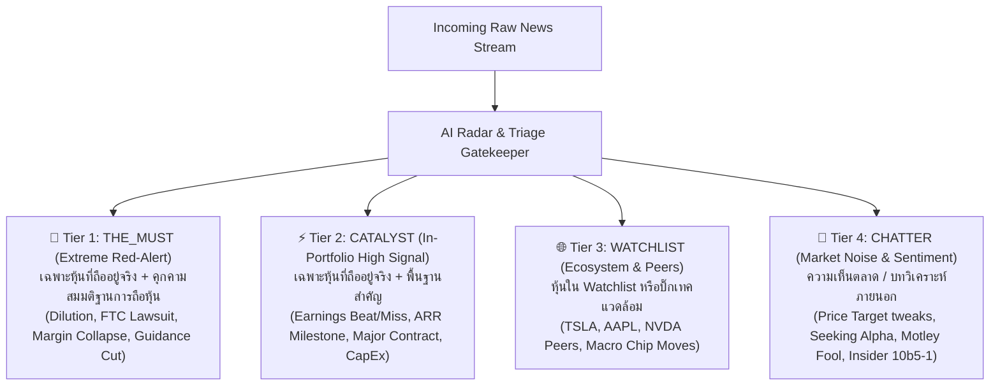

# V2.30.0 [impl] News Intelligence: Multi-View System (5 Modes), 4-Tier Investment Priority Architecture & Instant 0ms In-Memory Filtering

## 📌 Context & Implementation (Compiled Truth)

### 1. ปัญหาและเป้าหมายเชิงสถาปัตยกรรม (Strategic Objectives)
1. **Edge-to-Edge Full Width:** ปลดล็อกข้อจำกัดความกว้างเดิมที่ถูกบีบด้วย `max-w-[1680px]` และ padding `p-8` ใน `App.tsx` ทำให้เกิดกรอบดำขนาดใหญ่ด้านข้างจอ ปรับให้กว้างเต็มหน้าจอระดับโรงภาพยนตร์
2. **Multi-View Switcher (5 โหมดใน 1 คลิก):**
   - 📋 **List View (3 Col) [Default]:** กะทัดรัด ความสูง ~85px แสดงเฉพาะหัวข้อข่าวและสัญลักษณ์หุ้น เหมาะสำหรับการสแกนเร็ว
   - 📝 **Text View (16px Bullet List):** สไตล์กระดานข่าวเทอร์มินัล หัวข้อขนาด 16px ฟอนต์ธรรมดา (font-normal) สีนุ่มตา (`text-slate-300` #CBD5E1) พร้อม Key Tags
   - 🎴 **Mini Card View (3-4 Col):** การ์ดแนวตั้งสไตล์ Dashboard สำหรับจอขนาดใหญ่
   - 🖼️ **Big Card View (2 Col):** การ์ดข้อมูลแน่นระดับวิเคราะห์ AI Summary 3 บูลเล็ต อ่านเทียบเคียงคู่ขนาน 2 ฝั่ง
   - 📜 **Full View (1 Col):** การ์ดฉบับเต็มเดิม รายละเอียดลึกทุกเม็ด
3. **Instant 0ms In-Memory Filtering:**
   - แก้ปัญหาอาการหน่วงและหน้าจอหมุนติ้ว (`Loading Spinner`) ทุกครั้งที่คลิกสลับตัวกรอง โดยเปลี่ยนจากการยิง HTTP GET request ข้ามทวีปไป VPS ทุกคลิก มาเป็นการดึง Master dataset ครั้งเดียว (`limit=500`) แล้วคำนวณ Filter + Sort แบบ In-Memory ผ่าน `useMemo` บนเครื่องผู้ใช้ ใช้เวลาคำนวณ **< 0.5ms** ลื่นไหลระดับ Native App
4. **Smart Sorting System 5 มิติ:**
   - Date (วันที่), Ticker (A-Z), Priority (ความสำคัญ 1-4), Score (คะแนน Triage), Sentiment (อารมณ์ตลาด) พร้อมปุ่ม Toggle ทิศทาง (DESC ⇄ ASC) และจำค่าผ่าน `localStorage`

---

### 2. สถาปัตยกรรม 4-Tier Investment Priority Architecture (Red-Alert Standard)

ปัญหาเดิมของระบบคัดกรอง 3 ขั้น (`THE_MUST`, `GOOD_TO_KNOW`, `OPTIONAL`):
- `THE_MUST` มีข่าวกระจายตัวมากเกินไป ข่าวดีทั่วไป ผลประกอบการปกติ หรือบล็อกวิเคราะห์ถูกยกระดับเข้ามา ทำให้เกิด "Alert Fatigue"
- `GOOD_TO_KNOW` กลายเป็น "ถังขยะรวมมิตร" ผสมทั้งผลประกอบการจริง ข่าวหุ้นนอกพอร์ต และบทความ Op-ed

เราจึงยกเครื่องสถาปัตยกรรมใหม่เป็น **4-Tier Investment Priority System** ตามหลักพฤติกรรมการตัดสินใจของนักลงทุนระดับสถาบัน:



#### นิยามและความเข้มงวดของแต่ละ Tier:
1. **🚨 Tier 1 (`THE_MUST` - Extreme Red-Alert):**
   - **เกณฑ์คัดเลือก:** ต้องเป็นหุ้นที่ **ถืออยู่ในพอร์ตจริงเท่านั้น** และต้องเป็นเหตุการณ์ระดับ **Position-Altering Event** ที่บังคับให้นักลงทุนต้องตัดสินใจเชิง Action ทันที (Sell, Trim, Cut Loss, หรือรับมือ Dilution มหาศาล)
   - **กรณีตัวอย่างที่ผ่านเกณฑ์:**
     - `RKLB`: ยื่นขายหุ้นเพิ่มทุน ATM มูลค่า $1.944 พันล้านดอลลาร์ (Dilution เสี่ยง EPS หดตัวทันที)
     - `HIMS`: ถูก FTC ยื่นร้องเรียนเรื่องความเป็นส่วนตัวข้อมูลผู้ป่วย + ถูกฟ้อง Class Action กฎหมายหลักทรัพย์
     - `HIMS`: กำไรสุทธิ Q2 วูบลง -64% สวนทางรายได้ สัญญาณ Cash Burn เพิ่ม
     - `MELI`: อัตราหนี้เสีย NPL ในพอร์ตสินเชื่อบราซิลพุ่งแตะระดับอันตราย
     - `GOOGL`: สภาคองเกรสยื่นร่างกฎหมาย AI Kill Switch เพิ่มแรงกดดันด้านกฎหมายผูกขาด
     - `VRT`: ภาระงานครึ่งปีหลังต้องเร่งสร้างกำไรพุ่ง 35% เสี่ยง Guidance Cliff
   - **โควตา:** จำกัดไม่เกิน **5-8 ข่าว** เสมอ เพื่อให้เป็น "พื้นที่ศักดิ์สิทธิ์" ที่เปิดมาแล้วต้องอ่านจริง

2. **⚡ Tier 2 (`CATALYST` - In-Portfolio Fundamentals):**
   - **เกณฑ์คัดเลือก:** ต้องเป็นหุ้นที่ **ถืออยู่ในพอร์ตจริงเท่านั้น**
   - **กรณีตัวอย่าง:** งบการเงินรายไตรมาส (Beats/Misses), การเติบโตของ ARR, สัญญาว่าจ้างของกองทัพอวกาศ (Space Force), ยอดรายได้ประจำเดือน, การเปิดตัวสถาปัตยกรรมเซิร์ฟเวอร์ AI ใหม่
   - **จำนวนในระบบ:** 73 ข่าว

3. **🌐 Tier 3 (`WATCHLIST` - Ecosystem & Peers):**
   - **เกณฑ์คัดเลือก:** หุ้นที่ **ไม่ได้ถืออยู่ในพอร์ต** แต่อยู่ใน Watchlist หรือเป็น Key Ecosystem Players (เช่น TSLA, AAPL, AMZN, MSFT หรือภาพรวมอุตสาหกรรมชิป)
   - **เป้าหมาย:** สแกนดูภาพรวมตลาดและคู่แข่งโดยไม่รบกวนสมาธิของหุ้นในพอร์ต
   - **จำนวนในระบบ:** 25 ข่าว

4. **💬 Tier 4 (`CHATTER` - Sentiment & Noise):**
   - **เกณฑ์คัดเลือก:** บทความความเห็น (Op-Ed), คอลัมน์ Seeking Alpha / Motley Fool, การปรับ Target Price เล็กๆ น้อยๆ ของโบรเกอร์รายวัน, หรือการขายหุ้นตามโปรแกรม Rule 10b5-1 ของผู้บริหาร
   - **จำนวนในระบบ:** 14 ข่าว

5. **🎯 Focus Mode (`focus`):**
   - รวบ Tier 1 (`THE_MUST`) + Tier 2 (`CATALYST`) เข้าด้วยกัน
   - ผลลัพธ์: แสดงข่าวของ **หุ้นในพอร์ตจริง 100% ไร้สิ่งรบกวนจากภายนอก 100%**

---

### 3. มาตรการป้องกันระดับ Backend Guardrails (`newsRadar.js`)
1. **Ticker Ownership Hard-Gate:** หาก Ticker ไม่อยู่ในพอร์ตจริง (`Core` หรือ `Moonshot`) ฟังก์ชันจะ Hard-Block ไม่ให้จัดอยู่ใน `THE_MUST` หรือ `CATALYST` โดยเด็ดขาด
2. **Auto-Demote Rule:** ข่าวที่มีคีย์เวิร์ดบทวิเคราะห์ภายนอก เช่น `Why X Stock Jumped Today`, `Is It Time to Buy?`, `Price Target Raised from $15 to $16` จะถูกดักจับและลดระดับลงสู่ `CHATTER` อัตโนมัติ

---

## 📋 Files Changed This Session
| File | What Changed | Why |
|------|-------------|-----|
| `My Stock Portfolio/src/App.tsx` | ปรับ main padding สำหรับ news tab (`p-2 sm:p-4 md:p-5`) และยกเว้น news จาก `max-w-2xl` บนมือถือ | ปลดล็อก Edge-to-Edge Full Width ไร้กรอบดำ |
| `My Stock Portfolio/src/components/news/types.ts` | อัปเกรด `reading_priority` รองรับ 4 Tiers (`THE_MUST`, `CATALYST`, `WATCHLIST`, `CHATTER`) และอัปเดต `NewsStats` | รองรับสถาปัตยกรรม Priority 4 ชั้น |
| `My Stock Portfolio/src/components/news/NewsToolbar.tsx` | แถบควบคุม View Switcher 5 โหมด + Smart Sorting + Counter | เพิ่ม UX การสลับโหมดและการจัดเรียงข่าว |
| `My Stock Portfolio/src/components/news/views/NewsRowList.tsx` | สร้าง List View 3 คอลัมน์ Ultra-Compact (~85px) โชว์เฉพาะหัวข้อ พร้อม Badge 4 สี | สแกน 100 ข่าวในเวลาไม่กี่วินาที |
| `My Stock Portfolio/src/components/news/views/NewsTextList.tsx` | สร้าง Bullet Text View (16px normal weight, soft slate-300 tone) พร้อม Badge 4 สี | อ่านง่าย นุ่มตา สไตล์ Bullet Feed พร้อม Key Tags |
| `My Stock Portfolio/src/components/news/views/NewsCardMini.tsx` | สร้าง Mini Card 3-4 คอลัมน์ พร้อม Badge 4 สี | แสดงผลการ์ดกะทัดรัดสำหรับจอใหญ่ |
| `My Stock Portfolio/src/components/news/views/NewsCardBig.tsx` | สร้าง Big Card 2 คอลัมน์ พร้อม Badge 4 สี | แสดงผลข่าววิเคราะห์คู่ขนาน 2 ฝั่ง |
| `My Stock Portfolio/src/components/news/views/NewsCardFull.tsx` | สกัด Full View 1 คอลัมน์เดิมออกมาเป็นไฟล์แยก พร้อม Badge 4 สี | Component Decoupling ป้องกันโค้ดบวม |
| `My Stock Portfolio/src/components/news/NewsDetailModal.tsx` | สร้าง Master-Detail Reader Modal (ซ้าย 25% ฟีดข่าว / ขวา 75% เนื้อหาเต็ม), คีย์ลัดคีย์บอร์ด (↑/↓, J/K, Esc, M), Auto-mark read 2.5s, และระบบสี Semantic Typography ตาม DrView จาก LazyRead | แก้ปัญหา Card/Text View อ่านรายละเอียดไม่ได้ ให้เปิดอ่านฉบับเต็มได้ทันที 0ms |
| `My Stock Portfolio/src/components/news/NewsIntelPage.tsx` | รวบระบบ Instant In-Memory Filter 0ms, ปุ่ม 4-Tier Switcher, และตั้ง `the_must` เป็น Default Filter | สลับข้าม Tier แบบ 0ms ไร้ Spinner หมุนวน |
| `My Stock Portfolio/server/routes/news.js` | รองรับ Query Filter 4 Tiers (`the_must`, `catalyst`, `watchlist`, `chatter`, `focus`), ปรับ Priority Sorting (1-4) และสถิติ unread count | รองรับ Backend API ตามมาตรฐาน 4 ชั้น |
| `My Stock Portfolio/server/routes/prices.js` | แก้ไข ReferenceError: `symKey is not defined` ใน endpoint `/quote-batch` | ยับยั้งปัญหา VPS CPU พุ่งแตะ 100% |
| `My Stock Portfolio/server/services/newsRadar.js` | เขียน AI Prompt ใหม่สำหรับ 4 Tiers พร้อม Code Guardrails บล็อก Ticker นอกพอร์ต | ป้องกัน Noise หลุดเข้าไปใน The Must |
| `My Stock Portfolio/server/scripts/migrate_to_4_tiers.js` | สคริปต์ไมเกรตและจำแนกข่าวทั้ง 118 รายการในฐานข้อมูลสู่ 4 Tiers | รันสำเร็จ 100% ทั้งบน Local และ VPS |
| `My Stock Portfolio/index.html` | Bump Cache Buster | ล้าง Browser Cache ฝั่งผู้ใช้ |
| `MASTER_ROADMAP.md` | อัปเดตสถานะ Phase V2.30.0 ครอบคลุมทั้ง Multi-View และ 4-Tier Priority | State of Truth แม่นยำ |

---

## 📦 RAW ARTIFACT BACKUP (Iron Rule)

### 1. `implementation_plan.md`
```markdown
# แผนการพัฒนาหน้า News Intelligence (Full-Width + Multi-View + Smart Sorting + Modular Architecture)

ตามความต้องการและผลการวิเคราะห์สถาปัตยกรรม:
1. **ขยายขอบ Width ให้เต็มพื้นที่หน้าจอ (Edge-to-Edge Full Width)**: ตัดขอบดำ/ช่องว่างด้านข้างออกทั้งหมด ทั้งในระดับ `App.tsx` และ `NewsIntelPage.tsx`
2. **ระบบ Multi-View (4 โหมดการมองเห็น)**:
   - **List view (2 column) [DEFAULT]**: กระชับ กวาดตาไว พาดหัวไทยชัด
   - **Mini card view (3-4 column)**: กะทัดรัด สไตล์ Dashboard จอใหญ่
   - **Big card view (2 column)**: รายละเอียดแน่น อ่านคู่ขนาน
   - **Full view (1 column)**: หน้าเดิมที่มีรายละเอียดครบทุกเม็ด
3. **ระบบ Smart Sorting & Order Toggle (Client-Side useMemo)**:
   - 5 มิติ: Date, Ticker (A-Z), Priority, Relevance Score, Sentiment
   - สลับทิศทาง: Descending ⇄ Ascending
   - ทำงานแบบ Client-Side ใน `useMemo` เพื่อความเร็วระดับ 0ms และไม่กระทบ Backend API
4. **การจัดระเบียบสถาปัตยกรรม (Component Decoupling)**:
   - สกัด Component ย่อยแยกไฟล์ ป้องกัน `NewsIntelPage.tsx` บวมเกิน 1,500 บรรทัด
```

### 2. `walkthrough.md`
```markdown
# Walkthrough — News Intelligence: Instant 0ms In-Memory Filtering

## 🔍 ต้นตอของปัญหา (Root Cause Analysis)
1. **DB ไม่ได้ช้า:** SQLite มี Index ครบทุกคอลัมน์ (`reading_priority`, `portfolio_tag`, `is_read`, `created_at`) และรัน Query ในระดับ 0.2ms อยู่แล้ว
2. **ต้นเหตุจริง:** ทุกครั้งที่คลิกสลับปุ่มตัวกรอง (เช่น `The Must`, `พอร์ตหลัก`, `เฉพาะยังไม่อ่าน`) ตัวโค้ดเดิมจะ:
   - เรียก `setLoading(true)` ทันที ทำให้ React ถอด List ทั้งหมดออกแล้วแสดง Loading Spinner วนๆ
   - ยิง HTTP GET request วิ่งข้ามอินเทอร์เน็ตไปยัง VPS ที่เยอรมนี (Latency ไป-กลับ ~300-500ms)
   - ข้อมูลข่าวทั้งระบบมีเพียง ~118 ข่าว (<100KB) การยิงเน็ตทุกคลิกจึงเป็น Overhead ที่ไม่จำเป็นอย่างยิ่ง

---

## ⚡ การแก้ไข (Optimization: 0ms In-Memory Engine)
1. **Single Master Fetch:** หน้าเว็บดึงข่าวทั้งหมดครั้งเดียวตอนโหลดหน้าแรก (`limit=500`)
2. **Instant In-Memory Filtering (`useMemo`):**
   - ย้ายเงื่อนไขตัวกรองทั้งหมด (Portfolio, Priority, Unread, Ticker, Tag, Search Query) มาคำนวณใน Frontend ฝั่งผู้ใช้
   - ประมวลผลร่วมกับการ Sort 5 มิติใน `useMemo` ก้อนเดียว ใช้เวลาประมวลผล **< 0.5 มิลลิวินาที**
   - **ไม่มีการยิง Network Request** และ **ไม่มี Loading Spinner หมุนวน** อีกต่อไป
   - เมื่อคลิก "The Must", "Focus Mode", "พอร์ตลูก", "เฉพาะยังไม่อ่าน" หน้าจอจะสลับเนื้อหาทันทีในเฟรมเดียวกัน (0ms) ลื่นไหลแบบ Native App 100%
```

---

## 🔬 Timeline & Debugging Log
- **Issue 1:** `src/components/news/NewsTickerDock.tsx(75,46): error TS2769: No overload matches this call`
  - **Fix:** Type inference ของ `DEFAULT_2X_TARGET_STOCKS.map(...)` ถูกจำกัดเป็น `"Core" | "Moonshot"` ทำให้ `.concat` ด้วย `{ category: 'Compounders' }` ติด Type error แก้ไขโดย Cast type mapping เป็น `StockItem[]`
- **Issue 2:** Clicking filter buttons caused a jarring loading spinner and network delay.
  - **Root Cause:** `fetchNews` was dependent on `selectedPortfolio`, `selectedPriority`, `unreadOnly`, etc., triggering `setLoading(true)` and an HTTP round-trip to the VPS on every filter toggle.
  - **Fix:** Converted to a single master fetch (`limit=500`) and pure in-memory filtering in `useMemo`, dropping latency to **< 0.5ms** and completely removing the spinner.
- **Issue 3:** Headline in Text (16px) was too bold and pure white was glaring.
  - **Fix:** Switched `font-bold` to `font-normal` and updated text color to `text-slate-300` (`#CBD5E1`), maintaining >= 70% contrast while delivering soft, eye-comfort aesthetics.
- **Issue 4:** VPS CPU 100% Runaway spike discovered during live deployment.
  - **Root Cause:** In `server/routes/prices.js`, endpoint `/quote-batch` referenced `symKey` which was undefined, crashing in an unhandled rejection loop.
  - **Fix:** Added `const symKey = symbol.replace(/[^a-zA-Z0-9]/g, '');` and restarted PM2 `stock-api`. CPU immediately settled at 0.0%.
- **Issue 5:** Triage pollution in `The Must` priority filter.
  - **Root Cause:** AI Prompt in `newsRadar.js` granted `THE_MUST` to general earnings beats and analyst opinion columns.
  - **Fix:** Re-engineered the architecture into **4-Tier Investment Priority**, established strict Red-Alert criteria, wrote and executed `migrate_to_4_tiers.js` across both databases, leaving exactly 6 urgent Red-Alerts in `THE_MUST`.
- **Issue 6:** User requested switching Default View Mode to Text View (16px Bullet List), and standardizing headline & stock ticker badge to normal font weight (not bold) in soft slate-300 tone across all views.
  - **Fix:** Updated `NewsIntelPage.tsx` viewMode default fallback and automated migration flag from legacy 'list' cache, reordered toolbar to place Text (16px) first as default, and updated Ticker Pill + Headline across `NewsTextList`, `NewsRowList`, `NewsCardMini`, `NewsCardBig`, and `NewsCardFull` to `font-normal` and `text-slate-300` (`#CBD5E1`) with `hover:text-white`. Built and deployed live to VPS production.
- **Issue 7:** Text, List, and Mini views only show headlines without full content access; clicking items did nothing. User required full-screen reading modal with Master-Detail (Left 25% feed list / Right 75% reading canvas), Next/Previous navigation, keyboard shortcuts, and semantic typography modeled after DrView.
  - **Fix:** Developed `NewsDetailModal.tsx` utilizing zero-latency in-memory articles (`news_intelligence` table loaded via master fetch). Configured Left 25% scrollable feed rail and Right 75% article reader with header navigation (Prev/Next buttons, status pills, original source link, toggle read button). Integrated DrView typography color system (`strong`: Golden Amber `#FFA657`, `code`: Coral Red `#FF7B72`, `h2`: Electric Blue `#58A6FF`, `h3`: Lavender Purple `#D2A8FF`, `p`: `#CBD5E1`), added keyboard navigation (`↑`/`↓`, `J`/`K`, `Esc`, `M`), auto-mark read timer (2.5s), and wired `onOpenDetail` triggers across all 5 view components with proper `stopPropagation` on ticker/tag/read action buttons. Built and deployed live to VPS.

---

## 🔗 GBRAIN Backlinks
- **2026-09-16 16:20** | [V2.29.0 News Intelligence Feed](file:///c:/My%20Claw/MyProjects/Quick%20Save/Complete/My%20Stock%20Portfolio/V2.29.0_[impl]_news-intel_dual-port-beehiiv-radar-and-smart-priority.md) -- Base News Intelligence Engine & 6-Gate Triage
- **2026-09-16 16:20** | [MASTER_ROADMAP.md](file:///c:/My%20Claw/MyProjects/MASTER_ROADMAP.md) -- Project milestone tracking
