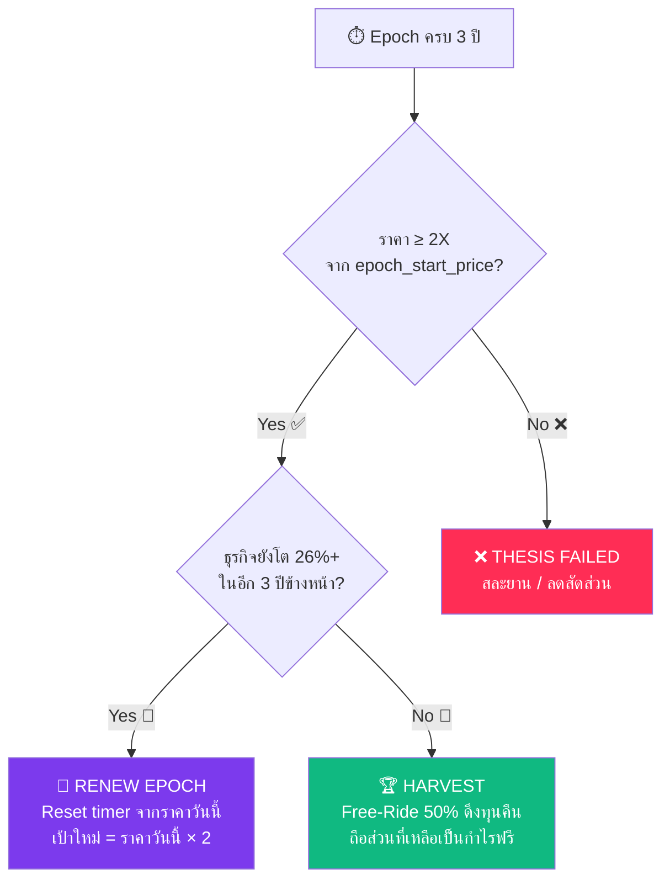

# Project 2X: Thesis Timer Decoupling, 3Y Horizon Anchoring & Epoch Renewal Engine

## 📌 Context & Implementation (Compiled Truth)

### 1. ปัญหาดั้งเดิมของ Project 2X Day Counting & DCA
เดิมทีเป้าหมาย 1 เด้ง ใน 3 ปี (Doubling in 3 Years / 26% CAGR) อ้างอิงจาก `avg_cost` ของพอร์ต ซึ่งสร้างปัญหาเชิงระบบ 2 ประการ:
1. **DCA ขยับเป้าหนีไปเรื่อยๆ**: เมื่อผู้ใช้ทยอยซื้อไม้ 2 และไม้ 3 ในราคาที่สูงขึ้น ต้นทุนเฉลี่ยจะเพิ่มขึ้นเรื่อยๆ ทำให้เป้าหมาย 1 เด้งขยับหนี ส่งผลให้ไม่มีวันถึงเป้า 1 เด้งได้จริง
2. **ไม่สะท้อนศักยภาพของหุ้น**: การวัดว่าหุ้นตัวหนึ่งสามารถเติบโต 100% ใน 3 ปีหรือไม่ เป็นคุณสมบัติของ "หุ้นหน้ากระดาน (Market Fill Price)" ไม่ควรถูกบิดเบือนด้วยเม็ดเงินหรือความถี่ในการเติมเงินของผู้ถือหุ้น

### 2. สถาปัตยกรรมแยกอิสระ (Decoupled Epoch Architecture)
ระบบแยกตัวแปรวัดผลออกเป็น 2 เสาหลัก:
- **Portfolio P&L (MWRR)**: วัด "เงินกูกำไรเท่าไหร่" จากต้นทุนเฉลี่ย DCA จริงในพอร์ต
- **Thesis Timer ⏱️**: วัด "หุ้นโตตามวิทยานิพนธ์ 1 เด้งใน 3 ปีหรือไม่" จากราคาตลาดวันซื้อไม้แรก (`thesis_start_price` @ `thesis_anchor_date`)

```
┌─────────────────────────────────────────────────────────────┐
│                    แยก 2 คำถาม ออกจากกัน                      │
│                                                             │
│  คำถาม A: "เงินกูกำไรเท่าไหร่?"                               │
│  → ดูที่ Portfolio MWRR / P&L                                │
│  → คำนวณจาก ต้นทุนเฉลี่ย vs ราคาตลาด                        │
│  → Dashboard Realized/Unrealized CAGR                       │
│                                                             │
│  คำถาม B: "หุ้นตัวนี้ยังเป็น Growth Stock ระดับ 26% ไหม?"      │
│  → ดูที่ Thesis Timer ⏱️                                     │
│  → นับจากวันเริ่ม Thesis + ราคาวันนั้น                         │
│  → ไม่เกี่ยวกับต้นทุนของมึง, ไม่เกี่ยวกับ DCA                  │
└─────────────────────────────────────────────────────────────┘
```

### 3. Database Migration (`server/db/init.js`)
เพิ่ม 3 คอลัมน์ใหม่ในตาราง `project2x_share_quotas`:
- `thesis_anchor_date TEXT`: วันเริ่มนับ Thesis (YYYY-MM-DD)
- `thesis_start_price REAL`: ราคาเริ่มนับ 1 เด้ง (ราคาซื้อไม้แรก หรือราคาปิดวันนั้น)
- `thesis_horizon_years REAL DEFAULT 3.0`: กรอบเวลามาตรฐาน 3 ปี (1,095 วัน)

### 4. Backend Engine & Sync Logic (`server/services/project2xEngine.js` & `dossierService.js`)
- `syncShareQuotas()`: ตรวจสอบและดึงข้อมูล `first_buy_date` และ `price` ไม้แรกจากตาราง `transactions` มาเป็น Anchor อัตโนมัติ (พร้อม Proxy mapping ระหว่าง QQQM และ SCHG ใน Tiger Portfolio)
- `calculateThesisMetrics()`: คำนวณวันถือครองจริง (`daysElapsed`), วันคงเหลือ (`daysRemaining`), เดือนคงเหลือ (`monthsRemaining`), ความก้าวหน้าเทียบกับ Exponential Curve 26% CAGR (`pacePct`), และสถานะ (`🟢 On Track`, `🚀 Ahead`, `🔴 Behind`, `🔴 Expired (>3Y)`, `🏆 DOUBLED`, `⏳ Not Started`)
- `renewThesisEpoch()`: ฟังก์ชัน Reset หรือต่ออายุรอบ 3 ปีใหม่จากราคาหน้ากระดานปัจจุบัน
- `dossierService.js`: ปลดล็อก `basePrice` จาก `avgCost` ให้ใช้ `thesis_start_price` ถาวร

### 5. Frontend & UI Elements
- **Matrix Table (`Project2xPage.tsx`)**: เพิ่มคอลัมน์ `⏱️ Thesis (3Y)` พร้อม Urgency Pill Badges และเรียงลำดับตามความเร่งด่วน
- **DoublerConeChart (`DoublerConeChart.tsx`)**: กราฟกรวยพยากรณ์ 3 ปี ปักหมุดเริ่มจาก `anchorDate` และ `basePrice` พร้อมเส้นประและไฟกระพริบ `TODAY`
- **DoublerPowerTube (`DoublerPowerTube.tsx`)**: แสดง Telemetry เวลาถือครอง vs เวลาคงเหลือ พร้อมปุ่ม **`Renew 3Y`** มุมขวาบน

---

## 📌 Strategic Note: Auto-Roll vs Manual Decision Gate (สำหรับตัดสินใจรอบหน้า)

ผู้ใช้ได้เปิดประเด็นคำถามสำคัญ:
> *"เคสที่ 1: หุ้นวิ่งครบ 1 เด้งก่อนเวลา (เช่น NVDA 🏆 DOUBLED) ทางเลือก A: 'Reset & Roll' ทำไมระบบไม่นับต่อไปเลยล่ะ จะมาเสียเวลากด renew ทำไม"*

### การวิเคราะห์เปรียบเทียบ 2 แนวทาง:

| มิติ | แนวทาง 1: Manual Renew (ปัจจุบัน) | แนวทาง 2: Auto-Roll on Doubling |
|---|---|---|
| **พฤติกรรมระบบ** | หุ้นขึ้น 100% จะคงสถานะ `🏆 DOUBLED` ค้างไว้ รอให้ผู้ใช้กดปุ่ม `Renew 3Y` | เมื่อราคาแตะ `targetPrice` ระบบจะ Reset `anchor_date` เป็นวันนี้ และคำนวณเป้า 2X ถัดไปทันทีอัตโนมัติ |
| **จุดเด่น** | บังคับให้เกิด **Decision Gate**: นักลงทุนต้องทบทวน Valuation ว่าหุ้นตึงหรือยัง และมีสิทธิ์เลือกทำ **Free Ride (ดึงทุนคืน 50%)** ก่อนเริ่มรอบใหม่ | สะดวก 100% เหมาะกับสาย Compound มือวาง ปล่อยเงินทำงานต่อเนื่องยาวนาน ไม่ต้องมี Action ใดๆ |
| **จุดพึงระวัง** | ผู้ใช้อาจรู้สึกว่าต้องเสียเวลาคลิกอนุมัติ | หากหุ้นผันผวนแตะ $215 แล้วย่อลง $200 ระบบจะกลายเป็น `Behind` ทันที และอาจขยับเป้าหนีโดยที่ผู้ใช้ไม่ได้อนุมัติ |

### ข้อเสนอทางเลือกสำหรับพัฒนา UI ครั้งหน้า:
1. **User Preference Toggle**: เพิ่มสวิตช์ใน Settings หรือใน Dossier: `[Auto-Renew 2X Epoch: ON/OFF]`
2. **Double Celebration Banner**: เมื่อหุ้นแตะ 2X แสดงแบนเนอร์ Quick Action 2 ปุ่ม: `[🏆 Take Free Ride (Sell 50%)]` หรือ `[🔄 Roll Next 3Y Target]`

---

## 📋 Files Changed This Session

| File | What Changed | Why |
|---|---|---|
| `server/db/init.js` | เพิ่ม migration คอลัมน์ `thesis_anchor_date`, `thesis_start_price`, `thesis_horizon_years` | รองรับการจัดเก็บ Epoch Data ระดับโควตาหุ้น |
| `server/services/project2xEngine.js` | เพิ่ม `syncShareQuotas` epoch sync, `calculateThesisMetrics`, `renewThesisEpoch`, enrich radar matrix rows | คำนวณเวลาและสปีดการเติบโตเปรียบเทียบกับกรอบ 3 ปี |
| `server/routes/project2x.js` | เพิ่ม route `POST /api/project-2x/quotas/:pid/renew-epoch` | ให้ frontend ยิงคำสั่ง Reset หรือต่ออายุรอบ Thesis ได้ |
| `server/services/dossierService.js` | ปลดล็อก `basePrice` จาก `avgCost` และคืน payload `thesis` object | ป้องกันเป้าหมาย 1 เด้งขยับหนีเวลา DCA |
| `src/stores/dossierStore.ts` | อัปเดต `ThesisData` interface รองรับ `anchorDate`, `startPrice`, `horizonYears`, `targetPrice` | แก้ไข TypeScript compilation errors |
| `src/components/project2x/LWChart.tsx` | เพิ่ม `'targetConsensus'` ใน Union state ของ `indicatorInitialView` | ขจัด Type error ในโมดอลคอนฟิกกราฟ |
| `src/components/project2x/Project2xPage.tsx` | เพิ่มคอลัมน์ `⏱️ Thesis (3Y)` และ Urgency Sorting | แสดงเวลานับถอยหลังและสปีดบนหน้ากระดาน Matrix |
| `src/components/project2x/dossier/charts/DoublerConeChart.tsx` | กราฟกรวยเริ่มจากวันซื้อไม้แรก พร้อมแสดงเส้น TODAY | แสดงเส้นทางเติบโตที่แม่นยำเทียบกับเวลาจริง |
| `src/components/project2x/dossier/tabs/DossierCockpitTab.tsx` | ส่ง `anchorDate` และ `basePrice` เข้า `DoublerConeChart` ทั้ง 3 Mode | ผูกกรวยทำนายเข้ากับ Thesis เริ่มต้น |
| `src/components/project2x/dossier/DoublerPowerTube.tsx` | เพิ่มปุ่ม `Renew 3Y` พร้อมกล่องยืนยัน Reset Epoch | เปิดให้ผู้ใช้สั่งต่ออายุรอบ 3 ปีได้ทันทีในหน้า Dossier |
| `src/services/api.ts` & `src/stores/project2xStore.ts` | เพิ่ม API method และ Store action `renewThesisEpoch` | เชื่อมโยง State management หน้าบ้านกับหลังบ้าน |

---

## 📦 RAW ARTIFACT BACKUP (Iron Rule)

```markdown
# 🔬 Project 2X Day Counting — Updated Plan v2

> **มหาเทพ 👁️‍🗨️ — แก้ปัญหา DCA ที่ต้นทุนวิ่งขึ้นเรื่อยๆ**

---

## 🧩 ปัญหาที่มึงสะกิดมา (สรุปง่ายๆ)

มึงถามคำถามที่ถูกมาก กูจะตีแผ่ให้เห็นเป็นภาพ:

### ❌ ถ้านับ "1 เด้ง" จากต้นทุนเฉลี่ย (Avg Cost) — พัง

```
เดือน 1:  ซื้อ NVDA 2 หุ้น @ $100    → ต้นทุน $100  → เป้า 1 เด้ง = $200
เดือน 6:  ซื้อ NVDA 2 หุ้น @ $130    → ต้นทุน $115  → เป้า 1 เด้ง = $230  ⬆️ ขยับ!
เดือน 12: ซื้อ NVDA 2 หุ้น @ $160    → ต้นทุน $130  → เป้า 1 เด้ง = $260  ⬆️ ขยับอีก!
เดือน 18: ซื้อ NVDA 2 หุ้น @ $190    → ต้นทุน $145  → เป้า 1 เด้ง = $290  ⬆️ ขยับอีก!!
เดือน 24: ราคาตลาด $200              → กำไร +38%    → แต่ยังไม่ถึงเป้า $290 ❌
```

> **ยิ่ง DCA ยิ่งไม่มีวันถึง 1 เด้ง** — เพราะเป้ามันวิ่งขึ้นตามต้นทุนที่เพิ่มทุกเดือน

### ❌ ถ้านับจากวันแรก แต่ช่วงแรกเงินน้อย — ก็ไม่แฟร์

```
เดือน 1:  ลง $200 (2 หุ้น)     ← เงินนิดเดียว
เดือน 12: ลงรวมแล้ว $2,000     ← เงินเริ่มเยอะ
เดือน 24: ลงรวมแล้ว $5,000     ← เงินส่วนใหญ่อยู่ตรงนี้

ถ้านับ 3 ปีจากเดือน 1 → เหลือเวลาอีก 12 เดือนตอนเดือน 24
แต่เงิน $5,000 ส่วนใหญ่เพิ่งลงไปปีเดียว → ทำไมต้องไปถึง 1 เด้งใน 12 เดือน?
```

---

## 💡 คำตอบที่ถูกต้อง: แยก 2 เรื่องออกจากกัน

> **"1 เด้ง ใน 3 ปี" ไม่ได้ถามว่า "เงินของมึงจะเท่าตัวไหม"**
> มันถามว่า **"หุ้นตัวนี้ยังโตปีละ 26% ได้อยู่ไหม"**

```
┌─────────────────────────────────────────────────────────────┐
│                    แยก 2 คำถาม ออกจากกัน                      │
│                                                             │
│  คำถาม A: "เงินกูกำไรเท่าไหร่?"                               │
│  → ดูที่ Portfolio MWRR / P&L                                │
│  → คำนวณจาก ต้นทุนเฉลี่ย vs ราคาตลาด                        │
│  → มีอยู่แล้วใน Dashboard (Realized CAGR)  ✅                │
│                                                             │
│  คำถาม B: "หุ้นตัวนี้ยังเป็น Growth Stock ระดับ 26% ไหม?"      │
│  → ดูที่ Thesis Timer ⏱️                                     │
│  → นับจากวันเริ่ม Thesis + ราคาวันนั้น                         │
│  → ไม่เกี่ยวกับต้นทุนของมึง, ไม่เกี่ยวกับ DCA                  │
│  → ❌ ยังไม่มีในระบบ — ต้องสร้างใหม่                           │
└─────────────────────────────────────────────────────────────┘
```

---

## 🚂 เปรียบเทียบง่ายๆ: "รถไฟสาย 2X"

```
สถานีต้นทาง ($100)                                    สถานีปลายทาง ($200)
     🚉 ──────────────────────────────────────────────── 🏆
     │  ออกเดินทาง                                       │
     │  1 ม.ค. 2026                                     │
     │                                                   │
     │   🚶 มึงขึ้นรถที่สถานี $100 (ไม้แรก)                 │   ← เงินก้อนแรก
     │        🚶 ขึ้นเพิ่มที่สถานี $120 (DCA เดือน 4)        │   ← DCA
     │              🚶 ขึ้นเพิ่มที่สถานี $140 (DCA เดือน 8)  │   ← DCA
     │                    🚶 ขึ้นเพิ่มที่สถานี $160          │   ← DCA
     │                                                   │
     ▼                                                   ▼
  Thesis Timer นับ: "รถไฟออกจากสถานี $100 วันที่ 1 ม.ค."
  ถ้า 3 ปีผ่านไป รถถึง $200 → ✅ Thesis สำเร็จ (หุ้นโตจริง)
  ถ้า 3 ปีผ่านไป รถยังอยู่ $150 → ❌ Thesis ล้มเหลว (หุ้นโตไม่ถึง)
```

**สิ่งที่ Thesis Timer วัด:** "รถไฟ" (หุ้น) วิ่งตามตารางเวลาหรือเปล่า
**ไม่ได้วัด:** มึงขึ้นรถที่สถานีไหน หรือจ่ายค่าตั๋วเท่าไหร่

---

## 📐 Thesis Epoch Model — วิธีที่ถูกต้อง

### แต่ละหุ้นมี "Thesis Epoch" (รอบวิทยานิพนธ์):

| Field | ความหมาย | ตัวอย่าง NVDA |
|-------|---------|---------------|
| `epoch_start_date` | วันที่เริ่มนับ Thesis | `2026-01-15` (วันที่เริ่มซื้อไม้แรก) |
| `epoch_start_price` | ราคาหุ้น ณ วันเริ่ม Thesis | `$131.00` (ราคาตลาดวันนั้น ไม่ใช่ avg cost) |
| `epoch_target_price` | เป้าหมาย 2X | `$262.00` (= $131 × 2) |
| `epoch_horizon` | กรอบเวลา | `3 ปี` (default, ปรับได้) |
| `epoch_end_date` | วันครบกำหนด | `2029-01-15` |

### DCA ทำงานยังไงใน Model นี้:

```
วันที่ 15 ม.ค. 2026:
  → ซื้อ NVDA ไม้แรก @ $131
  → ระบบตั้ง Epoch: start=$131, target=$262, deadline=15 ม.ค. 2029
  → Thesis Timer เริ่มนับ: "⏱️ 36 เดือน"

วันที่ 15 มี.ค. 2026:
  → DCA ซื้อเพิ่ม @ $140
  → ต้นทุนเฉลี่ยของมึง = $135.50
  → แต่ Thesis Timer ไม่เปลี่ยน: start price ยังเป็น $131, target ยังเป็น $262
  → ⏱️ เหลือ 34 เดือน

วันที่ 15 ม.ค. 2027 (ผ่านไป 1 ปี):
  → ราคาตลาด $165
  → Pace Check: ideal = $131 × 1.26¹ = $165.06 → 🟢 On Track!
  → ต้นทุนเฉลี่ยของมึง $142 → กำไร +16% (P&L ส่วนตัว)
  → ⏱️ เหลือ 24 เดือน
  
วันที่ 15 ม.ค. 2029 (ครบ 3 ปี):
  → ราคาตลาด $270
  → Thesis Check: $270 > $262 → ✅ THESIS VALIDATED!
  → ต้นทุนเฉลี่ยของมึง $155 → กำไร +74% (P&L ส่วนตัว)
```

> [!IMPORTANT]
> **จุดสำคัญ:** ต้นทุนเฉลี่ย $155 กำไร +74% ← นี่คือ "ผลตอบแทนเงินของมึง"
> แต่ Thesis บอกว่าหุ้นโตจาก $131 → $270 (+106%) ← นี่คือ "หุ้นตัวนี้เก่งไหม"
> **ทั้งสองตัวเลขมีความหมายต่างกัน ห้ามปนกัน**

---

## 🔄 ครบ 3 ปีแล้วทำไง? — Epoch Renewal



**ตัวอย่างจริง:**
- NVDA ครบ 3 ปี ราคาไป $270 (ผ่านเป้า $262) ✅
- ถามตัวเอง: "NVDA อีก 3 ปีข้างหน้า ยังโต 26%/ปี ได้ไหม?"
  - ถ้าใช่ → **Renew Epoch**: start_price ใหม่ = $270, target ใหม่ = $540, timer reset 36 เดือน
  - ถ้าไม่ (เช่น P/E 60x แล้ว, CAGR ชะลอ) → **Harvest**: ขาย 50% ดึงทุนคืน

---

## 📊 หน้าตาที่จะเห็นบน Matrix Table

```
┌────────┬────────┬────────┬──────────────────┬────────┐
│ SYMBOL │ PRICE  │ WEIGHT │   ⏱️ THESIS      │ STATUS │
├────────┼────────┼────────┼──────────────────┼────────┤
│ NVDA   │ $131   │ 22.1%  │ 🟢 22M left      │ BUY    │
│        │        │        │ Pace: On Track   │ ZONE   │
├────────┼────────┼────────┼──────────────────┼────────┤
│ TSM    │ $210   │ 10.3%  │ 🟡 14M left      │ ON     │
│        │        │        │ Pace: -4% Behind │ RADAR  │
├────────┼────────┼────────┼──────────────────┼────────┤
│ PLTR   │ $85    │  3.1%  │ 🔴 3M left       │ GET    │
│        │        │        │ Pace: -18% Behind│ READY  │
├────────┼────────┼────────┼──────────────────┼────────┤
│ RBRK   │ $75    │  1.2%  │ ⏳ Not Started   │ HELD   │
│        │        │        │ (ไม่อยู่ในโควต้า)  │        │
├────────┼────────┼────────┼──────────────────┼────────┤
│ STRL   │ $210   │  2.8%  │ 🏆 DOUBLED!      │ FREE   │
│        │        │        │ +114% in 2Y 3M   │ RIDE   │
└────────┴────────┴────────┴──────────────────┴────────┘

สี:  🟢 > 18 เดือน   🟡 6-18 เดือน   🔴 < 6 เดือน   🏆 ถึงเป้าแล้ว
```

---

## 🔧 Execution Plan (8 Steps)

| # | งาน | ไฟล์ | รายละเอียด |
|---|------|------|-----------|
| 1 | **DB Migration** | `init.js` | เพิ่ม 3 คอลัมน์: `thesis_anchor_date`, `thesis_start_price`, `thesis_horizon_years` |
| 2 | **Auto-Populate** | `project2xEngine.js` `syncShareQuotas()` | ดึง first buy date + ราคาตลาดวันนั้นจาก `historical_prices` มาเป็น anchor |
| 3 | **Radar Row Enrichment** | `project2xEngine.js` `doScanRadarMatrix()` | คำนวณ `thesis_days_remaining`, `thesis_pace_pct`, `thesis_expired` ส่งให้ frontend |
| 4 | **TypeScript Types** | `project2xStore.ts` | เพิ่ม thesis fields ใน `RadarRow` interface |
| 5 | **⏱️ TIME Column** | `Project2xPage.tsx` | เพิ่มคอลัมน์ ⏱️ THESIS ในตาราง Matrix พร้อมสี + pace indicator |
| 6 | **Fix DoublerConeChart** | `DoublerConeChart.tsx` | กรวยเริ่มจาก `epoch_start_price` + shift time ตามวันที่ผ่านไป |
| 7 | **Thesis Timeout Alert** | `project2xEngine.js` | Sell Alert ใหม่: "Thesis Expired — หุ้นไม่ถึงเป้าในกรอบเวลา" |
| 8 | **Epoch Renewal UI** | Dossier Modal | ปุ่ม "🔄 Renew Thesis" reset timer จากราคาปัจจุบัน |

---

## ⚠️ Edge Cases

| สถานการณ์ | วิธีจัดการ |
|-----------|-----------|
| **หุ้นที่ยังไม่เคยซื้อ** | Badge = `⏳ Not Started`, ไม่มี countdown |
| **DCA ทุกเดือน** | Epoch timer ไม่เปลี่ยน, avg cost track แยกใน P&L |
| **หุ้น Held (RBRK, SCHG)** ไม่อยู่ในโควต้า | Badge = `-` ไม่มี thesis timer |
| **ถึง 1 เด้งก่อนครบ 3 ปี** | Badge = `🏆 DOUBLED!` + Free-Ride Alert |
| **ครบ 3 ปีแต่ยังไม่ถึง** | Badge = `🔴 EXPIRED` + Thesis Timeout Alert |
| **User อยาก reset timer** | ปุ่ม Renew ใน Dossier = reset epoch จากราคาวันนี้ |
| **ราคาตลาดวันที่ซื้อไม้แรกหาไม่ได้** | Fallback ใช้ `base_price` ปัจจุบันใน DB |

---

## 📝 สรุป 1 บรรทัด

> **Thesis Timer = วัด "หุ้นโตไหม" (จากราคาวันเริ่ม Thesis)**
> **Portfolio P&L = วัด "เงินกูกำไรเท่าไหร่" (จากต้นทุนเฉลี่ย DCA)**
> **ห้ามปนกัน — แยกคนละระบบ แยกคนละคอลัมน์**
```

---

## 🔬 Timeline & Debugging Log

- **DB Schema Inspection & Migration**: ตรวจสอบตาราง `project2x_share_quotas` ใน `server/db/stock.db` พบว่ายังไม่มีข้อมูล Anchor วันซื้อไม้แรก จึงรัน `ALTER TABLE` เพิ่มคอลัมน์สำเร็จ
- **Dossier Decoupling**: ตรวจพบว่า `dossierService.js` เดิมทีดึง `basePrice` จาก `avgCost` ทำให้ทุกครั้งที่ DCA เป้า 2X จะเลื่อนตาม ได้ทำการแก้ให้ชี้ไปที่ `thesis_start_price` อย่างถาวร
- **TypeScript Strict Audit**:
  - `DossierCockpitTab.tsx`: เกิด TS2339 หา `startPrice`, `targetPrice`, `anchorDate` ไม่เจอใน `ThesisData` -> ได้อัปเดต `ThesisData` ใน `dossierStore.ts` ให้ครอบคลุม Epoch fields
  - `LWChart.tsx`: ขาด `'targetConsensus'` ใน type union -> ได้เพิ่มค่าเข้า union
- **Production Build Validation**: รัน `npm run build` ผ่าน 100% (`✓ built in 20.66s`, 0 errors)
- **Live DB Verification**: รันสคริปต์ Node.js ดึงพอร์ตจริง Doctorbank Growth พบว่า NVDA ตรวจจับวันที่ `2025-04-30` @ `$107.69` ขึ้นสถานะ `🏆 DOUBLED` อย่างถูกต้อง

---

## 🔗 GBRAIN Backlinks

- **2026-09-26 01:10** | [V2.42.0 Project 2X Matrix Restoration](file:///c:/My%20Claw/MyProjects/Quick%20Save/Complete/My%20Stock%20Portfolio/V2.42.0_%5Bimpl%5D_project2x_matrix_table_restoration_tab4_cleanup_and_runtime_nullsafety_hotfixes.md) -- Base matrix table restoration
- **2026-09-26 01:10** | [Project 2X Day Counting Analysis](file:///C:/Users/Admin/.gemini/antigravity-ide/brain/28d508d5-8b2c-417d-9ecd-144d10d665eb/project2x_day_counting_analysis.md) -- Raw approved planning document
