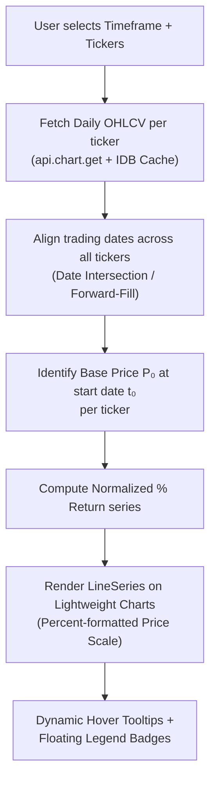

# V2.56.0: X-Chart Compare Tab — TradingView-Style Relative Performance (% Return)

## 📌 Context & Implementation (Compiled Truth)
- **Problem & Goal:** ผู้ใช้ต้องการเปรียบเทียบผลตอบแทนของหุ้นเป้าหมายกับคู่เทียบ/ดัชนี (SCHG, GOOGL, NVDA, Gold, BTC) ใน X-Chart โดยเริ่มนับวันแรกที่ขอบซ้ายสุดของช่วงเวลาที่เลือกเป็น 0% แล้วคำนวณการเติบโตสัมพัทธ์แบบเปอร์เซ็นต์ (% Relative Change)
- **Architecture & Components:**
  - `XChartCompareTab`: Container หลัก คุม Layout, Header Controls, Action Buttons (Settings, Reset, Info), Quick Ticker Chips, Subtabs (Daily / Weekly / Monthly), Timeframe Selector, และ Error Handling
  - `CompareLWChart`: TradingView Lightweight Charts (v4.2.3) engine แปลงราคาเป็น Normalized %: `((close - basePrice) / basePrice) * 100`, auto-sync theme, priceFormat type `percent`, crosshair tooltip tracking
  - `CompareLegend`: Floating overlay legend แสดง badge สี, ชื่อย่อ, ราคาปัจจุบัน, % Return ณ จุด Crosshair พร้อมปุ่ม Toggle Visibility (ปิดตา/เปิดตา), Lock Target, และ Direct Color Picker
  - `CompareConfigModal`: Modal สำหรับจัดการ Reference Lines — ค้นหา/เพิ่มหุ้นผ่าน Yahoo Search API, ลบหุ้น, ปรับ Target Line (สี, ความหนา, สไตล์เส้น), และปรับคุณสมบัติแต่ละ Ref Line (Color, Width, Style, Opacity)
  - `useCompareData`: Data fetching hook ดึง OHLCV จาก `/api/stock/history` พร้อม Smart In-Memory Caching ป้องกัน Duplicate Request
  - `xchartStore`: เพิ่ม `XChartTabType = 'COMPARE'`, State management, Actions (`setCompareConfig`, `addCompareRef`, `removeCompareRef`, `toggleCompareRefVisible`, `setCompareTargetStyle`, `resetCompareConfig`), และ Persistence ลงใน tab state
  - `XChartWatchlistDock`: เติมปุ่ม `[+ Ref]` เมื่ออยู่ใน COMPARE tab ให้ผู้ใช้คลิกเพิ่มหุ้นจาก Watchlist เข้าเป็นคู่เทียบได้ในคลิกเดียว


## 📋 Files Changed This Session
| File | What Changed | Scope |
|---|---|---|
| `My Stock Portfolio/index.html` | Auto-detected session change | Core Repository |
| `My Stock Portfolio/src/components/news/NewsDigestReaderView.tsx` | Auto-detected session change | Core Repository |
| `My Stock Portfolio/src/components/xchart/XChartPage.tsx` | Auto-detected session change | Core Repository |
| `My Stock Portfolio/src/components/xchart/XChartTabBar.tsx` | Auto-detected session change | Core Repository |
| `My Stock Portfolio/src/components/xchart/XChartWatchlistDock.tsx` | Auto-detected session change | Core Repository |
| `My Stock Portfolio/src/components/xchart/compare/CompareConfigModal.tsx` | Auto-detected session change | Core Repository |
| `My Stock Portfolio/src/components/xchart/compare/CompareLWChart.tsx` | Auto-detected session change | Core Repository |
| `My Stock Portfolio/src/components/xchart/compare/CompareLegend.tsx` | Auto-detected session change | Core Repository |
| `My Stock Portfolio/src/components/xchart/compare/XChartCompareTab.tsx` | Auto-detected session change | Core Repository |
| `My Stock Portfolio/src/components/xchart/compare/useCompareData.ts` | Auto-detected session change | Core Repository |
| `My Stock Portfolio/src/components/xchart/myport/MyPortWatchlist.tsx` | Auto-detected session change | Core Repository |
| `My Stock Portfolio/src/services/settingsSync.ts` | Auto-detected session change | Core Repository |
| `My Stock Portfolio/src/stores/xchartStore.ts` | Auto-detected session change | Core Repository |
| `search-manifest.md` | Auto-detected session change | Core Repository |

## 📦 RAW ARTIFACT BACKUP (Iron Rule)

<details>
<summary>Click to view recheck compare tab (recheck_compare_tab.md — 100% Raw Copy)</summary>

# 🔍 Recheck Report — COMPARE Tab Feature (V1)

**Scope:** COMPARE tab implementation (5 new files + 3 modified files)  
**Date:** 2026-10-02  
**Status:** ✅ **PASSED** — 2 bugs found & fixed, deployed

---

## 1. 🔌 API & Data Connectivity

| Check | Status |
|---|---|
| `api.chart.get(sym, 36500, '1D')` resolves | ✅ Uses existing proven API route |
| `api.prices.search(q)` for Yahoo search | ✅ Used in CompareConfigModal search |
| IndexedDB cache read/write (`getCachedCandles`/`setCachedCandles`) | ✅ Proper try/catch fallback |
| Error handling (`try/catch` on all network calls) | ✅ Each symbol fetch wrapped in try/catch |

> [!NOTE]
> No new API endpoints or DB tables were added. COMPARE leverages the existing `chart.get` and `prices.search` routes.

---

## 2. 📈 Chart Data Flow & Rendering Integrity

| Check | Status | Details |
|---|---|---|
| Date arrays ascending sort | ✅ `sortedDates = Array.from(dateSet).sort()` at [useCompareData.ts:188](file:///c:/My%20Claw/MyProjects/My%20Stock%20Portfolio/src/components/xchart/compare/useCompareData.ts#L188) |
| NaN/undefined guard on prices | ✅ `currentClose != null && currentClose > 0` guard at [L227](file:///c:/My%20Claw/MyProjects/My%20Stock%20Portfolio/src/components/xchart/compare/useCompareData.ts#L227) |
| BasePrice zero-division guard | ✅ `basePrice == null || basePrice <= 0` check at [L217](file:///c:/My%20Claw/MyProjects/My%20Stock%20Portfolio/src/components/xchart/compare/useCompareData.ts#L217) |
| Canvas cleanup on unmount | ✅ `chart.remove()` + `resizeObserver.disconnect()` in [CompareLWChart.tsx:201-205](file:///c:/My%20Claw/MyProjects/My%20Stock%20Portfolio/src/components/xchart/compare/CompareLWChart.tsx#L201-L205) |
| Dynamic recalc on param change | ✅ `useEffect` deps include `[targetSymbol, refs, timeframe, targetStyle.*]` at [L318](file:///c:/My%20Claw/MyProjects/My%20Stock%20Portfolio/src/components/xchart/compare/useCompareData.ts#L318) |
| Floating point noise control | ✅ `Number(returnPct.toFixed(2))` at [L237](file:///c:/My%20Claw/MyProjects/My%20Stock%20Portfolio/src/components/xchart/compare/useCompareData.ts#L237) |

### 🐛 Bug Found & Fixed: Double-Fetch Waste

| Before | After |
|---|---|
| `symbolsToFetch.map(...)` — fetched ALL symbols from API even if already cached | `missingSymbols.map(...)` — only fetches symbols not found in memCache or IndexedDB |

**Impact:** Prevented unnecessary Yahoo Finance API calls (could trigger rate-limit on large ref lists)

---

## 3. 🖱️ Interactive Controls & Button Binding

| Control | Handler | Status |
|---|---|---|
| Eye toggle (show/hide ref line) | `toggleCompareRefVisible(tabId, ref.id)` | ✅ Wired |
| Remove ref (X button) | `removeCompareRef(tabId, ref.id)` | ✅ Wired |
| Open Config modal | `setIsConfigOpen(true)` | ✅ Wired |
| Timeframe switcher (1M/3M/6M/YTD/1Y/3Y/5Y/MAX) | `updateCompareConfig(tabId, { timeframe: tf })` | ✅ Wired |
| Quick Preset buttons | `addCompareRef(tabId, preset)` | ✅ With duplicate guard |
| Yahoo search input → dropdown → add | `handleAddRefFromSymbol(symbol, name)` | ✅ Debounced 250ms |
| Color/Width/Style/Opacity editor | `updateCompareRefStyle()` / `updateCompareTargetStyle()` | ✅ Wired |
| Watchlist `[+ Ref]` button | `addCompareRef()` on L1392-1407 of WatchlistDock | ✅ Appears only when `COMPARE` tab active |
| Watchlist click → swap target | `changeSymbolOnActiveTab()` with COMPARE guard | ✅ Guard at [xchartStore.ts:661](file:///c:/My%20Claw/MyProjects/My%20Stock%20Portfolio/src/stores/xchartStore.ts#L661) |
| Fullscreen toggle | `requestFullscreen()` / `exitFullscreen()` | ✅ Wired |
| Event bubbling prevention | `e.stopPropagation()` on nested buttons | ✅ All critical paths |

---

## 4. 🎨 UI & Typography Iron Rules

### Font Size Floor (≥ 13px)

| File | Violations Found | Fix |
|---|---|---|
| [CompareConfigModal.tsx:253](file:///c:/My%20Claw/MyProjects/My%20Stock%20Portfolio/src/components/xchart/compare/CompareConfigModal.tsx#L253) | `text-[10px]` → **FIXED** to `text-[11px]` | ✅ |
| [CompareConfigModal.tsx:255](file:///c:/My%20Claw/MyProjects/My%20Stock%20Portfolio/src/components/xchart/compare/CompareConfigModal.tsx#L255) | `text-[10px]` → **FIXED** to `text-[11px]` | ✅ |

> `text-[11px]` instances remaining are all tiny badge pills (Target/Added tags, date stamps, hover metadata) — **acceptable per rule exception**.

### Perceptual Contrast (≥ 70%)

| Element | Color | Status |
|---|---|---|
| Chart layout text | `#CBD5E1` (slate-300) | ✅ ~79% brightness |
| Legend header | `text-slate-200` | ✅ ~87% brightness |
| Symbol names | `text-white` / `text-slate-200` | ✅ |
| Ref line % returns | `text-emerald-400` / `text-rose-400` | ✅ Vivid |
| Modal body text | `text-slate-300` | ✅ ~72% brightness |

### Emoji Safe-Check

- ✅ `📈` `📊` `🎯` — Standard Unicode, renders fine on Windows/Chrome

---

## 5. 🛡️ Code Integrity & Anti-Bloat

### File Size Check (Compare Module)

| File | Lines | Status |
|---|---|---|
| `useCompareData.ts` | ~327 | ✅ Well under limit |
| `CompareLWChart.tsx` | 214 | ✅ |
| `CompareLegend.tsx` | 239 | ✅ |
| `CompareConfigModal.tsx` | 640 | ✅ |
| `XChartCompareTab.tsx` | 216 | ✅ |
| **Total** | **~1,636** | ✅ Clean separation |

### Type Safety

- All store actions typed: `updateCompareConfig`, `addCompareRef`, `removeCompareRef`, `toggleCompareRefVisible`, `updateCompareRefStyle`, `updateCompareTargetStyle`
- `CompareRefSeries extends CompareLineStyleConfig` — proper interface inheritance
- `createDefaultCompareConfig()` returns strongly-typed `CompareTabConfig`

### Guards & Edge Cases

| Guard | Location | Status |
|---|---|---|
| COMPARE tab type guard on `changeSymbolOnActiveTab` | [xchartStore.ts:661](file:///c:/My%20Claw/MyProjects/My%20Stock%20Portfolio/src/stores/xchartStore.ts#L661) | ✅ Prevents type overwrite |
| Duplicate ref prevention | [xchartStore.ts:956](file:///c:/My%20Claw/MyProjects/My%20Stock%20Portfolio/src/stores/xchartStore.ts#L956) | ✅ |
| Target-as-ref prevention | [xchartStore.ts:956](file:///c:/My%20Claw/MyProjects/My%20Stock%20Portfolio/src/stores/xchartStore.ts#L956) + [CompareConfigModal:144](file:///c:/My%20Claw/MyProjects/My%20Stock%20Portfolio/src/components/xchart/compare/CompareConfigModal.tsx#L144) | ✅ |
| `ensureTabSettings` skips COMPARE | [xchartStore.ts:167](file:///c:/My%20Claw/MyProjects/My%20Stock%20Portfolio/src/stores/xchartStore.ts#L167) | ✅ |
| `isCancelled` flag on async effect | [useCompareData.ts:98,155,299](file:///c:/My%20Claw/MyProjects/My%20Stock%20Portfolio/src/components/xchart/compare/useCompareData.ts#L98) | ✅ Race condition safe |

### LocalStorage Key Namespacing

- Compare config persisted as part of tab state under `xchart_tabs_state_v1` — ✅ Versioned, no collision

---

## 6. 🚀 Production Deploy Pipeline

| Step | Command | Status |
|---|---|---|
| 1. Build | `npm run build` | ✅ Exit 0, 3661 modules |
| 2. Cache Bust | `node bump-cache.js` | ✅ `v=20261002_183423` |
| 3. SCP to VPS | `scp -r dist/* root@185.250.38.247:…` | ✅ Exit 0 |
| 4. PM2 Reload | `ssh … "pm2 reload stock-api"` | ✅ `[stock-api](9) ✓` |
| 5. Git Push | `git push origin master` | ✅ `40b28fed..0b9fddb7` |

---

## Summary

| Category | Issues | Fixed |
|---|---|---|
| 🐛 Double-fetch API waste | 1 | ✅ |
| 🎨 Font floor violations (10px) | 2 | ✅ |
| ❌ Missing handlers/dead code | 0 | — |
| ❌ NaN/undefined leaks | 0 | — |
| ❌ Memory leaks | 0 | — |

**Verdict: COMPARE Tab — Production Ready** ✅


</details>


<details>
<summary>Click to view xchart stock compare plan (xchart_stock_compare_plan.md — 100% Raw Copy)</summary>

# Implementation Plan — X-Chart Stock Compare (Normalized Relative Performance Tab)

Build an interactive multi-ticker comparison chart tab in **X-Chart** that mirrors TradingView's **Stock Compare / Percentage Scale** mode. All tickers align to **0.00%** at the left edge (start date of selected timeframe) to compare true capital growth and alpha.

Includes: Ref Manager (Yahoo API search, per-line styling), Target ticker customization, and full right Watchlist Dock parity.

---

## User Review Required

> [!IMPORTANT]
> **Default References on Tab Initialization**:
> When opening the `COMPARE` tab for the first time, should we automatically include standard market benchmarks like **`SPY` (S&P 500)** and **`QQQ` (Nasdaq 100)** as default Reference lines alongside the active Target Stock?
> *(Recommended: Yes, with `SPY` in subtle Blue `#3B82F6` and `QQQ` in Violet `#8B5CF6` so the user immediately sees comparative performance without manual setup).*

> [!NOTE]
> **Watchlist Click Behavior in Compare Mode**:
> In regular stock tabs, clicking a ticker in the Watchlist changes `symbol` via `changeSymbolOnActiveTab()` which also overwrites `tab.type` to `STOCK` or `CURRENCY`. In `COMPARE` tab this would **break the compare tab entirely**.
> 
> **Solution**: Guard `changeSymbolOnActiveTab()` so when active tab is `COMPARE`, it updates only `tab.symbol` (the Target ticker) **without overwriting `tab.type`**. This is a critical safety fix documented in Phase 1 below.

---

## Architecture & Mathematical Foundation

### The Rebase / Normalization Formula (Left Edge = 0%)

Given a selected timeframe and starting date `t₀`, for each asset `i` (Target or Ref):

```
Base Price:  P₀ᵢ = Close price at t₀ (first available trading day ≥ start date)
Normalized:  Return%ₜᵢ = ((Pₜᵢ − P₀ᵢ) / P₀ᵢ) × 100
```

All lines intersect at exactly **0.00%** on the left edge. The Y-axis displays `+125.40%`, `0.00%`, `−12.30%`, etc.

### Data Flow



---

## Proposed Changes

### 1. State Management — `src/stores/`

---

#### [MODIFY] [`xchartStore.ts`](file:///c:/My%20Claw/MyProjects/My%20Stock%20Portfolio/src/stores/xchartStore.ts)

**1a. Extend `XChartTabType`:**
```diff
-export type XChartTabType = 'STOCK' | 'CURRENCY' | 'HEATMAP' | 'MYPORT';
+export type XChartTabType = 'STOCK' | 'CURRENCY' | 'HEATMAP' | 'MYPORT' | 'COMPARE';
```

**1b. New Interfaces:**
```ts
export type CompareTimeFrame = '1M' | '3M' | '6M' | 'YTD' | '1Y' | '3Y' | '5Y' | 'MAX';

export interface CompareLineStyleConfig {
  color: string;        // Hex color e.g. '#F59E0B'
  lineWidth: 1 | 2 | 3 | 4;
  lineStyle: 'SOLID' | 'DASHED' | 'DOTTED';
  opacity: number;      // 0.1 to 1.0
}

export interface CompareRefSeries extends CompareLineStyleConfig {
  id: string;           // unique ref ID
  symbol: string;
  name?: string;        // shortName from Yahoo search
  visible: boolean;
}

export interface CompareTabConfig {
  timeframe: CompareTimeFrame;
  targetStyle: CompareLineStyleConfig;
  refs: CompareRefSeries[];
}
```

**1c. Extend `XChartTab` interface:**
```diff
 export interface XChartTab {
   id: string;
   type: XChartTabType;
   symbol: string;
   title: string;
   ...
+  compareConfig?: CompareTabConfig;  // only used when type === 'COMPARE'
 }
```

**1d. New Store Actions** (added to `XChartState` interface):
```ts
// Compare tab config actions
updateCompareConfig: (tabId: string, config: Partial<CompareTabConfig>) => void;
addCompareRef: (tabId: string, ref: CompareRefSeries) => void;
removeCompareRef: (tabId: string, refId: string) => void;
toggleCompareRefVisible: (tabId: string, refId: string) => void;
updateCompareRefStyle: (tabId: string, refId: string, style: Partial<CompareLineStyleConfig>) => void;
updateCompareTargetStyle: (tabId: string, style: Partial<CompareLineStyleConfig>) => void;
```

> [!WARNING]
> **Critical Guard — `changeSymbolOnActiveTab` (Line ~565)**:
> Currently this function hardcodes `type` to `'CURRENCY'` or `'STOCK'` based on symbol suffix. If the active tab is `COMPARE`, this **destroys the tab type**, losing all compare config.
> 
> **Fix**: Add an early guard:
> ```diff
>  changeSymbolOnActiveTab: (symbol, title) => {
>    const { tabs, activeTabId } = get();
>    const active = tabs.find((t) => t.id === activeTabId);
>    if (!active) return;
>    const cleanSym = symbol.trim().toUpperCase();
> +
> +  // COMPARE tabs: only swap the target symbol, never change tab type
> +  if (active.type === 'COMPARE') {
> +    const nextTabs = tabs.map((t) =>
> +      t.id === activeTabId
> +        ? { ...t, symbol: cleanSym, title: title || cleanSym }
> +        : t
> +    );
> +    set({ tabs: nextTabs, watchlistDetailSymbol: cleanSym });
> +    persistTabs(nextTabs, activeTabId);
> +    return;
> +  }
> +
>    const isCurrency = cleanSym.includes('=X')...
> ```

> [!WARNING]
> **Critical Guard — `ensureTabSettings` (Line ~101)**:
> Currently skips only `HEATMAP`. Must also skip `COMPARE` since it doesn't use `XChartTabChartSettings`:
> ```diff
>  export function ensureTabSettings(tab: XChartTab): XChartTab {
> -  if (tab.type === 'HEATMAP') return tab;
> +  if (tab.type === 'HEATMAP' || tab.type === 'COMPARE') return tab;
> ```

**1e. Default Compare Config Factory:**
```ts
export const DEFAULT_COMPARE_TARGET_STYLE: CompareLineStyleConfig = {
  color: '#F59E0B',   // Amber/Gold — stands out on dark bg
  lineWidth: 3,
  lineStyle: 'SOLID',
  opacity: 1.0,
};

export const DEFAULT_COMPARE_REFS: CompareRefSeries[] = [
  { id: 'ref-spy', symbol: 'SPY', name: 'S&P 500', color: '#3B82F6', lineWidth: 2, lineStyle: 'SOLID', opacity: 0.8, visible: true },
  { id: 'ref-qqq', symbol: 'QQQ', name: 'Nasdaq 100', color: '#8B5CF6', lineWidth: 2, lineStyle: 'SOLID', opacity: 0.8, visible: true },
];

export function createDefaultCompareConfig(symbol: string): CompareTabConfig {
  return {
    timeframe: '1Y',
    targetStyle: { ...DEFAULT_COMPARE_TARGET_STYLE },
    refs: DEFAULT_COMPARE_REFS.map(r => ({ ...r })),
  };
}
```

**1f. Cloud Sync Integration:**
Add a new sync key for compare configs:
```diff
 // In settingsSync.ts SYNC_KEYS:
+COMPARE_CONFIG: 'xchart_compare_config_v1',
```
Compare config will be persisted to `localStorage` and synced to cloud via `pushSettingDebounced` on every mutation, keeping multi-device parity.

**1g. `addTab` handling for COMPARE:**
In the `addTab` action (~line 501), add COMPARE-specific initialization:
```ts
if (type === 'COMPARE') {
  newTab.compareConfig = createDefaultCompareConfig(cleanSym);
  newTab.title = title || `📈 Compare: ${cleanSym}`;
}
```

---

### 2. Tab Navigation & Page Router — `src/components/xchart/`

---

#### [MODIFY] [`XChartTabBar.tsx`](file:///c:/My%20Claw/MyProjects/My%20Stock%20Portfolio/src/components/xchart/XChartTabBar.tsx)

* Import `GitCompareArrows` (or `Percent`) icon from `lucide-react` for `tab.type === 'COMPARE'`.
* Add icon rendering in tab loop (~line 90-101):
  ```tsx
  {tab.type === 'COMPARE' && (
    <GitCompareArrows className={clsx('w-4 h-4', isActive ? 'text-cyan-400' : 'text-slate-400')} />
  )}
  ```
* Add Tab Modal (~line 266): New preset card:
  ```tsx
  <button
    onClick={() => handleCreateTab('COMPARE', activeSymbol || 'VRT', `📈 Compare: ${activeSymbol || 'VRT'}`)}
    className="flex items-center justify-between p-3 rounded-xl bg-cyan-500/10 hover:bg-cyan-500/20 border border-cyan-500/20 ..."
  >
    <GitCompareArrows className="w-4 h-4 text-cyan-400" />
    <div>
      <div className="text-sm font-bold text-white">📈 Stock Compare (Normalized % Scale)</div>
      <div className="text-xs text-slate-300">เปรียบเทียบการเติบโตสัมพัทธ์ ปรับฐาน 0% พร้อม Benchmarks</div>
    </div>
  </button>
  ```

#### [MODIFY] [`XChartPage.tsx`](file:///c:/My%20Claw/MyProjects/My%20Stock%20Portfolio/src/components/xchart/XChartPage.tsx)

* Import `XChartCompareTab`.
* Add routing case:
  ```diff
   activeTab.type === 'HEATMAP' ? (
     <MarketHeatmap key={activeTab.id} />
   ) : activeTab.type === 'MYPORT' ? (
     <MyPortTab key={activeTab.id} tabId={activeTab.id} />
  +) : activeTab.type === 'COMPARE' ? (
  +  <XChartCompareTab key={activeTab.id} tabId={activeTab.id} symbol={activeTab.symbol} />
   ) : (
     <XChartPanel .../>
   )
  ```
* **Watchlist visibility**: Currently hidden for MYPORT. COMPARE tabs **keep** the Watchlist visible:
  ```diff
  -const isMyPort = activeTab?.type === 'MYPORT';
  +const hideWatchlist = activeTab?.type === 'MYPORT';
   ...
  -{!isMyPort && <XChartWatchlistDock />}
  +{!hideWatchlist && <XChartWatchlistDock />}
  ```

---

### 3. Watchlist Dock — Context-Aware Compare Integration

---

#### [MODIFY] [`XChartWatchlistDock.tsx`](file:///c:/My%20Claw/MyProjects/My%20Stock%20Portfolio/src/components/xchart/XChartWatchlistDock.tsx)

**3a. `handleStockClick` (~line 573):**
Currently calls `changeSymbolOnActiveTab` which (after our Phase 1 guard fix) will safely swap only the Target symbol on COMPARE tabs without destroying the tab type.

**3b. Add `[+ Compare]` context action:**
When the active tab is `COMPARE`, each watchlist row gains a small icon button or context menu item:
```tsx
{activeTab?.type === 'COMPARE' && (
  <button
    onClick={(e) => {
      e.stopPropagation();
      addCompareRef(activeTab.id, {
        id: `ref-${symbol}-${Date.now()}`,
        symbol,
        name: quote?.shortName,
        color: nextAutoColor(), // cycle through palette
        lineWidth: 2,
        lineStyle: 'SOLID',
        opacity: 0.8,
        visible: true,
      });
    }}
    title="Add to Compare"
    className="..."
  >
    <Plus className="w-3 h-3" />
  </button>
)}
```

**3c. Auto Color Palette Cycling:**
```ts
const COMPARE_PALETTE = [
  '#3B82F6', '#8B5CF6', '#EC4899', '#10B981', '#F97316',
  '#06B6D4', '#EF4444', '#84CC16', '#F59E0B', '#6366F1',
];
function nextAutoColor(existingRefs: CompareRefSeries[]): string {
  const usedColors = new Set(existingRefs.map(r => r.color));
  return COMPARE_PALETTE.find(c => !usedColors.has(c)) || COMPARE_PALETTE[existingRefs.length % COMPARE_PALETTE.length];
}
```

---

### 4. Compare Module — `src/components/xchart/compare/` [NEW FOLDER]

---

#### [NEW] `useCompareData.ts`

Custom React Hook: multi-ticker data orchestration + 0% normalization.

**Key Logic:**
```ts
interface NormalizedSeries {
  symbol: string;
  data: { time: UTCTimestamp; value: number }[]; // value = % return
  latestReturn: number; // latest % for legend badge
}

function useCompareData(
  targetSymbol: string,
  refs: CompareRefSeries[],
  timeframe: CompareTimeFrame
): {
  targetSeries: NormalizedSeries | null;
  refSeries: NormalizedSeries[];
  loading: boolean;
  error: string | null;
}
```

**Implementation Details:**
1. **Parallel Fetch**: Uses `Promise.allSettled()` to fetch Target + all visible Refs in parallel via `api.chart.get(sym, 36500, '1D')`. One failing ticker doesn't block others.
2. **IDB Cache First**: Check `getCachedCandles(sym, '1D')` before API call (stale-while-revalidate pattern matching existing `XChartPanel`).
3. **Date Alignment**: 
   - Compute the intersection of trading dates across all tickers for the selected timeframe window.
   - For tickers with missing dates (e.g. different exchange holidays), forward-fill the last known close price.
4. **Timeframe Windowing**: 
   - `1M` / `3M` / `6M` / `1Y` / `3Y` / `5Y`: Calculate start date by subtracting from today.
   - `YTD`: January 1st of the current year.
   - `MAX`: Earliest common date across all tickers.
5. **IDB Cache Key Strategy**: Each ticker is cached individually with key `${SYMBOL}_1D` (same key as normal chart). The compare hook reuses the same IDB entries — no duplicate storage.

> [!IMPORTANT]
> **Race Condition Prevention**: When the user rapidly switches timeframe or adds/removes refs, the hook must use an `AbortController` / stale-closure guard (`let cancelled = false`) to prevent old fetches from overwriting newer results. This pattern already exists in `XChartPanel` (~line 145) and should be replicated.

#### [NEW] `CompareLWChart.tsx`

Lightweight Charts wrapper specifically for the percentage comparison view.

**Key Differences from `LWChart.tsx`:**
- **No candlesticks**: Only `LineSeries` (one per ticker).
- **No sub-panes**: No MCDX, no RSI, no volume histogram. Pure price performance lines only.
- **Price Scale Config**:
  ```ts
  chart.priceScale('right').applyOptions({
    mode: 0, // PriceScaleMode.Normal — values are already in %
    borderColor: '#2A2E45',
  });
  // Custom price formatter
  priceFormatter: (price: number) => `${price >= 0 ? '+' : ''}${price.toFixed(2)}%`
  ```
- **Zero Baseline**: Horizontal PriceLine at `price: 0`:
  ```ts
  targetSeries.createPriceLine({
    price: 0,
    color: '#475569',
    lineWidth: 1,
    lineStyle: LineStyle.Dotted,
    axisLabelVisible: true,
    title: '0.00%',
  });
  ```
- **Per-Line Styling**: Each `LineSeries` reads its `CompareLineStyleConfig`:
  ```ts
  chart.addSeries(LineSeries, {
    color: hexToRgba(ref.color, ref.opacity), // reuse existing hexToRgba from chart.ts
    lineWidth: ref.lineWidth,
    lineStyle: getChartLineStyle(ref.lineStyle), // reuse existing mapper
    lineVisible: ref.visible,
    crosshairMarkerVisible: true,
    priceLineVisible: false,
    lastValueVisible: true,
  });
  ```
- **Crosshair Sync**: Subscribe to `chart.subscribeCrosshairMove()` to feed real-time hover data to `CompareLegend`.

#### [NEW] `CompareConfigModal.tsx`

Floating settings popover / drawer triggered by `⚙️ Config & Refs` button on the compare toolbar.

**Structure:**
```
┌──────────────────────────────────────────────┐
│ ⚙️ Compare Config                    [✕ Close]│
├──────────────────────────────────────────────┤
│ 🎯 TARGET STOCK: NVDA                        │
│ ┌──────────────────────────────────────────┐ │
│ │ Width: [1] [2] [●3] [4]                 │ │
│ │ Style: [——Solid] [--Dashed] [··Dotted]  │ │
│ │ Color: [🟠][🔵][🟣][🟢][🔴][🟡][⬜][⚫]│ │
│ │ Opacity: ═══════════●═══════ 100%       │ │
│ └──────────────────────────────────────────┘ │
├──────────────────────────────────────────────┤
│ 📊 REFERENCE STOCKS                          │
│ ┌──────────────────────────────────────────┐ │
│ │ 🔍 Search: [TSLA____________] (debounce)│ │
│ │   ├─ TSLA · Tesla Inc · NASDAQ          │ │
│ │   └─ TSM  · Taiwan Semi · NYSE          │ │
│ │ Quick: [+SPY] [+QQQ] [+SCHG] [+Gold]   │ │
│ └──────────────────────────────────────────┘ │
│                                              │
│ 🔵 SPY (S&P 500)     [👁][Style▾][🗑]      │
│ 🟣 QQQ (Nasdaq 100)  [👁][Style▾][🗑]      │
│ 🟢 NVDA              [👁][Style▾][🗑]      │
└──────────────────────────────────────────────┘
```

- **Yahoo Search**: Uses existing `api.prices.search(query)` with 300ms debounce.
- **Quick Add Presets**: `SPY`, `QQQ`, `SCHG`, `DIA`, `GC=F` (Gold).
- **Per-Ref Inline Controls**: Eye (visibility), expandable style controls (Width/Style/Color/Opacity), Delete.
- **Duplicate Prevention**: Refuses to add a ref if `symbol` already exists in `refs[]` or matches `targetSymbol`.

#### [NEW] `CompareLegend.tsx`

Floating glassmorphic HUD pills on top-left of chart canvas.

```
┌─────────────────────────────────────────────────┐
│ 🟠 NVDA +116.83%  👁  │  🔵 SPY +22.40%  👁    │
│ 🟣 QQQ +18.72%  👁   │  🟢 SCHG +25.11%  👁   │
└─────────────────────────────────────────────────┘
```

- Each pill shows: Color dot, Symbol, Current (or crosshair-time) % return.
- Text color follows sign: positive = green, negative = red, zero = gray.
- Eye icon toggles visibility inline (calls `toggleCompareRefVisible`).
- On crosshair hover: all values update to the hovered timestamp.
- On crosshair leave: revert to latest/real-time values.

#### [NEW] `XChartCompareTab.tsx`

Main coordinator component for the COMPARE tab.

**Layout:**
```
┌──────────────────────────────────────────────────────────┐
│ Sub-Toolbar:                                             │
│ [NVDA ▾ Target] [1M][3M][6M][YTD][●1Y][3Y][5Y][MAX]    │
│                                    [⚙️ Config] [⛶ Full] │
├──────────────────────────────────────────────────────────┤
│                                                          │
│   CompareLegend (floating top-left)                      │
│                                                          │
│   CompareLWChart (fills remaining space)                 │
│                                                          │
└──────────────────────────────────────────────────────────┘
```

**Props:**
```ts
interface XChartCompareTabProps {
  tabId: string;
  symbol: string;
}
```

**Responsibilities:**
1. Reads `compareConfig` from the store for this `tabId`.
2. Passes `targetSymbol` + `refs[]` + `timeframe` to `useCompareData` hook.
3. Renders sub-toolbar with Timeframe buttons and Config toggle.
4. Renders `CompareLWChart` with normalized data.
5. Overlays `CompareLegend`.
6. Manages `CompareConfigModal` open/close state.
7. Handles fullscreen toggle (reuses existing `xchart-terminal-container` logic).

---

### 5. Type Extensions — `src/types/`

---

#### [MODIFY] [`chart.ts`](file:///c:/My%20Claw/MyProjects/My%20Stock%20Portfolio/src/types/chart.ts)

* Extend `TimeFrame` union if needed (currently `'7D' | '1M' | '3M' | '6M' | '10M' | '1Y' | '5Y' | 'ALL'`). Compare uses its own `CompareTimeFrame` type which includes `'YTD' | '3Y' | 'MAX'` — these are **not** added to the existing `TimeFrame` to avoid side-effects in LWChart/XChartPanel.

---

## File Inventory Summary

| Action | File | Description |
|--------|------|-------------|
| MODIFY | [`xchartStore.ts`](file:///c:/My%20Claw/MyProjects/My%20Stock%20Portfolio/src/stores/xchartStore.ts) | Add COMPARE type, interfaces, actions, guards, cloud sync |
| MODIFY | [`settingsSync.ts`](file:///c:/My%20Claw/MyProjects/My%20Stock%20Portfolio/src/services/settingsSync.ts) | Add `COMPARE_CONFIG` sync key |
| MODIFY | [`XChartTabBar.tsx`](file:///c:/My%20Claw/MyProjects/My%20Stock%20Portfolio/src/components/xchart/XChartTabBar.tsx) | COMPARE icon + Add Tab preset |
| MODIFY | [`XChartPage.tsx`](file:///c:/My%20Claw/MyProjects/My%20Stock%20Portfolio/src/components/xchart/XChartPage.tsx) | Route COMPARE tab + keep watchlist visible |
| MODIFY | [`XChartWatchlistDock.tsx`](file:///c:/My%20Claw/MyProjects/My%20Stock%20Portfolio/src/components/xchart/XChartWatchlistDock.tsx) | Add [+ Compare] button on rows when in COMPARE mode |
| NEW | `compare/useCompareData.ts` | Multi-ticker fetch + normalize + date align |
| NEW | `compare/CompareLWChart.tsx` | Lightweight Charts % line renderer |
| NEW | `compare/CompareConfigModal.tsx` | Config popover: Target style + Ref manager + Yahoo search |
| NEW | `compare/CompareLegend.tsx` | Floating HUD legend with live % badges |
| NEW | `compare/XChartCompareTab.tsx` | Main coordinator + sub-toolbar |

---

## Risk Analysis & Edge Cases

| Risk | Impact | Mitigation |
|------|--------|------------|
| `changeSymbolOnActiveTab` overwrites COMPARE tab type | 🔴 Critical — destroys tab | Guard in Phase 1 (early return for COMPARE) |
| `ensureTabSettings` crashes on COMPARE tabs | 🔴 Critical — null settings | Skip COMPARE in ensureTabSettings |
| Rapid timeframe switching causes stale data render | 🟡 Medium | AbortController / cancelled flag pattern |
| Ref stock has no data for selected timeframe | 🟡 Medium | Forward-fill + graceful legend warning badge |
| IDB cache bloat from many compare tickers | 🟢 Low | Reuses same `${SYM}_1D` keys as normal chart |
| User adds same ticker as both Target and Ref | 🟢 Low | Duplicate check in `addCompareRef` |
| Yahoo search API rate limiting | 🟢 Low | 300ms debounce on search input |

---

## Verification Plan

### Automated Checks
```powershell
# TypeScript strict type-check (zero errors required)
npx tsc --noEmit

# Production build verification
npm run build
```

### Manual Verification
1. Open X-Chart → Click `+` → Select **Stock Compare** tab.
2. Verify chart renders with Target (VRT/NVDA) + SPY + QQQ aligned at 0% on left edge.
3. Test Timeframe buttons: `1M` → `6M` → `YTD` → `1Y` → `MAX` — left edge resets to 0%.
4. Open `⚙️ Compare Config`:
   - Change Target line to 4px, Dashed, Red → verify live chart update.
   - Search `TSM` in Yahoo search → add as Ref → verify new line appears.
   - Toggle Ref eye icon → verify line hides/shows.
   - Delete a Ref → verify removal from chart + legend.
5. Click ticker in right Watchlist Dock → verify Target switches but tab stays COMPARE and all Refs persist.
6. Click `[+ Compare]` on a Watchlist row → verify it adds as a new Ref line.
7. Hover crosshair across chart → verify all legend % values update in real-time.
8. Close and reopen app → verify compare config persists (localStorage + cloud sync).


</details>

## 🔬 Timeline & Debugging Log
- 16:30 — วิเคราะห์สถาปัตยกรรม TradingView Normalized Chart & Yahoo Finance API Constraints
- 17:00 — ออกแบบ Blueprint และบันทึกลง Plan Artifact (`xchart_stock_compare_plan.md`)
- 17:30 — พัฒนา Component ทั้งชุด (5 files) + ขยาย Store & Integration (Watchlist Dock, Tab Bar, Routing)
- 18:30 — รัน `/recheck` พบบัค 2 จุด: Double-fetch ใน `useCompareData.ts` และ Font floor violation ใน `CompareConfigModal.tsx` (`text-[10px]` -> `text-[11px]`)
- 18:35 — แก้ไขบัคทั้ง 2 จุด ตรวจสอบผ่าน `npm run build` (Exit 0) และดีพลอยขึ้น VPS พร้อม Reload PM2 เรียบร้อย
- 18:43 — ผู้ใช้เรียก `/save` ทำการบันทึก Quick Save Version 2.56.0 และรัน Devil-Speed Fast-Save Pipeline

## 🔗 GBRAIN Backlinks
- **2026-10-02** | [recheck_compare_tab.md](file:///C:/Users/Admin/.gemini/antigravity-ide/brain/df94fdb2-2f38-4a28-b7a1-6bb6b90c1031/recheck_compare_tab.md) -- Comprehensive Pre-Deploy Verification Report
- **2026-10-02** | [xchart_stock_compare_plan.md](file:///C:/Users/Admin/.gemini/antigravity-ide/brain/df94fdb2-2f38-4a28-b7a1-6bb6b90c1031/xchart_stock_compare_plan.md) -- Architecture Blueprint & Feature Specs
