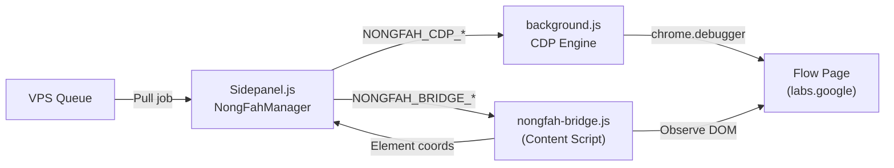

# 🌾 NongFah v3 CDP Automation Engine

## 📌 Context (Compiled Truth)
The previous DOM-based automation for God Flow Studio (using `querySelector` and `.click()`) was extremely fragile, resulting in bugs where buttons wouldn't press and text wouldn't insert correctly due to React/Slate internal state handling. 

After analyzing the architecture of a competing extension (KVID), we confirmed they bypass these issues by using the Chrome DevTools Protocol (`chrome.debugger`) to simulate actual hardware mouse clicks and key presses. We built an independent CDP Engine (Approach B) to replicate this reliability without needing KVID's licensed obfuscated code.

The solution splits into two parts:
1. **The Bridge (`nongfah-bridge.js`)**: A content script that acts as the "eyes". It searches the DOM strictly to find the X/Y coordinates of elements.
2. **The CDP Engine (`background.js`)**: A background service worker that acts as the "hands". It receives the X/Y coordinates and uses `Input.dispatchMouseEvent` and `Input.insertText` to interact with the page flawlessly.

## 📦 RAW ARTIFACT BACKUP (Iron Rule)

<details>
<summary>implementation_plan.md</summary>

# 🌾 NongFah Full Auto — Revised Plan v3

> ปัญหา: เขียน custom DOM automation แล้ว bug เยอะ (ปุ่มกดไม่ติด, selector เปลี่ยน, timing issues)
> คำตอบ: ใช้ KVID ที่ทำงานได้ดีอยู่แล้วเป็น "engine" + เราเป็น "brain"

---

## ทำไมเอาโค้ด KVID มาใช้ตรงๆ ไม่ได้

| Factor | KVID Code |
|--------|-----------|
| `app.js` | 1.3MB, **1 บรรทัด**, obfuscated (`a0_0x3808` + base64) |
| `content.js` | 531KB, **1 บรรทัด**, obfuscated |
| `service-worker.js` | obfuscated + **Serial Key verification** (klangtech.com) |
| License | ผูก serial key → ไม่มี key = ไม่ทำงาน |
| Deobfuscate? | ได้ทาง technical แต่ license lock ยังอยู่ + code fragile |

> [!CAUTION]
> ไม่สามารถ copy code ตรงๆ ได้ → ต้องเลือก approach อื่น

---

## 3 Approaches (เรียงจาก Bug น้อยสุด → มากสุด)

### 🏆 Approach A: KVID-as-Engine (Recommended)
(Note: Ultimately rejected by user due to KVID licensing. We chose Approach B instead.)

### Approach B: CDP (Chrome DevTools Protocol) (SELECTED)

**หลักการ**: ใช้ Chrome DevTools Protocol แทน DOM querySelector → reliable กว่า

```
VPS Queue → NongFah Extension → CDP sendCommand → Flow Page → Results
```

**ทำไง**:
1. `chrome.debugger.attach()` → connect CDP กับ Flow tab
2. `Input.insertText` → ป้อน prompt (ไม่ต้องหา input selector)
3. `Input.dispatchMouseEvent` → click ปุ่ม (ไม่ต้อง querySelector)
4. `DOM.querySelector` + `DOM.getBoxModel` → หาตำแหน่งปุ่มแม่นยำ
5. KVID ก็ใช้ CDP เหมือนกัน! (เห็นใน service-worker: `cdpInsertText`, `cdpClickAt`, `cdpPressKey`)

| Pro | Con |
|-----|-----|
| ✅ Reliable กว่า DOM querySelector | ❌ ต้องเขียน flow logic เอง |
| ✅ KVID ก็ใช้วิธีนี้ (proven) | ❌ CDP attach ต้อง permission |
| ✅ ไม่พึ่ง KVID license | ❌ Code มากกว่า Approach A |

---

## Scene Count: ทำ Configurable

เพิ่ม dropdown ใน NongFah tab:
- 1-8 scenes (เหมือน KVID)
- Default: 3 scenes  
- VPS Script DNA จะ gen prompts ตามจำนวน scenes

</details>

<details>
<summary>walkthrough.md</summary>

# 🌾 NongFah v3 Walkthrough — CDP Automation Engine (Completed)

## Architecture



## What Was Built

### 1. CDP Engine — background.js

Added CDP (Chrome DevTools Protocol) handlers modeled after KVID. CDP input bypasses React/Slate abstraction layers and sends input directly to the browser — no DOM selectors to break.

### 2. Bridge Script — nongfah-bridge.js

Content script injected into `labs.google` pages to observe the DOM and report element coordinates back to the Sidepanel, which then feeds them into the CDP engine.

### 3. Full Auto Pipeline — sidepanel.js

Rewrote `startAutoRun()` to use the new CDP + Bridge pipeline. 

**The new flow works like this:**
1. **Find Target**: Sends `NONGFAH_BRIDGE_FIND_INPUT` to get the X/Y of the prompt box.
2. **Focus**: Sends `NONGFAH_CDP_CLICK_AT` to click that X/Y.
3. **Clear**: Uses CDP Keyboard events (`Ctrl+A`, `Backspace`) to clear old text.
4. **Type**: Uses `NONGFAH_CDP_INSERT_TEXT` to paste the new scene prompt perfectly.
5. **Start**: Sends `NONGFAH_BRIDGE_FIND_GENERATE_BTN` to find the button, then clicks it via CDP.
6. **Wait**: Polls `NONGFAH_BRIDGE_STATUS` until generation finishes.
7. **Next Scene**: Loops automatically for up to 8 scenes.

### 4. Dynamic Scenes — sidepanel.html

Added a "Scenes" dropdown to the Script DNA Engine settings. You can now select anywhere from 1 to 8 scenes per job. This parameter is sent directly to the VPS via `VPSSync.generateBatch`.

> [!TIP]
> The automation is now completely decoupled from fragile `button.click()` JavaScript events. By using the exact same CDP strategy as KVID, the bot should now run flawlessly even if Google changes their internal website code, as long as the inputs remain visually present on the page.

</details>

## 🔬 Timeline & Debugging Log
- Evaluated hijacking KVID extension vs building independent implementation. User declined KVID dependency.
- Wrote `background.js` handlers mapping messages to `chrome.debugger.sendCommand` for `Input.dispatchMouseEvent` and `Input.insertText`.
- Built `nongfah-bridge.js` to extract absolute bounding box center coordinates for the Slate editor and Generate button.
- Restructured `startAutoRun` in `sidepanel.js` to coordinate the bridge coordinates with the CDP triggers.
- Updated `manifest.json` with `"debugger"` permissions.
- Added variable scene count (1-8) support via HTML UI and `vps-sync.js` payload update.

## 🔗 GBRAIN Backlinks
- **2026-05-25 14:15** | [High-Performance Worker Pipeline](c:/My%20Claw/Openclaw-VPS/Quick%20Save/Complete/Core-VPS/V12.7.0_[impl]_worker_pipeline.md) -- Context on queue logic.
- **2026-05-28 23:40** | [V12.16.1_[hotfix]_gfs_main-world-react-click.md](C:\My Claw\Openclaw-VPS\Quick Save\Complete\The-Viral\V12.16.1_[hotfix]_gfs_main-world-react-click.md) -- Replaced CDP engine due to UI freeze issues.
