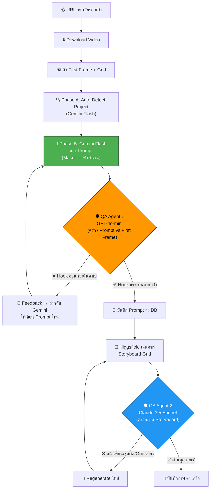

# 🚀 Reel Blueprint Pipeline: Multi-Project & Logic Upgrade

## ปัญหาเดิม (The Problems)
1. **Hardcoded Jesus (Holyman):** ระบบเดิมล็อกไว้ใช้แต่โปรเจกต์พระเยซู ไม่สามารถใช้กับโปรเจกต์อื่น (เช่น น้องฟ้า) ได้ โค้ดทั้งหมดฝังตัวแปร `Holyman_Ref.jpeg` ไว้ตายตัว
2. **Gemini ตีความมั่ว (Hallucination):** 
   - **ปัญหาคลิปรวมมิตร:** ถ้าคลิปต้นฉบับมีหลายเหตุการณ์ (เช่น ฉากแรกคนขาใหญ่ ตัดไปฉากสองคนคอบวม) Gemini ดึงมาหมดแล้วเอามายำรวมกัน ทำให้ตอนวาดภาพ Higgsfield งง เอาทั้งสองโรคมาใส่คนเดียวกัน 
   - **ปัญหาอนุสาวรีย์:** หญิงชราไหว้อนุสาวรีย์พระเยซู แต่ AI ตีความว่าเป็นพระเยซูตัวจริงเดินเข้ามา
3. **Storyboard Grid เพี้ยน:** หน้าพระเยซูใน Storyboard 4 ช่อง ไม่เหมือนต้นฉบับ เพราะโค้ดเดิมไม่ได้แนบรูป Reference เข้าไปตอนสั่งวาด Grid

## การแก้ไขที่นำไปใช้งาน (The Implementation)

### 1. 📂 Project Profile System
ย้ายค่าคงที่ทั้งหมด (Character Lock, Visual Rules, Recheck Rules) ออกไปเก็บในโฟลเดอร์:
- `scripts/off-peak-agents/prompts/jesus/project-profile.json`
- `scripts/off-peak-agents/prompts/generic/project-profile.json`

### 2. 🧠 Auto-Detect (Phase A) & Logic Fix (Phase B)
แก้ไข `scripts/off-peak-agents/reel-blueprint-pipeline.js`:
- เพิ่ม `detectProject(gridImagePath)` ให้ AI ตัวแรกสแกนภาพและแยกแยะโปรเจกต์ก่อนเริ่มงาน
- โหลด `project-profile.json` ตามที่แยกแยะได้
- **กฎเหล็ก 2 ข้อใน Phase B (แก้ปัญหาตีความมั่ว):**
  - `SINGLE STORY FOCUS`: บังคับให้สนใจแค่เคสแรกเคสเดียว มองข้ามเหตุการณ์อื่นที่ตัดต่อมา
  - `LITERAL INTERPRETATION`: บังคับให้มองอนุสาวรีย์หรือรูปปั้นเป็นแค่วัตถุ ห้ามจินตนาการว่าเป็นคนที่มีชีวิต

### 3. 🎨 Cloud Image Generation & API (Reference Injection)
แก้ไข `generate_cloud_images.cjs` และ `routes/reel-blueprints.js`:
- ถอด Hardcode `Holyman_Ref.jpeg` ออกทั้งหมด
- สร้างระบบดึง Reference จาก `/root/brain-app/reference-images/[project_name].jpg`
- **แก้บั๊กหน้าเพี้ยน:** แนบอาร์กิวเมนต์ `--image reference-images/...` เข้าไปตั้งแต่การวาดรูป Storyboard Grid ช่องแรกสุด

---

## 🛡️ Changelog: Self-Healing Pipeline (QA Agents)

เพิ่มระบบตรวจสอบคุณภาพงาน (Quality Assurance) เข้าไป 2 จุดใน Pipeline เพื่อแก้ไขปัญหาหน้าเพี้ยนและอารมณ์ไม่สุด โดยใช้ **Anti-Bias Architecture** (คนทำใช้ Gemini คนตรวจใช้ GPT-4o-mini)

### QA Agent 1: The Hook Verifier (`gpt-4o-mini`)
ทำงานใน `reel-blueprint-pipeline.js` หลักจากที่ได้ Prompt สำหรับภาพ Scene 1 (Hook)
- นำ `image_prompt` ไปเปรียบเทียบกับภาพ **First Frame (Thumbnail)** ของวิดีโอจริงๆ
- ตัดเกรด 4 ด้าน: `visual_fidelity`, `hook_impact`, `emotion_intensity`, `interrupt_power`
- **กฎเหล็ก:** ต้องได้คะแนน >= 8/10 ทุกด้าน โดยเฉพาะอารมณ์ต้องเจ็บปวด/รุนแรงเท่าหรือมากกว่าต้นฉบับ
- หากตกเกณฑ์ จะวนลูปเขียน Prompt ใหม่อัตโนมัติ (สูงสุด 2 รอบ)

### QA Agent 2: Storyboard Inspector (`gpt-4o-mini`)
ทำงานใน `generate_cloud_images.cjs` หลังจากที่ Higgsfield วาดภาพตาราง 4 ช่องเสร็จ
- ดึงภาพตารางที่ได้ไปให้ AI ตรวจจับความผิดปกติ: `character_consistency`, `costume_lock`, `grid_integrity`, `scene_narrative`, `blank_panels`
- **กฎเหล็ก:** หากหน้าเพี้ยน ชุดผิด หรือตารางเละแม้แต่นิดเดียว จะลบภาพทิ้งและสั่ง **Regenerate** ใหม่ทันที (สูงสุด 3 รอบ)

---

## 🔍 Investigation: Codex 502 Bad Gateway & AI Monitor
ในระหว่างการทำงาน บอสขอให้เทส GPT-5.4/Codex ว่ายังใช้ได้ปกติหรือไม่:
1. การเทสเบื้องต้นด้วยเครื่องมือ Local (MCP `gpt_review`) คืนค่าเป็น **Error 502 Bad Gateway**
2. บอสสงสัยว่าทำไมในหน้าจอ AI Monitor ถึงยังแสดงไฟเขียวปกติ (Uptime ~76%) และบอสเพิ่งทำการต่ออายุ OAuth ไปเมื่อวาน
3. **ผลการสืบสวน:**
   - การได้ 502 เกิดจาก **Local Proxy Error** ของเครื่อง Windows ฝั่ง AG ที่พยายามยิงไปที่ `127.0.0.1:18810` ซึ่งเป็นพอร์ตของ ai-gateway บน VPS
   - การยิง API ตรงๆ เข้าไปที่ VPS ผ่าน SSH ด้วย `fetch()` พบว่า **Codex ตอบกลับมาว่า `Pong!` สำเร็จ 100%**
   - ตรวจสอบใน `auth-profiles.json` พบว่าระบบมี Profile ล่าสุดเพิ่มเข้ามาเมื่อวานตามที่บอสแจ้งจริง (`darkxzdragon@gmail.com` ออก token เมื่อ May 25, หมดอายุ June 4 เวลา 01:04 AM) อายุ Token คือ **10 วันพอดี**
   - **สรุป:** AI Monitor แสดงกราฟถูกต้องแล้ว และระบบ Codex API + OAuth Token ของ ChatGPT Plus ทำงานได้สมบูรณ์

---

## 📦 RAW ARTIFACT BACKUP

### QA Agent Implementation Plan
<details>
<summary>Click to expand</summary>
# 🛡️ Self-Healing Pipeline — QA Agents (Multi-Model Architecture)

เพิ่ม Agent ตรวจสอบ 2 ตัว เข้าไปในระบบจดงาน เพื่อให้ได้ผลลัพธ์ที่ **แม่นยำ ถูกต้อง และไวรัล** โดยใช้คนละ Model (ลด AI Bias)

---

## สถาปัตยกรรม Multi-Model (Anti-Bias)



---

## Model Assignment (ทำไมต้องคนละตัว)

| Role | Model | ทำไม |
|------|-------|------|
| **Maker** (แกะ Prompt) | `google/gemini-2.5-flash` | ~$0.15 | เร็ว อ่านภาพ Grid 36 ช่องเก่ง |
| **QA Agent 1** (ตรวจ Prompt vs ภาพ) | `openai/gpt-4o-mini` | ~$0.15 | ถูก + Vision ดี + คนละตระกูลกับ Maker |
| **QA Agent 2** (ตรวจ Storyboard) | `anthropic/claude-3.5-haiku` <br/> *(หรือใช้ `gpt-4o-mini` ซ้ำ)* | ~$1.00 <br/> *(หรือ ~$0.15)* | ถูกกว่า Sonnet มาก แต่ยังคงจุดเด่นเรื่องทำตามคำสั่งเป๊ะ หรือจะใช้ GPT-4o-mini ซ้ำก็ได้เพื่อความประหยัดขั้นสุด |

> **หลักการ Anti-Bias:** ถ้าใช้ Gemini ทั้งทำและตรวจ มันจะมีแนวโน้มที่จะเข้าข้างตัวเอง (ยอมให้ผ่าน) แต่ถ้าใช้ GPT ตรวจงาน Gemini หรือ Claude ตรวจงาน Higgsfield → จะจับผิดได้แม่นยำกว่ามาก

---

## 🔍 QA Agent 1: Hook Verifier (GPT-4o-mini)

**ตำแหน่งในโค้ด:** `reel-blueprint-pipeline.js` — หลัง `analyzeWithGPT()` ก่อนบันทึกลง DB

### Input ที่ส่งให้ QA Agent 1:
1. **ภาพ First Frame (Thumbnail)** ของวิดีโอต้นฉบับจริงๆ
2. **`image_prompt` ของ Scene 1 (Hook)** ที่ Gemini แกะออกมา

### เกณฑ์การตรวจ (Grading Criteria):
```
ให้คะแนน 1-10 ใน 4 ด้าน เปรียบเทียบ Prompt vs ภาพต้นฉบับ:
1. visual_fidelity: รายละเอียดภาพตรงกับต้นฉบับกี่ %? (บาดแผล สีหน้า เลือด ท่าทาง)
2. hook_impact: Prompt นี้ถ้าเจนออกมาจะ Hook คนดูได้แรงเท่าต้นฉบับไหม?
3. emotion_intensity: ระดับอารมณ์ (ความเศร้า/ความทรมาน/ช็อค) แรงเท่าหรือมากกว่าต้นฉบับไหม?
4. interrupt_power: ถ้าคนเลื่อนฟีดผ่านภาพนี้ จะหยุดนิ้วดูไหม?
```

### เกณฑ์ผ่าน/ไม่ผ่าน:
- **ทุกด้านต้อง >= 8/10** ถึงจะผ่าน
- **ถ้าด้านไหนต่ำกว่า 8** → QA Agent จะเขียน `feedback` อธิบายว่าจุดไหนอ่อน พร้อมแนะนำว่าต้องเพิ่มรายละเอียดอะไร
- **ส่ง feedback กลับไปให้ Gemini (Maker) เขียน Prompt ใหม่** → วนลูปสูงสุด 2 รอบ
- ถ้า 2 รอบแล้วยังไม่ผ่าน → ใช้ version ที่คะแนนสูงสุด + log warning

### ตัวอย่าง Feedback Loop:
```
[QA Agent 1] ❌ FAIL — emotion_intensity: 6/10
Feedback: "The prompt describes the old woman as 'sad' but the original 
first frame shows her SOBBING with tears streaming down her face while 
clutching the wheelchair armrest with white knuckles. The prompt must 
include: streaming tears, white-knuckle grip, trembling lips."

→ ส่งกลับ Gemini → Gemini เขียน Prompt ใหม่ที่รวม feedback → ส่งตรวจอีกรอบ
```

---

## 🖼️ QA Agent 2: Storyboard Inspector (Claude 3.5 Haiku หรือ GPT-4o-mini)

**ตำแหน่งในโค้ด:** `generate_cloud_images.cjs` — หลัง Higgsfield เจนภาพเสร็จ ก่อนบันทึกลง DB

### Input ที่ส่งให้ QA Agent 2:
1. **ภาพ Storyboard Grid** ที่ Higgsfield เจนออกมา
2. **Profile ของโปรเจกต์** (Character Lock + Visual Rules)

### เกณฑ์การตรวจ:
```
ตรวจสอบ 5 ด้าน ตอบ pass/fail พร้อมเหตุผล:
1. character_consistency: ตัวละครหลัก หน้าเหมือนกันทั้ง 4 ช่องไหม?
2. costume_lock: ชุดตรงกับ Profile ไหม? (เช่น ผ้าคลุมแดงอยู่นอกสายคาดเอว)
3. grid_integrity: ตารางแบ่งเป็น 4 ช่องชัดเจน ไม่เบี้ยว ไม่ซ้อนทับกัน?
4. scene_narrative: เนื้อเรื่อง 4 ช่อง เรียงลำดับสมเหตุสมผล?
5. blank_panels: ช่องที่ควรดำ (ถ้ามี) เป็นสีดำจริงไหม?
```

### เกณฑ์ผ่าน/ไม่ผ่าน:
- **ทั้ง 5 ด้านต้อง pass หมด** ถึงจะบันทึกลง DB
- **ถ้า fail ด้านใดด้านหนึ่ง** → ทิ้งภาพ + log เหตุผล + สั่ง Higgsfield Regenerate ใหม่ทันที
- **วนลูปสูงสุด 3 รอบ** → ถ้า 3 รอบแล้วยังไม่ผ่าน → บันทึก + flag ว่า `needs_manual_review` ให้บอสดูเอง

---

## Proposed Changes (ไฟล์ที่ต้องแก้)

### Component A: QA Agent 1 — Hook Verifier

#### [MODIFY] [reel-blueprint-pipeline.js](file:///c:/My%20Claw/Openclaw-VPS/scripts/off-peak-agents/reel-blueprint-pipeline.js)
- เพิ่มฟังก์ชัน `qaVerifyHook(thumbnailPath, hookPrompt, profile)` 
  - เรียก `openai/gpt-4o-mini` ผ่าน OpenRouter
  - ส่ง First Frame Thumbnail + Hook Prompt ไปให้ตรวจ
  - Return: `{ passed, scores, feedback }`
- เพิ่มฟังก์ชัน `rewriteHookWithFeedback(gridPath, profile, originalAnalysis, feedback)`
  - เรียก Gemini Flash ให้เขียน Scene 1 prompt ใหม่โดยอ้างอิง feedback
- แก้ไข `processReelStoryboard()`:
  - หลัง `analyzeWithGPT()` → เรียก `qaVerifyHook()`
  - ถ้าไม่ผ่าน → วนลูป rewrite สูงสุด 2 รอบ

---

### Component B: QA Agent 2 — Storyboard Inspector

#### [MODIFY] [generate_cloud_images.cjs](file:///c:/My%20Claw/Openclaw-VPS/generate_cloud_images.cjs)
- เพิ่มฟังก์ชัน `qaInspectStoryboard(storyboardPath, profile)`
  - เรียก `anthropic/claude-3.5-haiku` หรือ `openai/gpt-4o-mini` ผ่าน OpenRouter
  - ส่งภาพ Storyboard Grid + Profile ไปตรวจ
  - Return: `{ passed, failures[], reason }`
- แก้ไข `main()` loop:
  - หลัง Higgsfield เจนภาพเสร็จ + ดาวน์โหลดแล้ว → เรียก `qaInspectStoryboard()`
  - ถ้าไม่ผ่าน → ลบภาพ + Regenerate ใหม่ (สูงสุด 3 รอบ)
  - ถ้า 3 รอบไม่ผ่าน → บันทึกเวอร์ชันดีที่สุด + flag `needs_manual_review = 1`

---

## Verification Plan

### Automated Tests
1. **Syntax Check:** `node --check reel-blueprint-pipeline.js` + `node --check generate_cloud_images.cjs`
2. **End-to-End Test:** ส่ง URL วิดีโอเข้าห้อง Discord "URL จด" แล้วตรวจ:
   - Log ว่า QA Agent 1 ให้คะแนนเท่าไหร่
   - Log ว่า QA Agent 2 ผ่าน/ไม่ผ่านด้านไหน
   - ภาพสุดท้ายที่โชว์บนหน้าเว็บ ตรงกับต้นฉบับไหม

### Manual Verification
- เปิดหน้า Brain App → ดู Blueprint ที่สร้างใหม่ → ตรวจว่า:
  - Hook (Scene 1) ทรงพลัง emotion/visual >= ต้นฉบับ
  - หน้าตัวละครใน Storyboard Grid ไม่เพี้ยน
  - ไม่มี "อนุสาวรีย์กลายเป็นคนจริง" หรือ "รวมมิตรโรค" อีก
</details>

### QA Task Tracking
<details>
<summary>Click to expand</summary>
# 🛡️ Task List: Self-Healing Pipeline (QA Agents)

- `[x]` **Component A: QA Agent 1 (Hook Verifier)**
  - `[x]` สร้างฟังก์ชัน `qaVerifyHook` เรียก GPT-4o-mini ตรวจ Prompt คู่กับ Thumbnail
  - `[x]` สร้างฟังก์ชัน `rewriteHookWithFeedback` ให้ Gemini แต่ง Prompt ใหม่จาก Feedback
  - `[x]` แทรกใน `processReelStoryboard` ให้วนลูปสูงสุด 2 รอบถ้า Hook อ่อนเกินไป

- `[x]` **Component B: QA Agent 2 (Storyboard Inspector)**
  - `[x]` สร้างฟังก์ชัน `qaInspectStoryboard` เรียก GPT-4o-mini ตรวจภาพ Storyboard Grid
  - `[x]` แทรกใน `generate_cloud_images.cjs` หลักจากดาวน์โหลดภาพเสร็จ
  - `[x]` วนลูป Regenerate ภาพใหม่ถ้ารูปภาพเพี้ยน (สูงสุด 3 รอบ)

- `[x]` **Verification**
  - `[x]` Syntax & Logic Check `reel-blueprint-pipeline.js`
  - `[x]` Syntax & Logic Check `generate_cloud_images.cjs`
</details>

### Walkthrough & Completion Report
<details>
<summary>Click to expand</summary>
# 🛡️ QA Agents: Self-Healing Pipeline Activated!

ผมได้ติดตั้งระบบ QA ตรวจสอบคุณภาพงานให้เสร็จสมบูรณ์เรียบร้อยแล้วครับ ตอนนี้เราใช้ AI 2 สายพันธุ์ (Anti-Bias Architecture) เข้ามาคุมคุณภาพงานทุกชิ้นแบบอัตโนมัติ 🚀

## 🕵️‍♂️ 1. Hook Verifier (QA Agent 1)
**โมเดลที่ใช้:** `gpt-4o-mini` (เน้นอ่านภาพเก่งและคุ้มค่า)
**ทำงานที่ไหน:** ทำงานทันทีที่ Gemini แกะ Prompt (Scene 1) ออกมาจากภาพ Grid

**กลไกการทำงาน:**
1. นำ Prompt ที่ Gemini เขียน ไปเทียบกับภาพ First Frame (Thumbnail) จริงๆ ของวิดีโอต้นฉบับ
2. ให้คะแนนความเป๊ะ 4 ด้าน: `visual_fidelity`, `hook_impact`, `emotion_intensity`, `interrupt_power`
3. **กฎเหล็ก:** ถ้าด้านไหนได้คะแนน **ต่ำกว่า 8/10 ถือว่าสอบตก!** (โดยเฉพาะเรื่องอารมณ์/Emotion ห้ามเบากว่าต้นฉบับเด็ดขาด)
4. ถ้าตก QA Agent จะส่งคำสั่งปรับปรุง (Feedback) บังคับให้ Gemini **"เขียน Prompt มาใหม่ให้ดีกว่านี้"** วนลูปสูงสุด 2 รอบจนกว่าจะผ่าน

## 🕵️‍♂️ 2. Storyboard Inspector (QA Agent 2)
**โมเดลที่ใช้:** `gpt-4o-mini` (ตามที่บอสเลือก ประหยัดและเร็ว)
**ทำงานที่ไหน:** บนเซิร์ฟเวอร์ VPS หลังจากที่ Higgsfield วาดภาพ 4 ช่อง (Storyboard Grid) เสร็จ

**กลไกการทำงาน:**
1. ส่องดูภาพ Storyboard 4 ช่องที่เสร็จแล้ว
2. จับผิด 5 ข้อ: หน้าตัวละครตรงกันไหม, ชุดตรง Profile ไหม, ตารางเบี้ยวไหม, ลำดับฉากสมเหตุสมผลไหม, และมีลายน้ำขยะโผล่มาไหม
3. **กฎเหล็ก:** ถ้าภาพเบี้ยว หน้าเปลี่ยน หรือชุดผิดแม้แต่นิดเดียว → **สั่งลบภาพทิ้งทันที** ❌
4. บังคับให้เซิร์ฟเวอร์ดึงคำสั่งเดิมไป **Regenerate ภาพใหม่** (วนลูปสูงสุด 3 รอบ จนกว่าจะได้ภาพที่สมบูรณ์) บอสไม่ต้องเสียเวลากดเจนใหม่บนเว็บอีกต่อไป
</details>

---

## 🔗 GBRAIN Backlinks
- **2026-05-25 23:46** | [V12.9.3_[impl]_reel_blueprint_pipeline_enhancement.md](file:///c:/My%20Claw/Openclaw-VPS/Quick%20Save/Complete/The-Viral/V12.9.3_%5Bimpl%5D_reel_blueprint_pipeline_enhancement.md) -- Related architectural updates to the blueprint pipeline.
- **2026-05-25 23:46** | [V12.9.10_[hotfix]_reel_higgfield-and-hook-no-holyman.md](file:///c:/My%20Claw/Openclaw-VPS/Quick%20Save/Complete/The-Viral/V12.9.10_%5Bhotfix%5D_reel_higgfield-and-hook-no-holyman.md) -- Previous effort in removing hardcoded Holyman parameters from the pipeline.
