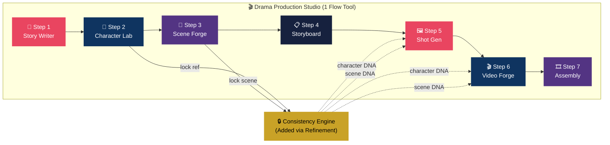

# V12.19.1 Drama Production Studio Architecture (Google Flow Tools)

## 📌 Context (Compiled Truth)
The user is building the "AI Drama Production Studio" as a native tool within Google Flow. This acts as a comprehensive 7-step wizard (Story -> Characters -> Scenes -> Storyboard -> Shots -> Video -> Assembly) designed for high-consistency viral drama production (e.g., TikTok/Shorts).

Key architectural decisions established during this session:
1. **Consistency Engine:** A persistent sidebar managing Character DNA and Scene DNA. It auto-injects locked DNA (Master Prompts, Identity Anchors, Continuity Props) into Step 5 (Image Gen) and Step 6 (Video Gen) to prevent AI drift.
2. **Quality Tiers:** Global cascade system prioritizing a "Free/0-credit" default tier (Nano Banana Flash / Veo 3.1 Lite) to allow drafting without using credits, with easy upscaling to Premium/Ultra.
3. **Language Bifurcation:** The UI and generated script output in Thai, but all underlying prompts sent to the image/video models are strictly English, except for spoken dialogue which remains Thai for lip-sync.
4. **Series Template Gallery:** Implemented a pre-configured template system. Specifically, the "Nong Fah" template injects her battle-tested iron rules (Authenticity Rule, Anatomy Decoupling, Skin Constraints) directly into the tool's state so she is generated flawlessly on the first click.
5. **Dynamic Scene Logic:** Corrected a logic flaw; templates now leave scenes empty to be generated dynamically based on the Step 1 script, preventing hardcoded scenes from overriding the narrative.
6. **Guardrails (Story Boundaries):** When using the "Random Idea" button with a template active (like Nong Fah), a hidden `storyBoundary` constraint prevents the LLM from hallucinating out-of-character plots (e.g., sci-fi or violence).

## 📦 RAW ARTIFACT BACKUP (Iron Rule)

### implementation_plan.md
<details>
<summary>Click to expand</summary>

# 🎬 AI Drama Production Studio
## All-in-One Mega Tool — Native Google Flow Tools

> **1 Tool เดียว, 7 Wizard Steps, Data ไหลอัตโนมัติ**
> สร้างละครสั้นครบ pipeline จาก Idea ถึง Final Video

---

## Architecture: Single Mega-Tool with Wizard Steps + Consistency Engine



### Build Strategy

```
Phase 1: Master Prompt → สร้าง 7 Steps พื้นฐาน (เรียบง่าย, ไม่มี Consistency)
Phase 2: Refinement Round 1 → ตรวจ State Sharing
Phase 3: Refinement Round 2-3 → เพิ่ม Consistency Engine (Character DNA + Scene DNA)
Phase 4: Refinement Round 4-5 → UX Polish + Quality Tiers (Free default)
Phase 5: ทดสอบ full workflow
```

> [!IMPORTANT]
> **Consistency Engine จะเพิ่มทีหลังผ่าน Refinement Chat** — ไม่ได้อยู่ใน Master Prompt เพื่อให้ Flow Agent สร้าง foundation ที่เสถียรก่อน แล้วค่อยเพิ่มความซับซ้อนทีละชั้น

---

## ⚠️ Fallback Strategy: ถ้า Mega Tool ชน Limit

> [!WARNING]
> Flow Tools มี storage limit — Tool ที่ซับซ้อนมากอาจชนขีดจำกัด ถ้าเกิดเหตุการณ์นี้:

**Plan B — แยกเป็น 2 Tools:**
- **Tool A: Pre-Production** (Step 1-4: Story → Character → Scene → Storyboard)
- **Tool B: Production** (Step 5-7: Shot Gen → Video → Assembly)
- เชื่อมกันด้วย JSON export/import

**เริ่มด้วย Mega Tool ก่อน → ถ้าไม่ไหวค่อยแตก**

---

## 🛠️ Master Prompt — สร้าง Mega Tool (Phase 1)

### วิธีใช้:
1. เข้า Google Flow → **Tools** → **Create Tool**
2. **Copy prompt ด้านล่างทั้งหมด** → Paste ลงใน Tool Builder
3. กด **Generate** → รอ Agent สร้าง
4. ดู Preview → ไป Phase 2 (Refinement Chat)

> [!IMPORTANT]
> Master Prompt นี้สร้าง **foundation 7 steps** ก่อน — ยังไม่มี Consistency Engine
> Consistency จะเพิ่มใน Refinement Round 2-3

---

### 📋 Master Prompt (Copy ทั้งหมดนี้ไป paste ใน Flow Tool Builder)

Create an "AI Drama Production Studio" — a comprehensive all-in-one tool for producing AI short dramas (like mini web series, YouTube Shorts dramas, or TikTok series). 

This tool works as a WIZARD with 7 TABS/STEPS. Each step's output automatically feeds into the next step. The tool should maintain shared state across all tabs so data flows seamlessly.

Use a sleek, dark cinematic theme with film-industry aesthetics. Use accent colors: red (#e94560) for primary actions, blue (#0f3460) for info, purple (#533483) for creative elements.

===== NAVIGATION =====
- At the TOP, show a horizontal step indicator/progress bar with 7 steps:
  Step 1: 📝 Story | Step 2: 👤 Characters | Step 3: 🌄 Scenes | Step 4: 📋 Storyboard | Step 5: 🖼️ Shots | Step 6: 🎬 Video | Step 7: 🎞️ Assembly
- Clicking a step tab navigates to that step
- Current step is highlighted
- Show a "Next Step →" and "← Previous Step" button at the bottom of each tab
- Show a progress indicator (e.g., "Step 3 of 7")

===== STEP 1: STORY WRITER =====
Purpose: Generate a complete drama script from a brief idea.

UI Elements:
- Text area "Story Idea" (placeholder: "Enter your drama concept in 1-2 sentences...")
- Dropdown "Genre": Slice-of-Life, Thriller, Action, Spiritual/Epic, Horror, Comedy, Romance, Drama, Sci-Fi
- Dropdown "Tone": Warm, Dark, Suspenseful, Epic, Playful, Melancholy, Mysterious, Intense
- Dropdown "Structure": 3-Act Structure, Hero's Journey, Day-in-the-Life, Twist Ending, Parallel Stories, Flashback
- Dropdown "Target Length": 30s (3-4 scenes), 60s (5-7 scenes), 2min (8-12 scenes), 3min (12-18 scenes)
- Text field "Main Character Name" (optional)
- Text field "Setting" (optional, e.g., "rural Thailand", "ancient Jerusalem")
- Button "✨ Generate Script" (primary action button, red accent)
- Button "🔄 Regenerate" (secondary)

Output:
- Show generated script in a structured card format:
  - Title (large, cinematic font)
  - Synopsis paragraph
  - Character list (auto-extracted names + brief descriptions)
  - Scene cards in a vertical list, each showing:
    - Scene # and title
    - Location & Time
    - Action description
    - Dialogue/Narration
    - Camera hint
    - Mood note
    - Duration estimate
  - Total estimated duration at the bottom
- Button "📋 Copy Script" — copies full text
- Button "→ Next: Create Characters" — goes to Step 2 AND passes character list automatically

IMPORTANT: Store the generated script data (scenes, characters, settings) in the tool's internal state so other tabs can access it.

===== STEP 2: CHARACTER LAB =====
Purpose: Create consistent character identities with reference images.

This tab should AUTO-POPULATE a character list from Step 1's script. Show each character extracted from the script as a card that can be expanded.

Per Character Card:
- Text field "Name" (auto-filled from script)
- Text field "Description from Script" (auto-filled, read-only)
- Dropdown "Gender": Male, Female, Non-binary
- Number input "Age" (5-80)
- Dropdown "Ethnicity": Thai, East Asian, Southeast Asian, South Asian, European, African, Middle Eastern, Latin, Mixed
- Dropdown "Body Type": Slim, Average, Athletic, Curvy, Muscular
- Text field "Skin Tone": Fair, Light, Medium, Tan, Dark, Olive
- Text field "Hair" (e.g., "long straight black hair, side-parted")
- Text field "Primary Outfit" (e.g., "white V-neck blouse, denim shorts")
- Text area "Distinguishing Features" (e.g., "small mole on cheek, silver bracelet")
- Dropdown "Expression for Reference": Neutral, Smiling, Serious, Thoughtful

Generation Settings (shared for all characters):
- Dropdown "Model": Nano Banana Pro (recommended), Nano Banana 2, Nano Banana Flash
- Dropdown "Aspect Ratio": 1:1 (headshot), 3:4 (portrait), 9:16 (full body)
- Dropdown "Style": Photorealistic Cinematic, Soft Portrait, Anime, Stylized

Per Character Actions:
- Button "🎨 Generate Reference" — generates character image
- Button "📸 Upload Reference" — upload own image instead
- Button "🔒 Lock as Master" — locks the best image as canonical reference
- Button "📝 View Prompt" — shows the auto-composed character prompt text

Output:
- Display generated/uploaded reference images
- A "Character Prompt" text box per character (auto-composed, copyable) — this prompt will be used in Step 5 and 6
- Button "→ Next: Create Scenes" 
- Button "➕ Add Character" — manually add more characters

IMPORTANT: Store character prompts + reference images in internal state for Step 5 and 6 to use automatically.

===== STEP 3: SCENE & BACKGROUND FORGE =====
Purpose: Generate background environments for each scene.

Auto-populate scene list from Step 1's script. Each scene from the script becomes a scene card.

Per Scene Card:
- Text field "Scene Name" (auto-filled, e.g., "Cafe Interior - Afternoon")
- Text area "Scene Description" (auto-filled from script, editable)
- Dropdown "Environment Type":
  Indoor: Cafe, Bedroom, Kitchen, Office, Classroom, Restaurant, Temple, Hospital
  Outdoor: Rice Field, Street Market, Beach, Forest, City Street, Rooftop, Garden, River
  Special: Arena, Cathedral, Dark Alley, Stage, Ruins, Arena
- Dropdown "Time of Day": Dawn, Morning Golden Hour, Noon, Afternoon, Sunset, Dusk, Night, Midnight
- Dropdown "Weather": Clear, Cloudy, Rainy, Foggy, Stormy, Snowy
- Dropdown "Lighting": Natural, Warm Ambient, Cool, Dramatic, Neon, Candlelight, Backlit, Harsh Sun
- Dropdown "Mood Palette": Warm Tones, Cool Tones, Pastel, Vibrant, Dark/Moody, Golden, Muted

Generation Settings:
- Dropdown "Model": Nano Banana 2 (default), Nano Banana Pro, Nano Banana Flash
- Dropdown "Aspect Ratio": 16:9 (cinematic, default), 9:16 (vertical), 1:1, 21:9 (ultra-wide)
- Dropdown "Style": Photorealistic Cinematic, Anime Background, Painterly, Documentary

Per Scene Actions:
- Button "🌄 Generate Background"
- Button "🔄 Generate 4 Variations"
- Button "📤 Upload Background" (use own image)
- Button "✅ Approve" — marks this scene BG as final

Output:
- Display generated BG images per scene
- Approved backgrounds are stored for Step 4 and 5

===== STEP 4: STORYBOARD BUILDER =====
Purpose: Visual shot-by-shot plan combining script + characters + scenes.

Auto-generate storyboard panels from Step 1's scene breakdown. Each scene may have 1-3 shots.

Per Panel:
- Read-only "Scene #" and "Scene Title" (from Step 1)
- Read-only "Characters in Scene" (from Step 2)
- Text area "Shot Description" (auto-filled from script action, editable)
- Text field "Dialogue/Narration" (auto-filled from script)
- Dropdown "Shot Type": Extreme Wide, Wide/Establishing, Medium, Medium Close-up, Close-up, Extreme Close-up, Over-the-Shoulder, POV, Bird's Eye, Low Angle
- Dropdown "Camera Movement": Static, Pan Left, Pan Right, Tilt Up, Tilt Down, Dolly In, Dolly Out, Tracking, Crane Up, Crane Down, Orbit, Handheld
- Dropdown "Duration": 4s, 6s, 8s
- Text field "Mood/Music" (auto-filled from script)

Storyboard Controls:
- Dropdown "Layout View": Grid 2x3, Grid 3x4, Timeline (horizontal)
- Button "🖼️ Generate All Thumbnails" — quick-generate preview images for all panels (using Nano Banana Flash)
- Button "➕ Add Panel" — add custom panel
- Button "🔀 Reorder" — drag-and-drop mode
- "Total Duration" counter (auto-calculated)
- "Total Shots" counter

Per Panel Actions:
- Button "Generate Preview" (quick thumbnail)
- Move Up/Down
- Duplicate / Delete

Output:
- Visual storyboard grid with thumbnails
- Complete shot list ready for Step 5
- Button "→ Next: Generate Final Shots"

===== STEP 5: SHOT GENERATOR =====
Purpose: Generate final high-quality images for each shot.

Show a panel for each storyboard shot from Step 4. AUTO-COMPOSE the prompt by combining:
- Character prompt from Step 2
- Scene/background description from Step 3
- Shot description + camera angle from Step 4

Per Shot:
- Read-only "Composed Prompt" (auto-combined, but user can edit)
- Auto-attached character reference images from Step 2
- Auto-attached scene background from Step 3

Generation Settings (global, apply to all):
- Dropdown "Model": Nano Banana Pro (default for final), Nano Banana 2, Nano Banana Flash
- Dropdown "Aspect Ratio": 16:9 (default, matches video), 9:16, 1:1, 4:3
- Dropdown "Style": Photorealistic Cinematic, Soft Cinematic, Dark Cinematic, Anime, Stylized
- Toggle "Precise Mode" ON/OFF (preserve face identity from reference)
- Text area "Negative Prompt" (e.g., "blurry, extra fingers, distorted face, watermark")
- Number "Variations per Shot": 1, 2, 4

Actions:
- Button "🖼️ Generate All Shots" — batch generate every panel
- Button "Generate This Shot" — per panel
- Per variation: "✅ Approve" / "❌ Reject" / "🔄 Regenerate"

Output:
- Grid of shots with variations
- Approved frames auto-feed into Step 6

===== STEP 6: VIDEO FORGE =====
Purpose: Convert approved images into video clips with motion and audio.

Show each approved frame from Step 5 as a video generation card. Auto-populate motion hints from Step 4's camera movements.

Per Clip Card:
- Thumbnail of approved frame (from Step 5)
- Read-only "Scene info" (from previous steps)
- Text area "Motion Prompt" (e.g., "character slowly turns head and smiles, wind gently blows through hair") — auto-suggested from script action
- Text area "Audio Description" (optional, e.g., "soft cafe ambient, gentle rain on window")
- Auto-attached character reference for consistency

Generation Settings (global):
- Dropdown "Video Model":
  Veo 3.1 Quality (4K, best quality)
  Veo 3.1 Fast (4K, balanced, default)
  Veo 3.1 Lite (1080p, cost-saving)
  Veo 4 (up to 30s clips)
- Dropdown "Duration": 4s, 6s (default), 8s
- Dropdown "Resolution": 720p (draft), 1080p (standard), 4K (final)
- Dropdown "Aspect Ratio": 16:9 (landscape), 9:16 (vertical)
- Dropdown "Camera Movement": (auto-filled from Step 4, editable) Static, Pan L/R, Tilt U/D, Dolly In/Out, Tracking, Crane, Orbit, Handheld
- Toggle "Native Audio" ON/OFF
- Toggle "Precise Mode" ON/OFF

Quality Presets (quick-select):
- "Draft" → Veo 3.1 Lite + 720p
- "Standard" → Veo 3.1 Fast + 1080p  
- "Final" → Veo 3.1 Quality + 4K

Generation Modes (per clip):
- Radio: "Image to Video" (default) | "First & Last Frame" | "Text Only"
- If "First & Last Frame": show additional "Upload End Frame" input

Actions:
- Button "🎬 Generate All Videos" — batch
- Button "Generate This Clip" — per clip
- Button "🔄 Regenerate" — try again
- Button "➕ Extend +7s" — extend a clip
- Per clip: "✅ Mark as Final"

Output:
- Video players with playback for each clip
- Final clips auto-feed into Step 7

===== STEP 7: ASSEMBLY CUT =====
Purpose: Organize final clips into sequence and create export plan.

Auto-populate clip list from Step 6's finalized clips, in scene order.

Per Clip Entry:
- Clip thumbnail/preview (from Step 6)
- Read-only "Scene" and "Duration"
- Dropdown "Transition to Next": Hard Cut (default), Crossfade, Fade to Black, Fade to White
- Text field "Subtitle/Caption" (auto-filled from script dialogue)
- Text field "Music/Audio Note"
- Move Up/Down / Delete buttons

Assembly Controls:
- "Total Duration" (auto-calculated, live updating)
- "Total Clips" counter
- Dropdown "Target Platform":
  YouTube Shorts (9:16, max 60s)
  Instagram Reels (9:16, max 90s)
  Facebook Reels (9:16, max 60s)
  TikTok (9:16, max 3min)
  YouTube Video (16:9, no limit)
  Custom
- Warning banner if total duration > platform limit

Text Overlays:
- Text field "Opening Title" 
- Text field "End Credits"
- Toggle "Show Subtitles" ON/OFF

Export:
- Button "📊 Generate Assembly Sheet" — creates a visual summary image of the full sequence
- Button "📋 Export Clip List" — downloads the ordered list with timecodes
- Button "📥 Download All Clips" — batch download all final clips

Post-Production Notes:
- Text area for editor notes (music plans, color grading notes, etc.)

===== GENERAL REQUIREMENTS =====
- All tabs share state — data created in one tab is automatically available in subsequent tabs
- Dark cinematic theme throughout — background #0a0a0f, cards #1a1a2e, text white
- Use film-industry typography and subtle animations
- Each tab remembers its state — user can navigate back and forth freely
- Show a "Project Summary" floating panel that shows: Title, Genre, Total Scenes, Total Duration, Characters count
- Responsive design but optimize for desktop use

---

## 🔧 Post-Generate Refinement Chat

หลังจาก Agent generate Tool ครั้งแรก ให้ chat ต่อเพื่อ refine ทีละ round:

### Round 1: ตรวจ State Sharing
Make sure all tabs share the same data state. When I generate a script in Step 1, 
the character names should automatically appear in Step 2, and the scene list 
should auto-populate in Step 3 and Step 4. Test by adding sample data.

---

### Round 2: 🔒 Consistency Engine — Character DNA + Panel

> [!IMPORTANT]
> **นี่คือ round สำคัญที่สุด** — เพิ่ม Consistency Engine ทั้งระบบ

Add a CHARACTER & SCENE CONSISTENCY system. This is critical for drama production 
where characters and scenes must look identical across all shots.

=== PART 1: CONSISTENCY PANEL (Persistent Sidebar) ===
Add a collapsible panel on the RIGHT side of the screen, visible across ALL tabs.
This panel is the "memory" of the project.

The panel has 3 sections:

1. 👤 CHARACTER DNA section:
   - Shows all "locked" characters
   - Per character: small thumbnail, name with 🔒 icon, truncated prompt text
   - Buttons: "Copy Prompt" / "Unlock" (with confirmation) / "Edit"
   - Characters get added here when user clicks "🔒 Lock as Master" in Step 2

2. 🌄 SCENE DNA section:
   - Shows all "locked" scenes  
   - Per scene: small thumbnail, name with 🔒 icon, lighting + palette info
   - Buttons: "Copy Prompt" / "Unlock" / "Edit"
   - Scenes get added here when user clicks "🔒 Lock Scene" in Step 3

3. ⚙️ CONSISTENCY SETTINGS (collapsible):
   - Toggle "Auto-inject Character DNA" ON (default ON)
   - Toggle "Auto-attach Ref Images as Ingredients" ON (default ON)
   - Toggle "Auto-inject Scene DNA" ON (default ON)
   - Toggle "Auto-enable Precise Mode" ON (default ON)
   - Text area "Global Style Prefix" — text prepended to ALL generation prompts
     (e.g., "cinematic lighting, 35mm film grain, shallow depth of field")
   - Text area "Global Negative Prompt" — excluded from ALL generations
     (e.g., "blurry, extra fingers, distorted face, watermark, text")
   - Dropdown "Consistency Level": 
     Strict (Precise Mode + 3 ref slots)
     Balanced (default, Precise Mode + 1-2 refs)
     Loose (prompt-only, no Precise Mode)

=== PART 2: Upgrade Step 2 (Character Lab) ===
Add these features to Step 2:

- New field "Alternate Outfit" (optional) per character
- Rename "Distinguishing Features" to "Identity Anchors" — these details 
  will ALWAYS be appended to every prompt, even if user edits the prompt
- New button "🔄 Generate Multi-Angle" — generates 4 views: Front, 3/4 Left,
  3/4 Right, Side Profile
- New button "😀 Generate Expression Sheet" — generates 2x3 grid of expressions:
  Neutral, Happy, Sad, Angry, Surprised, Thoughtful
- New button "👗 Generate Outfit Variants" — same character, different outfits
- Change "🔒 Lock as Master" to "🔒 Lock as Master → Consistency Panel"
  When clicked: saves the character's composed prompt + master ref image + 
  multi-angle refs to the Consistency Panel. Show status badge: 
  "🔒 LOCKED — Auto-injected into Steps 5 & 6"

=== PART 3: Upgrade Step 3 (Scene Forge) ===
Add these features to Step 3:

- New field "Continuity Props" per scene — list of props that MUST appear in
  every shot (e.g., "coffee cup on table, rain on window")
- New field "Atmosphere Notes" — persistent details (e.g., "steam from coffee, 
  soft bokeh, dust in sunbeam")
- Change "✅ Approve" to "🔒 Lock Scene DNA → Consistency Panel"
  When clicked: saves scene prompt + ref image + lighting + palette + 
  continuity props to the Consistency Panel
  Show: Lighting DNA, Palette DNA, Continuity Props
  Status badge: "🔒 LOCKED — Auto-injected into Steps 5 & 6"

---

### Round 3: 🔒 Consistency Auto-Injection into Steps 5 & 6

Now wire up the Consistency Engine to Steps 5 and 6:

=== STEP 5 UPGRADES ===
In Step 5 (Shot Generator), auto-compose the prompt in this order:
1. [Global Style Prefix] from Consistency Panel
2. [Character DNA Prompt] from locked character (auto-detected by "Characters in Scene")
3. [Scene DNA Prompt] from locked scene (auto-matched by scene number)
4. [Shot description + camera angle] from Step 4
5. [Continuity Props] from Scene DNA
6. [Identity Anchors] from Character DNA

Per shot, show:
- Label "🔒 Using: [character name] DNA + [scene name] DNA"
- The full composed prompt in an editable text box
- Identity Anchors and Continuity Props highlighted in yellow as "protected" — 
  if user tries to delete, show warning: "Removing may cause consistency issues"
- Auto-attached Ingredients:
  Ingredient 1: [character master ref] 🔒
  Ingredient 2: [scene ref] 🔒
  Ingredient 3: [available for extra ref]
- Consistency indicator: ✅ green if all DNA injected, ⚠️ yellow if missing
- New button "🔍 Compare with Reference" — side-by-side view of generated 
  image vs character master reference

Auto-fill: Precise Mode = ON if Consistency Panel has it enabled
Auto-fill: Negative Prompt from Consistency Panel's Global Negative Prompt

=== STEP 6 UPGRADES ===
In Step 6 (Video Forge):
- Show label "🔒 Using: [character name] DNA + [scene name] DNA"  
- Auto-prepend character DNA to motion prompt (hidden but applied)
- Auto-attach character ref as Ingredient #1 and scene ref as Ingredient #2
- Auto-enable Precise Mode
- For "First & Last Frame" mode: auto-suggest current shot as Start Frame 
  and NEXT shot as End Frame (smooth transitions)
- New button "🔍 Compare Frames" — first/last frame vs character ref
- When extending clips (+7s), character DNA is auto-applied to extension too

---

### Round 4: UX Polish

Add these UI improvements:
1. A floating "Project Summary" bar at the top showing: project title, genre, 
   total scenes, total duration, and character count
2. Color-code each step tab: Story=red, Character=blue, Scene=purple, 
   Storyboard=teal, Shot=red, Video=blue, Assembly=purple
3. Add a "Jump to Step" dropdown in the top navigation
4. Add a "Reset All" button with confirmation dialog
5. In the Consistency Panel, show a gold 🔒 icon for locked items

---

### Round 5: Quality Tiers + Free Default

Add a "Quality Tier" global dropdown at the very top of the tool, 
prominently displayed next to the Project Summary. This controls the 
default model selection across ALL generation steps.

The tiers are:

- "🆓 Free" (DEFAULT) — uses free/0-credit models:
  Image: Nano Banana Flash (or lowest-tier free model available)
  Video: Veo 3.1 Lite
  Resolution: 720p
  This is the default tier so users can draft and iterate without spending credits

- "⚡ Standard" — balanced quality:
  Image: Nano Banana 2
  Video: Veo 3.1 Fast
  Resolution: 1080p

- "💎 Premium" — maximum quality:
  Image: Nano Banana Pro
  Video: Veo 3.1 Quality
  Resolution: 4K

- "🎬 Ultra" — best of everything (for final renders):
  Image: Nano Banana Pro + Precise Mode ON
  Video: Veo 4
  Resolution: 4K

When the user changes the tier, it should CASCADE to all generation 
dropdowns in Steps 2, 3, 4, 5, and 6 — updating the model, resolution, 
and quality preset automatically.

Users can still override individual settings per step if needed.
Show a small badge on each generation button showing which tier is active
(e.g., "🆓 Free" or "💎 Premium").

---

### Round 6: ถ้า Tool ชน Storage Limit

If the tool is getting too large, simplify by:
1. Remove inline image/video generation — instead, compose the prompt and show 
   a "Copy & Generate in Flow" button that copies the prompt to clipboard
2. Focus the tool on being a PRODUCTION PLANNER that outputs ready-to-use 
   prompts, rather than generating media directly inside the tool
3. Keep the Consistency Panel — this is the most critical part

---

## 🔒 Consistency Engine — Reference Guide

> ส่วนนี้เป็น reference สำหรับเข้าใจระบบ Consistency ที่จะถูกเพิ่มใน Round 2-3

### Character DNA ประกอบด้วย:
| Component | ตัวอย่าง | ใช้ตอน |
|:---|:---|:---|
| **Master Prompt** | "22-year-old Thai woman, fair skin, long black hair, V-neck blouse, slim" | Auto-prepend ทุก prompt ใน Step 5+6 |
| **Master Ref Image** | ภาพ lock จาก Step 2 | Auto-attach เป็น Ingredient #1 |
| **Multi-Angle Refs** | Front, 3/4, Side views | ใช้เป็น Ingredient เสริม |
| **Expression Refs** | Smile, Sad, Angry, Neutral | เลือกตาม scene mood |
| **Outfit Variants** | Primary outfit, Alt outfit | เลือกตาม scene |
| **Identity Anchors** | "small mole on left cheek, silver bracelet" | Append ท้าย prompt เสมอ (ลบไม่ได้) |

### Scene DNA ประกอบด้วย:
| Component | ตัวอย่าง | ใช้ตอน |
|:---|:---|:---|
| **Scene Prompt** | "cozy Thai cafe, warm wood, afternoon sunlight, potted plants" | Auto-inject เป็น background context |
| **Scene Ref Image** | ภาพ approve จาก Step 3 | Auto-attach เป็น Ingredient #2 |
| **Lighting DNA** | "warm ambient, golden hour, soft shadows" | Append เสมอเมื่ออยู่ scene นี้ |
| **Color Palette DNA** | "warm tones: amber, cream, soft brown, golden yellow" | Append เพื่อล็อกโทนสี |
| **Continuity Props** | "coffee cup on table, rain on window" | Props ที่ต้องอยู่ทุก shot |

### Auto-Injection Flow (หลัง Round 3):
```
เมื่อเจนภาพ/วิดีโอ prompt จะถูกประกอบอัตโนมัติ:

[Global Style Prefix]
+ [Character DNA Prompt]
+ [Scene DNA Prompt]
+ [Shot Description + Camera]
+ [Continuity Props]
+ [Identity Anchors]

Ingredients:
  #1 = Character Master Ref 🔒
  #2 = Scene Ref Image 🔒
  #3 = (available for user)

Precise Mode = AUTO-ON
Negative Prompt = Global Negative Prompt
```

---

## 📱 User Workflow (วิธีใช้จริง)

```
1. เปิด Drama Production Studio Tool (Quality Tier: 🆓 Free)
2. Tab 1: พิมพ์ idea → Generate Script → ได้ script 5 scenes
3. Tab 2: เห็น characters auto-populated → ปรับ details → Generate Refs → 🔒 Lock
4. Tab 3: เห็น scenes auto-populated → ปรับ lighting/weather → Generate BGs → 🔒 Lock
5. Tab 4: เห็น storyboard auto-created → ปรับ shot types/camera → Generate previews
6. Tab 5: เห็น composed prompts (auto = character DNA + scene DNA + shot)
   → Switch to 💎 Premium → Generate final images → Approve best
7. Tab 6: เห็น approved frames → ตั้ง motion + model → Generate videos → Mark final
8. Tab 7: เห็น clips in order → ตั้ง transitions + subtitles → Export plan

🔒 Consistency Panel: ตัวละครและฉากที่ lock ไว้จะถูก inject อัตโนมัติทุก shot
🆓 Free tier เป็น default → เปลี่ยนเป็น Premium เฉพาะตอน final render
```

---

## ⏱️ Build Timeline

| Phase | Action | เวลา |
|:---|:---|:---|
| 1 | Paste Master Prompt → Generate foundation | ~5-10 min |
| 2 | Round 1: ตรวจ state sharing | ~5-10 min |
| 3 | Round 2: เพิ่ม Consistency Engine + Panel | ~15-20 min |
| 4 | Round 3: Wire consistency to Steps 5+6 | ~10-15 min |
| 5 | Round 4-5: UX + Quality Tiers | ~10-15 min |
| 6 | Test full workflow | ~15 min |
| **Total** | | **~60-85 min** |

---

</details>

### walkthrough.md
<details>
<summary>Click to expand</summary>

# 🎬 Drama Production Studio — Refinement Playbook
## คู่มือ Chat กับ Flow Tool Builder Agent ทีละ Round

> **วิธีใช้:** หลัง Generate ด้วย Master Prompt เสร็จแล้ว → Copy prompt แต่ละ Round ไป paste ใน chat ของ Tool Builder ทีละอัน → รอ Agent ทำเสร็จ → ตรวจ Preview → ไป Round ถัดไป

---

## 🔍 Round 0: Full Review (ก่อนเริ่ม Refine)

### เป้าหมาย
ให้ Agent ตรวจสอบ app ที่สร้างไปแล้วทั้งหมด แล้วสรุปสถานะ

### Input → Process → Output

| | รายละเอียด |
|:---|:---|
| **Input** | App ที่ generate จาก Master Prompt (7 tabs ที่มีอยู่) |
| **Process** | Agent scan โค้ดทั้งหมด, ตรวจว่า tabs ครบ 7, UI ถูกต้อง, state sharing ทำงานไหม |
| **Output** | สรุปสถานะ: อะไรเสร็จ, อะไรขาด, อะไรมีบัค |

### 📋 Prompt:

Review the entire app you just built. Check:

1. Are all 7 tabs working? (Story, Characters, Scenes, Storyboard, Shots, Video, Assembly)
2. Does the navigation between tabs work correctly?
3. Is the dark cinematic theme applied consistently?
4. Does clicking "Next Step" navigate to the correct tab?
5. Are the dropdowns and form fields in each tab present and functional?

Tell me:
- What's working well
- What's missing or broken
- What needs improvement

Don't fix anything yet — just give me a status report.

### ✅ ตรวจสอบ (ก่อนไป Round 1):
- [ ] 7 tabs แสดงครบ
- [ ] สามารถคลิกสลับ tab ได้
- [ ] Navigation arrows ทำงาน
- [ ] Dark theme ใช้ได้
- [ ] Form fields แสดงครบในแต่ละ tab

---

## 🔗 Round 1: State Sharing (ข้อมูลไหลข้าม Tab)

### เป้าหมาย
ทำให้ข้อมูลที่สร้างใน Tab หนึ่ง ไหลไปปรากฏใน Tab ถัดไปอัตโนมัติ

### Input → Process → Output

| | รายละเอียด |
|:---|:---|
| **Input** | App 7 tabs ที่ทำงานแยกกัน (ยังไม่แชร์ data) |
| **Process** | Agent สร้างระบบ shared state (JavaScript object) ที่เก็บข้อมูลกลาง → เมื่อ Step 1 generate script → ดึง character names, scene list → populate เข้า Step 2, 3, 4 อัตโนมัติ |
| **Output** | เมื่อ generate script ใน Step 1 → Step 2 เห็น character list, Step 3 เห็น scene list, Step 4 เห็น storyboard panels — ทั้งหมดอัตโนมัติ |

### 📋 Prompt:

The most important feature of this app is that data flows between tabs automatically.
Right now each tab works independently. Fix this:

WHAT SHOULD HAPPEN:
1. When user generates a script in Step 1 (Story Writer), the app should:
   - Extract all character names and descriptions from the script
   - Extract all scene descriptions, locations, and details from the script
   - Store this data in a shared state object accessible by all tabs

2. When user navigates to Step 2 (Characters), it should:
   - Auto-populate character cards from the script's character list
   - Pre-fill each card with name and description from the script
   - User can then add details (age, ethnicity, outfit) and generate images

3. When user navigates to Step 3 (Scenes), it should:
   - Auto-populate scene cards from the script's scene list
   - Pre-fill scene name, description, time of day from the script

4. When user navigates to Step 4 (Storyboard), it should:
   - Auto-generate panels from the script's scenes
   - Show character names and scene info per panel
   - Pre-fill dialogue/narration from the script

5. Step 5 should auto-compose prompts from Step 2 (character) + Step 3 (scene) + Step 4 (shot)

6. Step 6 should show approved images from Step 5

7. Step 7 should list finalized clips from Step 6

Implement the shared state system and make sure all tabs read from it.
Add sample data to test: create a sample 3-scene script about a girl 
in a cafe on a rainy day, and verify the data flows to all tabs.

### ✅ ตรวจสอบ:
- [ ] Generate script ใน Step 1 → ข้อมูลปรากฏใน Step 2 (characters)
- [ ] ข้อมูลปรากฏใน Step 3 (scenes)
- [ ] ข้อมูลปรากฏใน Step 4 (storyboard panels)
- [ ] Step 5 แสดง composed prompt
- [ ] ไม่ต้อง copy-paste อะไรเลย

---

## 🔒 Round 2: Consistency Engine — Character & Scene DNA

### เป้าหมาย
เพิ่มระบบล็อก "DNA" ของตัวละครและฉาก เพื่อให้หน้าตา/ฉาก คงที่ตลอดทุก shot

### Input → Process → Output

| | รายละเอียด |
|:---|:---|
| **Input** | App ที่มี state sharing ทำงานแล้ว (จาก Round 1), ตัวละครและฉากยังไม่มีระบบ lock |
| **Process** | Agent เพิ่ม: (1) Consistency Panel sidebar ด้านขวา เห็นทุก tab, (2) ปุ่ม Lock ใน Step 2 + 3, (3) เก็บ DNA (prompt + ref image + identity anchors + lighting + palette + props) ใน shared state, (4) ฟีเจอร์ Multi-Angle/Expression/Outfit ใน Step 2, (5) Continuity Props + Atmosphere ใน Step 3 |
| **Output** | Sidebar แสดง locked characters + scenes, Step 2 มีปุ่ม Multi-Angle/Expression/Lock, Step 3 มี Continuity Props/Lock, DNA ถูกเก็บใน state พร้อม auto-inject ใน Round 3 |

### 📋 Prompt:

Add a CHARACTER & SCENE CONSISTENCY system. This is the most critical feature 
for drama production — characters must look identical in every shot, and scenes 
must have consistent lighting/colors/props.

=== ADD: CONSISTENCY PANEL (Right Sidebar) ===
Add a collapsible panel on the RIGHT side, VISIBLE ACROSS ALL TABS.

It has 3 sections:

1. "👤 CHARACTER DNA" section:
   - Shows locked characters as small cards
   - Each card: thumbnail, name with gold 🔒 icon, truncated prompt
   - Buttons: "Copy Prompt" / "Unlock" (with confirm dialog) / "Edit"

2. "🌄 SCENE DNA" section:
   - Shows locked scenes as small cards
   - Each card: thumbnail, name with gold 🔒 icon, lighting + palette info
   - Buttons: "Copy Prompt" / "Unlock" / "Edit"

3. "⚙️ SETTINGS" section (collapsible):
   - Toggle "Auto-inject Character DNA" (default ON)
   - Toggle "Auto-attach Refs as Ingredients" (default ON)
   - Toggle "Auto-inject Scene DNA" (default ON)
   - Toggle "Auto-enable Precise Mode" (default ON)
   - Text area "Global Style Prefix" (prepended to all prompts)
   - Text area "Global Negative Prompt" (excluded from all prompts)
   - Dropdown "Consistency Level": Strict / Balanced (default) / Loose

=== UPGRADE STEP 2: CHARACTER LAB ===
Add these new features per character:

- New text field "Alternate Outfit" (optional)
- Rename "Distinguishing Features" → "Identity Anchors" with helper text: 
  "These details are ALWAYS included in every prompt and cannot be removed"
- New button "🔄 Multi-Angle" → generates 4 views: Front, 3/4 Left, 3/4 Right, Side
- New button "😀 Expressions" → generates 2x3 grid: Neutral, Happy, Sad, Angry, Surprised, Thoughtful
- New button "👗 Outfits" → generates primary + alternate outfit variants
- Change "🔒 Lock as Master" → "🔒 Lock → DNA Panel"
  On click: save composed prompt + ref image + anchors to Consistency Panel
  Show green badge: "🔒 LOCKED — Auto-injected into Steps 5 & 6"

=== UPGRADE STEP 3: SCENE FORGE ===
Add per scene:

- New text area "Continuity Props" — props that MUST appear in every shot 
  of this scene (e.g., "coffee cup on wooden table, potted fern in corner")
- New text area "Atmosphere Notes" — persistent atmosphere details
  (e.g., "steam rising from coffee, soft bokeh in background")
- Change "✅ Approve" → "🔒 Lock Scene DNA → Panel"
  On click: save scene prompt + ref image + lighting + palette + props
  Show green badge: "🔒 LOCKED — Auto-injected into Steps 5 & 6"
  Display after locking:
    - Lighting DNA (e.g., "warm ambient, golden hour")
    - Palette DNA (e.g., "warm tones: amber, cream, soft brown")
    - Continuity Props list

### ✅ ตรวจสอบ:
- [ ] Consistency Panel แสดงด้านขวา ทุก tab
- [ ] Step 2: ปุ่ม Multi-Angle, Expression, Outfits ทำงาน
- [ ] Step 2: Lock → ตัวละครปรากฏใน Panel
- [ ] Step 3: Continuity Props + Atmosphere fields มี
- [ ] Step 3: Lock → ฉากปรากฏใน Panel พร้อม Lighting/Palette DNA
- [ ] Settings toggles ทำงาน

---

## 🔌 Round 3: Auto-Injection (DNA → Steps 5+6)

### เป้าหมาย
เชื่อม DNA ที่ lock ไว้เข้ากับ generation steps — auto-compose prompts, auto-attach refs, auto-enable precise mode

### Input → Process → Output

| | รายละเอียด |
|:---|:---|
| **Input** | Consistency Panel มี locked characters + scenes แล้ว (จาก Round 2), แต่ Step 5+6 ยังไม่ใช้ DNA |
| **Process** | Agent wire ระบบ auto-injection: (1) ตรวจว่า shot มีตัวละครไหน → ดึง Character DNA, (2) ตรวจว่า shot อยู่ scene ไหน → ดึง Scene DNA, (3) compose prompt ตามลำดับ 6 ชั้น, (4) attach ref images เป็น Ingredients, (5) เพิ่ม Compare with Reference, (6) เพิ่ม consistency indicator |
| **Output** | Step 5+6 แสดง label "🔒 Using: [character] + [scene]", prompt ถูก auto-compose, refs ถูก auto-attach, Precise Mode auto-ON, มีปุ่ม Compare |

### 📋 Prompt:

Now connect the Consistency Engine to Steps 5 and 6. When generating images 
or videos, the locked DNA should be automatically applied.

=== STEP 5 (Shot Generator) — Auto-compose prompts ===

For each shot panel, the system should:

1. Detect which characters are in this shot (from Step 4 "Characters in Scene")
2. Match the scene number to find the locked Scene DNA
3. Auto-compose the prompt in this EXACT order:
   [Global Style Prefix from Settings]
   + [Character DNA Prompt] 
   + [Scene DNA Prompt]
   + [Shot description + camera angle from Step 4]
   + [Continuity Props from Scene DNA]
   + [Identity Anchors from Character DNA]

4. Show above the prompt: "🔒 Using: [character name] DNA + [scene name] DNA"

5. Show the full composed prompt in an EDITABLE text box
   - Highlight Identity Anchors and Continuity Props in yellow
   - If user tries to delete highlighted text, show warning: 
     "⚠️ Removing this may cause consistency issues"

6. Show auto-attached Ingredients:
   - Slot 1: [character master ref thumbnail] 🔒
   - Slot 2: [scene ref thumbnail] 🔒
   - Slot 3: [empty — user can add extra ref]

7. Show consistency indicator next to each shot:
   ✅ = all DNA injected properly
   ⚠️ = some DNA missing (character or scene not locked)

8. Auto-set Precise Mode = ON if Consistency Settings has it enabled
9. Auto-fill Negative Prompt from Global Negative Prompt in Settings

10. Add button "🔍 Compare with Reference" — opens a side-by-side view 
    showing the generated image next to the character's master reference

=== STEP 6 (Video Forge) — Same consistency treatment ===

1. Show label "🔒 Using: [character] DNA + [scene] DNA"
2. Auto-prepend character DNA to the motion prompt (behind the scenes)
3. Auto-attach: Ingredient 1 = character ref, Ingredient 2 = scene ref/approved frame
4. Auto-enable Precise Mode from Settings
5. For "First & Last Frame" mode: auto-suggest current shot's approved frame 
   as Start, and NEXT shot's approved frame as End (smooth transitions)
6. Add "🔍 Compare Frames" button — shows first frame vs last frame vs 
   character reference side by side
7. When extending clips (+7s), character DNA is auto-applied to extension too

### ✅ ตรวจสอบ:
- [ ] Step 5: แสดง "🔒 Using: ..." label
- [ ] Step 5: prompt ถูก auto-compose ครบ 6 ชั้น
- [ ] Step 5: Identity Anchors + Props highlighted สีเหลือง
- [ ] Step 5: Ingredients auto-attached (ref thumbnails)
- [ ] Step 5: Precise Mode auto-ON
- [ ] Step 5: Compare with Reference ทำงาน
- [ ] Step 6: แสดง DNA label + auto-attach refs
- [ ] Step 6: First & Last Frame auto-suggest

---

## ✨ Round 4: UX Polish

### เป้าหมาย
ปรับ UI/UX ให้สวย ใช้ง่าย professional

### Input → Process → Output

| | รายละเอียด |
|:---|:---|
| **Input** | App ที่มี 7 tabs + Consistency Engine ทำงานแล้ว แต่ UI ยัง basic |
| **Process** | Agent เพิ่ม: Project Summary bar, color-coded tabs, Jump to Step, Reset All, gold lock icons, micro-animations |
| **Output** | UI premium ขึ้น — เห็นสรุปโปรเจกต์ตลอด, tabs มีสี, navigation ดีขึ้น |

### 📋 Prompt:

Polish the UI to feel premium and professional:

1. FLOATING PROJECT SUMMARY BAR at the very top:
   - Show: Project title | Genre | Total Scenes | Total Duration | Characters count
   - Update in real-time as user adds content
   - Dark background with subtle border-bottom glow

2. COLOR-CODED STEP TABS:
   - Story = #e94560 (red)
   - Characters = #0f3460 (blue)
   - Scenes = #533483 (purple)
   - Storyboard = #16A085 (teal)
   - Shots = #e94560 (red)
   - Video = #0f3460 (blue)
   - Assembly = #533483 (purple)
   - Active tab has full color, inactive tabs are dimmed

3. NAVIGATION IMPROVEMENTS:
   - Add a "Jump to Step" dropdown in the top bar for quick navigation
   - Add keyboard shortcuts: Ctrl+1 through Ctrl+7 for each step
   - Show completion indicators per step (empty circle → half → filled)

4. RESET & MANAGEMENT:
   - Add "🗑️ Reset All" button with confirmation dialog
   - Add "💾 Save Draft" button that exports the entire project state as JSON
   - Add "📂 Load Draft" button that imports a previously saved state

5. CONSISTENCY PANEL POLISH:
   - Gold 🔒 icons for locked items (not just text)
   - Smooth slide animation when panel opens/closes
   - Panel width: ~280px, collapsible to just icons

6. GENERAL POLISH:
   - Smooth transition animations between tabs (fade or slide)
   - Loading spinners on generation buttons
   - Success/error toast notifications
   - Hover effects on all buttons and cards

### ✅ ตรวจสอบ:
- [ ] Project Summary bar แสดงด้านบน + update real-time
- [ ] Tabs มีสีตาม spec
- [ ] Jump to Step dropdown ทำงาน
- [ ] Reset All / Save Draft / Load Draft ทำงาน
- [ ] Animations smooth

---

## 🆓 Round 5: Quality Tiers + Free Default

### เป้าหมาย
เพิ่มระบบ Quality Tier ที่ cascade ทุก step — Free (0 credit) เป็น default

### Input → Process → Output

| | รายละเอียด |
|:---|:---|
| **Input** | App ที่ทุก step ต้องเลือก model ด้วยมือ |
| **Process** | Agent เพิ่ม Quality Tier dropdown ที่ top bar → เมื่อเปลี่ยน tier ระบบ auto-update model/resolution/quality ในทุก step (Steps 2-6) → Free เป็น default ใช้ Lite/Flash 0 credit |
| **Output** | 1 dropdown ควบคุม quality ทุก step, แสดง badge ที่ปุ่ม generate, Free เป็น default |

### 📋 Prompt:

Add a QUALITY TIER system — a single dropdown that controls the default 
model and quality across ALL generation steps.

PLACEMENT: Put the Quality Tier dropdown prominently in the top Project 
Summary bar, right after the project title. Make it visually prominent.

THE TIERS:

1. "🆓 Free" (THIS IS THE DEFAULT):
   - Image Model: Nano Banana Flash (or lowest available free model)
   - Video Model: Veo 3.1 Lite
   - Resolution: 720p
   - Precise Mode: OFF
   - Purpose: Draft and iterate without spending any credits
   - Badge color: green

2. "⚡ Standard":
   - Image Model: Nano Banana 2
   - Video Model: Veo 3.1 Fast
   - Resolution: 1080p
   - Precise Mode: ON
   - Purpose: Good quality for review
   - Badge color: blue

3. "💎 Premium":
   - Image Model: Nano Banana Pro
   - Video Model: Veo 3.1 Quality
   - Resolution: 4K
   - Precise Mode: ON
   - Purpose: Final quality renders
   - Badge color: purple

4. "🎬 Ultra":
   - Image Model: Nano Banana Pro + Precise Mode ALWAYS ON
   - Video Model: Veo 4
   - Resolution: 4K
   - Precise Mode: ON (forced)
   - Purpose: Absolute best quality for hero shots
   - Badge color: gold

BEHAVIOR:
- When user changes the tier, CASCADE the settings to ALL generation 
  dropdowns in Steps 2, 3, 4, 5, and 6
- Update model, resolution, and quality preset dropdowns automatically
- Users can still OVERRIDE individual settings per step if they want
- Show a small tier badge on each "Generate" button showing which tier 
  is active (e.g., "🆓 Free" badge on the button)
- Show estimated credits cost next to each tier name (e.g., "0 credits", 
  "~2 credits", "~5 credits", "~10 credits")

IMPORTANT: Default to "🆓 Free" so new users can explore and draft 
without worrying about credits. Show a tip: 
"💡 Use Free tier for drafting, switch to Premium for final renders only"

### ✅ ตรวจสอบ:
- [ ] Quality Tier dropdown แสดงใน top bar
- [ ] Default = 🆓 Free
- [ ] เปลี่ยน tier → model/resolution update ในทุก step
- [ ] Badge แสดงที่ปุ่ม Generate
- [ ] Override per step ยังทำได้

---

## 🚀 Round 6: Optimize, Enhance & Innovate

### เป้าหมาย
ให้ Agent ตรวจ app ทั้งหมดที่ทำมา แล้ว optimize + enhance + innovate เพิ่มเติม

### Input → Process → Output

| | รายละเอียด |
|:---|:---|
| **Input** | App เต็มรูปแบบ (7 steps + Consistency Engine + Quality Tiers + UX Polish) |
| **Process** | Agent review ทุก component → หา performance issues, missing features, UX gaps → เสนอ + implement improvements |
| **Output** | App ที่ optimized, enhanced, มี innovative features ใหม่ |

### 📋 Prompt:

You've now built a comprehensive Drama Production Studio. Take a step back 
and review the ENTIRE app holistically. Then optimize, enhance, and innovate.

=== OPTIMIZE ===
Review the code and fix:
- Any performance issues (slow tab switching, unnecessary re-renders)
- State management bugs (data not syncing between tabs properly)
- UI glitches (overlapping elements, broken layouts on different screen sizes)
- Ensure the Consistency Panel doesn't block content on smaller screens

=== ENHANCE ===
Improve existing features:
- Better error handling: show helpful messages when generation fails
- Add "Undo" functionality for the last action in each step
- Add tooltips on all buttons explaining what they do
- Add a "Quick Tour" overlay that highlights each feature on first use
- Improve the auto-compose prompt algorithm — make the combined prompt 
  more natural and well-structured, not just concatenated
- Add word count / character count to prompt text areas
- Add "Copy to Clipboard" buttons on all prompt outputs

=== INNOVATE ===
Add these new features that would make the tool stand out:

1. "🎲 Random Inspiration" button in Step 1 — generates a random story 
   concept based on selected genre and tone

2. "📊 Production Dashboard" — a floating widget showing:
   - Total items generated (images + videos)
   - Estimated credits used per tier
   - Progress: how many shots are approved vs pending

3. "🔄 A/B Compare" in Step 5 — when user has 2+ variations, 
   show them side-by-side with a slider overlay to compare

4. "📱 Platform Preview" in Step 7 — show how the final video 
   would look in a YouTube Shorts / TikTok / Instagram frame mockup

5. "🎵 Music Mood Matcher" in Step 7 — suggest background music mood 
   based on the script's tone (e.g., "Warm acoustic guitar for 
   slice-of-life", "Tense strings for thriller")

6. "⏱️ Timeline View" in Step 7 — visual horizontal timeline showing 
   all clips with their durations, transitions, and subtitle timecodes

Review the entire app after these changes and make sure everything 
works together smoothly. Fix any issues you find.

### ✅ ตรวจสอบ:
- [ ] App performance ดีขึ้น
- [ ] Error messages มี
- [ ] Tooltips แสดง
- [ ] Random Inspiration ทำงาน
- [ ] Production Dashboard แสดง
- [ ] A/B Compare ใน Step 5 ทำงาน
- [ ] Platform Preview ใน Step 7 ทำงาน
- [ ] Timeline View ใน Step 7 ทำงาน

---

## 📋 Summary: ลำดับการ Refine

```
Round 0: Review สถานะ (ดูว่าอะไรเสร็จ/ขาด)
   ↓
Round 1: State Sharing (ข้อมูลไหลข้าม tab)
   ↓
Round 2: Consistency Engine (DNA Panel + Lock)
   ↓
Round 3: Auto-Injection (DNA → Steps 5+6)
   ↓
Round 4: UX Polish (สวย, professional)
   ↓
Round 5: Quality Tiers (Free default)
   ↓
Round 6: Optimize + Enhance + Innovate
```

> [!TIP]
> **ถ้า Agent ตอบว่า "too complex" หรือ tool ชน limit:**
> แยก prompt เป็นท่อนเล็กๆ เช่น Round 2 แยกเป็น:
> - Round 2a: "Add just the Consistency Panel sidebar"
> - Round 2b: "Upgrade Step 2 with Multi-Angle and Lock"
> - Round 2c: "Upgrade Step 3 with Continuity Props and Lock"

> [!TIP]
> **ถ้า Agent ทำให้ feature เดิมพัง:**
> พิมพ์: `"The last change broke [feature]. Revert the last change and try a different approach."`
> Flow Tool Builder มีระบบ Revert ในตัว

> [!WARNING]
> **Storage Limit:** ถ้าเจอ error "storage limit" ให้พิมพ์:
> `"Simplify the tool — remove inline generation, keep it as a Production Planner that outputs copyable prompts instead. Keep the Consistency Panel."`

</details>

## 🔬 Timeline & Debugging Log
- Initial plan: Mega Tool vs 2 Split Tools. Chose Mega Tool.
- Refinement: Moved Consistency Engine out of the master prompt into post-generation chat rounds to prevent overwhelming the Flow Agent.
- UI Feedback: User provided UI screenshots. Refined Genre, Tone, Structure dropdowns to support viral formats (Loop, Twist Ending, POV) and added Thai translation labels.
- Innovation Round: Extracted insights from the Flow Agent's technical brief to propose Project Save/Load via `Flow.save()`, `mediaId` chaining for reference images, and Voice-to-Sync (Lip sync) using `audioReferenceMediaIds`.
- Nong Fah Template Integration: Exported the exact Master Prompt and rules from `channel-memory.md` into the Flow template prompt.
- Logic Correction: Adjusted the template to leave scenes dynamic rather than pre-locking them, and added `storyBoundary` guardrails for the Random Idea generator.

## 🔗 GBRAIN Backlinks
- **2026-06-06 02:00** | [V12.10.2_[design]_character_nong-fah-prompts.md](c:\My Claw\Openclaw-VPS\Quick Save\Complete\The-Viral\V12.10.2_[design]_character_nong-fah-prompts.md) -- Enabled seamless Nong Fah DNA injection via the new Template system
- **2026-06-06 02:00** | [V12.15.1_[study]_girl_script-dna-and-seedream.md](c:\My Claw\Openclaw-VPS\Quick Save\Complete\The-Viral\V12.15.1_[study]_girl_script-dna-and-seedream.md) -- Enforced script and scene generation guardrails (Story Boundaries) for consistent DNA output
- **2026-06-06 02:00** | [V12.11.1_[design]_nongfah-dynamic-hooks-guideline.md](c:\My Claw\Openclaw-VPS\Quick Save\Complete\The-Viral\V12.11.1_[design]_nongfah-dynamic-hooks-guideline.md) -- Adapted logic to leave scenes dynamic instead of pre-locking, supporting varying narrative hooks
- **2026-06-07 11:35** | [V12.19.2_[study]_google-flow-sdk-knowledge-base.md](C:/My%20Claw/Openclaw-VPS/Quick%20Save/Complete/The-Viral/V12.19.2_[study]_google-flow-sdk-knowledge-base.md) -- The knowledge base clarifies technical constraints of building the God Flow Tools mentioned in this architecture.
