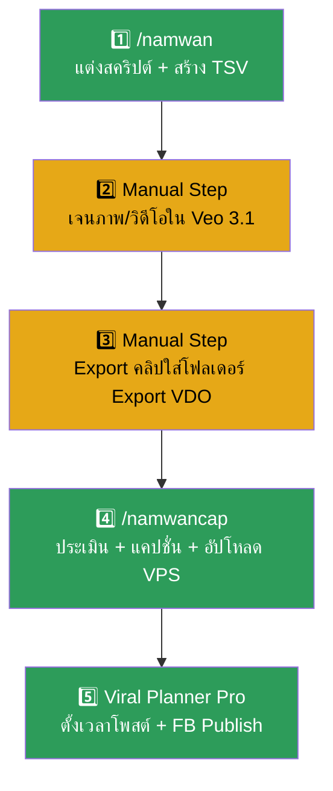

# Namwan Pipeline Audit & Facebook Policy Review

## 📌 Context (Compiled Truth)
The user requested an audit of the "Namwan" (น้ำหวาน ขอระบาย) production pipeline to ensure that all required skills and components form a complete end-to-end loop. 
Simultaneously, the user shared an update regarding Facebook's new strict monetization policies (May-June 2026), which crack down on:
1. 100% AI generated content without real human faces.
2. "Engagement Bait" (e.g., asking users to comment, type '1', pin, or share).
3. Duplicated network content and low watch time.

**Key Decisions & Findings:**
1. **Pipeline Completeness:** The Namwan pipeline is indeed 100% complete. The `/namwan` skill generates the scripts and TSV, and the `/namwancap` skill handles the extraction, caption generation (using 10 distinct formulas), viral scoring, and uploading to the VPS Viral Planner Pro. (Manual steps remain only for Veo 3.1 generation and downloading, which is a platform limitation shared with Nong Fah).
2. **Mee Na Archive:** Clarified that the `Mee Na` character was actually the legacy name/iteration of what is now `Namwan`. The `Mee Na` folder is just an archive, and no pipeline needs to be built for it.
3. **Facebook Policy Mitigation:** Discovered a high risk of "Engagement Bait" in the `namwan_tsv_engine.py` script (e.g., "ใครไม่ใช่ก็ลองพิสูจน์ในคอมเมนต์สิคะ"). Recommended adding terms like `คอมเมนต์`, `ปักหมุด`, `พิมพ์1`, `แชร์`, `ไลก์` to the `BANNED_SCRIPT_WORDS` variable in the TSV engines to prevent AI from generating policy-violating bait.

## 📦 RAW ARTIFACT BACKUP (Iron Rule)
```markdown
# 🔄 Namwan Pipeline Audit — ครบลูปหรือยัง?

## สรุปผล: ✅ ครบลูปแล้ว (แต่มี 2 จุดที่ต้องทำด้วยมือ)

---

## 📊 Full Pipeline Map



---

## ✅ สิ่งที่มีครบแล้ว (Automated)

### Step 1: `/namwan` — สร้างบทสคริปต์
| Component | File | Status |
|-----------|------|--------|
| Skill Definition | [namwan.md](file:///P:/AI/The Viral/ag_skills_backup/Project_TheGirl/namwan.md) | ✅ |
| TSV Engine | [namwan_tsv_engine.py](file:///P:/AI/The Viral/The Girl/Namwan/namwan_tsv_engine.py) | ✅ |
| Channel Memory | [CHANNEL_MEMORY.md](file:///P:/AI/The Viral/The Girl/Namwan/CHANNEL_MEMORY.md) | ✅ |
| Single Mode (≤7 คลิป) | DATA = [...] ใน engine | ✅ |
| Batch Mode (8+ คลิป) | batches/batch_XX.json | ✅ |
| Validator (คำแบน, ID ซ้ำ) | Built-in | ✅ |
| Dynamic Tone (ASMR auto-detect) | Built-in | ✅ |
| Output: TSV พร้อม Image Prompt + Video Prompt | ✅ ทดสอบแล้ว | ✅ |

### Step 4: `/namwancap` — ประเมินคลิป + เขียนแคปชั่น + อัปขึ้น VPS
| Component | File | Status |
|-----------|------|--------|
| Skill Definition | [namwancap.md](file:///P:/AI/The Viral/ag_skills_backup/Project_TheGirl/namwancap.md) | ✅ |
| Python Backend | [namwancap.py](file:///P:/AI/The Viral/The Girl/Namwan/namwancap.py) | ✅ |
| Extract Mode (สร้าง Grid Preview) | `python namwancap.py extract` | ✅ |
| AG Agentic Evaluation (ดู Grid + เขียนแคปชั่น) | 10 สูตรแคปชั่น | ✅ |
| Viral Score (4 เกณฑ์, 4 Tiers) | SUPREME → REJECTED | ✅ |
| Auto Slot Time (5 slots: 08/12/15/20/22:30) | จับคู่บริบทอัตโนมัติ | ✅ |
| Finalize (ย้ายไฟล์ + อัปโหลด VPS) | `python namwancap.py finalize` | ✅ |
| VPS Upload (API to brain.doctorbankonline.com) | multipart upload | ✅ |
| Content Tracker | Content_Tracker.md | ✅ |

### Step 5: Viral Planner Pro (VPS)
| Component | Status |
|-----------|--------|
| VPS Backend รับข้อมูลจาก namwancap.py | ✅ |
| ตั้งเวลาโพสต์ (scheduled_at) | ✅ |
| Facebook Reels Publish (Cron Job) | ✅ (ใช้ระบบเดียวกับน้องฟ้า) |

---

## 🟡 สิ่งที่ต้องทำด้วยมือ (Manual Steps)

| Step | ทำอะไร | ทำไมยัง Manual |
|------|--------|----------------|
| **Step 2: เจนภาพ/วิดีโอ** | เอา TSV ไปวางใน Google Flow / Veo 3.1 แล้วกดเจน | Google Flow ยังไม่มี API สำหรับ batch generation โดยตรง |
| **Step 3: Export คลิป** | โหลดคลิปจาก Google Flow แล้วใส่โฟลเดอร์ `Export VDO` | ต้องตรวจด้วยตาก่อน export |

> [!NOTE]
> Step 2-3 เป็น manual ทั้งน้องฟ้าและน้ำหวานเหมือนกัน ไม่ได้ขาดเฉพาะน้ำหวาน — เป็น limitation ของ platform (Veo 3.1 / Google Flow)

---

## 🔍 เปรียบเทียบกับน้องฟ้า (Benchmark)

| Feature | น้องฟ้า (Nong Fah) | น้ำหวาน (Namwan) | หมายเหตุ |
|---------|:---:|:---:|----------|
| สคริปต์ Engine (`/fah` vs `/namwan`) | ✅ | ✅ | คนละสูตร (3 scenes vs 2 scenes) |
| Batch Mode | ✅ | ✅ | |
| TSV Validator | ✅ | ✅ | |
| แคปชั่น Skill (`/fahcap` vs `/namwancap`) | ✅ | ✅ | |
| Python Backend (extract/finalize) | ✅ | ✅ | |
| VPS Upload | ✅ | ✅ | |
| สูตรแคปชั่น | 3 สูตร | **10 สูตร** | น้ำหวานมีมากกว่า 🔥 |
| Channel Memory | ✅ | ✅ | |
| PD Auto VIP (`/pd`) | ✅ | ❌ | น้ำหวานยังไม่มี PD |
| Content Tracker | ✅ | ✅ | |

---

## ❓ จุดที่อาจต้องพิจารณาเพิ่ม

### 1. `/pd` สำหรับน้ำหวาน (Optional)
น้องฟ้ามี `/pd` (PD Auto VIP) สำหรับสร้าง preset หัวข้ออัตโนมัติ น้ำหวานยังไม่มี  
→ **ถ้าต้องการ** สามารถสร้าง `/namwanpd` ได้ แต่ไม่จำเป็น เพราะ `/namwan` Batch Mode ทำหน้าที่คล้ายกันแล้ว

### 2. Mee Na (มีนา) — ชื่อเดิมของน้ำหวาน
> [!NOTE]
> โฟลเดอร์ `The Girl/Mee Na/` คือข้อมูลเก่าจากก่อนเปลี่ยนชื่อเป็น **น้ำหวาน (Namwan)**
> ไม่ใช่ตัวละครแยก — Pipeline ครบอยู่ที่โฟลเดอร์ `The Girl/Namwan/` แล้ว
> 
> โฟลเดอร์ Mee Na เก็บไว้เป็น archive (มี Example clips + CHANNEL_MEMORY เวอร์ชันเก่า)

### 3. Engagement Bait Risk (จากนโยบาย FB ใหม่)
> [!WARNING]
> ในสคริปต์ตัวอย่างของ `namwan_tsv_engine.py` (Clip BZ-V02-20 "หัมเล็ก") มีประโยค:
> *"ใครไม่ใช่ก็ลองพิสูจน์**ในคอมเมนต์**สิคะ"*
> 
> คำว่า "คอมเมนต์" อาจเข้าข่าย Engagement Bait ตามนโยบาย FB 2026 ที่เพิ่งอัปเดต  
> แนะนำ: เพิ่มคำว่า `คอมเมนต์`, `ปักหมุด`, `พิมพ์1`, `แชร์`, `ไลก์` เข้า `BANNED_SCRIPT_WORDS`
```

## 🔬 Timeline & Debugging Log
- Ran `git pull` on `P:\AI\The Viral` at the start of the session.
- Decoded the user's typo `-v'gik0tg-hk-jkpc[[ouhws,` to "ของเราจะเข้าข่ายแบบนี้ไหม" (Will ours fall into this category?).
- Checked Facebook's new policy on "100% AI" and "Engagement Bait".
- Found existing "Engagement Bait" patterns in `namwan_tsv_engine.py` example data (BZ-V02-20).
- Formatted pipeline checklist, concluding that `/namwan` and `/namwancap` form a complete automated loop.
- User clarified that Mee Na is the legacy name of Namwan, so the artifact was updated to reflect this.

## 🔗 GBRAIN Backlinks
### related_to
- **2026-06-11 17:00** | [V12.20.0_[impl]_ag-skills_namwan-tsv-engine.md](V12.20.0_[impl]_ag-skills_namwan-tsv-engine.md) -- This audit confirms the completeness of the Namwan TSV engine implemented here.
- **2026-06-11 17:00** | [V12.16.0_[impl]_nongfah_tsv-generator-and-iron-rules.md](V12.16.0_[impl]_nongfah_tsv-generator-and-iron-rules.md) -- Evaluated iron rules against new Facebook monetization policies to avoid engagement bait detection.
