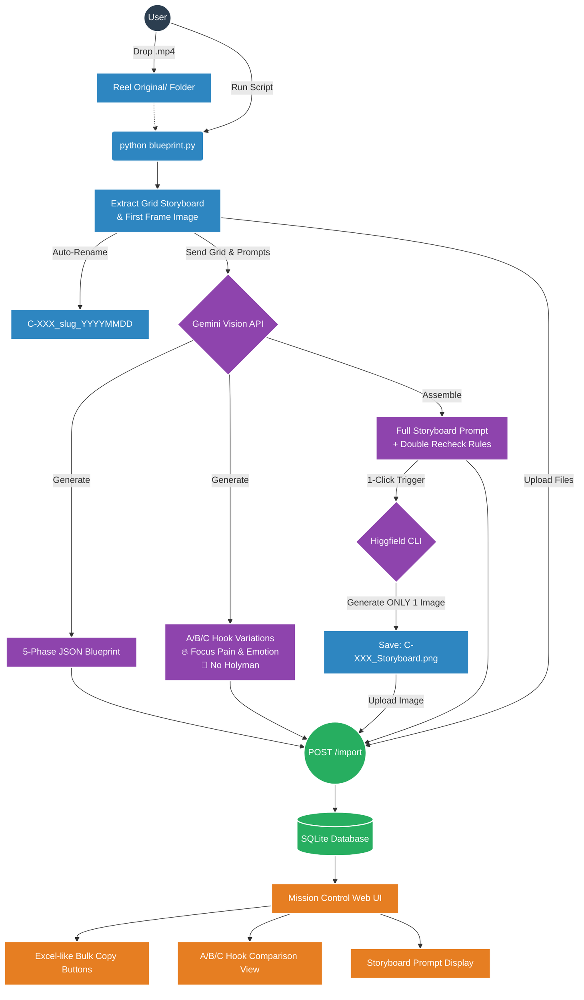

# V12.9.10 [hotfix] reel: Higgsfield CLI 1-Image Storyboard & Hook No-Holyman Rule

## 📌 Context (Compiled Truth)
- **Problem:** The `/reel` pipeline (`blueprint.py`) was generating images for every single panel and hook variation independently, wasting generation time and credits. Additionally, the Hook A-C variations were not emotionally intense enough, and the Holy Man's presence in Scene 1 (the Hook) diluted the drama before the reveal. The `master_instruction.txt` file was also causing confusion as it was outdated.
- **Solution:** 
  1. Removed `master_instruction.txt` from the prompt loading sequence, relying entirely on the internal python prompt and `knowledge_base_v3.txt`.
  2. Deleted per-scene (`generate_scene_image`) and per-hook (`generate_hook_image`) generation logic. The pipeline now triggers the **Higgsfield CLI** exactly ONE time to generate a single combined `_Storyboard.png` canvas image.
  3. Enforced two Iron Rules for the Scene 1 Hook Variations (A/B/C): **PAIN & EMOTION** (100% focus on physical struggle and tragedy) and **NO HOLYMAN** (he must not appear in the Hook scene at all).

## 📦 RAW ARTIFACT BACKUP (Iron Rule)

<details>
<summary>reel_workflow_summary.md</summary>

# 🎬 สรุป Reel Blueprint Pipeline Workflow (อัปเดตล่าสุด)

สรุปการทำงานของ `/reel` pipeline ล่าสุดที่มีการอัปเกรดระบบเพื่อ **Auto-Generate Storyboard ผ่าน Higgfield CLI**, การทำ **A/B/C Hook Variations (No Holyman)**, และระบบจัดการไฟล์แบบสมบูรณ์

## 🔄 ภาพรวมการทำงาน (Pipeline Diagram)



---

## 🚀 ฟีเจอร์เด่นที่มีในอัปเดตล่าสุด

### 1. 🎞️ Local OpenCV Extraction & Auto-Rename
*   สแกนไฟล์จาก `Reel Original/` แล้วใช้ OpenCV ตัดภาพเป็น **Grid Storyboard** (สูงสุด 36 panels, 6 columns) และ **First Frame Image**
*   เมื่อทำเสร็จจะย้ายไฟล์ต้นฉบับไปที่ `Processed/` พร้อมทำ Auto-Rename ระบบไฟล์เป็น `C-XXX_slug_YYYYMMDD.mp4/.jpg` อัตโนมัติ

### 2. 🧠 Smart AI Vision Analysis & Hook Refinement
*   โมเดล AI (Gemini) จะถอดรหัสวิดีโอต้นฉบับออกมาเป็น 5-Phase JSON Blueprint
*   **Hook Variations (A-C):** ปรับเงื่อนไขการสร้าง Hook Prompt ใน Scene 1 ใหม่ โดย**เน้นขยี้ Pain Point และ Emotion อย่างหนักหน่วง** และมีกฎเหล็กคือ **ห้ามมีตัวละคร Holy Man ปรากฏในซีน Hook โดยเด็ดขาด (No Holyman)** เพื่อดึงความรู้สึกของผู้ชมอย่างเต็มที่ก่อนจะเฉลย

### 3. 🎨 Auto-Generate Full Storyboard Prompt
*   ดึง Image Prompt ของทุกซีนมาประกอบร่างกันเป็น Prompt ก้อนเดียวเพื่อเอาไปเจนภาพรวม
*   บังคับ **Canvas Rule** (เช่น 4 ซีน = 16:9, 5-6 ซีน = 9:16) เพื่อรับประกัน Character Consistency 100%
*   ฝัง **Double Recheck Rule** ป้องกันความผิดพลาดของ Character

### 4. 🖼️ 1-Click Storyboard Image (Higgfield CLI)
*   เปลี่ยนมาใช้เครื่องมือหลักคือ **Higgfield CLI** ในการ Generate ภาพ Storyboard
*   **ระบบจะสร้างภาพ "Storyboard Image" เพียง 1 ภาพเท่านั้น** (เป็นภาพแผ่นเดียวที่รวมทุก Panel เอาไว้ตาม Canvas Rule)
*   เซฟเป็น `C-XXX_Storyboard.png` และส่งขึ้นเว็บอัตโนมัติ

### 5. 🌐 Web UI (Mission Control) Enhancements
*   เมื่อข้อมูลทั้งหมดซิงค์ผ่าน Hono Backend (`POST /import`) ขึ้นมา จะถูกจัดเรียงบนเว็บทันที
*   **Excel-like Bulk Copy:** มีปุ่มกดทีเดียวก๊อปปี้ Image Prompt หรือ Motion Prompt ของทุกซีน (คั่นด้วย `\n`) เพื่อเอาไป Paste ลง Excel แบบแยกช่องอัตโนมัติ
*   แสดง Hook เปรียบเทียบกัน และโชว์ AI Storyboard Image ด้านข้างพร้อมปุ่มก๊อปปี้แบบครบจบในที่เดียว

</details>

<details>
<summary>implementation_plan.md</summary>

# 🎬 Reel Blueprint Pipeline Hotfix (V12.9.9)

แผนการอัปเดตไฟล์ `blueprint.py` เพื่อบังคับใช้ระบบ Higgsfield CLI ในการเจนภาพ Storyboard แบบ 1 ภาพถ้วน พร้อมกับการปรับปรุงกฎของ Hook A-C ตามบรีฟของคุณครับ

## ⚠️ User Review Required
> [!IMPORTANT]
> **เรื่อง Master Instruction:**
> ในโค้ดปัจจุบันยังมีการโหลดไฟล์ `master_instruction.txt` อยู่ครับ ถ้าไฟล์นี้เก่าแล้ว ผมจะ **ลบโค้ดส่วนที่โหลดไฟล์นี้ทิ้ง** และใช้แค่ `knowledge_base_v3.txt` ร่วมกับ Prompt ที่อยู่ใน Python ดยตรงเลยไหมครับ? (รบกวนคอนเฟิร์มจุดนี้ให้ผมทีครับ)

## 🔧 Proposed Changes

### [MODIFY] [blueprint.py](file:///P:/AI/The%20Viral/blueprint.py)

**1. ตัดการ Generate ภาพแบบ Per-Scene & Hook ทิ้ง (Save Time & Credits)**
*   **[DELETE]** ฟังก์ชัน `generate_scene_image()` และ `generate_hook_image()` ทิ้งไปเลย
*   **[MODIFY]** ใน Loop การทำงานหลัก จะเหลือแค่การเรียกฟังก์ชัน `generate_ai_storyboard()` ซึ่งรันคำสั่ง `higgsfield.cmd` เพื่อเจน **ภาพ Storyboard ภาพเดียว (1 แผ่นจบ)** เท่านั้น

**2. อัปเดต Prompt สำหรับ Hook A-C (No Holyman & Pain Focus)**
*   **[MODIFY]** ในส่วนของ `user_prompt` (Phase 2) จะแก้คำสั่งการสร้าง Hook Variations ให้ชัดเจนยิ่งขึ้น:
    ```text
    - FOR SCENE 1 (HOOK) ONLY: Generate 3 alternative hook concepts (A/B/C variations).
      * RULE 1 (PAIN & EMOTION): Focus 100% on the victim's tragedy, extreme physical struggle, and deep emotional despair to instantly hook the viewer.
      * RULE 2 (NO HOLYMAN): The Holy Man MUST NOT appear in the Hook scene. Save his entrance for Scene 2.
    ```

**3. จัดการเรื่องไฟล์ Prompt Master**
*   *รอการคอนเฟิร์มจากคุณ:* หากให้ถอด `master_instruction.txt` ผมจะเอาบรรทัดที่โหลดไฟล์นี้ออก เพื่อไม่ให้ AI สับสนกับ instruction เก่าๆ ครับ

## 🔬 Verification Plan
1. รัน `python blueprint.py` ด้วยวิดีโอเทส 1 ตัว
2. ตรวจสอบใน `Processed/Storyboards/` ว่า **มีไฟล์ _Storyboard.png แค่ไฟล์เดียว** (ไม่มีไฟล์ _Scene_X แยก หรือ _Hook_Var แยก)
3. ตรวจสอบ JSON ที่ได้ ว่า Hook A, B, C ใน Scene 1 ไม่มี Holy Man และเน้นความเจ็บปวดจริงตามกฎใหม่

</details>

<details>
<summary>task.md</summary>

# Reel Blueprint Pipeline Hotfix Tasks (V12.9.9)

- `[x]` ถอดไฟล์ `master_instruction.txt` ออกจากระบบ
- `[x]` ลบโค้ดการเจนภาพแบบ Per-Scene & Hook Variations (`generate_scene_image`, `generate_hook_image`) เพื่อให้เหลือแค่การเจนแบบ 1-Click Storyboard Image แบบแผ่นเดียว
- `[x]` อัปเดต Prompt สำหรับ Hook A-C ใน `user_prompt` ให้เน้นขยี้ Pain Point/Emotion
- `[x]` เพิ่มกฎเหล็ก "No Holyman" ใน Hook Prompt เพื่อให้ Scene 1 ไม่มีตัวละคร Holy Man เข้ามาเกี่ยวข้อง
- `[x]` คลีนอัพโค้ดส่วนที่เกี่ยวข้องกับการจัดการไฟล์ภาพราย Scene ออกจากลูปการ Rename และ ย้ายไฟล์

</details>

<details>
<summary>walkthrough.md</summary>

# 🚀 รีวิวการอัปเดต Reel Blueprint Pipeline (Hotfix)

ทำการแก้ไขไฟล์ `blueprint.py` เรียบร้อยแล้ว! 

## 🔄 สิ่งที่ถูกปรับเปลี่ยนไป

1. **Clean Code & ลดการเผา Credits:**
   - ถอดการสั่งวาดภาพ `generate_scene_image` (วาดภาพแยกทุก Panel) และ `generate_hook_image` (วาดภาพ Variations แยก) ทิ้งทั้งหมด
   - ปัจจุบันระบบจะยิงไปหา **Higgsfield CLI** เพียงครั้งเดียว เพื่อเจนภาพ `[ชื่อไฟล์]_Storyboard.png` เป็นแผ่นเดียวจบ (รวมทุก Scene ตาม Canvas Rule ที่กำหนด)

2. **Hook A/B/C - Pain & Emotion (No Holyman):**
   - อัปเดตคำสั่งใน `user_prompt` อย่างเข้มงวด:
     - **RULE 1:** ต้องเน้นเจาะจงไปที่โศกนาฏกรรม, ความเจ็บปวด, และความสิ้นหวังแบบสุดขีดใน Scene 1
     - **RULE 2:** บังคับ **ห้ามมีตัวละคร Holy Man ปรากฏใน Scene 1 อย่างเด็ดขาด** (เก็บไว้เปิดตัวใน Scene 2 เท่านั้น)
   - โมเดล AI จะสร้างเพียง Text Prompt ออกมา 3 แบบ (A, B, C) ในไฟล์ JSON เพื่อให้ขึ้นไปแสดงผลบน Mission Control ทันที

3. **ตัด Master Instruction ที่ไม่จำเป็น:**
   - นำโค้ดโหลดไฟล์ `master_instruction.txt` ออกไปเรียบร้อย ตอนนี้ระบบจะพึ่งพาแค่ `knowledge_base_v3.txt` ร่วมกับกฎเหล็กที่ฝังแน่นอยู่ในไฟล์ `blueprint.py` โดยตรง ป้องกันปัญหา AI สับสน Instruction ซ้ำซ้อน

## 🧪 การตรวจสอบ (Verification)
เมื่อคุณทำการโยนวิดีโอใหม่ลงใน `Reel Original/` และรัน `python blueprint.py` อีกครั้ง คุณจะพบว่า:
- สคริปต์ทำงานเร็วขึ้นมาก เพราะรันคำสั่ง Higgsfield แค่ 1 รอบ
- ในหน้า Mission Control, Hook Variations A-C จะโชว์เฉพาะ Text Prompt (ดราม่าล้วนๆ) ไม่มีตัวละคร Holy Man
- โฟลเดอร์ `Processed/Storyboards/` จะสะอาดขึ้น มีแค่ภาพ _Storyboard.png และไฟล์ Prompt Text เท่านั้น

</details>

## 🔬 Timeline & Debugging Log
- **2026-05-22 10:45** | User requested a simple workflow summary and diagram of the latest `/reel` updates.
- **2026-05-22 10:46** | Created `reel_workflow_summary.md` detailing the 1-Click Storyboard extraction and Hook logic.
- **2026-05-22 11:02** | User clarified that we now exclusively use **Higgsfield CLI** for generating the single Storyboard Image, and the Hook A-C must focus on Pain/Emotion with a strict **No Holyman** rule.
- **2026-05-22 11:03** | Updated the artifact to reflect Higgsfield CLI and Hook rules.
- **2026-05-22 11:08** | User requested actual implementation of these rules into `blueprint.py` and confirmed we can delete `master_instruction.txt`.
- **2026-05-22 11:12** | Removed `generate_scene_image` and `generate_hook_image` from `blueprint.py`. Removed `master_instruction.txt` logic. Updated Hook A-C rules.
- **2026-05-22 11:19** | User initiated `/save` protocol to deploy changes.

## 🔗 GBRAIN Backlinks

### depends_on
- **2026-05-21 12:48** | [V12.9.3_[impl]_reel_blueprint_pipeline_enhancement.md](V12.9.3_[impl]_reel_blueprint_pipeline_enhancement.md) -- Baseline blueprint pipeline logic before these optimizations.
- **2026-05-22 09:50** | [V12.9.8_[impl]_skills_agentic-raw-pipeline.md](V12.9.8_[impl]_skills_agentic-raw-pipeline.md) -- Related structural update mapping the current VPS system.
- **2026-05-26 13:48** | [V12.13.0_[impl]_reel_blueprint-multiproject-and-prompt-fix.md](file:///c:/My%20Claw/Openclaw-VPS/Quick%20Save/Complete/The-Viral/V12.13.0_%5Bimpl%5D_reel_blueprint-multiproject-and-prompt-fix.md) -- Further fixed hardcoded variables and added QA Self-Healing agents.
